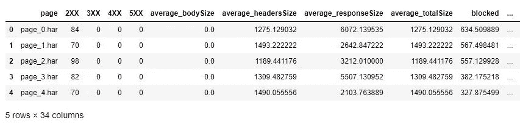
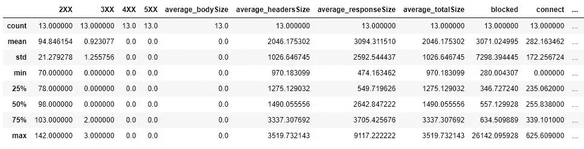
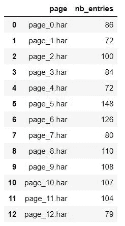
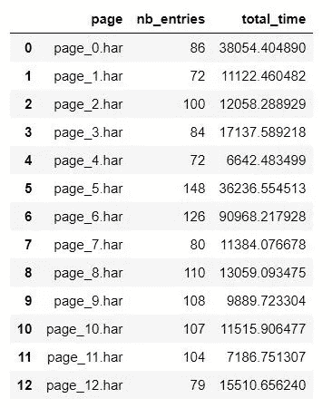
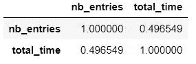
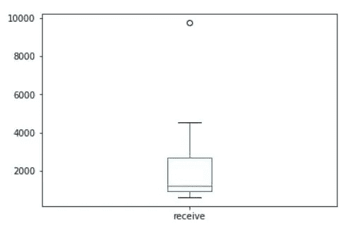

# 我的性能分析之旅 2/2 (HAR 文件)

> 原文：<https://towardsdatascience.com/my-journey-to-performance-analysis-2-2-har-files-8a94a52bfac9?source=collection_archive---------19----------------------->

这篇文章主要是解释我最近进行的第二种类型的性能分析。它是这篇[文章](http://www.datanalyst.info/web_analytics/my-journey-to-performance-analysis-1-2/)的后续。
这篇文章主要介绍了 HAR 文件的分析，以及您可以从中检索到什么类型的 KPI。

# 什么是 HAR 文件？

继 W3C github 帖子之后，HAR 代表 HTTP 存档格式。它是一种 JSON 格式的归档文件格式，用于记录 web 浏览器与站点的交互。这些文件的通用扩展名是**。har** 。

这看起来很有趣，但是它实际上涵盖了什么呢？它涵盖了相当多的指标和信息，这种格式仍在开发中。因此，它可以在未来发展，我的列表将不会是详尽的和/或涵盖信息已被否决从 HAR 文件。

全局对象:

*   创建者:关于创建此 HAR 文件的应用程序的信息
*   浏览器:包含有关创建日志的浏览器的信息
*   日志:这是最有趣的元素，因为它包含以下信息:
*   条目:条目是由页面触发的请求
*   页面:正在请求哪个页面

你现在可能会这样想:“这开始看起来像非常有趣的信息了！为什么你一开始就要费心使用你那愚蠢的性能爬虫呢？我浪费了 1000 万的生命去读那篇文章！”

好吧，这很公平 that 文件检索的问题是，它不像我们用 performance . getentries()JavaScript 控制台检索信息那样容易。

# 如何检索 HAR 文件分析

你可以阅读这篇来自 box.com 的关于 HAR 一代的好文章。
如果您想通过使用爬虫程序来生成相同类型的信息，您将需要使用中间人技术来生成这些文件。

这在 2015-2016 年不会是一件大事，但现在所有网站都在使用 HTTPS，你需要为你的浏览器生成一个证书，这样你的中间人就有权捕捉和解密这些信息。

正如您现在所能想象的，以自动化的方式实现这一点并不是那么简单。
虽然不是不可能，但是如果我设法实现(这是我的计划)，仅仅使用我已经创建的模块将需要一些对其他用户不友好的配置。
让我们推迟这个模块的创建，在浏览器中使用传统的检索方式。；)

# 条目对象

我之前解释过，嵌套在日志对象中的条目数组是我们真正感兴趣的，以便实现性能审查。
条目对象中最有趣的信息如下(完整列表[此处](https://w3c.github.io/web-performance/specs/HAR/Overview.html)):

*   startedDateTime :
    请求开始的日期和时间戳(—YYYY-MM-DDThh:MM:ss . stzd)
*   time:请求的总运行时间，以毫秒为单位。这是计时对象中所有可用计时的总和(即不包括-1 值)
*   计时(对象)
*   阻塞:在队列中等待网络连接的时间。如果计时不适用于当前请求，请使用-1。
*   dns : DNS 解析时间。解析主机名所需的时间。如果计时不适用于当前请求，请使用-1。
*   连接:创建 TCP 连接所需的时间。如果计时不适用于当前请求，请使用-1。
*   send:向服务器发送 HTTP 请求所需的时间。
*   等待:等待服务器的响应。
*   接收:从服务器(或缓存)读取整个响应所需的时间。
*   SSL:SSL/TLS 协商所需的时间。如果定义了该字段，则时间也包括在连接字段中(以确保向后兼容 HAR 1.1)。如果计时不适用于当前请求，请使用-1。
*   请求(对象)
*   方法 *:* 请求方法(GET，POST，…)。
*   url:请求的绝对 URL(不包括片段)。
*   cookie:cookie 对象列表。
*   queryString:查询字符串列表
*   postData:帖子中包含的数据信息
*   header size:
    从 HTTP 请求消息的开头到正文前的双 CRLF(包括双)的总字节数。如果信息不可用，则设置为-1。
*   bodySize :
    请求体(POST 数据有效负载)的大小，以字节为单位。如果信息不可用，则设置为-1。
*   响应(对象)
*   状态:200 / 404 / 302/ …
*   cookie:cookie 对象列表
*   header size:
    从 HTTP 响应消息的开始直到(包括)正文前的双 CRLF 的总字节数。如果信息不可用，则设置为-1。
*   bodySize :
    接收到的响应正文的大小，以字节为单位。在响应来自高速缓存的情况下设置为零(304)。如果信息不可用，则设置为-1。
*   cache (object):关于缓存的信息。我建议在检索元素时禁用缓存，因为您想知道页面上请求的所有元素。您可以稍后优化缓存。

你会告诉我有很多信息需要消化，你是对的，因为这只有一页。想象一下，您必须分析几十页或几百页的内容…
对于专业人员，有一些工具可以帮助您分析这些文件，并以简化的方式汇总这些数据。

在我们的案例中，有两个主要问题:

1.  我们无法使用那些工具
2.  我们不是专业人士:)

第二个评论是半个笑话，因为我们是专业人士，但我们不太了解那些 HAR 文件(我们不是每天都用，也不是每周都用)，我的哲学是，当你想了解一些东西时，你需要尽可能多地了解原始信息。这样做将有助于您稍后理解该工具实际上为您做了什么。
*(这个评论对任何你想掌握的学科都是有价值的——有时候你不需要掌握，那么快捷键就有用)*

# 分析快捷方式(哈佩模块)

如前所述，这里有大量的数据，为了缩短这篇文章，我将走一点捷径。
在使用 jupyter 笔记本发现数据后，我为我的分析创建了一个新的模块。这个想法很简单，你在所有 HAR 文件所在的文件夹中运行这个模块，它会生成一个。csv 文件”,其中聚集了一些数据。主要是与性能相关的数据。

这个新模块可以在我的 github 账户上获得，它的名字是“ **harpy** ”。是的，就像神话中的生物，但也因为它是一个 **HAR py** thon 分析仪。现在明白了；)
在我的其他脚本文件夹:[https://github.com/pitchmuc/other_scripts](https://github.com/pitchmuc/other_scripts)

我很可能会写一篇博文来解释这些方法。

# HAR 数据分析

所以你已经在你的文件夹中运行了 harpy 模块，它已经创建了一个。csv”文件。
我们来看看里面是什么，如何解读数据。

```
import pandas as pd
df = pd.read_csv('summary_blog.csv',delimiter='\t')
df.head()
```

这应该会给你这样的东西:



查看该列，我们在这里有一个广泛的列表。我创建的 harpy 模块试图在这个数据帧中收集尽可能多的数据。

```
df.columns
OUT: 
Index(['page', '2XX', '3XX', '4XX', '5XX', 'average_bodySize',       'average_headersSize', 'average_responseSize', 'average_totalSize',       'blocked', 'connect', 'cookies', 'dns', 'missing_blocked',       'missing_bodySize', 'missing_connect', 'missing_dns',       'missing_headersSize', 'missing_receive', 'missing_responseSize',       'missing_send', 'missing_ssl', 'missing_wait', 'nb_cookies',       'nb_entries', 'receive', 'send', 'ssl', 'total_bodySize',       'total_headersSize', 'total_responseSize', 'total_size', 'total_time',       'wait'],dtype='object')
```

如果你熟悉网络连接词汇，你应该不会迷失在这里。
这里我们可以从熊猫的概况数据开始。

```
df.describe()
```



当您在处理大型数据集时，如果您想浏览一下这里的情况，这种方法非常重要。

正如你所看到的，我们很快发现在我们发送的请求中没有 bodySize。大多数信息都是由报头发送的。平均响应大小是 3094 字节，但标准偏差是 2592。
这意味着每个请求的 responseSize 差异很大。
最小值和第三个四分位值(474 和 3705)证实了这一点。

数据会给你每个页面发送的请求的数量，你只需要查看“nb_entries”列

```
df[['page','nb_entries']]
```



添加更多列以直观地查看是否存在相关性。



您也可以直接询问您的两列的关联状态:

```
df[['nb_entries','total_time']].corr()
```



Positive correlation but nothing crazy

为了对数列的分布有所了解，你也可以使用箱线图。

```
df['receive'].plot(kind='box')
```



我们来看看箱线图上的这个极值点是什么。

```
df[df['receive'] == df['receive'].max()] ## This returns you the specific row for this.
```


我希望这篇文章向您展示了在分析页面性能时可以做些什么。

正如您可能已经注意到的，这些数据与我们在使用我在关于性能分析的第一篇博文中描述的爬虫时检索到的数据是不同的。因此，如果你需要更多数据来证实你的假设，这两种方法可以互补。