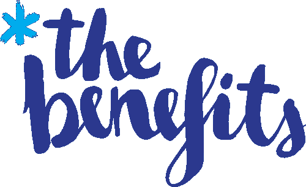

# 我的云计算之旅

> 原文：<https://towardsdatascience.com/my-journey-to-the-cloud-c03f8ba429ce?source=collection_archive---------29----------------------->

## 为什么我是倡导者，你也应该是。

[Image credit](https://newsignature.com/articles/new-service-offering-accelerate-your-journey-to-the-cloud/)

两周前，我在新加坡参加了 2019 年谷歌云峰会。谷歌每年都会在其主要市场举办类似的活动，宣布其新产品和路线图。这也是一个机会，让人们认识和了解行业的动向。

我特别喜欢领导人交流会议，在那里谷歌分享了它在该地区的见解。他们还主持了一场精彩的互动会议，而每个团队都扮演了一家正在进行数字化转型的全球银行机构的首席技术官。然后，我们面对不同的场景，在这些场景中，我们做出的每个决定都有相关的成本和收益。

Google Cloud Summit 2019 in Singapore

> 但是我为什么会在那里？

# 我的云计算之旅

如果几年前你问我什么是云计算，我可能会给你一个茫然的眼神。现在吗？我可以不停地谈论云计算有多棒，以及为什么你应该使用它(如果你还没有使用的话)。

我是越南一家电子商务公司的分析经理。由于本地计算机的海量数据和物理限制，在本地服务器上进行分析变得越来越困难。我们还缺乏用本地系统处理大数据的能力。另一方面，还有许多其他问题，例如开发工作、许可和访问控制等等。

很自然地，我开始寻找解决数据问题的方法。那时，我们可以选择使用开源软件或公共云提供商。我们选择了后者，因为我们希望专注于数据，而不是基础设施。

但是向一个组织介绍一个新的想法是困难的。你经常会面临来自众多利益相关者的阻力。在我的案例中，具体来说，我必须说服我的老板、我的团队和几个安全团队。你需要考虑的事情数不胜数，比如安全性、人才培养和变革管理。换句话说，你试图改变人们日常工作的方式。

> 你必须走出自己的路，你必须说服人们，你必须成为…一个倡导者。

我成为了组织中的云倡导者。我开始寻找业内人士，学习新东西，召开会议介绍新概念。我推动了一项在公共云上建立数据湖的计划。我们与谷歌云合作来做这件事，它为我打开了许多大门。通过这个项目，我认识了一些非常有才华的人，学到了新的做事方法，也学到了新的概念和技术技能。除了我的项目，我还帮助我们的其他团队也走上了云之路。

# 我的经验教训

回顾这段经历，我意识到两件事:

*   **成为云倡导者开拓新机遇:**如果我不是云倡导者，我今天就不会站在这里。
*   **掌控自己的工作:**如果我认为云计算不是我的责任，而是基础架构团队的责任，我也不会来这里。

# 那么，成为某个事物的倡导者意味着什么呢？

我们退一步来回答这个问题。快速的谷歌搜索给出了倡导者的如下定义:

> 公开支持或推荐一项特殊事业或政策的人。

成为某事物的倡导者意味着你竭尽全力去推动一个想法、一项事业或一项政策。从你最喜欢的电子游戏到社会经济改革，你可以成为任何事情的倡导者。

[Image source](https://www.16personalities.com/infj-strengths-and-weaknesses): 16 Personalities illustration of an advocate, I’m an INFJ-A by the way.

你很可能已经是一个拥护者了。还记得上一次你向朋友推荐你最喜欢的书或者你刚刚发现的一个很棒的应用吗？你是倡导者！

# 成为倡导者的好处

[Image credit](https://www.alsd.k12.ca.us/Page/168)

这些都不能保证，但如果你是一个倡导者，这里有一些潜在的好处，你可以收获。

*   **帮助建立你的个人品牌**:如果你倡导某事，人们会因此认可你。如果我一直谈论和使用苹果产品，当你有问题时，你可能会寻求我的帮助。这有助于建立你在这个问题上的个人品牌和可信度。此外，当你帮助别人时，他们往往会回报你。
*   **助人为乐:**当我们为陌生人开门或给需要帮助的人一美元时，我们感觉很好。当你向某人主张某事时，你相信你所推动的事情会使另一方受益。简而言之，你在帮助他们，你会感觉很好。
*   拓展你的人际网络:很有可能有像你一样的人也支持同样的事情。你有机会向他们学习，帮助他们，扩大你的人际网络。我们是群居动物，建立关系网从来都不是一件坏事。
*   获得新的机会:你将获得新的机会，比如工作中的晋升，甚至是新的工作机会。你的老板可能会意识到你所追求的东西的好处，给你学习的机会或者派你去参加会议。

# 如何做一个倡导者？

[Image credit](https://thehow.loseit.com/)

那么，你怎么能成为某件事的倡导者呢，尤其是在工作中？以下是一些我认为会有帮助的步骤:

*   **选择:**第一步，选择推什么。不要追求只对自己有利而对别人无益的东西。一定要推动对每个人都有利的事情。选择自己感兴趣的，或者自己擅长的。
*   **相信:**第二步，相信它。如果你不相信你正在推动的事情，人们会很快发现。当你在追求中遇到困难时，信念也能帮助你坚持下去。
*   学习:你试图说服人们为了你和他们自己的利益去做一些新的事情。花时间去了解它，彻底了解这门手艺，这样你才能令人信服。
*   **推动:**这是最关键的一步，实际上是推动你的主动权。在你的追求中要深思熟虑，始终如一，坚持不懈。向人们展示这对他们有什么好处，并尽力去做。
*   **坚持不懈:**有时候，事情并没有按照计划进行。你的时机可能不对，你似乎无法说服别人，或者你只是运气不好。当面临挑战时，重温第二步。如果你仍然相信你所追求的，那就继续前进。

# 让我们成为组织中的倡导者

Me and my good friend Joe at Google office in Singapore

在这篇文章中，我简单地分享了我的故事和我学到的经验。我了解到作为一名云倡导者为我打开了无数的机会，我应该对我所做的事情负责。

我还讨论了什么是倡导者和四个潜在的好处:帮助你建立你的个人品牌，通过帮助别人给你带来快乐，扩大你的网络，给你新的机会。

我敦促你在你的组织中成为一名倡导者，并通过**选择**、**相信**、**推动、**和**坚持不懈来获得利益！**