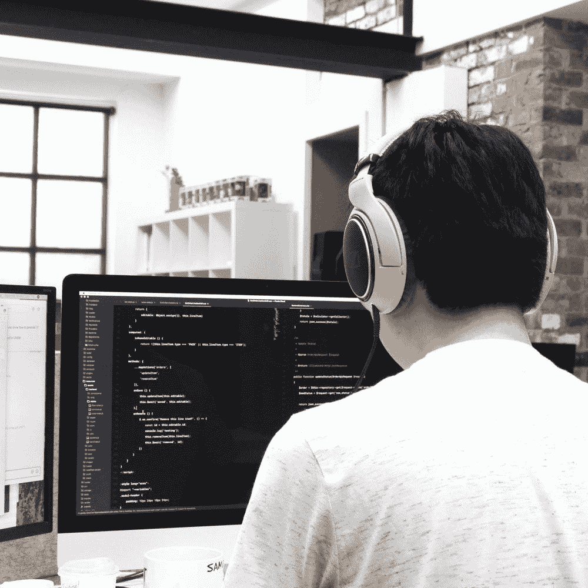

# 我从零开始进入数据科学的学习计划

> 原文：<https://towardsdatascience.com/my-learning-plan-for-getting-into-data-science-from-scratch-9562f37b4dde?source=collection_archive---------7----------------------->

## 我在大学的时候就开始了，并且一直持续到今天！

早在 2015 年初，当我还在上大学时，我就决定进入数据科学领域。实际上，我最初并没有打算成为一名数据科学家，而是一名*quant*——本质上是一名金融分析师，在他们的职能中使用高级数学和编码(例如风险管理和算法交易)；然而，9 个月的 quant 实习让我意识到，我想将这些技能应用到更广泛的背景中。读了几篇博文后，我得出结论，数据科学是适合我的领域。

来自应用经济学的背景，我觉得我的计量经济学繁重的课程已经给了我一个不错的数学基础；然而，我仍然没有机器学习中使用的模型的背景(例如，神经网络、随机森林)。此外，我在大学的剩余时间里浏览了所有课程，没有发现任何教我们如何编写自己的算法的内容。

**差距显然在于我缺乏编码和机器学习模型方面的知识。**

在这篇博文的其余部分，我将浏览我用来填补这一空白并实现我成为一名数据科学家的梦想的在线资源的简短列表。

我们开始吧！

# 概念学习

Courses and books will give the foundation of your data science skills

下面是我推荐你学习的书籍和课程，以了解数据科学是如何工作的。请注意，下面的学习资源是按照我推荐的顺序显示的(基于我的经验和其他人的反馈)。星号(*)表示我本人没有参加过该课程，但其他数据科学家强烈建议在现阶段参加该课程。

1.  [**Python for Everybody Specialization**](https://www.coursera.org/specializations/python)**—这一系列课程对于想要入门的绝对初学者来说非常棒。为了让你克服学习如何编码的恐惧，最好的方法。**
2.  **[**吴恩达《机器学习》**](https://www.coursera.org/learn/machine-learning?)**——这门课给了我理解不同机器学习模型的核心基础。吴恩达激励我从事机器学习的职业。****
3.  ****[**艰难地学习 Python 3**](https://www.amazon.com/Learn-More-Python-Hard-Way/dp/0134123484)**—这本书将为你的 Python 技能(以及一般的编码技能)打下坚实的基础。我怎么强调这本书在通过实践课和精心设计的练习来教授基本概念方面有多棒都不为过。******
4.  ******[**应用数据科学与 Python 专业化**](https://www.coursera.org/specializations/data-science-python) ***** —这一系列课程是将你对机器学习模型的理解与你的编码技能粘合起来的好方法。我个人认识一些人，他们能够在完成这一专业后立即在数据科学领域找到工作，因为到那时，他们已经拥有了一套体面的数据科学技能工具包，可以用来解决现实世界的问题。******
5.  ****[**程序员机器学习入门(fast.ai)**](http://course18.fast.ai/ml) —本课程由杰瑞米·霍华德教授，他给出了一个非常实用的关于如何正确使用代码进行机器学习的演练。准备好从头开始学习如何编写随机森林算法吧！****
6.  ****[**程序员实用深度学习(fast . ai)**](https://course.fast.ai/)**——这两部分课程是最好的资源，既适合 1)试图进入深度学习的有抱负的数据科学家，也适合 2)试图更深入地了解如何在深度学习中获得最先进的结果的更有经验的数据科学家。在第一课中，杰瑞米·霍华德将向您展示如何使用 fastai 库在 ImageNet 数据集中获得最先进的精度。在后面的章节中，您将越来越习惯于直接在 PyTorch 上实现模型。强烈推荐！******

# ******实践学习******

************

******Real world projects will teach you how to turn your skills into actual value for people******

******有些人会说，真正的学习只有在你从事具体项目并利用你的数据科学技能解决现实世界的问题时才会发生。以下是推荐的通过应用你的知识获得经验的方法(即边做边学)。******

1.  ******[**code signal**](https://codesignal.com/)**——当我刚接触编码时，我很难理解如何用我的基本技能来解决现实世界的问题。谢天谢地，CodeSignal(以前叫 CodeFights)有有趣的编码挑战，让我可以与机器人和真人竞争。这让我对用代码解决问题的过程感到很舒服。该网站最初是一个竞争性编码平台，但现在专注于在与科技公司的面试中为开发人员准备编码考试。********
2.  ******[**ka ggle**](https://www.kaggle.com/)**——**这是一个数据科学家聚集在一起的平台，1)共享数据和代码，2)竞争训练最能达到目标的 ML 算法(例如，最准确地预测房价)。即使你没有明确地参与竞争，我认为 Kaggle 最大的附加值是从竞争中获得“代码解决方案”。阅读其他更有经验的数据科学家的代码是变得更好的最快方法之一，因为它教你最佳实践，同时让你自己从头开始舒适地阅读和编写 ML 代码。******
3.  ******激情项目** —即使你没有数据科学的工作，但想进入这个领域，想一个很酷的项目来执行！确定一个你想解决的问题，甚至是你想做的有趣的事情，然后为此创建一个机器学习模型。如果你决定将它部署为一个可在互联网上访问的应用程序，那就更好了！(例如，我最近开发了一个[投资分析工具](https://hawksight.co/)，让智能交易变得更加容易！).****
4.  ******实习/全职** —这个应该很明显。边做边学的最好方法是给自己找一份数据科学方面的工作。冷启动问题是当公司希望你拥有数据科学技能，但你没有工作经验，如何获得这些技能？上面列举的所有步骤应该使您具备必要的技能，能够立即对数据科学团队有用。所以开始工作吧！****

# ****结论****

****这就是我如何获得我今天所拥有的技能，我还有很多要学！这是一个漫长而艰难的旅程，但每一项努力都是值得的。每天，我都很荣幸能从事一个既有趣又有影响力的职业。我在这个职业中感到如此快乐，所以我花时间创建了这个指南，以便更多的人可以进入这个领域。****

****最后，我给你留下以下信息:****

> ****你能否成功进入数据科学领域的最大决定因素是你是否愿意 1)吸取教训，2)在挑战中坚持不懈，以及 3)抓住现有的机会。****

****感谢您阅读本文，如果您对如何进入数据科学领域有任何进一步的问题，请在下面的**中发表评论。也可以通过邮件( *lorenzo.ampil@gmail.com)、* [twitter](https://twitter.com/AND__SO) 、 [linkedin](https://www.linkedin.com/in/lorenzoampil/) 联系我；然而，期待我更快地回复评论:)******