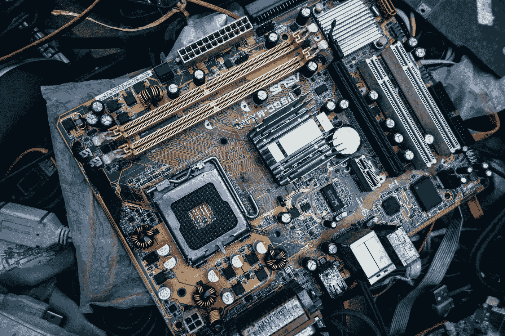

# 我的开源机器学习之旅开始了

> 原文：<https://towardsdatascience.com/my-open-source-machine-learning-journey-begins-615dee3a1654?source=collection_archive---------9----------------------->

## 我的新博客，人类学习机器学习，于 1 月 1 日发布

在技术和其他许多领域，过去的研究和发展与现在的实际情况之间有着重要的联系。探索这种联系对学习过程至关重要。历史是一位伟大的老师，尤其是因为，因为事情不会发生在真空中，所以将现在与过去联系起来考虑通常是明智的。

还有第二个同样重要的联系，在今天的现实和明天的可能之间有一个指导性的问号，它可以帮助加速学习过程。为了理解和指导你今天做的事情，你也应该问问你明天可能会做什么。

沿着这条学习之路走下去的好处是，你能够将过去的知识与现在的背景以及未来的潜力联系起来。这是我们在个人生活中都会做的一项练习，相当于“我去过哪里，我是如何来到这里的，我有能力完成什么？”在技术领域，如果你试图以尽可能少保留盲点的方式解决问题，这一过程尤为重要:如果你希望将技术应用于持久的解决方案，你需要知识、背景、好奇心和视角。

这让我想到了为什么我决定推出一个机器学习博客。现在，分布式系统和分散式区块链正在市场上认真探索，我想更好地了解的技术领域之一是机器学习。原因是我们应该开始问，在未来，人工智能软件可能如何访问和分析在区块链永恒存储的数据，以产生新的见解和解决方案，解决我们今天或明天可能出现的商业、社会和其他问题。

作为我努力学习数据和分析之间的交集的一部分，我最近开始了一个关于我一无所知的领域的学习之旅:机器学习。我花了一年的时间在区块链领域学习和工作，并花了几个月的时间自己定期学习密码学，我已经对开源学习之旅的力量产生了欣赏:分享你正在学习的东西、思考的问题和提出的问题。这样做，你不仅学得更快，而且还能和其他人分享加速学习过程的成果。

下面，我交叉发布了我的前三篇每日博客文章，分别来自 [**一台人类学习机器学习**](http://ahumanlearningmachinelearning.com) 。感谢您加入我的学习之旅。

1.  2019 年 1 月 1 日: [*我的开源机器学习之旅开始*](https://ahumanlearningmachinelearning.com/2019/01/01/my-open-source-machine-learning-journey-begins/)
2.  2019 年 1 月 2 日: [*机器学习新人资源*](https://ahumanlearningmachinelearning.com/2019/01/02/resources-for-the-newcomer-to-machine-learning/)
3.  2019 年 1 月 3 日: [*机器在学习处理文本之前，是否应该先学习处理语音？*](https://ahumanlearningmachinelearning.com/2019/01/03/should-machines-learn-to-process-speech-before-they-learn-to-process-text/)

# 2019 年 1 月 1 日:我的开源机器学习之旅开始了

(交叉贴自 [*我的开源机器学习之旅开始*](https://ahumanlearningmachinelearning.com/2019/01/01/my-open-source-machine-learning-journey-begins/) *)*

今天早些时候，在 LinkedIn 上，我写了以下内容:

> 2018 年是学习的一年……2019 年将是双重运用的一年，学习和应用:学习更多关于分布式系统和去中心化区块链的知识，学习机器学习，尝试应用程序，将我的心应用到更明确的目标上，学习将越来越强的好奇心应用到我的任务上，并允许我自己充分探索我的直觉。

一年多以前，我开始学习区块链、分布式总账和密码学。一旦您了解了使这些功能协同工作的基础知识，就很容易对信息的未来感到兴奋。在一个越来越依赖于存储、访问、分发和分析来自集中式、分布式和分散式存储的数据的世界里，重要的后续问题变成了“人类将如何使用数据来制造有助于推进我们社会目标的机器？”

这种想法促使我在两周前考虑未来几年我还应该学习什么，包括机器学习本身。我相信技术可以而且应该被用来做好事，我们应该用我们最好的想法为我们最好的理想服务，我忍不住试图理解现代技术表面领域的如此重要的一块，即机器学习、神经网络、人工智能和我们选择的明天的交集。

正如我在今天的 LinkedIn 帖子中所写的:

> 在这样一个问题重重的时代，我们不能不怀着极大的喜悦和坚定的信念，致力于减少阻碍人类进步的神秘事物。

在这个博客中，我的目标是“开源我在机器学习方面的学习之旅”，以便我现在的同龄人和未来的人们可以看到人类学习一项有朝一日将为人类体验的许多基础提供动力的技术是什么样的。由于我最近开始阅读机器学习，提出问题，思考未知，这个空间将作为日记，博客和游乐场的一部分，在未来建立和分享我的神经网络。人类学习过程的奇妙之处在于，它一部分是神经科学，一部分是魔法，是我们的生物神经元与联系、想法、死胡同、错误、突破、敬畏、好奇、好奇、记忆、问题以及生活和想象的双重选择压力斗争和角力的结果。有一天，在非常遥远的未来，在我死后很久，人类可能会创造出能够欣赏前面那句话中包含的所有快乐的学习机器。在那之前，我和我们对人类思维、计算机、数据以及如何利用这些数据来训练计算机代表我们做出更好的预测还有很多要学的。

在这个大脑的机器学习之旅中，我会发现什么？

# 2019 年 1 月 2 日:机器学习新手的资源

(跨贴自 [*机器学习新人资源*](https://ahumanlearningmachinelearning.com/2019/01/02/resources-for-the-newcomer-to-machine-learning/) )

学习如何学习新东西总是很棘手的。这有点像在你知道你将获得什么样的知识，书架应该有多长或多高，或者你需要哪些工具来搭建书架之前，弄清楚如何搭建一个书架来放置新知识。

我想有时候最好的开始方式就是，嗯，开始。你可以边做边做，如果需要的话，你可以向别人借工具，或者在需要的时候帮忙做架子。你也要确定什么与你的目标无关，或者远远超出你目前的知识范围，现在没有用。这就是非结构化试错游戏——人类版的强化学习。但首先，你必须开始。

划分起点的一种方法是按分段，即按资源的来源或类型:

*   要读的书
*   要追随的人
*   要学的课程

诸如此类。

## 学习部分

以下是我目前为止遇到的或者有人向我建议的一些机器学习资源。这份清单没有优先次序，也不详尽。这是一个及时的快照，所以我不期望在未来添加到这个列表中。

**书籍**

*   Gareth James、Daniela Witten、Trevor Hastie 和 Robert Tibshirani 编写的《统计学习介绍及其在 R 中的应用》
*   [*《统计学习的要素:数据挖掘、推理和预测》*](https://www.amazon.com/gp/product/0387848576) 作者:特雷弗·哈斯蒂、罗伯特·蒂布拉尼和杰罗姆·弗里德曼
*   [*模糊集和模糊逻辑:理论与应用*](https://www.amazon.com/gp/product/0131011715) 乔治·j·克里尔和袁波著
*   Max Tegmart 的《生活 3.0:成为人工智能时代的人类》
*   [*机器学习:新的人工智能*](https://www.amazon.com/gp/product/0262529513) 作者 Ethem Alpaydin
*   [*大师算法:对终极学习机的探索将如何重塑我们的世界*](https://www.amazon.com/gp/product/0465065708) 作者佩德罗·多明戈斯
*   [*Nexus(Nexus 三部曲第一册)*](https://www.amazon.com/gp/product/B00TOZI7FM) 作者 Ramez Naam(这是榜单上唯一的一本小说)
*   非线性动力学和混沌:应用于物理学、生物学、化学和工程学
*   杰夫·霍金斯和桑德拉·布莱克斯利的《论智力:对大脑的新理解将如何创造出真正智能的机器》
*   我们的数学宇宙:我对现实终极本质的探索

**课程**

*   [*通过 *Coursera* 的谷歌云培训，用 GCP*](https://www.coursera.org/learn/data-insights-gcp-apply-ml) 对你的数据应用机器学习
*   [“15 小时专家视频深入介绍机器学习”](https://www.r-bloggers.com/in-depth-introduction-to-machine-learning-in-15-hours-of-expert-videos/)凯文·马卡姆(2014)在 *R-bloggers* 或[data school . io](https://www.dataschool.io/15-hours-of-expert-machine-learning-videos/)的演讲(强烈推荐该补充资源，其中包括上面*R*中应用的统计学习介绍作者的课程幻灯片和视频)
*   [*神经网络和深度学习*](https://www.coursera.org/learn/neural-networks-deep-learning) 作者:吴恩达、基恩·卡坦弗什和尤尼斯·本苏达·莫里 *Coursera*
*   [*用于机器学习的神经网络——Geoffrey hint on 2016*](https://www.youtube.com/playlist?list=PLoRl3Ht4JOcdU872GhiYWf6jwrk_SNhz9)，科林·麦克唐纳在 *Youtube* 上的 78 段视频播放列表(Coursera 课程本身似乎不再提供)

## 长阅读

*   [“马尔可夫链蒙特卡罗方法、拒绝抽样和 Metropolis-Hastings 算法”](http://bjlkeng.github.io/posts/markov-chain-monte-carlo-mcmc-and-the-metropolis-hastings-algorithm/)Brian Keng(2015)在*有限理性*
*   [“马尔可夫链蒙特卡罗模型，Gibbs 抽样，&高维复杂随机问题的 Metropolis 算法”](https://papers.ssrn.com/sol3/papers.cfm?abstract_id=2553537)Yogesh Malhotra(2015)在*SSRN*
*   [《马文·明斯基的未来愿景》/杰里米·伯恩斯坦(1981)的《人工智能》](https://www.newyorker.com/magazine/1981/12/14/a-i)，*《纽约客》*
*   [《neural ink 与大脑的神奇未来》](https://waitbutwhy.com/2017/04/neuralink.html)蒂姆·厄本(2017)在*等一等但是为什么*
*   [“受神经科学启发的人工智能”](https://doi.org/10.1016/j.neuron.2017.06.011)作者:戴密斯·哈萨比斯、达尔山·库马兰、克里斯托弗·萨默菲尔德和马修·伯特温尼克(2017)在*神经元*
*   [《国际象棋机器的一大步》](https://www.nytimes.com/2018/12/26/science/chess-artificial-intelligence.html)史蒂文·斯特罗加兹(2018)在*纽约时报*上发表
*   [“人工智能进展报告”](https://web.media.mit.edu/~minsky/papers/PR1971.html)马文·明斯基和西蒙·派珀特(1971)在*麻省理工学院*

**人**

*   彼得·阿比尔 —伯克利强化学习研究员
*   [Francois Chollet](https://ai.google/research/people/105096)——Keras 神经网络库的发明者
*   [莱克斯·弗里德曼](https://lexfridman.com/)——麻省理工学院研究科学家和人工智能播客主持人
*   [戴密斯·哈萨比斯](https://twitter.com/demishassabis)——人工通用智能研究公司 DeepMind 的联合创始人
*   [安德烈·卡帕西](https://cs.stanford.edu/people/karpathy/)——特斯拉的人工智能总监，专注于自动驾驶感知
*   [费-李非](http://vision.stanford.edu/feifeili/)——斯坦福大学教授、计算机视觉专家
*   [吴恩达](https://www.andrewng.org/) —教授，Coursera 联合创始人，&深度学习专家
*   卡罗尔·雷利——机器人专家，自动驾驶公司 drive.ai 的联合创始人
*   机器人专家，麻省理工学院著名的 CSAIL 实验室主任

**杂谈**

*   你希望解决的问题类别如何影响你对学习模型、机器学习算法和神经网络的选择
*   某些神经网络计算(如矩阵乘法)的计算费用如何限制您对软件和硬件的选择(即机器学习的 GPU 友好性与 CPU 友好性)
*   您选择学习的编程语言(例如 C++与 Python 或 JavaScript 或 R)对您以后使用的工具和库的影响
*   使用哪些数据集来训练您的学习模型
*   哪些神经网络最适合对某些类型的输入进行预测，例如视频对静态图像对语音对文本
*   与分布式系统和分散式区块链一样，你想要解决的问题和要采用的解决方案组合之间的匹配

**花絮**

*   莱克斯·弗里德曼的播客 [*人工智能播客*](https://lexfridman.com/ai/) ，以采访上述彼得·阿比勒和马克斯·泰格马特以及许多其他人工智能和人工智能领域的人为特色
*   [生成对抗网络(GANs)](https://en.wikipedia.org/wiki/Generative_adversarial_network) 的主题显然是一个热门的研究领域
*   3Blue1Brown 的视频[“但是什么是神经网络呢？”](https://www.youtube.com/watch?v=aircAruvnKk)是我见过的关于感知机和神经网络结构目的的最好的视频
*   [“深度学习汽车”](https://www.youtube.com/watch?v=Aut32pR5PQA)是 Samuel Artz 的一个视频，它模拟了 2D 赛道上的汽车。在视频的描述中有一个模拟源代码的链接
*   多伦多计算机硬件公司 [Xanadu](https://www.xanadu.ai/) 正在研究高级人工智能和“光子量子计算”芯片，以实现机器学习的量子应用
*   对于各种神经网络架构的一些优秀的视觉效果和解释，请参见 AI 研究公司阿西莫夫研究所的文章[“神经网络动物园前传:细胞和层”](http://www.asimovinstitute.org/neural-network-zoo-prequel-cells-layers/)和[“神经网络动物园”](http://www.asimovinstitute.org/neural-network-zoo/)。你也可以阅读安德鲁·奇尔科夫的[“神经网络的最完整图表，在*向数据科学*解释](/the-mostly-complete-chart-of-neural-networks-explained-3fb6f2367464)
*   一些神经网络可以在手机应用程序中运行，并捆绑在一个具有特殊扩展名的文件中(例如，*)。mlmodel* 用于在 iPhone 或*上运行 mlmodel 的应用。tflite* 针对 Android 设备上运行 TensorFlow Lite 的应用)。因此，举例来说，iPhone 开发人员可以[通过使用苹果的核心 ML 框架、核心 ML API 和 *MLModel 类*将机器学习模型集成到他们的应用](https://developer.apple.com/documentation/coreml)中。关键的一点是，一些神经网络在 iPhone 这样的东西上利用 CPU 的有限资源工作，这很神奇，也许是未来在更低功率的物联网设备上运行的神经网络的垫脚石。
*   亚马逊 AWS 机器学习目前支持三种[类型的机器学习模型](https://docs.aws.amazon.com/machine-learning/latest/dg/types-of-ml-models.html)，分别是*二元分类*、*多类分类*和*回归*，每一种都非常适合做不同类型的预测
*   *博弈论*；*复杂性理论*；*多种统计*，以及主要统计理论(如贝叶斯)和相关技术(如回归)；线性代数和其他学科似乎是人工智能工作的重要层面。这非常有趣，机器学习技术似乎与分散系统(区块链)有共同之处:为了工作，它们必须借鉴经济学、统计学、计算机科学和数学的原理
*   一些大学不仅提供免费的在线课程，还在机器学习的各个子领域提供付费的证书课程，如麻省理工学院在线的专业教育和斯坦福大学在线的研究生教育
*   关于 Stata 软件中*先验分布*、*似然函数*、&、*后验概率*的简短技术介绍，请参见 Chuck Huber 的视频[“贝叶斯统计简介，第 1 部分:基本概念”](https://www.youtube.com/watch?v=0F0QoMCSKJ4)
*   Megan Beck 和 Barry Libert 撰写的*麻省理工学院斯隆管理评论*文章[“机器学习竞赛实际上是一场数据竞赛”](https://sloanreview.mit.edu/article/the-machine-learning-race-is-really-a-data-race/)提出了关于独特数据对训练商业应用中使用的机器学习模型的重要性的好问题

**工具**

*   [亚马逊机器学习](https://aws.amazon.com/machine-learning/)
*   [Azure 机器学习工作室](https://azure.microsoft.com/en-us/services/machine-learning-studio/)
*   [卡菲](http://caffe.berkeleyvision.org/) & [卡菲 2](https://caffe2.ai/)
*   [合作实验室](https://colaboratory.jupyter.org/)
*   [数据营](https://www.datacamp.com/)
*   [谷歌云 AI &机器学习](https://cloud.google.com/products/ai/)
*   [PyTorch](https://pytorch.org/)
*   [张量流](https://www.tensorflow.org/)

**工具补充说明**

1.  [合作实验室](https://colab.research.google.com/notebooks/welcome.ipynb)“一个免费的 Jupyter 笔记本环境，不需要任何设置，完全在云中运行”，有很多东西值得喜爱，但特别是附带了杰克·范德普拉斯的书的交互式笔记本版本， [*Python 数据科学手册:处理数据的基本工具*](https://colab.research.google.com/github/jakevdp/PythonDataScienceHandbook/blob/master/notebooks/Index.ipynb#scrollTo=sA1kJOJhW-Ge) ，以及谷歌的自定进度网站 [*机器学习速成班*](https://developers.google.com/machine-learning/crash-course/)
2.  谷歌云平台在其[谷歌云培训平台](https://cloud.google.com/training/)中有优秀的自定进度材料，其中包括 Qwiklabs 的实验室和三个[数据和机器学习](https://cloud.google.com/training/data-ml)学习课程:一个面向数据分析师，一个面向数据工程，一个面向数据科学家
3.  关于 PyTorch vs TensorFlow 的一个看法，见[“tensor flow 和 PyTorch:哪一个的原力强？](https://medium.com/@UdacityINDIA/tensorflow-or-pytorch-the-force-is-strong-with-which-one-68226bb7dab4)“作者雅士瓦丹·贾恩

# 2019 年 1 月 3 日:机器是否应该先学习处理语音，再学习处理文本？

(跨贴自 [*机器是否应该先学会处理语音再学会处理文本？*](https://ahumanlearningmachinelearning.com/2019/01/03/should-machines-learn-to-process-speech-before-they-learn-to-process-text/) )

今天我在 LinkedIn 的一个评论里问了一个问题。本质上，我的问题是，在我们教机器学习模型处理文本之前，先教它们处理语音是否有优势。让我告诉你我的推理。

## 处理自然语言的工具

亚马逊的 Matt Wood 博士最近写了一篇博客文章，宣布 AWS 机器学习可以被开发人员用来[在他们的应用程序中建立自然语言处理模型](https://aws.amazon.com/blogs/machine-learning/build-your-own-natural-language-models-on-aws-no-ml-experience-required/)。这依赖于一项名为 Amazon understand 的服务，顾名思义，它可以分析文本并执行阅读理解相关的任务。该服务通过*深度学习*模型进行训练，能够检测某些单词，对文本语言进行情感分析，甚至按照某些主题对文本进行分类。Wood 博士的声明是关于 understand 的一项新功能:1)根据特定组织的词典进一步定制服务搜索的能力，以及 2)将文档分类到自定义分类(即类别)的能力。显然，这种类型的搜索和分析并不容易做到，这就是为什么使用像 understand 这样的机器学习服务是有用的。这都属于被称为*自然语言处理*的应用机器学习范畴。

Wood 的博文让我想起了在 Alpaydin 的文字里看到过的一些东西，*机器学习* : **单词袋**。单词包是一种技术，用于判断文本是否出现在给定的文档中，然后根据其内容将该文档分类。例如，这是用于垃圾邮件过滤的技术之一。

在 Wood 帖子的前一天，AWS 人工智能的 Nino Bice 写了一篇名为[“开始使用亚马逊理解定制实体”](https://aws.amazon.com/blogs/machine-learning/getting-started-with-amazon-comprehend-custom-entities/)的帖子。在其中，Bice 描述了 Entities 数据类型现在如何支持特定于组织的“私有的、定制的实体类型”,这些实体类型映射到对该组织重要的单个单词。可以认为这是让机器学习模型更加适应使用由 intensive 的 API 支持的应用程序的公司(或医疗保健等行业)内部使用的语言。该组织的自定义文本数据训练理解的自然语言处理模型，以便在学习模型已经用客户的数据集训练之后，当客户的模型将来暴露于那些文档或文本时，更好地预测如何对文档或文本进行分类。据推测，单词袋技术是在这个过程中的某个地方使用的。

## 论视觉和听觉的原始性

在这一点上，指出 Alpaydin 书中的一页(第 103 页，图 4.2)是很有帮助的，它描述了一种叫做*层次处理*的东西是如何工作的。基本上，如果你将一幅文本图像输入计算机，并希望计算机能够识别图像中包含的单词，它会通过使用训练有素的模型来执行分层处理，首先是检测字母的视觉*原语*，“如弧线和线段”。Alpaydin 的图 4.2 显示了两条曲线如何形成一个 *o* ，一条垂直线如何形成一个 *l* ，等等。在分层处理中，机器将处理构成这些图元的像素，然后将这些图元组合成单个字母进行处理，然后确定给定的单词是否有它已经学会识别的字母组合，最后，识别“更抽象的关系，如“book”和[法语中的对等词]“livre”之间的关系”。令人着迷。

我记得当我还是一个小男孩的时候，我就开始学习如何在大的手稿纸上写字母。那些学校例行程序的目标必须是教我们学习、识别和*书写*字母表中所有字母的所有视觉原语，这可能会提高我们随后学习、识别和*阅读*字母表中所有字母的能力(我不记得我们是先学习阅读还是先学习书写)。

然而，我们大多数人在学习读或写之前，会先学习做别的事情:我们学习说话。像信件一样，语音也有自己的基本形式，除了它们是口头的(传输时)和听觉的(接收时)而不是视觉的:

> Alpaydin(第 67 页):“就像我们认为每个字符图像都是由不同方向的笔画等基本基元组成一样，一个单词被认为是一系列音素，这些音素是基本的语音。在语音的情况下，输入是时间的；单词按时间顺序由这些音素组成，有些单词比其他单词长

作为人类，我们在掌握字母的视觉原语以及它们如何组合起来形成书面单词之前，就开始掌握语音的音素。这就引出了我的问题。

## 我们的学习机器是否应该先学会听，再去读(或说)？

由于人类在学习读或写之前就学会了听和说，我想知道在训练文本数据上的自然语言处理模型之前，训练语音数据上的语音学习模型是否会有一些计算或其他优势，特别是对于说和写相同的单词，以便提高效率或准确性。我只是还不太了解这两者是如何工作的，所以无法给出答案。

此外，是否存在与用于文档文本分类的单词袋技术等效的语音识别？这种“口语词汇袋”技术可以与书面文本技术结合使用来提高模型的预测吗？

根据我提出的问题:

> …是否有一种方法可以获取通常用于训练文本分类模型的书面单词列表，大声说出单词并记录下来，将语音数据通过语音识别算法来训练语音识别 NLP 模型，然后使用结果来训练 Amazon understand 进行文本分类？我问的原因是，在人类学习中，当我们学习阅读单词时，我们可能会将字母的视觉原语与这些字母的口语版本的语音原语联系起来，我认为这加快了阅读和处理单词的能力，因为我们可以说出它们的口语对应物。因此，我想知道在机器学习中，我们是否还在以类似的方式处理事情，在训练过程中将文本的 NLP 与语音的 NLP 结合起来。

有很多值得探索的地方。

## 进一步学习

[1] [*机器学习*](https://mitpress.mit.edu/contributors/ethem-alpaydin) 作者 Ethem Alpaydin (2016)

[2] [《深度学习》](https://en.wikipedia.org/wiki/Deep_learning)——*维基百科*

[3] [*亚马逊理解常见问题*](https://aws.amazon.com/comprehend/faqs/) 和 [*实体*](https://docs.aws.amazon.com/comprehend/latest/dg/API_Entity.html)——*AWS*

【4】[【情绪分析】](https://en.wikipedia.org/wiki/Sentiment_analysis)——*维基百科*

【5】[【自然语言处理】](https://en.wikipedia.org/wiki/Natural_language_processing)——*维基百科*

[6] [“词袋模型”](https://en.wikipedia.org/wiki/Bag-of-words_model)[“朴素贝叶斯垃圾邮件过滤”](https://en.wikipedia.org/wiki/Naive_Bayes_spam_filtering)——*维基百科*

【7】[*亚马逊领悟医疗*](https://aws.amazon.com/comprehend/medical/)——*AWS*

【8】[【音素】](https://en.wikipedia.org/wiki/Phoneme)——*维基百科*

# 直到下次

这就是我的新机器学习博客[上的博客# 1-3，一个人类学习机器学习](http://ahumanlearningmachinelearning.com)。如果你喜欢你读过的内容，那么[在 LinkedIn](http://linkedin.com/in/alexoblockchain/) 上添加我，将我的博客加入书签或者添加到你最喜欢的 RSS / Atom 阅读器，并与他人分享这篇中型文章(或原始链接)。

如果你喜欢我的作品，并想把我列为投稿人，向你的媒体刊物投稿，请告诉我。

最后，如果你是一家初创公司或科技公司，需要一名自由撰稿人来完成你的区块链、机器学习或其他项目，请在 LinkedIn 上给我发消息[，在 alexoblockchain@gmail.com 发邮件，或者在这里留言。我目前正在接受客户。](https://www.linkedin.com/in/alexoblockchain/)

感谢阅读。