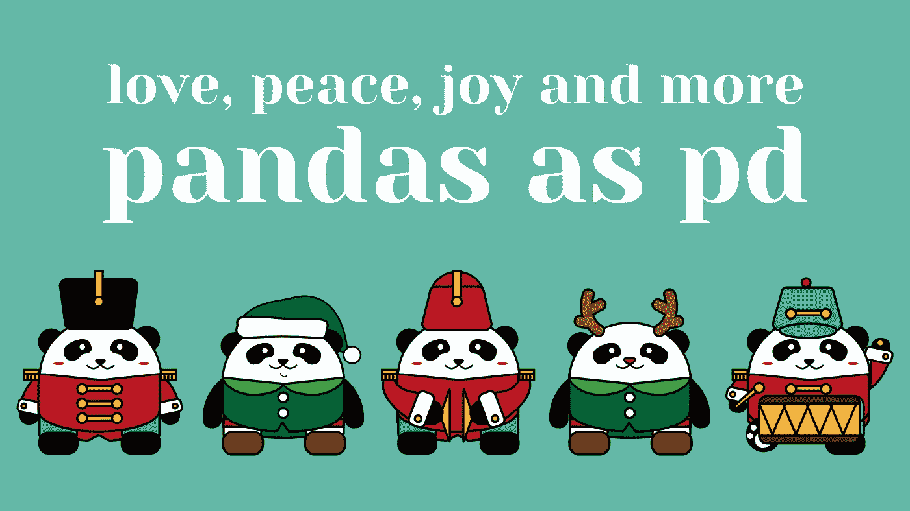

# 我的熊猫小抄

> 原文：<https://towardsdatascience.com/my-pandas-cheat-sheet-b71437ab26f?source=collection_archive---------18----------------------->

## 给我的数据科学家同事的提前圣诞礼物🎄🎁

My wishes for you.

> 被困在付费墙后面？[点击此处阅读我和朋友的‘礼物’链接](/my-pandas-cheat-sheet-b71437ab26f?source=friends_link&sk=0d8e8ac2e3692d74644bb7464d78bb0a)。

上周我在训练一个神经网络，首先我需要在一个*内部连接*中合并两个数据帧。经过几次测试。*合并()，。concat()，。join()* 很快我意识到我需要回到我的备忘单，而不是在我自己思考之前:*我在训练神经网络，但我不记得如何正确合并我的数据框架，这怎么可能呢？*

是啊，我记性很差。令人高兴的是，1。我知道这是可能的，因为我以前做过，2。我手边有我的熊猫小抄。

今天，作为提前的圣诞礼物，我整理了它，我将与你分享我的**笔记本-宝石**。它包含了我从开始学习 pandas 开始就收集的样本代码和函数，为我节省了很多关于*堆栈溢出的时间。*

## ***我们开始之前的一个建议:***

*您可以为该页面添加书签，或者克隆存储库以方便使用，但是* ***不要复制粘贴代码。*** *键入所有你曾经记得的执行任务的正确方式。* ***输入代码中有一个值。它练习编码肌肉记忆*** *到最终，代码没有小抄。*

If you can’t visualize the notebook complete click here: [https://gist.github.com/brendahali/2b8f6f218492a94cb74eea5043d64867](https://gist.github.com/BrendaHali/2b8f6f218492a94cb74eea5043d64867)

或者从这里的存储库中派生并克隆最新的文档:[https://github.com/brendahali/python_cheat_sheets](https://github.com/BrendaHali/python_cheat_sheets)

我应该在我们的备忘单中包含什么命令吗？分享给我我再补充。

继续分享知识，我的朋友和…圣诞快乐！