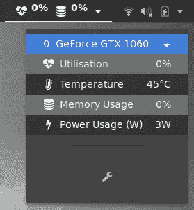
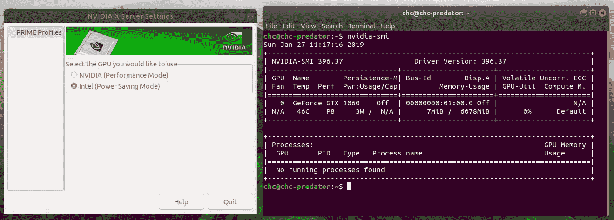
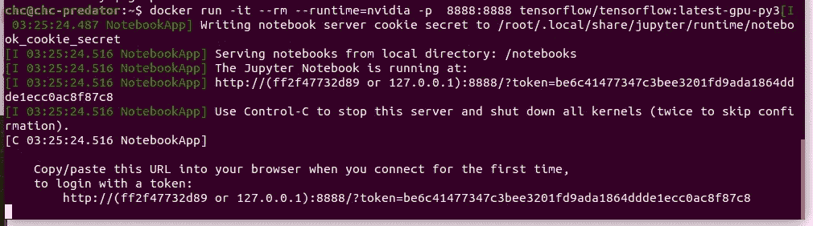
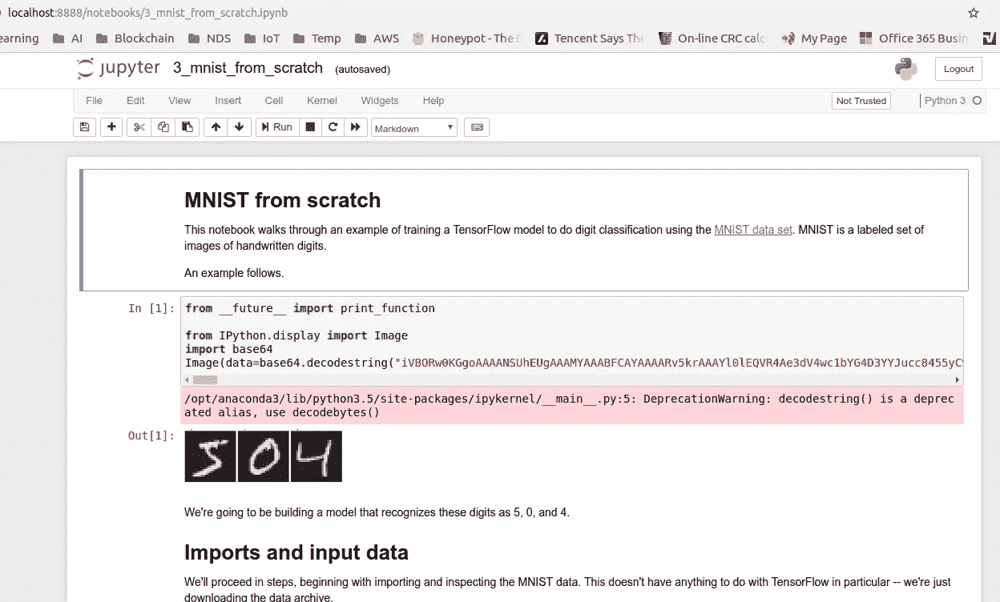
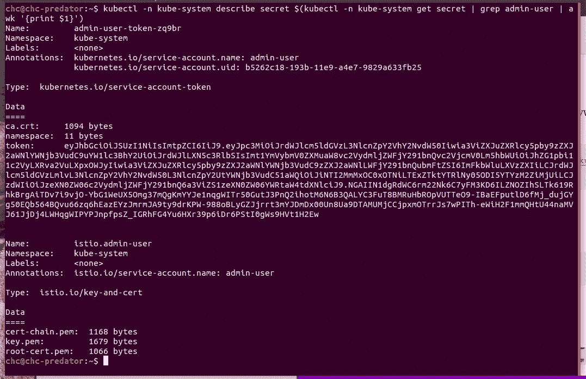
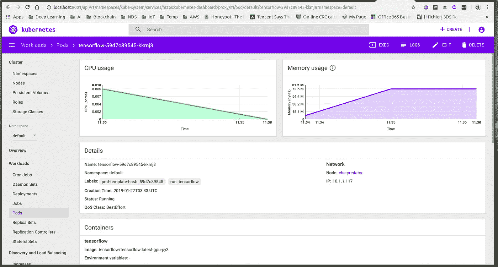
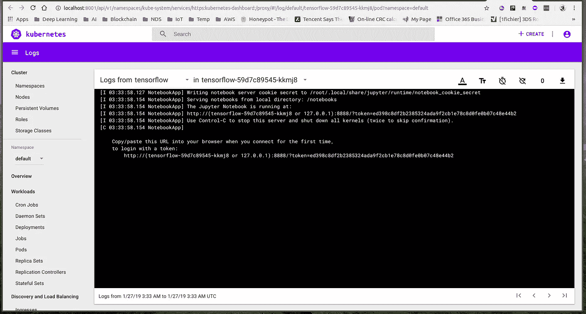
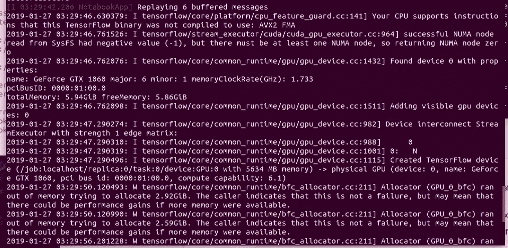
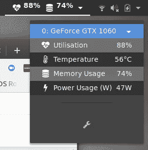

# 我的便携式 Ubuntu 18 深度学习设置

> 原文：<https://towardsdatascience.com/my-portable-ubuntu-18-deep-learning-setup-66151fe78da9?source=collection_archive---------18----------------------->

# **简介**

从我去年的早期文章开始，重点是在家里拥有一个 DIY 服务器，这是更新的指南，将更加关注使用游戏笔记本电脑的便携式深度学习。

# 动机

我希望有一个便携式深度学习硬件，在加载到云或 DIY 服务器之前，我可以随身携带进行实验。

# 笔记本电脑规格

我的笔记本电脑是[宏碁 Predator Helios 300](https://www.acer.com/ac/en/US/content/predator-helios300-series)

# 安装和设置

**Ubuntu 18.x 安装** -从[官方网站](https://www.ubuntu.com/download/desktop)获取最新的 Ubuntu 18.04.1，我得到的是最新的 LTS 版本，而不是 18.10
-到目前为止，在宏碁 Predator Helios 300 上安装没有问题，一切正常，但记得在 BIOS 中禁用安全引导。迄今为止 UEFI 工作正常。
-最后从软件&更新的附加驱动程序下安装 NVIDIA 二进制驱动程序。

**MicroK8s (Kubernetes)安装**
——只需遵循 microk8s
的官方[安装指南](https://microk8s.io/docs/)——我们可以通过以下命令打开 gpu 和注册表

```
microk8s.enable gpu dns dashboard registry
```

gpu 将与笔记本电脑 Nvidia 一起开箱即用，注册表是将在本地运行的 docker 注册表
-请注意，我们只为 kubectl 创建别名，而不是 docker one，因为 docker kubernetes 不能很好地工作，需要在 kubernetes 部署环境中运行
-最后，请参考[kubernetes wiki](https://github.com/kubernetes/dashboard/wiki/Creating-sample-user)来创建一些样本用户，因为我们需要用户令牌来稍后登录仪表板

**Docker 安装**
比使用 kubernetes docker
更容易官方使用 Docker-从[官方指南](https://docs.docker.com/install/linux/docker-ce/ubuntu/)
安装 Docker-从[官方指南](https://docs.docker.com/compose/install/)
安装 nvidia-docker2 从[官方指南](https://github.com/nvidia/nvidia-docker/wiki/Installation-(version-2.0))

一旦安装了 microk8s 和 docker，我们就可以重启笔记本电脑并使用 Nvidia prime (NVIDIA X 服务器设置)禁用 GPU

它将重新启动，这将为我们提供一个半 nvidia 加载驱动程序环境，我们可以充分利用 GPU 内存，而 X Windows 不会使用它。如果我们选择 Nvidia SMI 作为属性提供商，我们可以使用一些有趣的工具，如
[NVIDIA GPU 统计工具](https://extensions.gnome.org/extension/1320/nvidia-gpu-stats-tool/)



Noticed close to 0% memory

nvidia-smi 命令也可以工作



nvidia-smi command still work even we disable the driver

**Tensorflow + Jupyter(Docker-local)** 借助 Docker，我们可以轻松部署 tensor flow+Jupyter 设置

```
docker run -it — rm — runtime=nvidia -p 8888:8888 tensorflow/tensorflow:latest-gpu-py3
```



Note down the token to login later



The url will be [http://localhost:8888](http://localhost:8888)

**tensor flow+Jupyter(Kubernetes)** 要在 Kubernetes 中运行相同的图像，请执行以下命令

```
microk8s.kubectl run — generator=run-pod/v1 tensorflow — image=tensorflow/tensorflow:latest-gpu-py3
```

要获得 dashboard 的 kubernetes 令牌，请查找关键字令牌

```
kubectl -n kube-system describe secret $(kubectl -n kube-system get secret | grep admin-user | awk ‘{print $1}’)
```



Retrieve the token to login later

那我们需要跑

```
kubectrl proxy
```

使用[本地主机 url](http://localhost:8001/api/v1/namespaces/kube-system/services/https:kubernetes-dashboard:/proxy/) 显示管理面板



Note IP in the tensorflow pod, this will be use to access the jupyter from browser



Then click on Logs to look for jupyter login token

一旦我们有了 IP 和令牌，我们就可以使用浏览器访问 jupyter。

# 结论

像 docker 这样的容器技术甚至在 kubernetes 中也提供了很好的工作流，我们可以在本地进行实验，特别是在游戏笔记本电脑/台式机上，然后再部署到云中。我们也不需要担心安装 CUDA 库，只需要在 Ubuntu 上使用官方的 Nvidia 驱动程序。



Example runtime output with docker container that allow close to 100% GPU memory utilization



we could easily monitor the stats from here while running tensorflow

这种设置的唯一缺点是电池寿命！因为我们有半激活的 nvidia 驱动环境。