# 我关于自动睡眠阶段分类的美梦

> 原文：<https://towardsdatascience.com/my-sweet-dreams-about-automatic-sleep-stage-classification-414128441728?source=collection_archive---------21----------------------->

## 睡眠是我们每天能做的唯一最有效的事情来重置我们的大脑和身体健康——大自然母亲对抗死亡的最大努力。(马修·沃克)

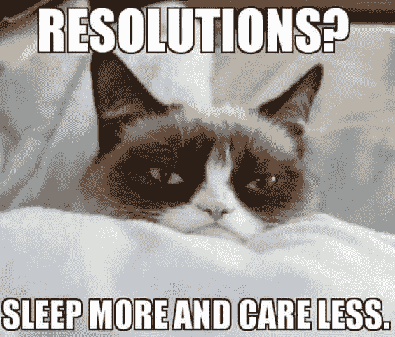

Credits: [The Funny Beaver](http://thefunnybeaver.com/32-memes-people-just-want-sleep/)

在过去的五个月里，我花了一些业余时间在一个全新的由法国公司 [Dreem](https://dreem.com/en) 提出的[挑战](https://challengedata.ens.fr/en/challenge/37/learning_sleep_stages_from_physiological_signals_on_dreem_headband.html)上提高我的 ML 技能，该公司的目标是改善每个人的夜晚。睡眠很少受到我们应有的重视，现在对我们的人口有具体和量化的后果。表现直线下降、注意力不集中、记忆障碍……都是睡眠不足的症状。Dreem 的解决方案是一个头带，在晚上主动刺激你的大脑，监控你的睡眠，并提供不同的程序让你轻松入睡。对于那些对睡眠在我们日常生活中的真正重要性有足够好奇心的人，我推荐你 [**我们为什么要睡觉**](https://www.theguardian.com/books/2017/sep/21/why-we-sleep-by-matthew-walker-review) 作者是*马修·沃克*，他目前是加州大学伯克利分校的一名教师。这本书在很多方面让我感到惊讶，它提供了很多原则和建议，让你了解并改善你的睡眠，从而改善你的日常生活。

在我的 [GitHub](https://github.com/Coricos/DreemHeadband) 上可以找到比赛使用的所有代码。请随时查看并给我反馈。我将主要讨论是什么让我登上了领奖台的第二名，尽管解决这个问题的可能性是无限的。你还会发现这个代码可以用于更广泛的与时间序列相关的问题，并且它主要面向**可解释性**。对于最好奇的人，你还会发现更多: **DL 架构**、**自动编码器、**和[TDA](/from-tda-to-dl-d06f234f51d)**复活节彩蛋**。尽情享受吧！

# 睡眠

在进入整个机器学习问题之前，让我们花一些时间来了解我们的背景和我们将不得不处理的多模态源。正如 Dreem 的[网站](https://dreem.com/en/product)上介绍的那样，他们的头带可以量化你的**大脑活动**(六个脑电图电极，相当于 F7、F8、O1、O2、Fpz 和一个参考值)、你的**头部运动和呼吸**(一个三维加速度计)和你的**心率**(一个脉搏血氧计)。

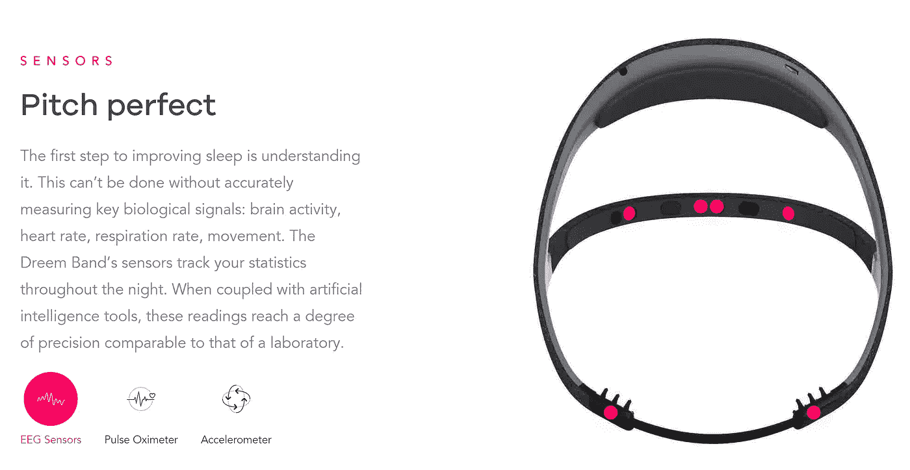

Credits: [Dreem](https://dreem.com/en/product)

在你睡眠期间，你的大脑会在不同的状态之间振荡，也称为**睡眠阶段**(如下所示)。每个阶段对应于特定的**电模式**和特定的脑电波。与睡眠阶段随时间演变相关的图表被称为**睡眠图**。

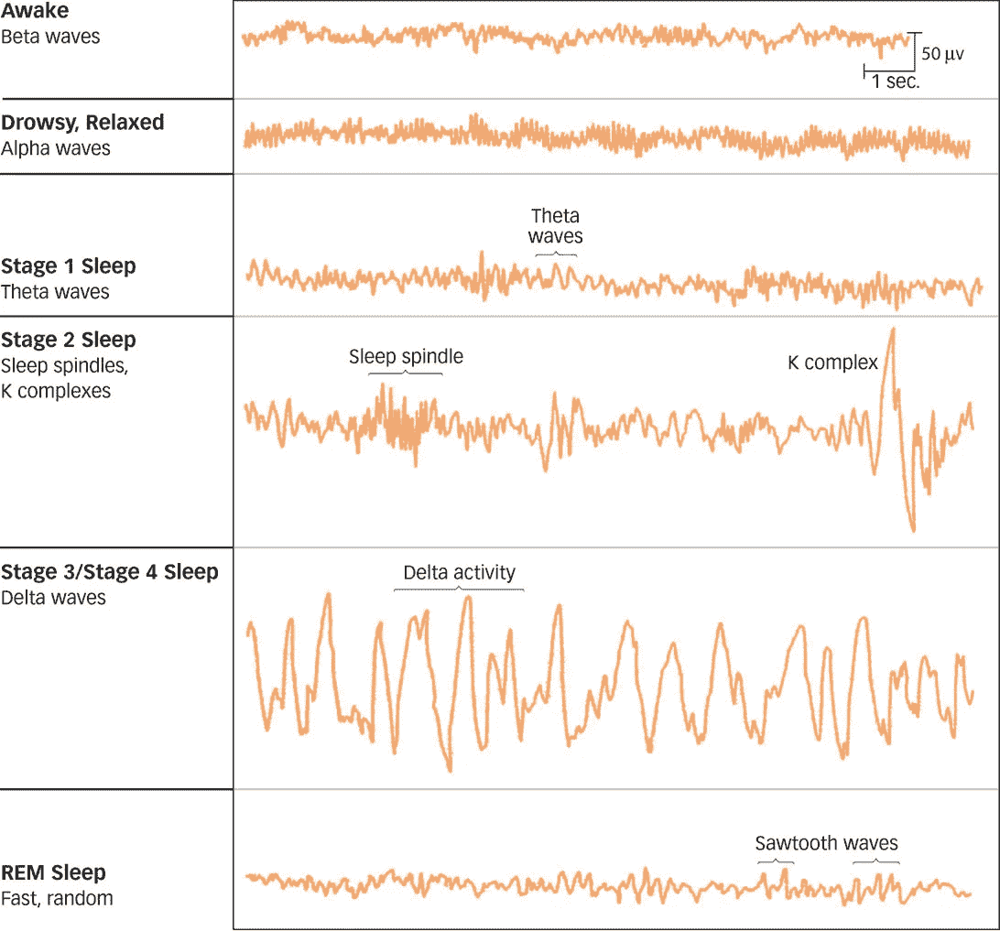

Credits: [http://www.macmillanhighered.com](http://www.macmillanhighered.com)

在过去的几十年里，人们一直希望用自动化的过程来取代那些阶段的基于专家的注释。当你阅读文献时，你会发现当前与这个话题相关的炒作。这正是机器学习发挥作用的地方！

我不会深入细节，但是每个阶段都有一个关于我们大脑健康的特定功能。精确标注这些阶段将使医学领域能够在更大范围内寻找病理和睡眠障碍。得益于强大的数据基础，更大规模(统计上更准确)的流行病学研究将成为可能。最终，人们将能够根据每天监测的真实指标来改善他们的睡眠。这正是 Dreem 所能提供的！此外，由于公司提出在**深度睡眠** (3 & 4)期间进行大脑刺激，他们必须尽可能准确地检测δ波，以正确触发它们。

# 探索性数据分析

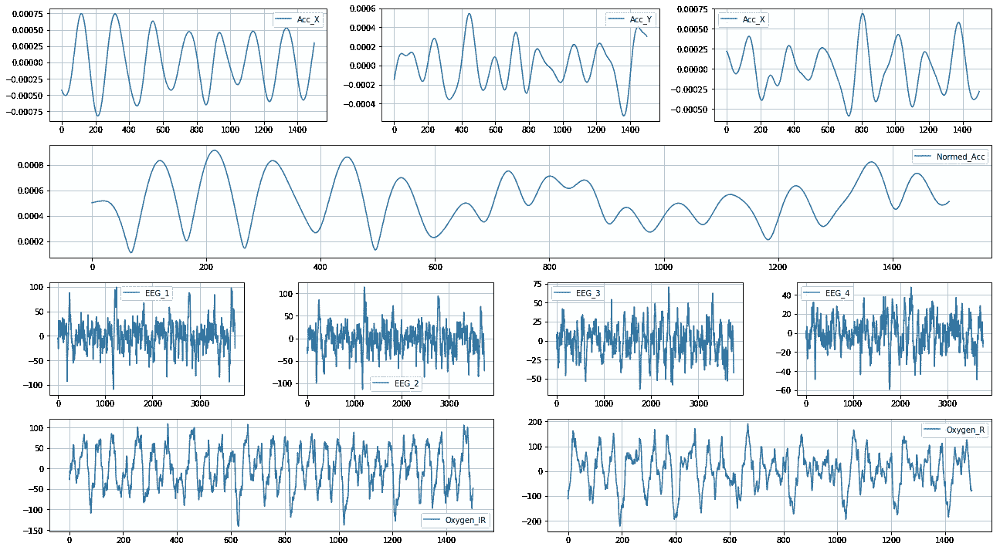

Actual Data extracted from the Train Dataset

D reem 为我们提供了从集成在头带中的多个传感器获得的时间序列。给定信号为 **30 秒周期**并以**不同频率**采样。就像有监督的最大似然问题一样，数据被分成一个标注了相应睡眠阶段的训练集(理论上由睡眠科学家给出)和一个测试集。通过快速查看标签的比率，可以观察到这是一个**不平衡的多分类问题**。信号极值的分布还突出了数据集中存在的大量**伪像**(基于 EEG 信号的经典范围为-500 至 500 微伏的假设)。

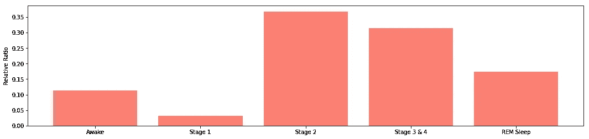

Annotations Ratios for the Five Considered Stages

摆弄数据时，我突然发现了一些意想不到的事情:标签实际上是有序的！这意味着数据集是通过个体的不断聚合而建立起来的，这给了我们**暂时性**的优势。这当然为模型的构建打开了一个全新的领域(GRU、LSTM……)。从我的理解，Dreem 似乎目前正在使用这样的模型(典型的 LSTM 超过 30 个 30 秒的时期)。然而，由于**的计算限制**(领域中使用的 DL 模型通常是火箭筒)和对**可解释性的渴望**，我决定将自己限制在良好的老式且健壮的特征工程方法上。

把时间性放在一边，前面的观察使我能够通过根据长时间的清醒(标签 0)分割指数来提取个体本身。下面给出了提取睡眠图的典型例子。一旦提取出来，这些个体就可以聚集成子集来构建健壮的验证集，以便评估我的模型的泛化能力。我最终得到了 88 个不同长度的子集，这可能是对实际人数的高估(这些片段对应的平均睡眠时间为 4.5 小时)。

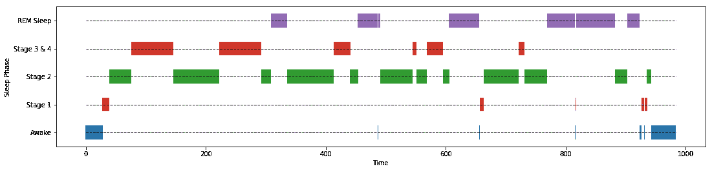

Example of one Extracted Hypnogram

# 描述性特征工程:混沌理论

有趣的(也是最长的)部分来了！我如何最好地描述睡眠阶段分类的 EEG 信号？在查阅文献之后，我收集了关于我的管道的多种描述性见解。结果，每个 30 秒的时期变成了一个 **1200 特征向量**。我不会详细介绍每个特征(仅仅是因为大多数都是经典的)，而是将重点放在为睡眠阶段分类提供最佳性能的特征上。

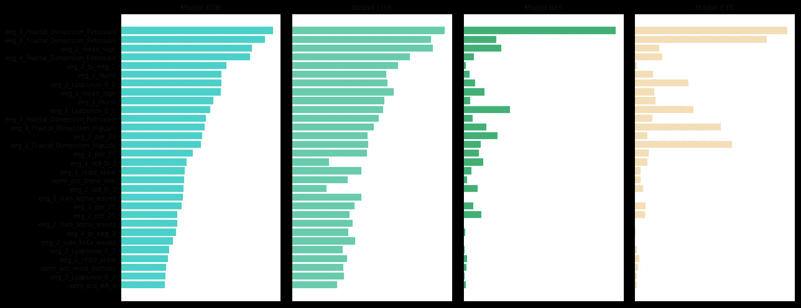

Relative Feature Importance (Best 30 features for XGBoost)

通常，在上图中，我估计了 XGBoost 模型的 30 个最重要特征的重要性，并将其与 LigthGBM、RandomForest 和 ExtraTrees 获得的相对重要性进行了比较。XGB 型号是我在**五重交叉验证中表现最好的型号。**(这里的重要性是 5 次折叠所得模型的平均值。)

难怪混沌理论最终成为最重要的理论之一。为什么？因为我们试图对**波**和**发生事件**进行分类:周期性和可预测事件的“低级”混沌；一般不可预测事件的“更高”混沌(例如，*纺锤波*、*K-复合波*，它们是特定于某些睡眠阶段的模式)。到目前为止，这些特性在我的许多项目中都非常有用，所以我将保留一些行来介绍它们。

> [李亚普诺夫指数](https://en.wikipedia.org/wiki/Lyapunov_exponent)指无限接近的轨迹之间的分离率(一般距离)。它们量化了动态系统(此处为非平稳脑电图)的可预测性，必须将其视为一个频谱。
> 
> [赫斯特指数](https://en.wikipedia.org/wiki/Hurst_exponent)指的是长期相关性的指数，因为它通过自相关来量化特定时间序列的长期记忆。
> 
> [分形维数](https://en.wikipedia.org/wiki/Fractal_dimension)对应于描述图案细节如何随测量尺度变化的复杂性统计指数。

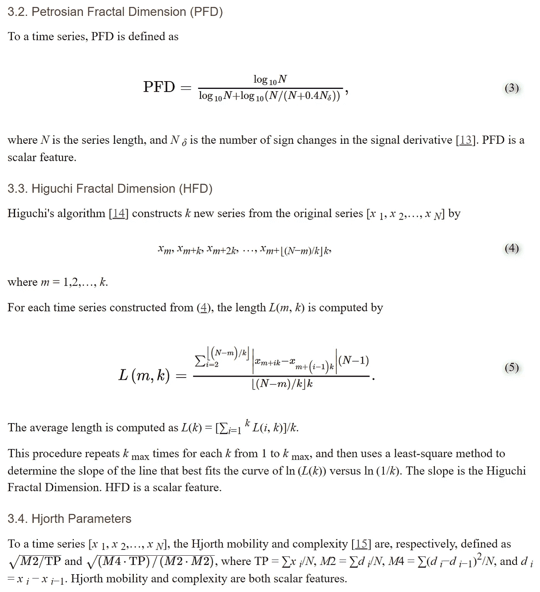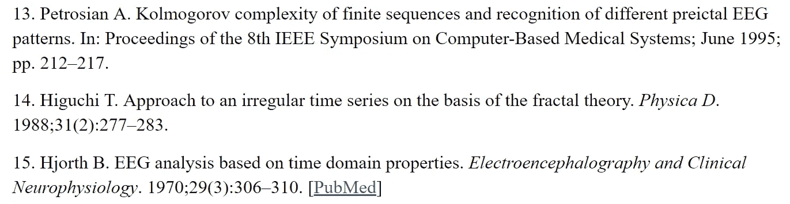

Credits: [PyEEG](https://www.ncbi.nlm.nih.gov/pmc/articles/PMC3070217/#B13)

那些是奇异的特征。我还使用了**拟合自回归模型的系数**，EEG 之间的距离，分解成小波的**，趋势-残差分解**和**频谱图**来确定频率相关性(因为每个波形图【α、δ、θ波】都有特定且显著的频率)。这给了我一个进入模型构建过程的基础。

# 水平施工和堆放

特征工程和预处理过程现已完成。我能够区分个人的一些子集，以便建立我的训练集和验证集。为了构建每个模型，我使用了 5 重交叉验证(这意味着我将个体的特定子集放在一边，以进行泛化表征)。

最后，为了得到最终的预测，我做了两个考虑:**基于噪声水平的区分和通过叠加的聚集**。

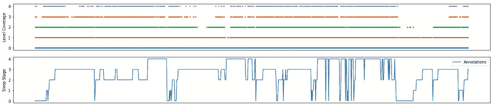

Example of Coverage for the first 1000 Samples

通常，统计模型会受到噪声的影响。我在这里的方法包括根据特定的度量标准构建训练和测试数据的精选子集。通常，为了定义“噪声水平”，我为每个 EEG 信号建立了三个特征:最大值、最小值和曲线下面积。通过(通过**中值**)相对三个分布的中心，我可以天真地确定噪声水平对应于**距离与实际标准偏差的比率**。这个方法让我定义了 5 个级别的噪声，如上图中的覆盖级别所示。没有出现在多个电平的信号极有可能包含**伪像**。这种限制意味着分别针对每个子集的 5 个不同的训练阶段。然而，这些给了我关于多路输出的**水平的信心**。最后，通过用更精细级别的预测迭代地覆盖它们自己来获得预测。

一旦这 5 个级别被分离，我就开始训练 4 个不同的模型(如特征工程过程中所介绍的):XGBoost、LigthGBM、RandomForest 和 ExtraTrees。超参数是用我自己实现的 [**超波段**](https://arxiv.org/abs/1603.06560) 调的。优化的度量标准是 [kappa 分数](https://en.wikipedia.org/wiki/Cohen%27s_kappa)(可以理解为**协议间度量标准**)，用于对该领域进行基准测试。

Definition of the Kappa score

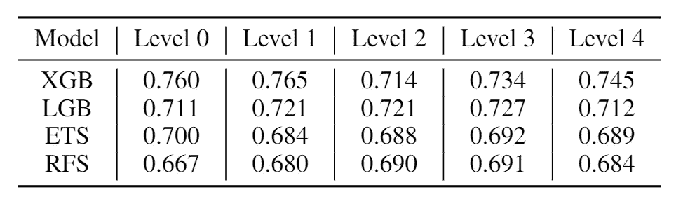

Cross-Validation Scores (Kappa Score on Validation Sets) on the 5 Levels of Noise

在每一轮交叉验证中，这 4 个模型给了我训练集、验证集和测试集样本的概率。数据集的不平衡也很重要，并在训练和评分过程中通过权重加以考虑。

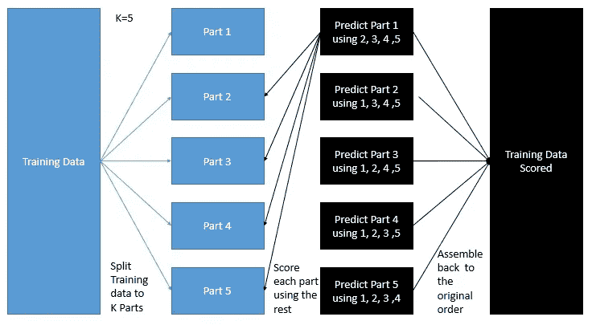

Credit: [No Free Hunch](http://blog.kaggle.com/2017/06/15/stacking-made-easy-an-introduction-to-stacknet-by-competitions-grandmaster-marios-michailidis-kazanova/)

结果，我得到了那 4 个模型的概率，这让我想到了**叠加**。这种方法的动机是结果的多样性，如下面模型之间的预测相关性所示。上图所示的基本方法基本上是将概率作为特征，并将其用作训练、验证和测试集。在这种情况下，我使用线性模型(随机梯度下降)并通过**基于个人的交叉验证**优化 kappa 指标。

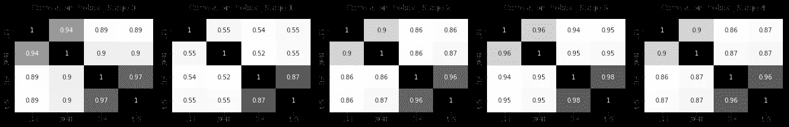

Correlations between Model Probabilities relative to actual Sleep Stages

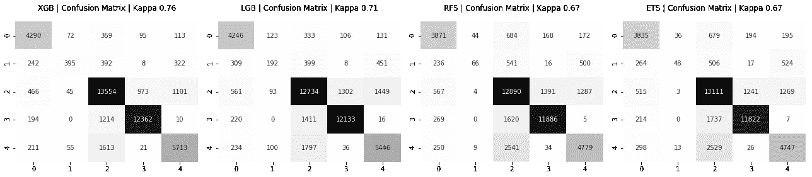

Confusion Matrixes for the 4 Models (5 Levels of Noise)

让我们关注一下相关性矩阵:由于(XGBoost，LightGBM)和(RandomForest，ExtraTrees)是相似的结构，它们的预测显然是高度相关的。然而，有两个事实值得注意:

*   **第 1 类**(第 1 阶段为少数类)最难预测，且在提升的树木中显示出很小的相关性；
*   第 3 类(阶段 3 & 4)是最容易预测的(这对于 Delta 波的 Dreem 刺激是一件好事)。进一步的分析将表明，类别 1 通常与类别 4(快速眼动睡眠)混淆，如果 EEG 的范围和形状相似，这是可以预料的。

# 输出平滑

鉴于之前的结果，我的方法有优点也有缺点。它有**两个特别的弱点**:该模型没有考虑样本之间的时间关系，并且它在预测睡眠阶段 1 时有困难。阶段 1 仅仅是一个**过渡阶段**，从清醒状态进入真正的睡眠阶段。我的目标是通过在它的基础上构建一个过滤器来改进之前的模型。我首先考虑的是经典输出平滑，以及*带通*(保持高频微唤醒并坚持连续睡眠阶段)或*平均方法*(例如 Savitsky Golay)。然后我转向**隐马尔可夫模型**，因为这些正是我正在寻找的:转移矩阵。然而，最好的结果来自它的近似值，通过基于 20 个时间步长的**过度拟合 LSTM** 。LSTM 基于输出概率(我为训练集和测试集收集的概率),并考虑了**时间关系**。有了它，我可以建立一个转移矩阵(就像 HMM 一样),但是对于连续的输入(概率)。

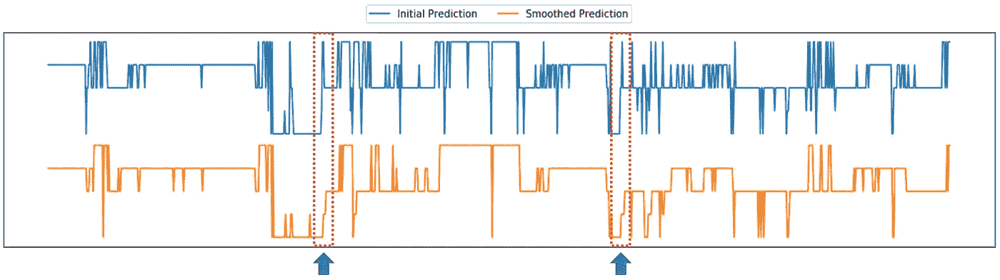

最后，我改进了睡眠阶段的**连续性，保留了**微唤醒**事件，并强调了**过渡阶段 1** 的重要性。**

# **精神食粮**

这就是我在这场比赛中所做的部分工作。可以改进的地方很多，而且可能性是无限的。最终我达到了第二的位置，在私服测试集上的最终 kappa 分数为 **70.7** 。正如所料，所使用的策略并没有完全保护我免于过度拟合，并且在我的内部分数和排行榜分数之间观察到了明显的差距。在这种医疗保健背景下，涉及个人不可挽回地引起了**协变量转移**的问题。这个问题一直存在，但我的结果显示了推广的巨大潜力。

我感谢我的爱人给了我关于马修·沃克的书的建议！许多类似的项目来了！*敬请期待来稿，想要更多就鼓掌；)*！

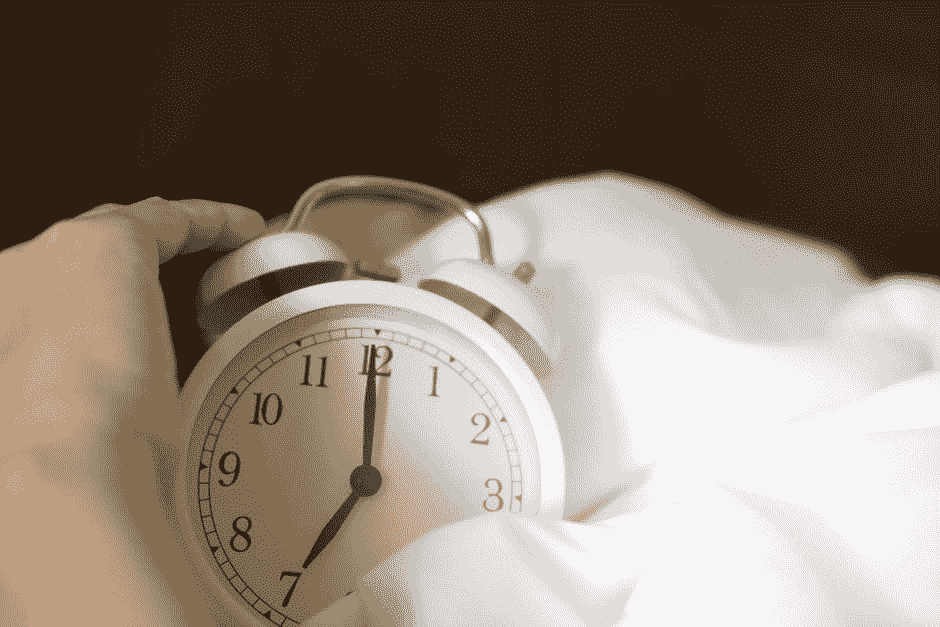

# 资源

*   [*Github 资源库*](https://github.com/Coricos/DreemHeadband)
*   [*比赛网站*](https://challengedata.ens.fr/en/challenge/37/learning_sleep_stages_from_physiological_signals_on_dreem_headband.html)
*   [*Dreem 网站*](https://dreem.com/en)