# 到目前为止，我在媒体上的数据科学博客之旅

> 原文：<https://towardsdatascience.com/my-technical-blogging-journey-on-medium-till-now-38aa9b9804b6?source=collection_archive---------5----------------------->

## 以及我如何通过我的技术博客获得了大量的浏览量？


Photo by [Chris Barbalis](https://unsplash.com/@cbarbalis?utm_source=medium&utm_medium=referral) on [Unsplash](https://unsplash.com?utm_source=medium&utm_medium=referral)

文笔清爽。

在全世界面前展示你的想法。并在此过程中获得想法和灵感。

但是这并不容易。

我第一次开始写博客是在 2014 年。我仍然记得我的第一篇博文。这是一场灾难。

**但是我记得它帮助了一些人。这可能是一个好的开始。**

我后来的帖子也好不到哪里去，经过大量的练习才达到我现在的写作阶段。

当我开始写作时，在数据和动力方面都有很多起伏。 ***我主要的动机缺失来自于这样一种观念，即我的作品不能被人们理解*** 。

直到 2018 年，我的博客上没有多少读者，虽然许多博客作者会要求你不要考虑这个问题，但让我的内容被阅读对我来说很重要。在某种程度上，这是个人的事情。

Medium 为我提供了一个平台，在这里我可以放下我的想法，并让人们阅读它们。

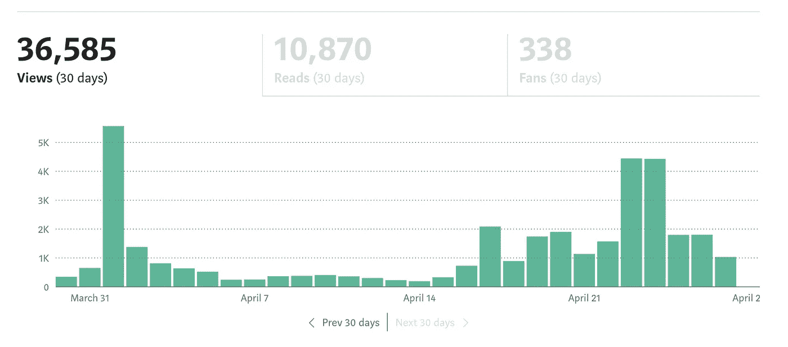

Views and Stats in Last Month

仅这个月我就获得了大约 36k 的浏览量。怎么会？

这篇文章是关于有效的博客实践，s̶o̶m̶e̶的自我推销和一些关于我写统计数据的分析/数据科学，为什么不呢？。

# 开始


My situation really.

我还记得我第一次来 medium 的时候。那是 2017 年 2 月。我重新利用了我在 medium 上的一些博客，想收集一些观点，获得追随者，并向世界展示我的想法。

这个平台看起来很棒，拥有超过数千的追随者。 ***但是你猜怎么着？我得到了多少次浏览？***

你猜对了。在 100 度左右。我发表了 10 多篇博文。

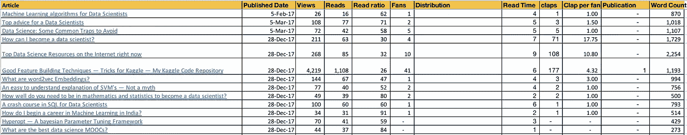

A Broken Start

2017 年 2 月至 12 月期间，我连续发布了几篇帖子，但没有任何实质性的结果。第一次是在二月到三月，它没有起飞。我在 12 月份又试了一次，但无济于事。正如你所看到的，我的后[好的 Kaggle 特征构建技术中只有一个有一些视图，这些视图是在大约一年后的 2018 年 11 月出现的。这不足以让我继续在 medium 上工作，因为我的博客获得了更多的浏览量。 ***所以我在 2017 年 12 月离开了 medium 一年。***](https://becominghuman.ai/good-feature-building-techniques-tricks-for-kaggle-my-kaggle-code-repository-c953b934f1e6)

但是我做错了什么呢？

事后看来，我会说，当时我不明白媒体是如何工作的。

中基于出版物。获得视图的是出版物。一开始我并不知道。

但是，什么是出版物呢？你可以看到这篇特别的文章是以“走向数据科学”为标题发表的。TDS 拥有 20.6 万用户，每当我在他们那里发表文章时，它就为我提供了接触这些用户的渠道。**对我这样的新手来说，那太难了。**

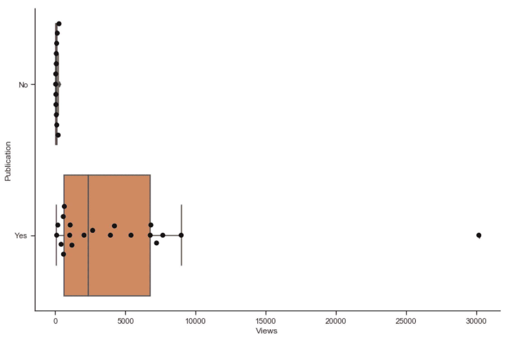

The Publication Effect

当谈到写作，特别是技术写作时，媒体有许多活动的部分。

因此，以下是我根据自己在这个平台上的经历对 Medium 的一些观察:

*   **总是为出版物写作。**我指的是永远。
*   用你写的任何出版物来建立声誉。有时编辑会在他们的首页发表你的文章。为此感谢他们。在这一点上，感谢 Ludovic Benistant 为我的一些帖子做了特写。仅出版物中的一个特征就能吸引大量的浏览。

[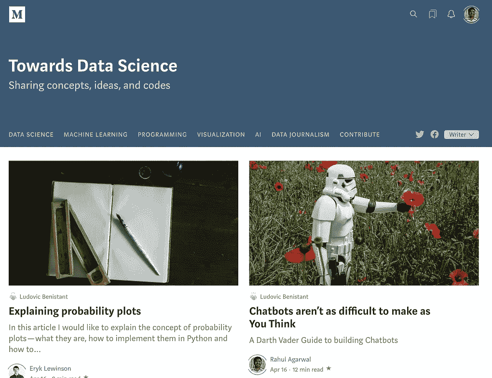](https://towardsdatascience.com/chatbots-arent-as-difficult-to-make-as-you-think-f7f90255b993)[](https://towardsdatascience.com/what-my-first-silver-medal-taught-me-about-text-classification-and-kaggle-in-general-ebae0df16278)

My posts are on Chatbots and Kaggle Learnings

*   给你的帖子贴上一些高收视率的标签。如果你不知道该写哪些标签，可以看看高产作者的标签。
*   关于这一点，跟随一些在媒体上成功的作家，试着理解他们成功的原因。我跟随[威尔·科尔森](https://medium.com/u/e2f299e30cb9?source=post_page-----38aa9b9804b6--------------------------------)和[卡西·科济尔科夫](https://medium.com/u/2fccb851bb5e?source=post_page-----38aa9b9804b6--------------------------------)。如果你这样做，你会学到很多关于媒介的知识。例如，我注意到大多数优秀的作家都是用短句而不是段落来写作。或者他们如何运用幽默。或者他们是如何把事情分解成更小的更容易理解的部分。这一点本身就证明了我不是一个好作家(既然这么长)。但是我正在努力改进。
*   在你的文章中使用好图片，使用高清晰的图片。在我最初的几篇帖子中，我没有利用这个工具。目前，我在媒体编辑器中使用 Unsplash 的图片。您也可以尝试 Pixabay 来获得高质量的图像。
*   **尽量让你的帖子被策展人分发给主题**。还有一些[指引](https://help.medium.com/hc/en-us/articles/360006362473)。跟着他们。下面是我在《数据科学》杂志上发表的一篇文章。感觉真好。

[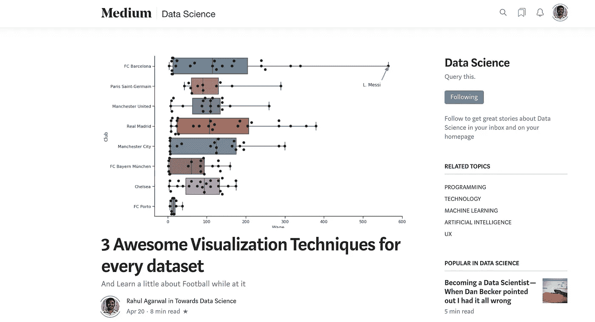](https://towardsdatascience.com/3-awesome-visualization-techniques-for-every-dataset-9737eecacbe8)

[The story](/3-awesome-visualization-techniques-for-every-dataset-9737eecacbe8) as it got featured in Data Science Topic in Medium.

*   媒体不是科学期刊。解释数学对某些人来说可能很有效，但对我来说，写直觉最有效。我想说这取决于你的写作风格，你应该努力找到自己的位置。
*   为你的帖子使用字幕，并为你的帖子添加合适的图片。你的帖子看起来像样是至关重要的。感谢 [Ludovic Benistant](https://medium.com/u/895063a310f4?source=post_page-----38aa9b9804b6--------------------------------) 的提示。
*   **尽量让你的内容有创意**。例如在这篇关于 [shell 基础知识](/shell-basics-every-data-scientist-should-know-3f012ef5c38c)的文章中，我用 gif 展示了 shell 是如何工作的。或者在[这篇文章](/why-sublime-text-for-data-science-is-hotter-than-jennifer-lawrence-651afc54d67)中，我如何试图厚颜无耻地使用标题。标新立异。*做写作是为了什么。这很有趣。*

> 写什么就写什么。这很有趣。

*   ***写各种各样的话题。防止无聊，提高你的写作，甚至可以说让你成为一个更好的人。目前，我写 NLP，编程，可视化，数据科学。这个帖子本身就是试图增加我的话题覆盖面。***
*   **写很多。**有时它不会自然而然地出现。我遵循的系统是尝试每天写 x(500)个单词。开始写一些 jibberish，你会注意到当你开始写的时候，你不会停留在 x 个单词上。永远不会。我已经写了 900 字了。我的脑子里充满了想法，所以很难停下来。记住，只有开始写，才很难停下来。

> 记住，只有当你开始写的时候，才很难停下来。

*   在发布之前，反复阅读你的文章。也许在第二天。一个普通的提示，但很重要。
*   最后，为你的观众创造一些有价值的东西。没有它你将一事无成。互联网上有很多信息渠道，让你与众不同的是你自己的观点。无畏地把它展示给全世界。记住，对你来说很自然的事情对别人来说可能不会那么快。让他们更容易。

> 互联网上有很多信息渠道，让你与众不同的是你自己的观点。

# 接下来发生了什么？

所以回到这个故事。直到 2017 年 12 月，我在媒体上一次又一次失败。直到 2018 年 11 月，我几乎没有任何观点。

我几乎已经忘记了 Medium，但它在 2018 年 12 月再次引起了我的注意，当时我注意到我的一篇文章在 Kaggle 发推文后成为了热门话题。

我在某种程度上欣喜若狂。我的文章被 Kaggle 发推特了。不错！

得到卡格尔的认可正是我需要的那种动力。这促使我更加努力地写作。

我开始写更多。发表了一些我的文章，这些文章在我的草稿文件夹里积了很长时间的灰尘。

几家出版社联系了我。但是 ***主要的转折点是作为一名作家被 TDS 接受。***

我突然开始有了看法。我的文章开始按主题分类，人们开始阅读我创作的内容。

我现在很开心，所以我写了这篇文章。

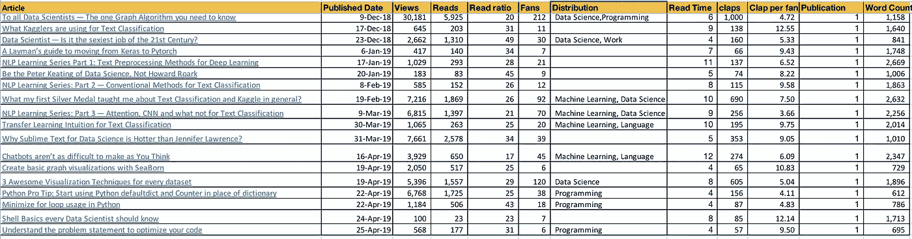

The stats after writing for publications

在上面的部分，我提供了一个定性经验的列表。现在让我们谈谈数字。

## 是什么让一篇文章成功？

粉丝数量是一篇文章成功的合理代表。

让我们来看看哪个因素对某篇文章获得更多粉丝至关重要。

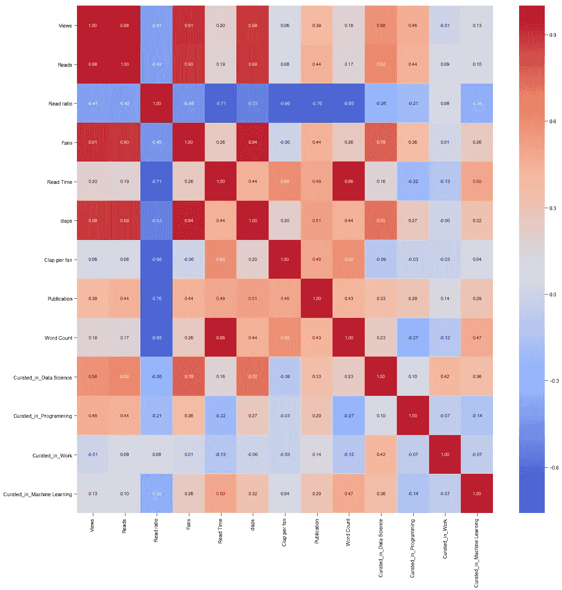

这里信息不多。被怀疑的浏览量和阅读量与粉丝数量高度相关。

**数据科学主题>机器学习主题:**从关联图中，我们可以看到，如果我的文章在数据科学中得到策划，那么与在机器学习中得到策划相比，它有很大的机会获得更多的粉丝/视图/阅读数。

此外，如果一篇文章在数据科学中被策划，它在编程中被选中的机会就非常小，反之亦然。基于有限的，可能是有偏见的样本，我的职位只有，我们在这里。

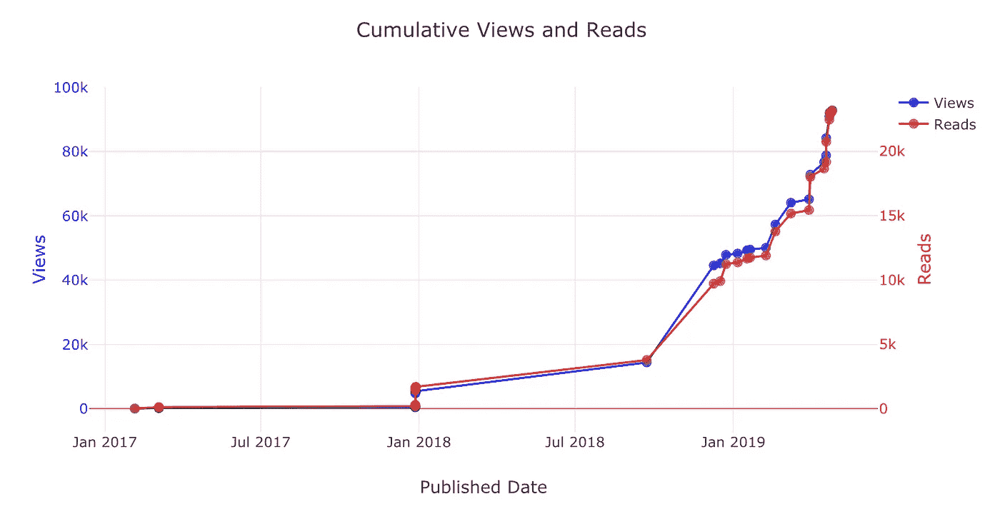

How the Cumulative views increase

写这篇文章的时候，我的终身浏览量刚刚低于 10 万。希望我通过这篇文章。

# 未来？

我已经每天统计我的观点。

为什么不建立一个模型来预测未来呢？我们当然是数据科学家。

我将使用脸书的`fbprophet`软件包来做这个时间序列分析。我喜欢这个包，因为它很简单。没有 ARIMA，萨里玛，自相关图。

只是一个非常干净的 API 来解决你的问题。时间序列模型的五条线。

```
import fbprophet
model = fbprophet.Prophet()
model.fit(df)
df_future = model.make_future_dataframe(periods=360)
df_predicted = model.predict(df_future)
```

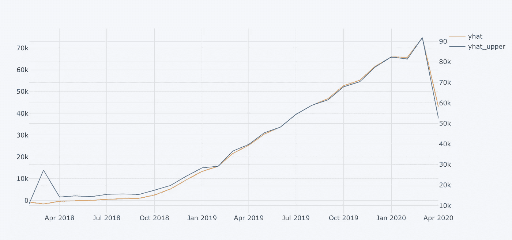

Monthly predicted views from the model

该模型预测到 2019 年底将有 65，000 次观看。我会更新这篇文章，看看我的预测是否与结果相符。

我们还可以发现工作日对日常视图的影响。

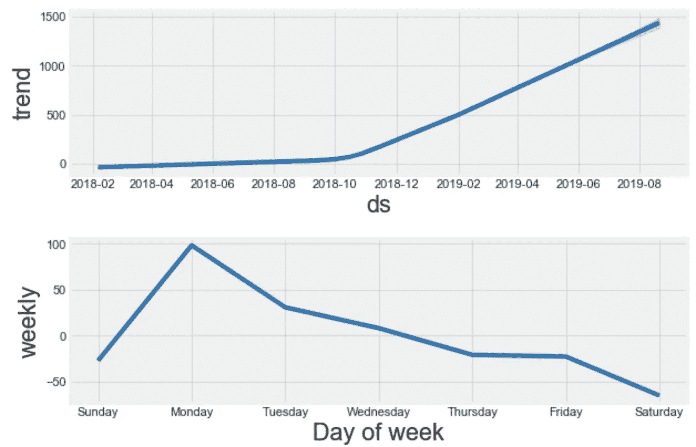

Daily predicted views from the model broken down in components

在这里**我们可以看到趋势主导着我们的日常观点**并且它还在持续增长。趋势在某种程度上定义了我们的基线观点。这是一件好事，它正以如此高的速度增长。

我们还可以看到，周一比其他任何一个工作日都有更多的浏览量。再次期待，因为这是本周的开始。人们有动力去阅读。

所以周日写，周一发表。检查！

# 结论

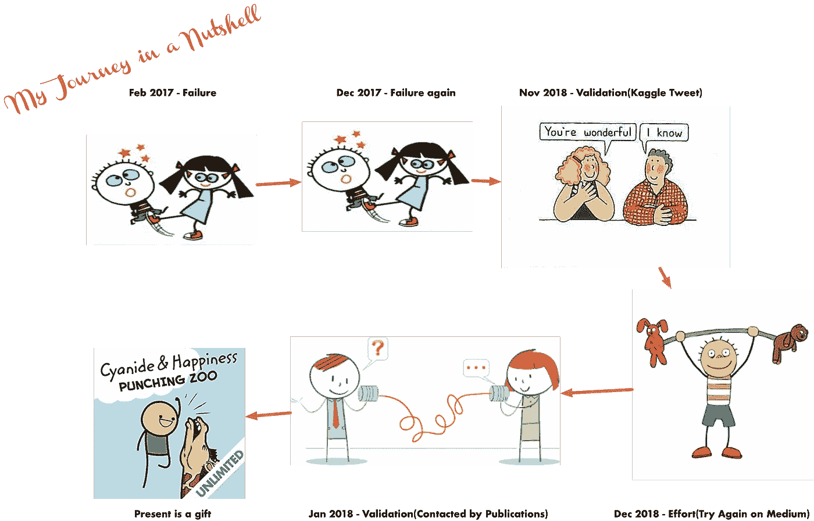

这篇文章详细介绍了我作为一名作家在 medium 上的旅程。我试着给有抱负的博客写手提供一些技巧和方法，以增加他们的覆盖面，并在媒体上写得更好。

这是一系列的失败，然后我在媒体上取得了小小的成功。希望我能通过让别人知道我的错误来帮助他们。

我也对自己的 medium stats 数据做了一个非常简要的分析。目前我可能没有很多追随者或观点，但我仍在努力，并获得一些不错的追随者。

很抱歉写了这么长的帖子，但你一开始就知道你会遇到什么。当布兰告诉提利昂他的故事很长时，他说:

> 要是我们被困在一座城堡里就好了，在隆冬时节，无处可去。

将来我也会写更多关于写作的文章。在 [**中**](https://medium.com/@rahul_agarwal) 关注我，或者订阅我的 [**博客**](http://eepurl.com/dbQnuX) 了解他们。一如既往，我欢迎反馈和建设性的批评，可以通过 Twitter [@mlwhiz](https://twitter.com/MLWhiz) 联系

最后，虽然这一节的标题可能是“结论”,但它不是。这仅仅是开始。