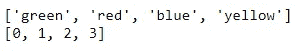
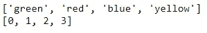
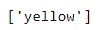
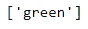
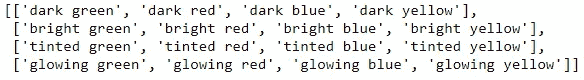

# 用 Python 理解列表的意义

> 原文：<https://towardsdatascience.com/my-trick-to-learning-list-comprehensions-in-python-8a54e66d98b?source=collection_archive---------15----------------------->


# 快速浏览列表

当我开始[探索 Python](https://www.w3schools.com/python/default.asp) 时，列表是我学到的第一件事，不久我就意识到它们是编程语言的一个常用特性。Python 语言中的列表是有序且可变的数据结构，它包含存储在一组括号[]之间的项目集合。列表可以包含重复项，列表中的单个项可以通过使用相应的索引值来调用，从[0，…，n]开始。列表中的项目可以被删除、更改或添加，使列表成为一种适应数据的方式。[有大量的资源可以帮助你学习更多关于 python 列表的知识](https://www.google.com/search?q=what+is+a+python+list)，但是这里有一个例子:

```
#example list
color_list = ["green", "red", "blue", "yellow"]
```

# 从列表理解开始

使用列表的一种“*python 式*”方法叫做*列表理解。*list comprehension 是一个语法结构，它允许您基于现有列表创建一个列表。一般语法如下:

```
#new_list = [(output value)(for loop)(logical conditions)]#example list comprehension
green_list = [color for color in color_list if color == 'green']
```

列表理解可以极大地减少完成一个操作所需的代码量。例如，这是使用 For 循环代替列表理解的相同逻辑:

```
green_list2 = []
for color in color_list:
    if color == 'green':
        green_list2.append(color)
```

# 我的尤里卡！列表理解的时刻

在我开始学习 Python 之前，我对 SQL 很熟悉，并且每天都在工作中使用它。 [SQL(结构化查询语言)](https://www.w3schools.com/sql/)常用于管理 MySQL、微软 SQL Server 等关系数据库中的数据。当我还是一个 python 初学者时，列表看起来相当简单，很容易在很多方面应用，但是列表理解对我来说很难理解。我被这种语法吓倒了，所以我避免使用它们。有一天，在做 python 练习时，我在写一个列表理解，突然意识到语法类似于 SQL SELECT 语句。这是一个尤里卡！给了我信心，让我变得有创造力。

```
#SQL select statement example
#SELECT color FROM color_list WHERE color IN ('green', 'red', 'blue')#list comprehension selecting the same data as the SQL statement
rgb = [color for color in color_list if color in('green', 'red', 'blue')]
print(rgb)
```

很容易看出列表理解如何类似于 SQL select 语句。

# 更多列表理解


在我灵光一现之后，学习理解列表变得容易多了。虽然这是一个强大的工具，但是有一些事情需要记住。列表理解可以重写为 for 循环，但不是每个 for 循环都可以写成列表理解！此外，就可读性和可维护性而言，写出 for 循环可能是有意义的。
这里还有几个使用列表理解的例子:

## 使用列表理解映射值的两种方法

```
#create numeric indicators for colors
color_indicator = [0 if color == 'green'else 1 if color == 'red' else 2 if color == 'blue' else 3 for color in color_list]
print(color_list)
print(color_indicator)
```



```
color_mapping = {'green': 0, 'red': 1, 'blue':2, 'yellow':3}
color_indicator2 = [color_mapping[color] if color in color_mapping else 'na' for color in color_list]
print(color_list)
print(color_indicator2)
```



## 查找长度为 n 的项目

假设我们想在列表中查找长度超过 5 个字符的所有颜色

```
long_color_words = [color for color in color_list if len(color) > 5]
long_color_words
```



在逻辑之间复制也很简单。我们可以找到长度在 4 到 6 之间的所有颜色:

```
color_length5 = [color for color in color_list if len(color) > 4 and len(color) < 6]
color_length5
```



## 嵌套循环

您可以嵌套循环来执行操作并返回矩阵。这里我们创建了一个颜色属性矩阵:

```
color_list1 = ['green', 'red', 'blue', 'yellow']
color_list2 = ['dark', 'bright', 'tinted', 'glowing']color_matrix = [[color2 + ' ' + color1 for color1 in color_list1] for color2 in color_list2]
color_matrix
```



# 结束语

希望这有助于理解 Python 列表，并给你一个简单的方法去思考它们，如果它们起初看起来令人生畏的话。它们是处理列表数据的优雅而强大的方式，因此理解它们是在 Python 中前进的重要一步。将列表理解视为 SQL Select 语句帮助我理解了这个概念，并帮助我更自信地探索其功能。

# 谢谢大家！

*   *如果你喜欢这个，* [*在 Medium 上关注我*](https://medium.com/@erickleppen) *获取更多*
*   [*通过订阅*](https://erickleppen.medium.com/membership) 获得对我的内容的完全访问和帮助支持
*   *我们来连线一下*[*LinkedIn*](https://www.linkedin.com/in/erickleppen01/)
*   *用 Python 分析数据？查看我的* [*网站*](https://pythondashboards.com/)

[**—埃里克·克莱本**](http://pythondashboards.com/)