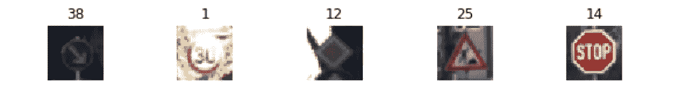

# 深度学习—带有 Keras 的德国交通标志数据集

> 原文：<https://towardsdatascience.com/my-tryst-with-deep-learning-german-traffic-data-set-with-keras-87970dfb18b7?source=collection_archive---------3----------------------->

纽约数据科学院提供的深度学习课程非常适合让您开始深度学习之旅，并鼓励您做一个成熟的深度学习项目。我决定用德国交通标志数据集做一个图像识别的挑战。我以前从未从事过图像识别，因此这个项目对我个人来说是一次很好的学习经历。

**问题陈述和项目目标**

***德国交通标志基准*** 是在[国际神经网络联合会议(IJCNN) 2011](http://www.ijcnn2011.org/) 上举办的多类别、单幅图像分类挑战赛。

[](http://benchmark.ini.rub.de/?section=gtsrb&subsection=news) [## 德国交通标志基准

### J.Stallkamp，M. Schlipsing，J. Salmen，C. Igel,《人与计算机:交通领域的基准机器学习算法》。

benchmark.ini.rub.de](http://benchmark.ini.rub.de/?section=gtsrb&subsection=news) 

交通标志检测是一个高度相关的计算机视觉问题，是汽车等行业许多应用的基础。交通标志在颜色、形状以及象形图或文字的存在方面可以提供不同类别之间的各种变化。

在这个挑战中，我们将开发一种深度学习算法，该算法将在德国交通标志图像上进行训练，然后对未标记的交通标志进行分类。深度学习模型将使用 Keras(tensor flow 的高级 API)构建，我们还将了解使用 OpenCV 预处理图像的各种方法，并使用云 GPU 服务提供商。

我们将与 Keras 合作构建算法。选择 Keras 是因为它易学易用。Keras 还与 TensorFlow 无缝集成。继 Tensorflow 之后，Keras 似乎是深度学习社区广泛使用的框架。

该项目的全部代码可以在我的 GitHub 账户上找到。

[](https://github.com/Navkrish04/German-Traffic-Sign-Classification) [## nav Kris h04/德语-交通标志-分类

### 用于图像识别挑战的深度学习算法-nav krish 04/德国-交通标志-分类

github.com](https://github.com/Navkrish04/German-Traffic-Sign-Classification) 

**算法流程**

类似于任何机器学习模型建立过程，我们也将执行相同的黄金步骤定义如下

1.  了解数据
2.  预处理数据
3.  构建模型的架构
4.  测试模型
5.  重复相同的过程，直到获得最佳结果
6.  部署模型(本练习不考虑)

**数据理解**

图像数据集由 **43** 类组成(独特的交通标志图像)。

训练集有 **34799** 幅图像，测试集有 **12630** 幅图像，验证集有 **4410** 幅图像。

```
# Understand the data
print("Training Set:", len(X_train))
print("Test Set:", len(y_test))
print("Validation Set:", len(X_valid))
print("Image Dimensions:", np.shape(X_train[1]))
print("Number of classes:", len(np.unique(y_train)))
n_classes = len(np.unique(y_train))
```



**Sample Images**


Class distribution

我们将在预处理阶段处理的数据中的几个推论

a)阶级偏见问题，因为一些阶级似乎代表性不足

b)对于许多图像，图像对比度似乎较低

**建立没有任何预处理的分数**

在不做任何预处理的情况下，理解你的模型所处的位置总是一个好的实践，因为这将帮助你为你的模型建立一个分数，你可以在每次迭代中改进它。我们模型的评估标准是“**准确性**得分。我受到资源限制，在我的 mac (8GB RAM)上运行测试模型，因此使用简单的“密集”或“完全”连接的神经网络架构进行基线评分和其他测试。

**密集网络架构**

```
model = Sequential()
model.add(Dense(128, activation='relu', input_shape=(32*32*3,)))
model.add(BatchNormalization())
model.add(Dense(128, activation='relu'))
model.add(BatchNormalization())
model.add(Dropout(0.5))
model.add(Dense(128, activation='relu'))
model.add(BatchNormalization())
model.add(Dropout(0.5))
model.add(Dense(128, activation='relu'))
model.add(BatchNormalization())
model.add(Dense(n_classes, activation='softmax'))
```

**model = Sequential()** 语句加载网络。输入形状是 32*32* **3** (因为图像有 3 个颜色通道)**。**在 Keras 中，没有特定的输入层命令，因为输入图形是隐式输入层。第一层上的参数数量将是**393344**((32 * 32 * 3 * 128)+128)。我们可以用同样的方式计算其他层的参数数。

激活功能为**“relu”**。在超参数优化过程中，我们可以检查 Tanh、Sigmoid 和其他激活函数是否更适合该任务。现在我们坚持“relu”。

具有 relu 激活的 128 个神经元的 4 个**隐藏层**,并且在除了最后一个隐藏层之外的每个隐藏层之后，包括一个 dropout(50%)函数。

**输出**层具有 softmax 激活，因为我们正在处理多类分类，有 43 个类。


该模型能够在没有任何预处理的情况下实现 **84%** 的准确度分数。

**数据预处理**

现在我们手头有一个分数，让我们了解预处理图像是否会导致更好的准确度分数并帮助我们的模型。

**数据增加**用于增加训练集数据。扩充数据基本上是从可用的图像中创建更多的图像，但是对图像有轻微的改变。我们通常需要与输入神经网络的参数成比例的数据。

我发现 OpenCV 非常适合图像预处理。下面是使用 OpenCV 和 Python 实现的通用教程的链接。在该过程中使用的一些技术是旋转、平移、双边滤波、灰度和局部直方图均衡化。

[](https://opencv-python-tutroals.readthedocs.io/en/latest/py_tutorials/py_setup/py_intro/py_intro.html) [## OpenCV-Python 教程简介- OpenCV-Python 教程 1 文档

### 对于开始为开源项目做贡献的新生来说，这将是一个很好的任务。只需将 OpenCV 插入…

opencv-python-tutro als . readthedocs . io](https://opencv-python-tutroals.readthedocs.io/en/latest/py_tutorials/py_setup/py_intro/py_intro.html) 

**图片轻微旋转:**我用的是图片 10 度旋转。旋转图像的次数超过这个数目是没有意义的，因为这可能会导致交通标志的错误显示。让我们在轻微旋转后查看一些图像(在一些图像中也不明显)

```
M_rot = cv2.getRotationMatrix2D((cols/2,rows/2),10,1)
```


Images after 10 degree rotation

**图像翻译:**这是一种移动图像位置的技术。通俗地说，如果图像的位置是(x1，y1)位置，平移后它就移动到(x2，y2)位置。正如你从下面的图片中看到的，位置稍微向下移动了。


Images after translation

**双边滤波:**双边滤波是对图像进行降噪、边缘保持平滑处理。

**灰度化:**图像的灰度化是为了减少提供给像素的信息，同时也降低了复杂度。

```
def gray_scale(image):

    return cv2.cvtColor(image, cv2.COLOR_RGB2GRAY)
```

**局部直方图均衡:**这样做是为了增加图像的对比度，因为我们在“数据理解”过程中发现图像可能需要增加对比度。

```
def local_histo_equalize(image):

    kernel = morp.disk(30)
    img_local = rank.equalize(image, selem=kernel)
    return img_local
```

这是所有预处理后的图像。


Images after preprocessing

**使用数据扩充解决类别偏差:**我们将使用数据扩充增加训练集图像，解决类别偏差问题也是有意义的。因此，在扩增过程中，所有的班级都有 4000 张图片。在原始数据集中，类别 2 具有最大数量的训练图像，有 2010 条记录。数字 4000 (Max class records * ~2)是我为了让所有类都有相同数量的记录而取的任意数字。我们肯定可以进一步研究这个分布。

下面的代码片段使所有的类都拥有我们需要的相同数量的记录。

```
for i in range(0,classes):

    class_records = np.where(y_train==i)[0].size
    max_records = 4000
    if class_records != max_records:
        ovr_sample = max_records - class_records
        samples = X_train[np.where(y_train==i)[0]]
        X_aug = []
        Y_aug = [i] * ovr_sample

        for x in range(ovr_sample):
            img = samples[x % class_records]
            trans_img = data_augment(img)
            X_aug.append(trans_img)

        X_train_final = np.concatenate((X_train_final, X_aug), axis=0)
        y_train_final = np.concatenate((y_train_final, Y_aug)) 

        Y_aug_1 = Y_aug_1 + Y_aug
        X_aug_1 = X_aug_1 + X_aug
```


Class distribution after fixing class bias

**数据扩充和修正类别偏差后的模型得分:**

与上面使用的相同的密集神经网络架构能够在数据预处理后将其准确度分数提高到 **88.2%** ，这向我们表明图像的预处理(扩充数据)是值得努力的。

**卷积神经网络**

模型构建之旅的下一步将是使用一个更加复杂的架构来提高我们的模型性能。计算机视觉领域的研究已经确定，卷积神经网络在图像识别挑战方面表现得非常好，因此应该是首选。我们的项目目标是系统地建立一个深度学习模型，并了解每个步骤如何影响模型性能。因此，CNN 最初并没有被使用。解释 CNN 的工作也超出了本文的范围。这里有一篇直观的文章。

[](https://medium.freecodecamp.org/an-intuitive-guide-to-convolutional-neural-networks-260c2de0a050) [## 卷积神经网络直观指南

### 在这篇文章中，我们将探讨卷积神经网络(CNN ),并在一个高层次上，通过他们是如何…

medium.freecodecamp.org](https://medium.freecodecamp.org/an-intuitive-guide-to-convolutional-neural-networks-260c2de0a050) 

**卷积神经网络架构**

这是模型的卷积神经网络架构

```
model_conv = Sequential()
*## If You preprocessed with gray scaling and local histogram equivalization then input_shape = (32,32,1) else (32,32,3)*
model_conv.add(Conv2D(32, kernel_size=(3, 3),activation='relu', input_shape=(32, 32, 1)))
model_conv.add(MaxPooling2D(pool_size=(2, 2)))
model_conv.add(Conv2D(128, kernel_size=(3, 3), activation='relu'))
model_conv.add(MaxPooling2D(pool_size=(2, 2)))
model.add(BatchNormalization())
model_conv.add(Conv2D(128, kernel_size=(3, 3), activation='relu'))
model_conv.add(MaxPooling2D(pool_size=(2, 2)))
model.add(BatchNormalization())
model_conv.add(Dropout(0.25))
model_conv.add(Conv2D(128, kernel_size=(3, 3), activation='relu'))
model_conv.add(MaxPooling2D(pool_size=(2, 2)))
model.add(BatchNormalization())
model_conv.add(Dropout(0.5))
model_conv.add(Flatten())
model_conv.add(Dense(128, activation='relu'))
model_conv.add(Dropout(0.5))
model_conv.add(Dense(n_classes, activation='softmax'))
```

有 4 个卷积层+最大池层。卷积层的核大小是(3，3)。内核指的是过滤器的大小。使用的一般尺寸是(5.5)或(3.3)。

这里要注意一点，输入形状是(32，32，1)。在密集网络中，我们有(32，32，3)，因为我们没有做灰度。因为我们对图像进行了灰度调整，通道值将变为 1。

添加了一个池大小为(2，2)的最大池层，并进行批处理规范化。最大池层数用于减少维数，这有助于缩短训练时间，也有助于减少过拟合。

那么在输出层之前也有两个完全连接的层。请注意，我们需要在这一层之前展平输出，因为预期的输入是一维向量。

因为这是一个多类分类，所以使用 solftmax 激活。


CNN Architecture

我在我的电脑上运行这个模型达 **100** 个时期，花了 **4** 天完成(很好奇它运行了多久)。模型评分提升至 **97.2%。**某种程度上解释了围绕 CNN 的炒作。

现在，购买一些 GPU 来加快处理速度或者去云服务提供商那里试验不同的架构更有意义。我发现[*FloydHub*](https://www.floydhub.com/)*在这方面非常优秀。使用 Floydhub 非常简单。我们只需要上传数据集，通过 GitHub 导入 Python 代码或者手动上传代码即可。*

**

*现在，整个代码只需大约 15 分钟就可以运行，我可以肯定地用不同的架构进行测试。*

***前进的道路***

*这种从零开始构建深度学习模型并遵循该过程来构建模型的体验是一种很好的学习体验。在这段旅程中，我每天都在不断学习新的东西，尝试新的改进。接下来要实施的几个步骤是*

1.  *确定最佳架构和最佳超参数。也可以试试 AlexNet 或者 VGGNet。*
2.  *使用迁移学习*