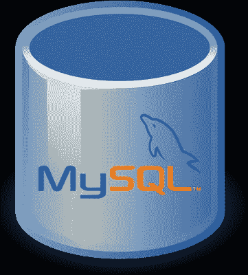
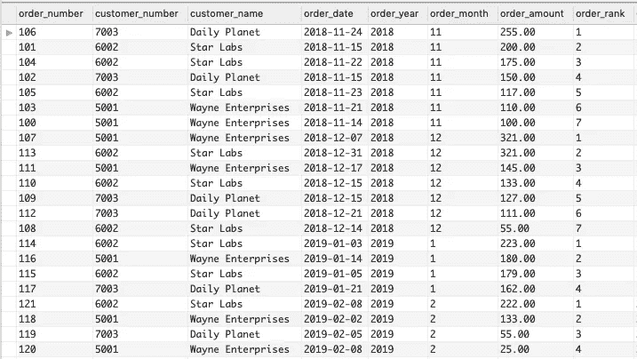
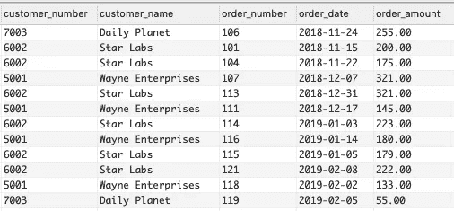
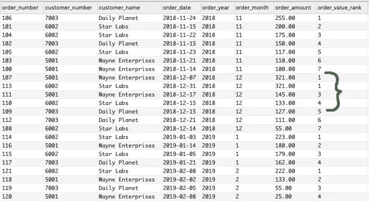

# MySQL:如何编写一个查询来返回一个组中的前几条记录

> 原文：<https://towardsdatascience.com/mysql-how-to-write-a-query-that-returns-the-top-records-in-a-group-12865695f436?source=collection_archive---------5----------------------->

*本文将向您展示 MySQL 5.7 中的一个简单查询示例(以及在 MySQL 8.0 中使用* ***rank()*** *函数的示例)，该示例将返回订单表中每月前 3 个订单。*



如果您曾经想要编写一个查询来返回一个组或类别中前 ***n*** 条记录，那么您就找对了地方。随着时间的推移，我偶尔需要这种类型的查询，并且我总是以过于复杂的多查询联合工作结束，或者只是在代码中迭代结果集。这两种方法效率都很低，而且(现在回想起来)很愚蠢。

在我寻求学习新的数据库查询技术的过程中，我遇到了 MySQL 8.0 中的 rank()函数，它使这项工作变得非常简单。但是在 MySQL 5.7 和更早的版本中，有一个同样简单的技术可以解决这个常见的难题。

让我们直接进入例子。

## 样本表

首先，我们将为我们的示例构建一个示例数据库表。这是一个简单的订单表，跨越了四个月的三个不同的客户。它包括一个作为主键的 ordered GUID，并包含订单号、客户号、客户名称、订单日期和订单金额。

我们将在两个 MySQL 版本示例中使用同一个表:

```
CREATE TABLE orders(
  id BINARY(16),
  order_number INT,
  customer_number INT,
  customer_name VARCHAR(90),
  order_date DATE,
  order_amount DECIMAL(13,2),
  PRIMARY KEY (`id`)
);

INSERT INTO orders VALUES 
  (UNHEX(‘11E92BDEA738CEB7B78E0242AC110002’), 100, 5001, ‘Wayne Enterprises’, ‘2018–11–14’, 100.00),
  (UNHEX(‘11E92BDEA73910BBB78E0242AC110002’), 101, 6002, ‘Star Labs’, ‘2018–11–15’, 200.00),
  (UNHEX(‘11E92BDEA7395C95B78E0242AC110002’), 102, 7003, ‘Daily Planet’, ‘2018–11–15’, 150.00),
  (UNHEX(‘11E92BDEA739A057B78E0242AC110002’), 103, 5001, ‘Wayne Enterprises’, ‘2018–11–21’, 110.00),
  (UNHEX(‘11E92BDEA739F892B78E0242AC110002’), 104, 6002, ‘Star Labs’, ‘2018–11–22’, 175.00),
  (UNHEX(‘11E92BE00BADD97CB78E0242AC110002’), 105, 6002, ‘Star Labs’, ‘2018–11–23’, 117.00),
  (UNHEX(‘11E92BE00BAE15ACB78E0242AC110002’), 106, 7003, ‘Daily Planet’, ‘2018–11–24’, 255.00),
  (UNHEX(‘11E92BE00BAE59FEB78E0242AC110002’), 107, 5001, ‘Wayne Enterprises’, ‘2018–12–07’, 321.00),
  (UNHEX(‘11E92BE00BAE9D7EB78E0242AC110002’), 108, 6002, ‘Star Labs’, ‘2018–12–14’, 55.00),
  (UNHEX(‘11E92BE00BAED1A4B78E0242AC110002’), 109, 7003, ‘Daily Planet’, ‘2018–12–15’, 127.00),
  (UNHEX(‘11E92BE021E2DF22B78E0242AC110002’), 110, 6002, ‘Star Labs’, ‘2018–12–15’, 133.00),
  (UNHEX(‘11E92BE021E31638B78E0242AC110002’), 111, 5001, ‘Wayne Enterprises’, ‘2018–12–17’, 145.00),
  (UNHEX(‘11E92BE021E35474B78E0242AC110002’), 112, 7003, ‘Daily Planet’, ‘2018–12–21’, 111.00),
  (UNHEX(‘11E92BE021E39950B78E0242AC110002’), 113, 6002, ‘Star Labs’, ‘2018–12–31’, 321.00),
  (UNHEX(‘11E92BE021E3CEC5B78E0242AC110002’), 114, 6002, ‘Star Labs’, ‘2019–01–03’, 223.00),
  (UNHEX(‘11E92BE035EF4BE5B78E0242AC110002’), 115, 6002, ‘Star Labs’, ‘2019–01–05’, 179.00),
  (UNHEX(‘11E92BE035EF970DB78E0242AC110002’), 116, 5001, ‘Wayne Enterprises’, ‘2019–01–14’, 180.00),
  (UNHEX(‘11E92BE035EFD540B78E0242AC110002’), 117, 7003, ‘Daily Planet’, ‘2019–01–21’, 162.00),
  (UNHEX(‘11E92BE035F01B8AB78E0242AC110002’), 118, 5001, ‘Wayne Enterprises’, ‘2019–02–02’, 133.00),
  (UNHEX(‘11E92BE035F05EF0B78E0242AC110002’), 119, 7003, ‘Daily Planet’, ‘2019–02–05’, 55.00),
  (UNHEX(‘11E92BE0480B3CBAB78E0242AC110002’), 120, 5001, ‘Wayne Enterprises’, ‘2019–02–08’, 25.00),
  (UNHEX(‘11E92BE25A9A3D6DB78E0242AC110002’), 121, 6002, ‘Star Labs’, ‘2019–02–08’, 222.00);
```

## MySQL 5.7 的例子

rank()函数很酷，但是在 MySQL 8.0 之前是不可用的。因此，我们需要编写一个创造性的嵌套查询来对记录进行排序并提供结果。

首先，我们将编写一个查询，按照年、月和订单金额的降序对表中的所有记录进行排序(这样最大的订单得分最低)。

```
SELECT order_number, customer_number, customer_name, order_date,
  YEAR(order_date) AS order_year, 
  MONTH(order_date) AS order_month, 
  order_amount, 
  [@order_rank](http://twitter.com/order_rank) := IF([@current_month](http://twitter.com/current_month) = MONTH(order_date),
  [@order_rank](http://twitter.com/order_rank) + 1, 1) AS order_rank,
  [@current_month](http://twitter.com/current_month) := MONTH(order_date) 
FROM orders
ORDER BY order_year, order_month, order_amount DESC;
```

在我们的 SELECT 语句示例中，我们从表中获取所有字段，并从订单日期和月份中获取年份。因为我们的目标是按月排列订单，所以我创建了一个名为@current_month 的临时 MySQL 变量来跟踪每个月。在每个月的变化中，我们将@order_rank 变量重置为 1，否则我们递增 1。

**注意**使用:=操作数允许我们动态创建变量，而不需要 SET 命令。

**第二个注意事项**请记住，该 SELECT 语句将对表中的所有记录进行排序。通常，您希望有一个 WHERE 子句来限制结果集的大小。也许是按客户或日期范围。

上面的查询产生如下所示的结果集:



您可以看到订单先按年份和月份排序，然后按订单金额降序排序。包含了新的 order_rank 列，该列按月对 1–2–3 序列中的每个订单进行排序。

现在，我们可以将该查询作为子查询包含到 SELECT 语句中，该语句只从每个组中提取前 3 个订单。最终的查询如下所示:

```
SELECT customer_number, customer_name, order_number, order_date, order_amount 
FROM 
  (SELECT order_number, customer_number, customer_name, order_date,
    YEAR(order_date) AS order_year, 
    MONTH(order_date) AS order_month,
    order_amount, 
    @order_rank := IF(@current_month = MONTH(order_date), 
    @order_rank + 1, 1) AS order_rank,
    @current_month := MONTH(order_date) 
   FROM orders
   ORDER BY order_year, order_month, order_amount DESC) ranked_orders 
WHERE order_rank <= 3;
```

使用我们的排名查询作为子查询，我们只需要取出报告所需的最终字段。添加了一个 WHERE 子句，该子句只提取等级为 3 或更低的记录。我们的最终结果集如下所示:



您可以在结果中看到，我们每个月都获得了前 3 名的订单。

## MySQL 8.0 的例子

MySQL 8.0 引入了 rank()函数，该函数增加了一些额外的功能，用于对结果集中的记录进行排序。使用 rank()函数，结果集按照您指定的值进行分区，然后在每个分区中为每一行分配一个等级。纽带被赋予相同的等级，并且随后的新号码被赋予等级 1 加上它之前的已排序记录的数目。

我们使用这个新特性的排名查询如下所示:

```
SELECT order_number, customer_number, customer_name, order_date,
 YEAR(order_date) AS order_year, 
 MONTH(order_date) AS order_month, 
 order_amount,
 RANK() OVER (
 PARTITION BY YEAR(order_date), MONTH(order_date)
ORDER BY YEAR(order_date), MONTH(order_date), order_amount DESC) order_value_rank
FROM orders;
```

这会产生如下所示的结果:



在本例中，您可以看到 12 月份两个最大的订单金额相同，都是 321.00 美元。rank()函数赋予这两个记录相同的等级 1，后续记录的等级为 3，依此类推。

像以前一样，这个排名查询用作最终查询的子查询:

```
WITH ranked_orders AS (
 SELECT order_number, customer_number, customer_name, order_date,
 YEAR(order_date) AS order_year, 
 MONTH(order_date) AS order_month, 
 order_amount,
 RANK() OVER (
 PARTITION BY YEAR(order_date), MONTH(order_date)
 ORDER BY YEAR(order_date), 
 MONTH(order_date), order_amount DESC) order_rank
 FROM orders
)
SELECT customer_number, customer_name, order_number, order_date,
 order_amount 
FROM ranked_orders
WHERE order_rank <= 3;
```

最终的查询与我们的 MySQL 5.7 示例非常相似，但是使用了 MySQL 8.0 的一些优点(如 WITH 语句的可用性)以及更多的排名功能，您可以在 MySQL 8.0 文档中进行研究。该查询的最终结果与上面示例中的 MySQL 5.7 结果相同。

我希望这两个例子能给你一些帮助，下次你想从一个团队中得到最好的结果。

## 还有呢！

请务必在这里查看我的其他文章，以了解更多关于在 Mac 上设置 PHP 开发环境以及其他编码技巧和示例。