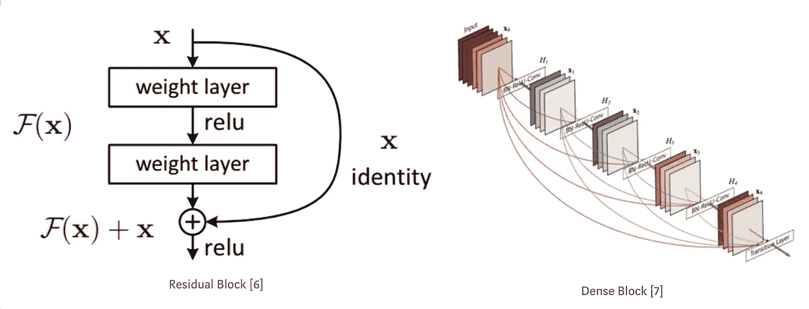
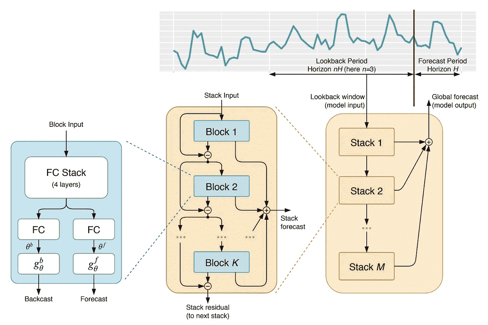
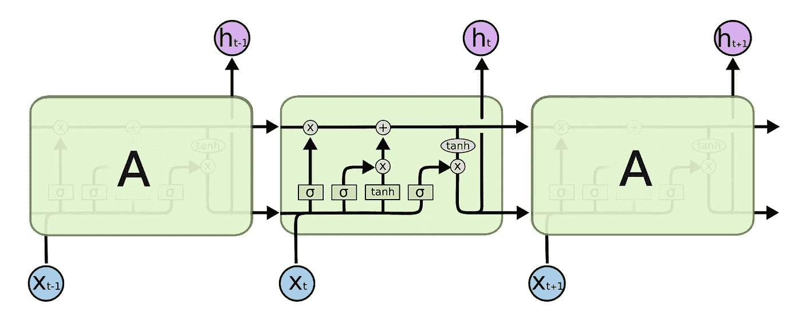
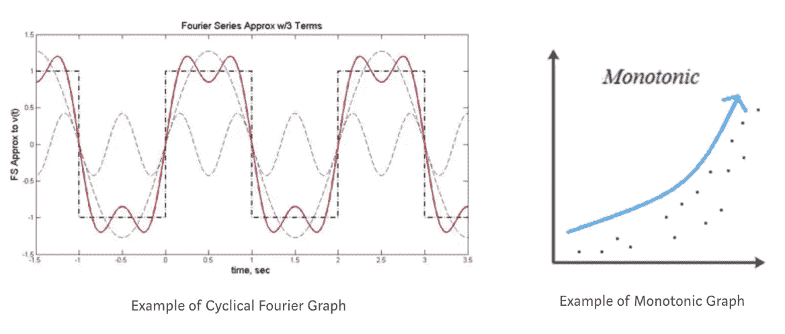
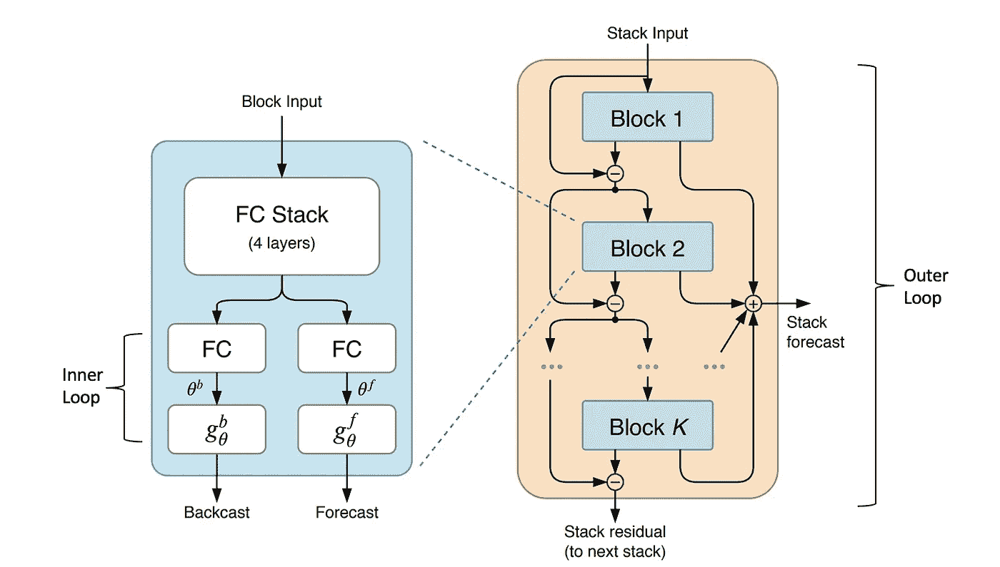

# 具有纯神经网络的 n 拍统计模型

> 原文：<https://towardsdatascience.com/n-beats-beating-statistical-models-with-neural-nets-28a4ba4a4de8?source=collection_archive---------9----------------------->

Photo by [Chris Liverani](https://unsplash.com/@chrisliverani?utm_source=unsplash&utm_medium=referral&utm_content=creditCopyText) on [Unsplash](https://unsplash.com/s/photos/statistics?utm_source=unsplash&utm_medium=referral&utm_content=creditCopyText)

## 基于残差叠加和元学习的 SOTA 时间序列预测

M 竞赛[1]是一系列声望很高的预测挑战，旨在比较和推进预测研究。在过去，统计算法总是赢。像 ARIMA 和指数平滑这样屡试不爽的模型产生的预测很难被更复杂但不太精确的算法击败。

但这一切在去年都改变了。在这篇文章中，我将谈到 M4 的获奖者，ES-RNN，一个长短期记忆网络和指数平滑的融合体。然后，我详细阐述了我对 N-BEATS 的了解，这是一个甚至击败了 ES-RNN 的纯神经网络。

# M4 奖得主:埃斯-RNN

M4 的意外赢家 ES-RNN[2]是一个由优步科技公司的 Slawek Smyl 创建的指数平滑和扩张 LSTM 的混合模型。

在指数平滑法中，一个时间序列可以被分解成 3 个部分，季节性，趋势和水平。扩张的 LSTM 块预测趋势，指数平滑处理剩下的部分。在[了解了](https://eng.uber.com/m4-forecasting-competition/)他是如何做到的之后，我迫不及待地想亲自尝试一下这个网络。我可以理解这些概念，但是这个层次模型的[实现](https://github.com/M4Competition/M4-methods/tree/slaweks_ES-RNN)是在 Dynet/C++中，所以理解代码很困难，更不用说转录了。

**更新**:在我写这篇文章的时候，发现了 ES-RNN 的一个 [Pytorch 实现](https://github.com/damitkwr/ESRNN-GPU)！[4]

# 新成员:N-BEATS

在 M4 的发现[1]中，Makridakis 得出结论，纯 ML 模型不如统计模型准确，“尽管可能会有一两个惊喜，这些方法优于统计方法，尽管只有很小的差距”。提交的 6 个纯 ML 模型表现不佳，甚至没有击败竞争基准，这就是证明。因此，如果没有好的统计数据，我们永远也不能建立一个预测模型，对吗？

没那么快。

[element ai](https://www.elementai.com/)(yo shua beng io 共同创办的创业公司)最近发表了 [N-BEATS](https://arxiv.org/abs/1905.10437) :可解释时间序列预测的神经基础扩展分析【3】，这是一种时间序列预测的纯 DL 方法，击败了 M4 的 ES-RNN 分数。该论文证明了以下假设:

> “在由 M4 数据集表示的单变量 TS 预测任务集上，可以构建纯 DL 模型，以胜过统计模型及其与 ML 的组合。”[3]

在我读这篇论文之前，我猜测击败 ES-RNN 的东西一定是一个复杂的多堆叠、扩张的双向、多注意力循环网络，带有 XL 变压器——但我很高兴地失望了。N-BEATS 使用一个简单但强大的集成前馈网络架构，该架构具有堆叠的预测和“反向预测”残差块。

作为一篇新论文，我找不到任何可以测试该架构的库，所以我卷起袖子编写了代码，用于一场预测竞赛。我以前从未从零开始实现过一篇论文，但是由于相对简单的架构和 [fastai 的](https://course.fast.ai/)教导，我已经能够满足我的竞赛需求。以下是我从报纸上获得的关键信息。

# 双重剩余叠加或“遗忘门”

据我所知，残差块要么涉及到连接，即 Densenet[7]，要么涉及到将原始输入添加到层的输出，即 Resnet[6]，使用跳过连接来决定中间层是否有用。

N-BEATS 以不同的方式使用 skip 连接，通过从下一个块的输入中移除“backcast”输出，使后续块更容易预测作业。同时，每个块都有一个“预测”输出，它与该块中的后续预测相加，以提供一个组合预测。

Visual from basic block to stack to multiple stacks combining to get final forecast [3]

我进一步思考了一下，意识到这种架构实际上非常类似于展开的 LSTM(下图)，其中的跳过连接就像 LSTM 的遗忘门一样，删除不需要的信息，并将处理后的输入传递给下一个模块，从而越来越容易产生更好的预测。这种“忘记门”的特征可以解释为什么这种新的结构运作良好。

Credits: [https://colah.github.io/posts/2015-08-Understanding-LSTMs/](https://colah.github.io/posts/2015-08-Understanding-LSTMs/)

下面是我的一个基本泛型块的代码片段。作者在波形发生器 gθ上花了很多心思，但对于一般的 gθ，它实际上只是另一个线性层，所以我对我的基本块进行了这样的编码。

Generic block coded with some fastai help

# 分解趋势和季节性

N-BEATS 想要证明的另一个假设是，我们可以创建可以分解和解释的 DL 模型。特别是:

> “可以在 DL 架构中编码适当的归纳偏差，以使其输出更具可解释性，而不会显著牺牲预测准确性。”[3]

作者通过固定波形发生器 gθ来模拟趋势(单调图)和季节性(循环图)函数，使每个叠加的输出都是可解释的，从而使 N 次搏动是可解释的。此外，通过在堆栈上共享 gθ和 block 参数，他们发现模型性能得到了改善。对我来说，这类似于 RNN 的隐藏状态是如何在所有时间步骤中共享的。

# 通过集合进行正则化

我从来没有想过将集成作为一种正则化技术，但是深入思考一下，这显然是因为它使您的整体模型(由几个子模型组成)更好地泛化——每个子模型的权重可以被视为一种惩罚。作者发现，与在单个模型上使用辍学或 L2 范数惩罚相比，具有不同输入范围的集成模型给出了更好的结果。这是有意义的，因为不同的输入范围为模型提供了不同的趋势和季节性数据表示。

M4 的调查结果[1]还得出结论，杂交和组合“是提高预测准确性和使预测更有价值的前进方向”。

# 将元学习与 N 节拍联系起来

作者提出 N-BEATS 工作良好是因为元学习。在元学习中，学习过程可以分解为内部和外部训练循环[5]。内部训练循环侧重于特定任务的知识，外部循环侧重于跨任务的知识。我们可以将其类比为 N 拍，其中θ在块内学习，并利用从外环学习的参数，其中梯度下降训练θ所依赖的权重矩阵。

Inner loop in each block where θ is updated; Outer loop for the entire network’s parameters’ update

当输入通过模块时，θ被缓慢“更新”,当反向预测与输入进行残差叠加时，我们在数据通过模块时调节θ的学习。

# 结论和调查结果

这种新颖的残差叠加架构为时间预测带来了全新的视角，并且在理论上表现得非常好。我不确定元学习如何真正提高模型的性能，但这是一个单独的研究课题。

当我在比赛中实现 N-BEATS 时，我意识到它可能不会像预期的那样工作，因为首先测试服务器很容易超时，所以模型必须很小，其次，N-BEATS 是一个单变量模型，可能不太适合我正在处理的多变量数据。因此，我将它应用于一个简单的 BTC 时间序列。这是我的 [kaggle 内核](https://www.kaggle.com/neoyipeng2018/forecasting-btc-using-n-beats/)实现的通用块堆栈，你可以看到它做得相当好。

**更新**:发现了一个[回购](https://github.com/philipperemy/n-beats)，它更好更精确地实现了代码。

**Update2:** ElementAI 在此分享了官方回购[！](https://github.com/ElementAI/N-BEATS)

[1] Makridakis 等人,《M4 竞争:结果、发现、结论和前进的道路》。

[2] [M4 预测竞赛:引入一种新的混合 ES-RNN 模型](https://eng.uber.com/m4-forecasting-competition/)

[3] Oreshkin 等. N-BEATS:用于可解释时间序列预测的神经基础扩展分析

[4] Redd 等.快速 ES-RNN:ES-RNN 算法的 GPU 实现

[5]安托尼乌、爱德华和斯托基。如何训练你的妈妈？

[6]何国光、张晓松、任少宁和孙军。用于图像识别的深度残差学习

[7]黄高、刘庄、基里安·q·温伯格和劳伦斯·范德马腾。密集连接的卷积网络