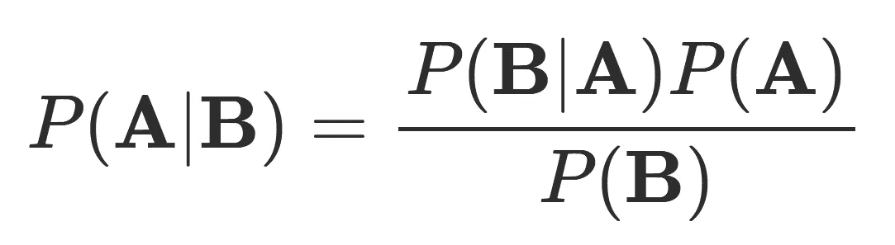

# 朴素贝叶斯和疾病检测

> 原文：<https://towardsdatascience.com/naive-bayes-and-disease-detection-ffefe2cc5c01?source=collection_archive---------18----------------------->

## 从 pdf 转移到离散值

之前我在 1760 年写过关于[贝叶斯推理的文章，在那里我观察了伯努利和贝塔分布。](https://medium.com/@andrew.cocks_35285/bayesian-inference-in-1760-e4b5ebdafe01)

但是你不需要使用概率密度函数，贝叶斯定理也适用于离散值。让我们看看人群中的疾病检测。

举一个发生在 1%人口中的疾病，你的测试有 99%的准确率:

```
True Positive (TP): 99% Correctly detects disease
False Positive (FP): 1% Incorrectly detects disease in healthy person
True Negative (TN): 99% Correctly detects absence of disease
False Negative (FN): 1% Incorrectly detects absence of disease in sick person
```

一个随机的人来到诊所，测试呈阳性——这个人实际上患有这种疾病的概率是多少？*在你继续读下去之前，想一个答案。*

这个不用 Bayes 也可以数值求解。让我们假设一个 10，000 人的任意人口规模。在这些人中，我们知道有 1%的人患有这种疾病:

```
100 people with the disease
9900 people without the disease
```

接下来我们可以计算阳性测试的数量。疾病组为 99%，健康组为 1%；

```
100 * 99% = 99 True Positive
9900 * 1% = 99 False Positive
```

这给了我们答案:

```
TP / (TP + FP) = 99 / (99 + 99) = 50%
```

一个随机测试呈阳性的人只有 **50%** 的患病几率，而 1%的人口患有这种疾病，而你的测试却有 99%的准确率！你还记得你猜的那个数字吗？50%的真实答案对大多数人来说都是一个惊喜。

现在再次使用[贝叶斯定理](https://en.wikipedia.org/wiki/Bayes%27_theorem):



Bayes’ theorem

```
P(A ∣ B) = P(B ∣ A) P(A)
          ───────────────
                P(B)
A = Disease
B = Positive test
```

问题又来了:疾病检测呈阳性的概率是多少，P(A ∣ B)是多少？

假定患者患有该疾病，检测呈阳性的概率:

```
P(B ∣ A) = 0.99
```

患病的可能性:

```
P(A) = 0.01
```

阳性测试的概率:

```
P(B) = 0.99 × 0.01 + 0.01 × 0.99 = 2 × 0.99 × 0.01
```

完成计算:

```
P(A ∣ B) = P(B ∣ A) × P(A)
          ───────────────
                P(B) 
         =   0.99 × 0.01
           ───────────────
           2 × 0.99 × 0.01
         = 1/2
         = **50%**
```

一项准确率为 99%的检测，但随机抽取一名检测结果为阳性的患者，其实际患病的几率只有 50 %!这种疾病在人群中的发病率是一个被许多人忽视的关键变量。

看看他们是如何在新闻中弄错的:[独立报告称，81%被大都会警察局面部识别技术标记的“嫌疑人”是无辜的](https://medium.com/@andrew.cocks_35285/81-of-suspects-flagged-by-met-s-police-facial-recognition-technology-innocent-independent-5d01be43649d)

参见:[贝叶斯排名系统](https://medium.com/@andrew.cocks_35285/bayesian-ranking-system-77818e63b57b)