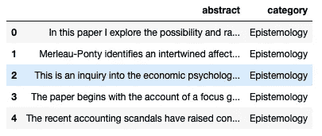
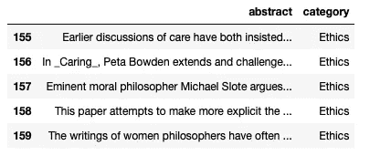
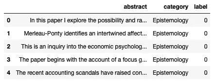
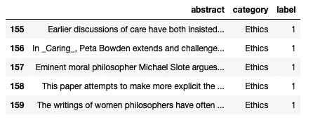
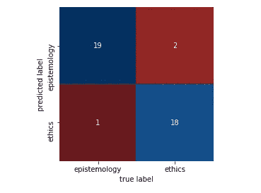
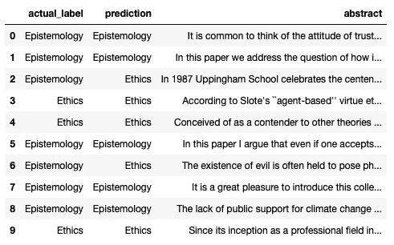

# Python 中的朴素贝叶斯文档分类

> 原文：<https://towardsdatascience.com/naive-bayes-document-classification-in-python-e33ff50f937e?source=collection_archive---------0----------------------->

## 我能在多大程度上根据摘要对一篇哲学论文进行分类？


朴素贝叶斯对于文档分类任务来说是一种相当有效的策略，尽管顾名思义，它是“幼稚的”

朴素贝叶斯分类利用贝叶斯定理来确定一个项目属于某个类别的可能性有多大。如果我有一个包含单词“信任”、“美德”或“知识”的文档，它属于“伦理学”而不是“认识论”的概率是多少朴素贝叶斯根据哪个概率最高来对项目进行分类。

这是“幼稚的”,因为它把每个单词出现在文档中的概率视为独立于任何其他单词出现的概率。这种假设对于我们想要分类的任何文档来说几乎都是不成立的，它们往往遵循语法、句法和交流的规则。当我们遵循这些规则时，一些单词往往会与其他单词相关联。

在这里，我设计了一个我认为有点困难的分类任务:对哲学文章的摘要进行分类。我选择了截然不同但有大量重叠的子学科:认识论和伦理学。两者都使用了证明和理由的语言。它们也经常交叉(例如信仰的伦理、道德知识等等)。最终，朴素贝叶斯在对这些文档进行分类时表现得出奇的好。

**什么是朴素贝叶斯分类？**

*贝叶斯定理*

贝叶斯定理告诉我们，给定一些证据的假设的概率等于假设的概率乘以给定假设的证据的概率，然后除以证据的概率。

> Pr(H|E) = Pr(H) * Pr(E|H) / Pr(E)

因为我们正在对文档进行分类，所以“假设”是:文档属于类别 c。“证据”是文档中出现的单词 W。

由于分类任务涉及比较两个(或更多)假设，我们可以使用贝叶斯定理的比率形式，它比较每个假设的上述公式的分子(对于贝叶斯爱好者:先验乘以似然性):

> pr(c₁|w)/pr(c₂|w)=pr(c₁)*pr(w|c₁)/pr(c₂)*pr(w|c₂)

由于文档中有许多单词，因此公式变为:

> Pr(C₁|W₁，W₂ …Wn) / Pr(C₂|W₁，W₂ …Wn)=
> 
> pr(c₁)*(pr(w₁|c₁)*pr(w₂|c₁)*…pr(wn|c₁))/
> 
> pr(c₂)*(pr(w₁|c₂)*pr(w₂|c₂)*…pr(wn|c₂))

例如，如果我想知道包含单词“预热烤箱”的文档是否属于“烹饪书”类别而不是“小说”类别，我会比较以下内容:

> Pr(食谱)* Pr("预热" |食谱)* Pr("烹饪" |食谱)* Pr("烤箱" |食谱)

对此:

> Pr(小说)* Pr("预热" |小说)* Pr(" the " |小说)* Pr("烤箱" |小说)

如果给定文档中出现的单词，它是食谱的概率大于它是小说的概率，则朴素贝叶斯返回“食谱”。如果反过来，朴素贝叶斯返回“小说”。

**演示:根据摘要对哲学论文进行分类**

1.  *准备数据*

我将尝试分类的文件是来自一个名为 [PhilPapers](https://philpapers.org) 的数据库的文章摘要。Philpapers 是一个综合性的哲学研究数据库。由于这个数据库是由大量的主题编辑管理的，我们有理由相信网站上给出的文档分类是正确的。

我从网站上为二元朴素贝叶斯分类器选择了两个哲学分支学科:伦理学或认识论。从每个分支学科中，我选择了一个主题。对于伦理学，我选择了题目[“各种美德伦理学”](https://philpapers.org/browse/varieties-of-virtue-ethics)，对于认识论，我选择了“[信任](https://philpapers.org/browse/trust)”我收集了 80 篇伦理学和 80 篇认识论摘要。

我最初的数据帧的头部和尾部是这样的:



为了在 Scikit Learn 中运行朴素贝叶斯分类器，类别必须是数字，所以我将标签 1 分配给所有伦理学摘要，将标签 0 分配给所有认识论摘要(即*而不是伦理学*):

```
df[‘label’] = df[‘category’].apply(lambda x: 0 if x==’Epistemology’ else 1)
```



*2。将数据分成训练集和测试集*

保留一些数据很重要，这样我们可以验证我们的模型。为此，我们可以使用 Scikit Learn 的 train_test_split。

```
from sklearn.model_selection import train_test_splitX_train, X_test, y_train, y_test = train_test_split(df[‘abstract’], df[‘label’], random_state=1)
```

*3。将摘要转换成字数矢量*

朴素贝叶斯分类器需要能够计算每个单词在每个文档中出现多少次，以及在每个类别中出现多少次。要实现这一点，数据需要看起来像这样:

[0, 1, 0, …]

[1, 1, 1, …]

[0, 2, 0, …]

每行代表一个文档，每列代表一个单词。第一行可能是包含“预热”的零、“The”的一和“烤箱”的零的文档。这意味着文档包含单词“the”的一个实例，但没有“preheat”或“oven”

要获得这种格式的摘要，我们可以使用 Scikit Learn 的计数矢量器。CountVectorizer 为每个摘要创建一个字数矢量，形成一个矩阵。每个索引对应一个词，出现在摘要中的每个词都有代表。

```
from sklearn.feature_extraction.text import CountVectorizercv = CountVectorizer(strip_accents=’ascii’, token_pattern=u’(?ui)\\b\\w*[a-z]+\\w*\\b’, lowercase=True, stop_words=’english’)X_train_cv = cv.fit_transform(X_train)
X_test_cv = cv.transform(X_test)
```

我们可以使用 strip_accents、token_pattern、lowercase 和 stopwords 参数来排除非单词、数字、冠词和其他对从计数中预测类别没有用的东西。有关详细信息，请参见[文档](https://scikit-learn.org/stable/modules/generated/sklearn.naive_bayes.MultinomialNB.html#sklearn.naive_bayes.MultinomialNB)。

如果您想查看数据并调查字数，您可以使用以下代码制作一个字数的数据框架:

```
word_freq_df = pd.DataFrame(X_train_cv.toarray(), columns=cv.get_feature_names())top_words_df = pd.DataFrame(word_freq.sum()).sort_values(0, ascending=False)```
```

*4。拟合模型并进行预测*

现在，我们准备将*多项式朴素贝叶斯分类器*模型拟合到我们的训练数据中，并使用它来预测测试数据的标签:

```
from sklearn.naive_bayes import MultinomialNB
naive_bayes = MultinomialNB()
naive_bayes.fit(X_train_cv, y_train)
predictions = naive_bayes.predict(X_test_cv)
```

*5。检查结果*

让我们看看模型在测试数据上的表现:

```
from sklearn.metrics import accuracy_score, precision_score, recall_scoreprint(‘Accuracy score: ‘, accuracy_score(y_test, predictions))
print(‘Precision score: ‘, precision_score(y_test, predictions))
print(‘Recall score: ‘, recall_score(y_test, predictions))
```


为了理解这些分数，看一下细目分类会有帮助:

```
from sklearn.metrics import confusion_matrix
import matplotlib.pyplot as plt
import seaborn as snscm = confusion_matrix(y_test, predictions)
sns.heatmap(cm, square=True, annot=True, cmap=’RdBu’, cbar=False,
xticklabels=[‘epistemology’, ‘ethics’], yticklabels=[‘epistemology’, ‘ethics’])
plt.xlabel(‘true label’)
plt.ylabel(‘predicted label’)
```



**准确度分数**告诉我们:在我们所做的所有识别中，有多少是正确的？

*   真阳性+真阴性/总观察值:(18 + 19) / 40

**精确分数**告诉我们:在我们进行的所有*道德*鉴定中，有多少是正确的？

*   真阳性/(真阳性+假阳性):18 / (18+2)

回忆分数告诉我们:在所有真实的道德案例中，我们正确识别了多少？

*   真阳性/(真阳性+假阴性):18/(18+1)

*6。调查模型的失误*

为了调查不正确的标签，我们可以将实际标签和预测标签并排放在一个数据帧中。

```
testing_predictions = []for i in range(len(X_test)):
    if predictions[i] == 1:
        testing_predictions.append(‘Ethics’)
    else:
        testing_predictions.append(‘Epistemology’)check_df = pd.DataFrame({‘actual_label’: list(y_test), ‘prediction’: testing_predictions, ‘abstract’:list(X_test)})
check_df.replace(to_replace=0, value=’Epistemology’, inplace=True)
check_df.replace(to_replace=1, value=’Ethics’, inplace=True)
```



总的来说，我的朴素贝叶斯分类器在测试集上表现良好。40 个标签中只有 3 个不匹配。

**推荐阅读:**

[](https://plato.stanford.edu/entries/logic-inductive/) [## 归纳逻辑(斯坦福哲学百科全书)

### 指定归纳支持函数的逻辑公理的一个好方法如下。这些公理显然是…

plato.stanford.edu](https://plato.stanford.edu/entries/logic-inductive/)  [## 加法平滑-维基百科

### 从贝叶斯的观点来看，这对应于后验分布的期望值，使用对称的…

en.wikipedia.org](https://en.wikipedia.org/wiki/Additive_smoothing) [](/naive-bayes-intuition-and-implementation-ac328f9c9718) [## 朴素贝叶斯:直觉和实现

### 了解朴素贝叶斯算法及其预测类的能力。

towardsdatascience.com](/naive-bayes-intuition-and-implementation-ac328f9c9718)  [## 深度:朴素贝叶斯分类

### 因为朴素贝叶斯分类器对数据做了如此严格的假设，它们通常不会表现得那么好…

jakevdp.github.io](https://jakevdp.github.io/PythonDataScienceHandbook/05.05-naive-bayes.html) [](https://medium.com/syncedreview/applying-multinomial-naive-bayes-to-nlp-problems-a-practical-explanation-4f5271768ebf) [## 将多项式朴素贝叶斯应用于 NLP 问题:一个实用的解释

### 1.简介朴素贝叶斯是一个基于应用贝叶斯定理的算法家族，它具有很强的(朴素)推理能力

medium.com](https://medium.com/syncedreview/applying-multinomial-naive-bayes-to-nlp-problems-a-practical-explanation-4f5271768ebf)