# 朴素贝叶斯解释道

> 原文：<https://towardsdatascience.com/naive-bayes-explained-108c095241eb?source=collection_archive---------11----------------------->

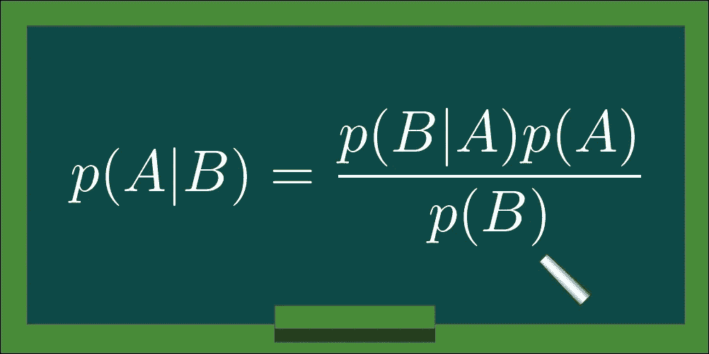

## 从直觉到实施

用于分类的机器学习方法本质上可以是*判别型*和*生成型*。基本上，一个和另一个之间的区别在于根据我们的数据获得预测的过程。让我们假设我们的数据集由几个实例 **x** 组成，其中每个实例包含一系列由 1 到 *D* 索引的特征，其中 *D* 是我们数据集的维数。鉴于这种直觉，我们可以将 **x** 表示为:

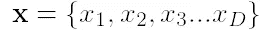

这里的特征 *x* 1、 *x* 2、 *x* 3 等。是唯一标识我们的实例的属性。例如，如果我们正在开发一个模型，根据某些标准来预测个人是否应该获得信贷，那么 *x* 1， *x* 2， *x* 3… *xD* 。将是个人的相关属性，例如他/她的个人信息、工资、债务金额等。鉴于这些数据，我们希望训练一个模型，能够预测这个人是否应该获得信贷。因此，对于这个特殊的问题我们将有两种可能性:

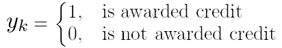

其中 *k* = {1，…， *K* }是类别索引，由于在这个特定的问题中我们有两个类别，那么 *K* =2。现在，一个判别模型将如何预测 ***y*** *k* ？它会告诉我们，给定数据 **x** ，一个人获得信贷的概率。我们可以用这个数学表达式来表达这个推理:

通过调整一组参数，*判别*模型的目标将是给我们这个概率作为结果，这将反过来成为我们的预测。另一方面，一个*创成式*模型会做什么？它的目标是最终给我们同样的概率，但是它遵循的过程会有一点不同。假设我们有*p*(**x***|****y****k*)和*p*(***y****k*)。然后，贝叶斯法则将允许我们通过使用以下等式找到*p*(***y****k |***x**):

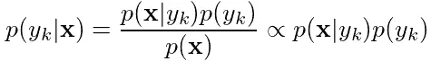

Equation 1\. Bayes Theorem for x and y

在这里，*p*(**x**|**y**k)又称为*可能性*，*p*(***y****k*)是*事前，p* ( **x** )是*证据*，而*分母中的证据 *p* ( **x** )可以被视为常数，为了简单起见，我们将忽略它。这个贝叶斯框架的好处在于，我们可以通过在概率分布后对其建模来轻松确定*可能性*，并且可以通过计算我们的数据集中有多少个***【y】****k*出现，然后除以数据点的总数来找到*先验*。事实上，通过知道似然值和先验，我们能够根据我们的数据进行预测。*

总之，*生成模型*将使用贝叶斯定理通过使用可能性和先验来进行预测。在贝叶斯学习领域中，有各种各样的用于不同目的的生成模型。其中之一被称为*朴素贝叶斯*，我们将在接下来的章节中深入讨论它。稍后，我们将通过使用手写数字的 MNIST 数据集在 Python 中实现这个模型。

## 推导朴素贝叶斯

让我们回到我们早期预测信用的例子。我们说过 **x** 将包含一系列属于特定个人的特征。这些特征包含了我们的模型进行信用或非信用预测所需的信息。我们的假设是特征 *1，…，D* 在统计上相互独立。这意味着，例如，个人的年龄不会决定他/她的债务数额。同样，工资也不是由他/她有多少债务等因素决定的。显然，我们可以看到，这种独立性假设并不总是成立的，但正如我们将在后面看到的，它将使我们的模型更加简单，而不会失去有效性。

然后，通过使用图形表示，我们可以将 p(**x**|**|*y****k*)描述如下:

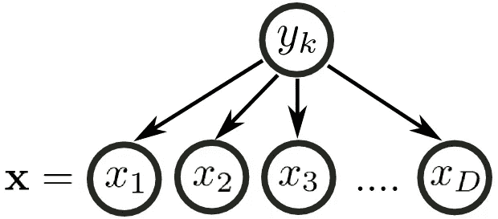

Figure 1\. Illustration for independence between features

我们可以看到，特征 ***x*** *i* 它们之间并不相连，而是 **y** *k* 连接到每个特征上。由此我们可以清楚地看到，这些特征互为*条件独立*，但它们只依赖于 ***y*** *k* 。超越信用问题，我们可以将每个 ***x*** *i* 想象为数字图像中的一个像素，如果我们正在进行计算机视觉，或者是句子中的一个单词，如果我们正在进行自然语言处理。事实上，稍后我们将实现朴素贝叶斯来分类手写数字图像。

现在让我们将迪普深入到直觉中，并假设我们有两个相互独立的变量 *A* 和 *B* 。通过应用乘积概率，我们知道:

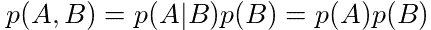

在这种情况下，因为独立条件，*p*(*A*|*B*)干脆就变成了 *p* ( *A* )。如果我们将同样的推理以及一些归纳应用于 **x** 和**y***k*，我们将能够容易地推导出朴素贝叶斯模型的主要关系。

现在我们要做一些归纳！先假设我们只有两个特征 *x* 1 和 *x* 2。考虑到我们之前提到的独立性问题，我们应用乘积规则的方式是:

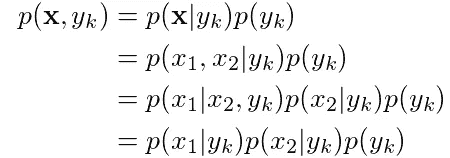

太好了！现在让我们用三个特性来试试 *x* 1、 *x* 2 和 *x* 3:

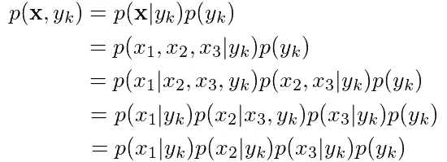

注意到模式了吗？是啊，我们可以把这个概率仅仅表示为 *x* 1、 *x* 2、 *x* 3、…、 *xD* 和*p*(***y****k*)的概率的乘积。因此，我们有:

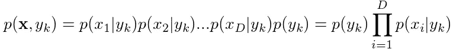

厉害！现在你可能已经注意到，这个表达式实际上是我们在等式 1 中定义的。因此，将它代入等式 1，我们得到:

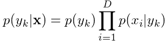

Equation 2\. Probability of y given x

那么，我们如何将它转化为实际的预测呢？当评估这个表达式时，我们将有一组概率，每个类一个。我们需要做的是找到突出的概率指数，我们将有预测！因此，等式 2 变为:

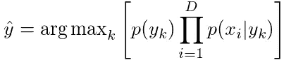

Equation 3\. Naive Bayes prediction

很好。这里一个有趣的事情是，我们可以通过采用合适的概率分布来模拟*p*(***x****I*|***y****k*)，其选择将取决于我们数据的性质。例如，如果我们的 **x** 是二元变量，我们将使用伯努利分布，或者如果它们是实数，那么我们将使用高斯函数。我们将在下一节更详细地讨论后者。

在继续之前，我们只需要对等式 3 做最后一件事。如果仔细观察，会发现 *argmax* 里面的所有项都是概率，也就是零和一之间的值。当我们把所有这些项相乘时，我们会得到一个越来越接近零的结果。当我们有许多特征时，情况会变得更糟，例如，数字图像中的像素。我们的预测会崩溃！我们能做什么？简单，应用对数。最好是一个大的负数，而不是一个非常接近零的值，这可能会搞乱我们的模型。由于我们只对预测感兴趣，并不关心概率值，我们应用**对数**不会影响期望的结果。通过这种修改，等式 3 变为:

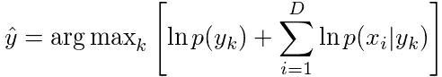

Equation 4\. Naive Bayes prediction with logarithms

这将确保在处理许多特征时更好的数值稳定性。接下来，我们讨论高斯朴素贝叶斯处理数据集中的实值 **x** 。

## 高斯朴素贝叶斯

关于朴素贝叶斯，什么叫“幼稚”？是啊，你猜对了！特征的独立性 *x* 1、 *x* 2、 *x* 3 等等。在前几节中，我们一直在讨论这个导致我们得出一些有趣结论的特殊特征。尽管我们不能总是假设我们的特征是独立的，朴素贝叶斯允许我们大大减少进行预测所需的计算成本。

我们现在将注意力转向当 **x** 为实值时的特殊情况，看看我们如何使用高斯密度函数来模拟*p*(***x****I*|**y**)。

我们如何定义多元高斯函数？我们应该记住，它由两个基本参数组成:均值 **μ** 和协方差**σ**，由下式给出

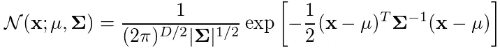

Equation 5\. Multivariate Gaussian

并且该表达式的对数由下式给出:

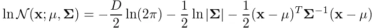

Equation 6\. Log of Multivariate Gaussian

这里，均值 **μ** 将是一个具有 *K* 个元素的向量，协方差**σ**将是一个 *K* x *K* 矩阵。正如我们所见，等式 5 和 6 要求我们计算该矩阵的逆矩阵。我们可以清楚地看到，这个操作将变得非常昂贵，特别是如果我们有大量的功能。那么我们如何利用朴素贝叶斯的独立性假设来简化这些计算呢？我们需要在这里应用一些概念。

让我们阐明一些重要的定义。当两个变量 **x** 1 和 **x** 2 独立且服从高斯分布时，那么它们的协方差为零。我们可以很容易地证明这一点，首先说明协方差的一般定义，它由下式给出

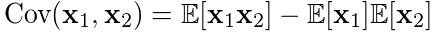

Equation 7\. Covariance definition

现在，我们暂时将注意力转向 E[**x**1**x**2]。给定 **x** 1 和 **x** 2 是独立的，那么我们将有:

如果我们在等式 7 中替换这个表达式，我们会发现 Cov( **x** 1， **x** 2)等于零。现在，回到我们之前对高斯密度函数的定义，矩阵**σ**有哪些元素？让我们来看看:

我们可以看到，**σ**实际上是一个仅由特征级方差组成的对角矩阵。这是特征之间独立性假设的结果，因为正如我们刚刚展示的，当**x**I 和**x**j 不同时，Cov(**x**I，**x**j*j*)为零。

为了推导高斯朴素贝叶斯模型的似然性，了解以下两个表达式将对我们非常有用:

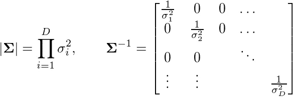

它们分别是对角协方差矩阵的行列式和逆矩阵。如果我们将这些代入等式 6，我们得到:

Equation 8\. Gaussian log-likelihood expression

为了方便起见，我们去掉了涉及 **ln(2π)** 的第一项。由于这是一个常数，它只会放大我们的结果，所以删除它不会改变实际的预测值。对于给定的 **x** ，等式 8 是我们模型的对数似然。这意味着，以下表达式实际上是等价的:

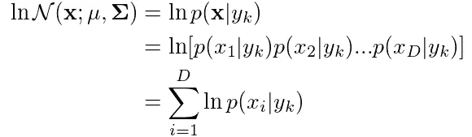

因此，将我们在上一节中推导的等式 8 代入等式 4，我们得到:

Equation 9\. Prediction for Gaussian Naive Bayes

精彩！我们想出了一个非常简单的方程来进行预测。请注意，我们已经去掉了所有涉及潜在的昂贵计算操作的表达式，如逆协方差、行列式等。我们可以很容易地在任何现代编程语言中实现这个模型，甚至对于包含大量条目的数据集。在下一节中，我们将集中精力使用手写数字的 MNIST 数据集在 Python 中实现高斯朴素贝叶斯。请继续阅读！

## 用 Python 实现

*注意:完整的源代码可以在 https://bit.ly/2T94GF5*的 Jupyter 笔记本上获得

我们现在要实现朴素贝叶斯来对手写数字的 MNIST 数据集进行预测[2]。该数据集由 60，000 幅用于训练的图像和 10，000 幅用于测试的图像组成。所有图像都有相应的标签。一个有趣的方面是，Keras 库已经附带了一个 API，允许我们根据需要轻松导入 MNIST。让我们首先导入数据集:

作为预处理步骤的一部分，我们还将 HOG 描述符应用于训练和测试数据集中的每个图像。这已经表明提高了我们的模型的性能。使用这些描述符的另一个优点是，它将需要评估的特征数量减少到一半以下。如果你想用 OpenCV [3]找到更多关于猪的描述符，你可以看看 https://bit.ly/2OJKLOt 的。总共为每个图像计算 108 个 HOG 特征，因此 *D* =108。

接下来我们计算先验*p*(***y****k*)。我们可以通过计算属于每个类的项目数，然后除以训练数据集中的条目总数来轻松实现这一点:

然后，我们还有计算高斯对数似然的逻辑，由下式给出

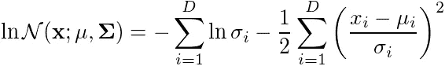

这方面的 Python 代码如下:

最后，为了进行预测，我们简单地计算后验概率的 argmax。我们根据等式 9 和高斯对数似然性来实现这一点:

我们还通过使用 10，000 张图像进行测试来评估我们的模型。为此，我们计算整体精度:

我们获得了 91.5%的准确率，考虑到我们已经假设了特征独立性，这是一个很好的设置。如果我们不做这样的假设，也许我们的精度会更高，但是反过来，我们在这里确实获得了重要的速度增益。您应该能够在几秒钟内使用整个数据集训练该模型！

以下是通过实施获得的一些预测示例:

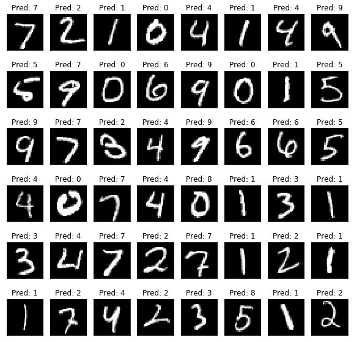

Figure 2\. Model predictions.
Source: [2] The MNIST Database of Handwritten Digits and own Implementation

## 结束语

我们已经将朴素贝叶斯作为假设特征级独立性的分类生成模型。我们已经看到，尽管这种假设可能并不总是有效，但它有助于我们提出一个非常容易实现和训练的模型。为了对数据集进行预测，我们可以只计算简单的运算，而不是进行矩阵运算。我强烈建议您查看整个实现，并使用自己的数据集进行尝试。如果你有任何问题或意见，请随时联系我，我真的希望你喜欢这篇文章！

## 参考

[1]墨菲，凯文 P. *机器学习:概率观点* (2012)麻省理工学院出版社，剑桥，马萨诸塞州。

[2]勒村，扬。科尔特斯科琳娜。克里斯托夫·伯格斯。*MNIST 手写数字数据库*。在 http://yann.lecun.com/exdb/mnist/[有售](http://yann.lecun.com/exdb/mnist/)

[3] OpenCV。 *cv::HOGDescriptor 结构引用。*可从[https://docs . opencv . org/3 . 4 . 6/D5/d33/struct cv _ 1 _ 1 hog descriptor . html](https://docs.opencv.org/3.4.6/d5/d33/structcv_1_1HOGDescriptor.html)获得