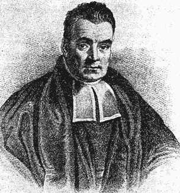
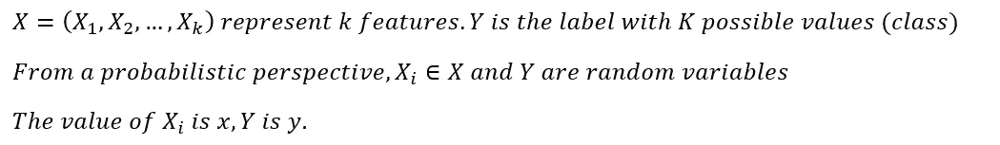
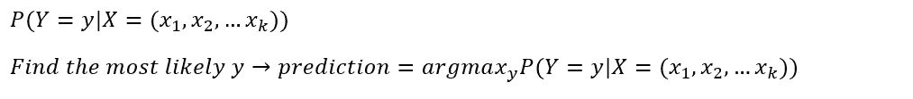
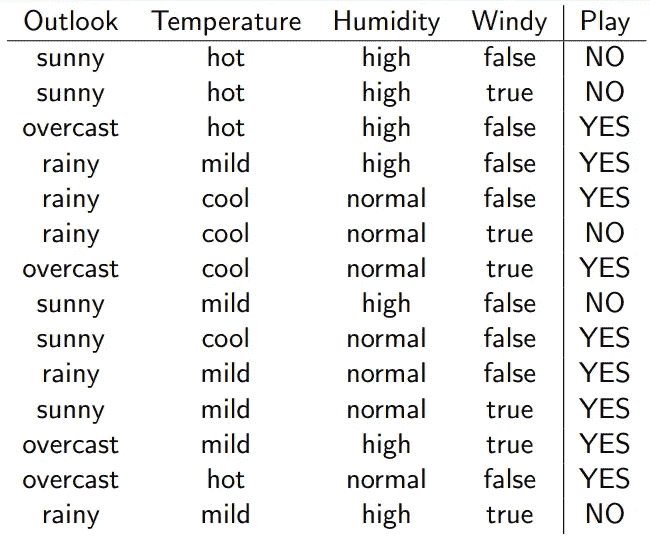
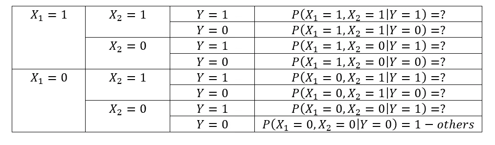
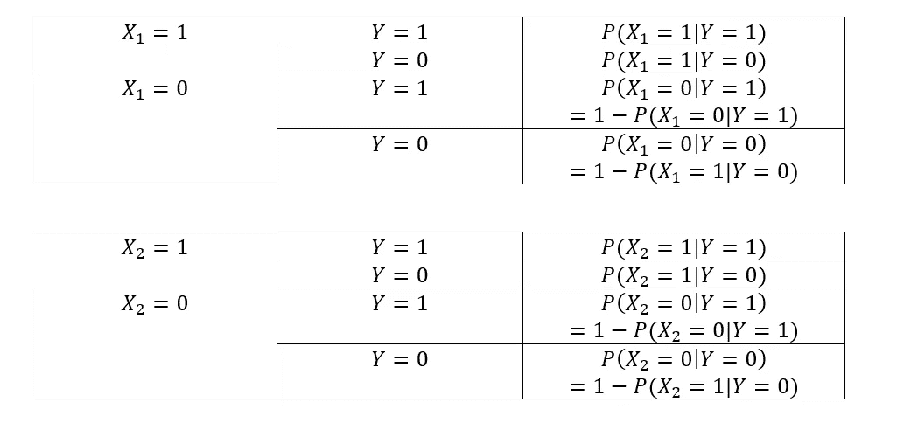
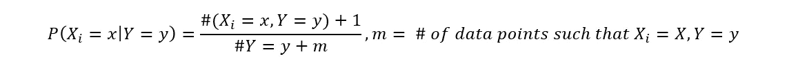
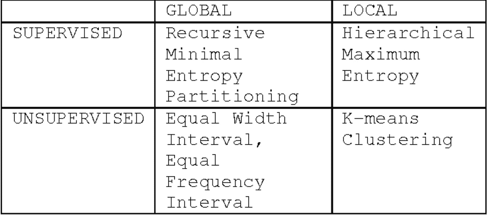
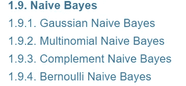

# 朴素贝叶斯解释道

> 原文：<https://towardsdatascience.com/naive-bayes-explained-9d2b96f4a9c0?source=collection_archive---------1----------------------->

朴素贝叶斯是一种概率算法，通常用于分类问题。朴素贝叶斯简单、直观，但在许多情况下表现惊人地好。例如，电子邮件应用程序使用的垃圾邮件过滤器是建立在朴素贝叶斯基础上的。在本文中，我将解释朴素贝叶斯背后的基本原理，并用 Python 构建一个垃圾邮件过滤器。(为了简单起见，我将重点讨论二进制分类问题)

Thomas Bayes, the ‘betting man’, from [BBC](https://www.bbc.com/news/uk-scotland-edinburgh-east-fife-14708583)

# **理论**

在我们开始之前，请记住本文中使用的符号:

## 基本想法

要做分类，我们需要用 X 来预测 Y，换句话说，给定一个数据点 X=(x1，x2，…，xn)，Y 是 Y 的奇数是多少，这可以改写为下面的等式:

这是朴素贝叶斯的基本思想，算法的其余部分实际上更侧重于如何计算上面的条件概率。

## 贝叶斯定理

到目前为止，贝叶斯先生对算法没有贡献。现在是他发光的时候了。根据贝叶斯定理:

[Bayes Theorem](https://en.wikipedia.org/wiki/Bayes%27_theorem)

这是一个相当简单的转变，但它弥合了我们想做的和我们能做的之间的差距。我们不能直接得到 P(Y|X)，但是可以从训练数据中得到 P(X|Y)和 P(Y)。这里有一个例子:

Weather dataset, from the [University of Edinburgh](http://www.inf.ed.ac.uk/teaching/courses/inf2b/learnSlides/inf2b12-learnlec06.pdf)

在这种情况下，X =(展望，温度，湿度，有风)，Y =玩。P(X|Y)和 P(Y)可以通过下式计算:

Example of finding P(Y) and P(X|Y)

## 朴素贝叶斯假设及其原因

理论上，求 P(X|Y)并不难。然而，随着特性数量的增加，这实际上要困难得多。

7 parameters are needed for a 2-feature binary dataset

Estimate Join Distribution requires more data

模型中有这么多参数是不切实际的。为了解决这个问题，做了一个天真的假设。**我们假设所有的特征都是独立的。**这是什么意思？

[Conditional independence](https://en.wikipedia.org/wiki/Conditional_independence)

现在借助于这个天真的假设(天真是因为特征很少是独立的)，**我们可以用少得多的参数进行分类**:

Naive Bayes Classifier

Naive Bayes need fewer parameters (4 in this case)

这是一件大事。我们将参数数量从指数型改为线性型。这意味着朴素贝叶斯很好地处理了高维数据。

## 分类和连续特征

**分类数据**

对于分类特征，P(Xi|Y)的估计是容易的。

Calculate the likelihood of categorical features

然而，一个问题是，如果一些特征值从未出现(可能缺乏数据)，它们的可能性将为零，这使得整个后验概率为零。解决这个问题的一个简单方法叫做[拉普拉斯估计器](https://en.wikipedia.org/wiki/Additive_smoothing):给每个类别添加假想样本(通常是一个)

Laplace Estimator

**连续数据**

对于连续特征，本质上有两种选择:离散化和连续朴素贝叶斯。

离散化的工作原理是将数据分解成分类值。最简单的离散化是均匀宁滨，它创建具有固定范围的箱。当然，还有更智能和更复杂的方法，如递归最小熵分割或基于 SOM 的分割。

[Discretizing Continuous Feature for Naive Bayes](https://www.semanticscholar.org/paper/Discretizing-Continuous-Features-for-Naive-Bayes-C-Kaya/680de400a534028b548c2297b8e8ddd904ebbd56)

第二种选择是利用已知的分布。如果要素是连续的，朴素贝叶斯算法可以写成:

f is the probability density function

例如，如果我们将数据可视化并看到一个钟形曲线状的分布，就可以假设该特征是正态分布的

第一步是计算给定标签 y 的特征的均值和方差:

[variance adjusted by the degree of freedom](http://onlinestatbook.com/2/estimation/df.html)

现在我们可以计算概率密度 f(x):

当然，还有其他发行版:

[Naive Bayes, from Scikit-Learn](https://scikit-learn.org/stable/modules/naive_bayes.html)

虽然这些方法在形式上有所不同，但背后的核心思想是一致的:假设特征满足某种分布，估计该分布的参数，进而得到概率密度函数。

# **优势和劣势**

## 力量

1.  尽管天真的假设很少是正确的，但该算法在许多情况下表现得出奇的好
2.  很好地处理高维数据。易于并行化，能够很好地处理大数据
3.  当数据集较小时，性能优于更复杂的模型

## 弱点

1.  由于天真的假设，估计的概率往往是不准确的。不适合回归使用或概率估计
2.  当数据丰富时，其他更复杂的模型往往优于朴素贝叶斯

# **总结**

朴素贝叶斯利用最基本的概率知识，并做出所有特征都是独立的天真假设。尽管简单(有些人可能会说过于简单)，朴素贝叶斯在许多应用程序中都有不错的表现。

现在你明白了朴素贝叶斯的工作原理，是时候在实际项目中尝试一下了！