# 朴素贝叶斯算法:直觉和在垃圾邮件检测器中的实现

> 原文：<https://towardsdatascience.com/naive-bayes-intuition-and-implementation-ac328f9c9718?source=collection_archive---------5----------------------->


Picture from [Unsplash](https://unsplash.com/photos/3E_8XgqRSps)

# 简介:什么是朴素贝叶斯模型？

从广义上讲，朴素贝叶斯模型是一种特殊的分类机器学习算法。它们基于一种叫做“贝叶斯定理”的统计分类技术。

朴素贝叶斯模型被称为“朴素”算法，因为它们假设预测变量相互独立。换句话说，数据集中某个特征的存在与任何其他特征的存在完全无关。

鉴于其简单性，它们提供了一种简单的方法来构建具有良好性能的精确模型。

他们通过提供一种方法来计算某个事件**发生的“后验”概率，给定一些“先验”事件的概率。**

**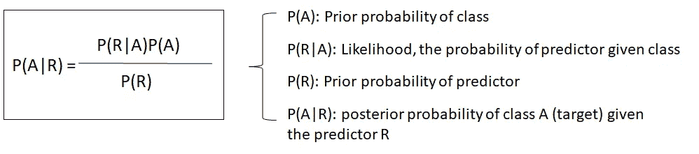**

**Figure by Author**

# **例子**

**我们将通过研究一个示例来介绍关于导航贝叶斯算法的主要概念:**

**让我们考虑在同一办公室工作的两个同事的情况:爱丽丝和布鲁诺。我们知道:**

*   **爱丽丝每周来办公室三天。**
*   **布鲁诺每周来办公室一天。**

**这将是我们的“先验”信息。**

**我们在办公室，看到有人飞快地从我们身边走过，快到我们都不知道那个人是谁:爱丽丝还是布鲁诺。**

**给定我们知道的信息，并假设他们每周只工作 4 天，看到的人是爱丽丝或布鲁诺的概率是:**

*   **p(爱丽丝)= 3/4 = 0.75**
*   **p(布鲁诺)= 1/4 = 0.25**

**当我们看到那个人经过时，我们看到他/她穿着一件红色的夹克。我们还知道以下情况:**

*   **爱丽丝一周穿两次红色衣服。**
*   **布鲁诺一周穿三次红色衣服。**

**因此，对于有 5 天的每个工作周，我们可以推断如下:**

*   **爱丽丝穿红色的概率是→ P(红色|爱丽丝)= 2/5 = 0.4**
*   **布鲁诺穿红的概率是→ P(红|布鲁诺)= 3/5 = 0.6**

**这个新的概率将是“后验”信息。**

**那么，有了这些信息，我们看到谁路过了呢？**

**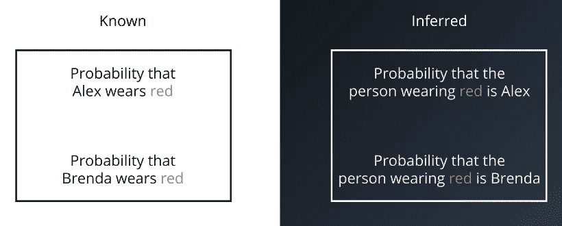**

**Figure by Author**

**最初我们知道 P(爱丽丝)和 P(布鲁诺)的概率，后来我们推断出 P(红|爱丽丝)和 P(红|布鲁诺)的概率。**

**所以，真正的可能性是:**

**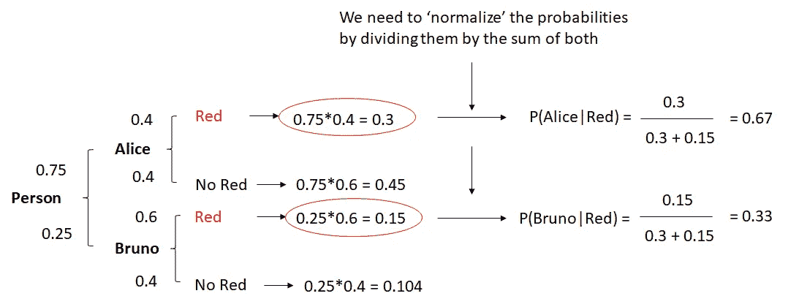**

**Figure by Author**

**形式上，前面的图形应该是:**

**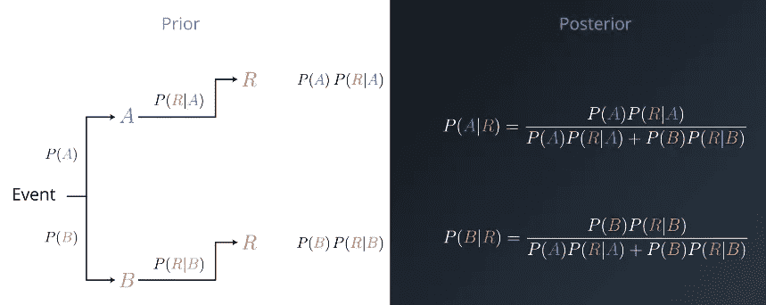**

**Figure by Author**

# **监督朴素贝叶斯算法**

**为了能够使用朴素贝叶斯算法来解决类似于前一个问题的分类问题，要执行的步骤是:**

1.  **将数据集转换为频率表**
2.  **通过查找事件发生的概率来创建可能性表。**
3.  **朴素贝叶斯方程用于计算每一类的后验概率。**
4.  **具有较高后验概率的类别是预测的结果。**

# **朴素贝叶斯的优点和缺点**

****主要优势有:****

*   **在二元和多元分类问题中预测类别的简单快捷的方法。**
*   **在独立性假设符合的情况下，该算法与其他分类模型相比表现更好，即使训练数据较少。**
*   **类别条件特征分布的分离意味着每个分布可以被独立地估计为一维分布。这有助于解决维数灾难带来的问题，并提高性能。+**

**鉴于**使用此方法**的主要缺点**是:****

*   **尽管朴素贝叶斯是非常好的分类器，但它们被认为是很差的估计器。所以不应该把它输出的概率看得太重。**
*   **天真的独立性假设不太可能与现实世界的数据相匹配。**
*   **当测试数据集具有在训练 se 中未观察到的特征时，模型将为其分配 0 概率，并且对于进行预测将是无用的。避免这种情况的主要方法之一是平滑技术，拉普拉斯估计是最流行的方法之一。**

# **实施项目:垃圾邮件检测器**

**目前，机器学习的主要应用之一是垃圾邮件检测。几乎所有最重要的电子邮件服务都提供了垃圾邮件检测器，可以自动对垃圾邮件进行分类，并将其发送到“垃圾邮箱”。**

**在这个项目中，我们将开发一个朴素贝叶斯模型来分类短信是否是垃圾邮件。它将基于我们提供的培训数据。**

**通过之前的研究，我们发现垃圾邮件通常:**

*   **包含像“免费”、“赢”、“赢家”、“现金”和“奖品”这样的词。**
*   **此外，他们倾向于用大写字母书写单词，也倾向于使用许多感叹号。**

**这是一个监督的二进制分类问题，因为邮件要么是“垃圾邮件”，要么是“非垃圾邮件”，我们将输入一个带标签的数据集来训练模型。**

****概述****

**我们将执行以下步骤:**

*   **了解数据集**
*   **数据预处理**
*   **单词包(BoW)和 Sci-kit 实现简介**
*   **在训练集和测试集中拆分数据集**
*   **应用 BoW 处理我们的数据集。**
*   **利用 sci-kit 学习实现朴素贝叶斯**
*   **模型评估**
*   **结论**

****了解数据集****

**我们将使用来自 UCI 机器学习知识库的数据集。这里可以找到链接[。](https://archive.ics.uci.edu/ml/machine-learning-databases/00228/)**

**数据预览:**

**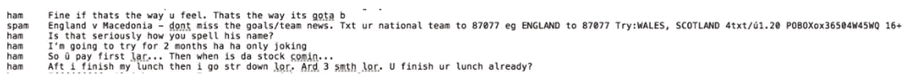**

**这些列没有命名，但是我们可以通过阅读它们来猜测:**

*   **第一列确定消息的类别:“垃圾邮件”或“垃圾邮件”。**
*   **第二列对应于消息的内容。**

**我们将首先导入数据集并重命名列名。通过之前的研究，我们还发现数据集是由制表符分隔的，所以实际的分隔符是' \t '。**

```
****# Import Pandas library**
import pandas as pd**# Dataset from** [**https://archive.ics.uci.edu/ml/datasets/SMS+Spam+Collection**](https://archive.ics.uci.edu/ml/datasets/SMS+Spam+Collection)
df = pd.read_table('smsspamcollection/SMSSpamCollection', 
                   sep='\t', 
                   names=['label','sms_message'])**# Output printing out first 5 rows**
df.head()**
```

**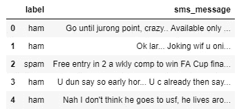**

****数据预处理****

**现在，由于 sci-kit learn 只处理数值作为输入，我们将把标签转换成二进制变量。0 代表“火腿”，1 代表“垃圾”。**

**要执行转换，请执行以下操作:**

```
****# Conversion**
df['label'] = df.label.map({'ham':0, 'spam':1})**# Print dataset shape**
df.shape()**
```

**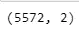**

****单词包(BoW)和 Sci-kit 实现简介****

**我们的数据集是一个大的文本数据集合(5572 行)。由于我们的模型只接受数字数据作为输入，我们应该处理文本消息。这就是单词袋发挥作用的地方。**

**单词包是一个术语，用于指定需要处理的文本数据集合的问题。这个想法是拿一段文字，统计文字出现的频率。**

**BoW 独立处理每个单词，顺序无关。**

**我们可以将一组文档转换成一个矩阵，每个文档是一行，每个单词(标记)是一列，相应的(行，列)值是每个单词或标记在该文档中出现的频率。**

**以 ann 为例，如果我们有以下 4 个文档:**

```
**['Hello, how are you!', 'Win money, win from home.', 'Call me now', 'Hello, Call you tomorrow?']**
```

**我们将把文本转换成如下的频率分布矩阵:**

**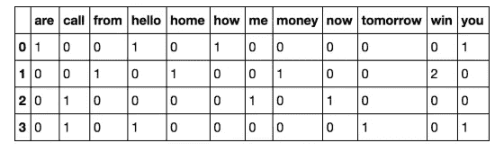**

**文档按行编号，每个单词是一个列名，对应的值是该单词在文档中的出现频率。**

**我们将使用 skleans C[计数矢量器](http://scikit-learn.org/stable/modules/generated/sklearn.feature_extraction.text.CountVectorizer.html#sklearn.feature_extraction.text.CountVectorizer)方法，该方法执行以下操作:**

*   **它将字符串标记化(将字符串分隔成单个单词)，并为每个标记提供一个整数 ID。**
*   **它计算这些标记的出现次数。**
*   **它会自动将所有标记化的单词转换为小写形式，这样就不会对“he”和“He”这样的单词区别对待。**
*   **它还会忽略所有标点符号，以便单词后跟一个标点符号(例如:“你好！”)与不带标点符号前缀或后缀的相同单词(例如:“hello”)没有区别。**
*   **第三个需要注意的参数是`stop_words`参数。停用词是指一种语言中最常用的词。它们包括像' am '，' an '，' the '等词。通过将该参数值设置为`english`，CountVectorizer 将自动忽略在 scikit-learn 的内置英语停用词列表中找到的所有单词(来自我们的输入文本)。**

**sci-kit learn 实现如下:**

```
****# Define the documents**
documents = ['Hello, how are you!',
                'Win money, win from home.',
                'Call me now.',
                'Hello, Call hello you tomorrow?']**# Import the count vectorizer and initialize it**
from sklearn.feature_extraction.text import CountVectorizer
count_vector = CountVectorizer()**# Print the 'count_vector' object which is an instance of 'CountVectorizer()'**
print(count_vector)**
```

**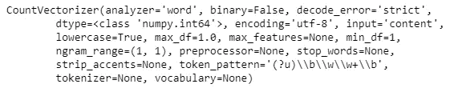**

**为了使文档数据集适合所创建的 CountVectorizer 对象，我们将使用 fit()方法，并使用 get_feature_names()方法获取已被归类为特征的单词列表。这个方法返回这个数据集的特征名，这个数据集是组成我们的“文档”词汇表的一组单词。**

```
**count_vector.fit(documents)
names = count_vector.get_feature_names()
names**
```

**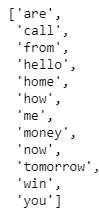**

**接下来，我们想要创建一个矩阵，其中行是 4 个文档中的每一个，列是每个单词。相应的(行，列)值将是该单词(在列中)在特定文档(在行中)中的出现频率。**

**我们可以使用 transform()方法并把文档数据集作为参数传入。transform()方法返回一个 numpy 整数的矩阵，您可以使用 toarray()将它转换为一个数组。**

```
**doc_array = count_vector.transform(documents).toarray()
doc_array**
```

**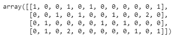**

**为了更容易理解，我们的下一步是将这个数组转换成 dataframe，并适当地命名这些列。**

```
**frequency_matrix = pd.DataFrame(data=doc_array, columns=names)
frequency_matrix**
```

**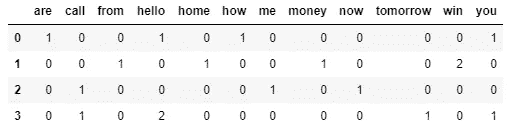**

**我们现在已经成功地为我们创建的文档数据集实现了单词袋问题。**

**使用这种开箱即用的方法可能产生的一个潜在问题是，如果我们的文本数据集非常大，由于语言本身的结构，某些值会比其他值更常见。例如，像“是”、“the”、“an”、代词、语法结构等词会扭曲我们的矩阵，影响我们的分析**

**为了减轻这种情况，我们将使用 CountVectorizer 类的 stop_words 参数，并将其值设置为 english。**

****在训练集和测试集中拆分数据集****

**我们希望拆分数据，使其具有以下形状:**

*   **`X_train`是我们为“sms_message”栏目提供的培训数据。**
*   **`y_train`是我们用于“标签”列的训练数据**
*   **`X_test`是我们对‘SMS _ message’栏目的测试数据。**
*   **`y_test`是我们的测试数据的‘标签’列打印出我们在每个我们的训练和测试数据中的行数。**

```
****# split into training and testing sets**
from sklearn.model_selection import train_test_splitX_train, X_test, y_train, y_test = train_test_split(df['sms_message'], df['label'], random_state=1)print('Number of rows in the total set: {}'.format(df.shape[0]))print('Number of rows in the training set: {}'.format(X_train.shape[0]))print('Number of rows in the test set: {}'.format(X_test.shape[0]))**
```

**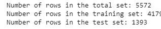**

****应用 BoW 处理我们的数据集****

**现在我们已经分割了数据，下一个目标是将数据转换成所需的矩阵格式。为此，我们将像以前一样使用 CountVectorizer()。这里需要考虑两个步骤:**

*   **首先，我们必须将我们的训练数据(`X_train`)放入`CountVectorizer()`并返回矩阵。**
*   **其次，我们必须转换我们的测试数据(`X_test`)来返回矩阵。**

**请注意，`X_train`是我们数据集中“sms_message”列的训练数据，我们将使用它来训练我们的模型。**

**`X_test`是我们对“sms_message”列的测试数据，这是我们将使用的数据(转换为矩阵后)来进行预测。在后面的步骤中，我们将把这些预测与`y_test`进行比较。**

**这个部分的代码分为两部分。首先，我们为训练数据学习词汇字典，然后将数据转换成文档-术语矩阵；其次，对于测试数据，我们只是将数据转换成文档术语矩阵。**

```
****# Instantiate the CountVectorizer method**
count_vector = CountVectorizer()**# Fit the training data and then return the matrix**
training_data = count_vector.fit_transform(X_train)**# Transform testing data and return the matrix. Note we are not fitting the testing data into the CountVectorizer()**
testing_data = count_vector.transform(X_test)**
```

****用 Sci-Kit Learn 实现朴素贝叶斯****

**我们将使用多项式朴素贝叶斯实现。这个特定的分类器适合于具有离散特征的分类(例如在我们的例子中，文本分类的字数)。它接受整数字数作为输入。另一方面，高斯朴素贝叶斯更适合连续数据，因为它假设输入数据具有高斯(正态)分布。**

**我们将导入多项式 inb 分类器，并使用 fit()将训练数据拟合到分类器中。**

```
**from sklearn.naive_bayes import MultinomialNB
naive_bayes = MultinomialNB()
naive_bayes.fit(training_data, y_train)**
```

**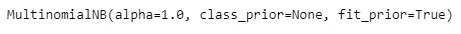**

**现在，我们的算法已经使用训练数据集进行了训练，我们现在可以使用 predict()对存储在“testing_data”中的测试数据进行一些预测。**

```
**predictions = naive_bayes.predict(testing_data)**
```

**既然已经对我们的测试集进行了预测，我们需要检查我们预测的准确性。**

****车型评测****

**有各种各样的机制可以做到这一点，但首先让我们快速回顾一下。**

*   **准确性:衡量分类器做出正确预测的频率。它是正确预测的数量与预测总数(测试数据点的数量)的比率。**
*   **Precision:告诉我们被我们归类为垃圾邮件的邮件中，实际上是垃圾邮件的比例。它是真阳性(分类为垃圾邮件的单词，实际上是垃圾邮件)与所有阳性(分类为垃圾邮件的所有单词，不管这是否是正确的分类)的比率。**

**`Precision = [True Positives/(True Positives + False Positives)]`**

*   **Recall(sensitivity):告诉我们实际上是垃圾邮件的邮件中有多少被我们归类为垃圾邮件。它是真阳性词(被归类为垃圾邮件的词，以及实际上是垃圾邮件的词)与所有实际上是垃圾邮件的词的比率。**

**`Recall = [True Positives/(True Positives + False Negatives)]`**

**对于像我们这样分类分布不均匀的分类问题，例如，如果我们有 100 条短信，只有 2 条是垃圾邮件，其余 98 条不是，准确性本身就不是一个很好的指标。我们可以将 90 封邮件归类为非垃圾邮件(包括 2 封垃圾邮件，但我们将其归类为非垃圾邮件，因此它们会是假阴性)，将 10 封邮件归类为垃圾邮件(所有 10 封邮件都是假阳性)，但仍然可以获得相当好的准确度分数。**

**对于这种情况，精确和回忆非常方便。这两个指标可以结合起来得到 F1 分数，它是精确度和召回分数的加权平均值。该分数的范围从 0 到 1，1 是 F1 的最佳分数。**

**我们将使用所有 4 个指标来确保我们的模型运行良好。对于数值范围从 0 到 1 的所有 4 个指标，分数尽可能接近 1 是我们的模型表现如何的良好指标。**

```
**from sklearn.metrics import accuracy_score, precision_score, recall_score, f1_scoreprint('Accuracy score: ', format(accuracy_score(y_test, predictions)))print('Precision score: ', format(precision_score(y_test, predictions)))print('Recall score: ', format(recall_score(y_test, predictions)))print('F1 score: ', format(f1_score(y_test, predictions)))**
```

**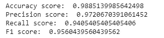**

****结论****

*   **与其他分类算法相比，朴素贝叶斯的一个主要优势是它能够处理大量的特征。在我们的例子中，每个单词都被视为一个特征，有成千上万个不同的单词。**
*   **此外，即使存在不相关的特征，它也能很好地执行，并且相对不受它们的影响。**
*   **它的另一个主要优点是相对简单。朴素贝叶斯开箱即用，很少需要调整它的参数。**
*   **它很少过度拟合数据。**
*   **另一个重要的优势是，对于它可以处理的数据量来说，它的模型训练和预测时间非常快。**

***如果你喜欢这篇文章，那么你可以看看我关于数据科学和机器学习的其他文章* [*这里*](https://medium.com/@rromanss23) *。***

***如果你想了解更多关于机器学习、数据科学和人工智能的知识* ***请在 Medium*** *上关注我，敬请关注我的下一篇帖子！***