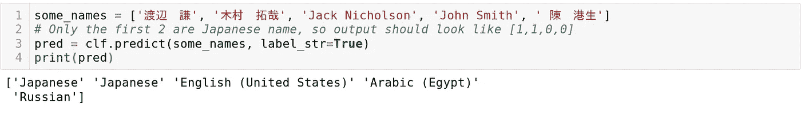
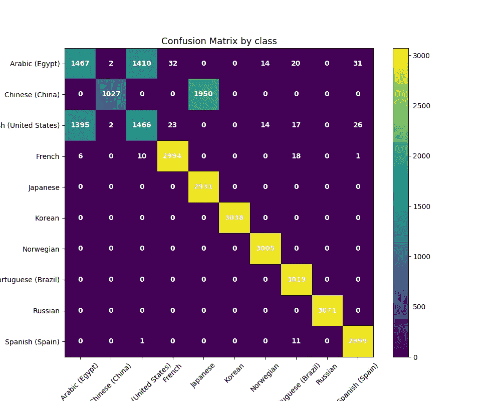
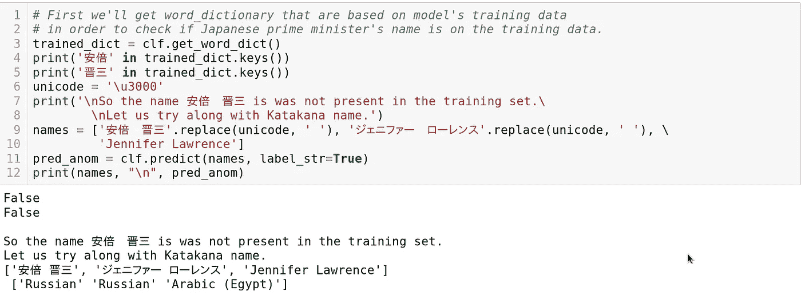

# 基于朴素贝叶斯的姓名分类

> 原文：<https://towardsdatascience.com/name-classification-with-naive-bayes-7c5e1415788a?source=collection_archive---------11----------------------->

## 把手放在某物或者某人身上

## 建立一个分类器来区分人名的来源/国家。

Olomana Trail, Oahu, Hawaii, where people from all over the world gather; img by Pinterest Best Oahu Hikes

随着越来越多的人出国旅游和生活，看到国际人士(无论是学生/职业人士/配偶)并不罕见。在更加国际化的环境中，来自真实世界的数据会有更多外国人的名字。作为一名商业从业者，每当有一个庞大的名单时，比如医疗/教育机构，(实际上是任何有个人信息的公司)，确保客户的信息正确是非常重要的。

比以往任何时候都有更多的人出国旅游、移民或学习，去了解和体验这个世界。

但是手动根据姓名将某人归类到他们的国籍，将是一个痛苦而漫长的过程，这对于机器学习来说是一项完美的任务，特别是对于自然语言处理来说。

令人欣慰的是，有许多机器学习库可以让我们轻松地构建和部署我们的原型。在这里，我们将使用 python 中的 scikit-learn 库实现朴素贝叶斯分类器。

在这个项目中，我

1.  收集和生成与国籍相关的假姓名数据
2.  加载、清理和矢量化名称(文本数据)
3.  训练和评估模型
4.  想法和结论

我们开始吧！

# 收集和生成名称数据

收集高质量的数据来训练分类器，实现您想要的工作，这是任何机器学习项目的重要部分。与您使用的模型类型及其体系结构一样，您用来训练模型的数据的质量和数量也会对模型的性能产生巨大影响。在分类问题的情况下，每个类的数据量必须平衡，特征与预测类标签有较高的关系。在真实的应用程序中，您还会希望确保您的数据实际上看起来像您的模型在服务中会遇到的数据。

这里，因为这是一个实验项目，所以使用 python 假数据生成库 [Faker](https://faker.readthedocs.io/en/master/) 生成了各种国籍的假名字。这个库不仅能生成假名字，还能生成其他假数据，如假地址。您可以选择不同的国家和地区作为数据/名称的来源，有关更多详细信息，请参考文档。

## 看看不同的名字

我试图创建一个模型来对姓名的国籍进行分类，那么需要注意哪些要点呢？全球有各种不同文化和国家的名字，但在这个项目中，我将主要关注第一世界国家的名字。那么有哪些来自不同文化的名字的例子呢？？让我们使用[熊猫](https://pandas.pydata.org/)作为数据帧来加载数据，并查看它。

Names their origin countries

这里，导入了用于数据预处理的 couple 库，并使用 Pandas 作为 DataFrame 对象加载数据。`Code`列保存国家的名称，`name`保存与国家相对应的名称字符串。

正如你所看到的，一些名字是英文字母，一些不是，其他人使用汉字，韩文，或日文平假名/汉字。每个名字的姓、(中间)和名(可能更多的成分取决于文化)之间用空格分开。现在最大的问题是，如何将它们输入到模型中…？？

# 数据预处理

作为计算机算法，机器学习模型无法将姓名数据解释为文本数据。首先需要将名称转换成数字表示，有许多技术可以做到这一点。这里我使用了单词袋模型。

## 一袋单词

机器学习数字的输入和输出向量，在单词袋模型中，文本被转换成数字的向量。基本思想是为文档中出现的每个唯一的单词分配一个唯一的整数，因此文档(本质上是单词序列)可以表示为一个数字序列。

有几种技术可以在单词包模型中进一步表示文档，但是在这个项目中，我使用了来自 [scikit-learn](https://scikit-learn.org/stable/index.html) 库 [**计数矢量器**](https://scikit-learn.org/stable/modules/generated/sklearn.feature_extraction.text.CountVectorizer.html) 。这种技术产生具有整个词汇长度的向量，每个索引位置代表在文档中出现的唯一单词，并且索引位置中的值表示该单词在文档/文本中出现的频率。这样，文档中单词的顺序不会被保留，但这是用整数表示文档的一种简单而直观的方式。让我们来看看实际情况。

CountVectorizer from scikit-learn

在这里，我已经初始化了 CountVectorizer，并用一个名字列表来匹配它，每个名字都用空格分成姓和名。在拟合过程中，姓名被分为姓氏和名字两部分，并创建单词->整数的映射/字典。之后，名字数据通过`.transform()`转换成带有词频信息的行向量。输出是 scipy 稀疏矩阵(包含许多 0 和小数字的矩阵，因为大多数姓名中不包含其他姓氏和名字)。

## 编码国家标签

就像名称数据一样，模型本身不能将标签解释为文本。由于有 10 个类别标签，它们可以在一个列向量中被编码成从 0 到 9 的整数。这可以通过使用 scikit-learn 的 OrdinalEncoder 类来完成。

首先，我们将初始化 OrdinaryEncoder 类，并使用 fit 方法来拟合/训练编码器。在这个过程中，您将创建一个映射，将唯一标签转换为指定的整数。之后，使用`.transform()`方法，你使用编码器将整个数据编码成整数的列向量。请注意，这个编码器实例可以在以后重新用于编码/解码标签。

最后，数据将被分为训练集和测试集(用与训练集相同的数据来测试模型是不公平的)。通常，训练集和测试集的拆分比例约为 70% : 30%。我们在`sklearn.model_selection`通过`.train_test_split()`方法做到这一点。

`test_size`是一个介于 0~1 之间的浮点值，指定测试集数据与向方法提供的原始数据的比率。`x`和`y`分别代表数据和标签。

# 训练和评估模型

## 多项式朴素贝叶斯分类器

现在我们已经准备好了数据，让我们开始训练模型。我用过 scikit-learn 的[多项式朴素贝叶斯类](https://scikit-learn.org/stable/modules/naive_bayes.html)。库中有多种类型的朴素贝叶斯分类器，但是根据文档，这种分类器适合于文本分类

> `[**MultinomialNB**](https://scikit-learn.org/stable/modules/generated/sklearn.naive_bayes.MultinomialNB.html#sklearn.naive_bayes.MultinomialNB)`为多项式分布数据实现朴素贝叶斯算法，它是文本分类中使用的两种经典朴素贝叶斯算法之一(其中数据通常表示为词向量计数，…

使用 scikit-learn 训练朴素贝叶斯模型非常容易，第一步是实例化类实例。接下来，将训练数据和标签输入到模型中。这里的训练数据是一个稀疏矩阵，标签是一个带有整数标签的列向量，每个标签代表一个国家。

## 评估和预测

现在我们有了一个经过训练的模型，让我们看看我们的模型表现如何。我们将使用从数据加载阶段创建的测试数据集。分类模型有几个评分标准，这里使用了准确度。出于项目目的，使用 python 包装类 [NameClassifier](https://github.com/wtberry/NameClassifier) 进行训练和预测。本文的其余部分使用这个类来演示和分析结果。

为了进行预测测试，创建了一个包含 2 个日本人、2 个美国人和 1 个香港人姓名的姓名列表，并将其输入到训练模型中。

正如你所看到的，模型预测 2 个日本名字和第一个英文名字没有问题，但由于某种原因，它错误地将第二个英文名字归类为埃及人(稍后会详细介绍)，将香港名字归类为俄罗斯人。

# 想法和结论

混淆矩阵是一个正方形表，其中有^ 2 元素的类数。表格的行代表真实的标签值，而列是预测的标签，这是分析模型性能的很好的工具。让我们来看看这个模型的一个。看看我在这里写的关于如何绘制混乱矩阵的帖子。

行代表真实标签，而列是预测标签。因此，对角线值代表真实的预测。从这个矩阵中，我们可以看出许多埃及名字被误归类为美式英语名字，反之亦然。它还将一些中国名字归类为日本名字，考虑到它们有多少共同的汉字字符，这并不奇怪。

现在，错误分类英语和埃及语名字的原因是这些名字在训练和测试数据中看起来是一样的。

这可能是由于 Faker 库首先用来生成数据。事实上，在他们的[文档](https://faker.readthedocs.io/en/master/)中提到

> Faker 的本地化是一个持续的过程，我们需要您的帮助。请不要犹豫，为您自己的地区创建一个本地化的提供商，并提交一个拉请求(PR)。

我猜埃及地区还没有准备好，因此它返回默认的美国英语名称。

## 处理看不见的名字

该模型的测试集也来自 Faker 包。如果模型遇到了它在训练/测试数据中没有见过的名字，会发生什么？？名字在不同类型的角色中的不同表现方式呢？

不在原始数据集中的独特的日语名字和英语名字的片假名一起被输入模型。根据训练实例，模型有时会将汉字和片假名表示预测为挪威语、汉语或俄语。它似乎在对看不见的数据进行随机猜测。

## 预测设置

还有几个关于模型/预测设置的其他问题。例如，增加模型的分类标签如何影响其准确性？这个项目是来自日本与否(只是一个二元分类，其中有 90%以上的测试精度)。因此，类别越多，正确预测就越困难。这在直觉上是显而易见的，因为选择越多，就越难从中做出正确的选择。选择正确答案的概率(基于随机猜测)是 50%，而在 10 类分类的情况下，它下降到 10%。

## 这种模式与不同的模式

*   使用朴素贝叶斯模型有什么好处和坏处？

> 朴素贝叶斯的优点是轻量级的。它几乎不需要时间来训练，并且可以体面地用于工业用途。

缺点包括它不能对看不见的名字进行分类，这些名字在训练集中不包含任何姓/名的成分。这意味着它不是学习名称模式/结构，而是“记住”训练数据集。(是因为 Naive Bayes 的工作方式，在给定类标签的情况下，它返回某些名称组件出现的可能性；或者使用的矢量化方法，即简单地统计单词的出现频率)。

*   可能更好的分类器模型选择，例如神经网络(RNN、CNN 或注意力模型或变压器)

也有可能单词模型包(在这种情况下特别是 CountVectorizer)没有从名称文本中提取必要的信息，以区分国家名称。做这件事的其他选择是什么？

*   单词包中的其他模型，如哈希、N-gram 等
*   除了单词袋、单词嵌入之外的不同模型，例如 word2vec、GloVe

了解它们的工作原理很重要，因此能够根据它们的优缺点来使用它们。其他模型或自然语言处理技术将在其他职位上演示。此外，请检查这个名称分类器项目的 [jupyter 笔记本](https://github.com/wtberry/NameClassifier/blob/master/Multi%20Class%20Name%20Classification%20with%20Naive%20Bayes.ipynb)。希望这至少是有帮助的或有趣的，并随时提问或提出建议。感谢阅读！