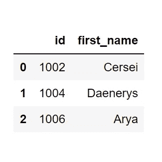
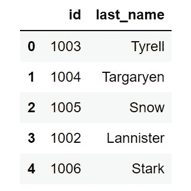
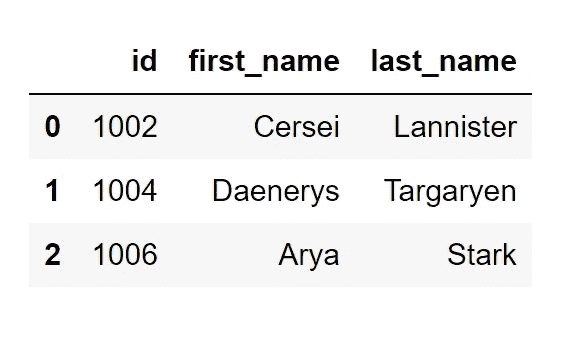

# 说出你最喜欢的 Excel 函数，我会教你它的熊猫等价物

> 原文：<https://towardsdatascience.com/name-your-favorite-excel-function-and-ill-teach-you-its-pandas-equivalent-7ee4400ada9f?source=collection_archive---------5----------------------->

## 在这篇文章中，我们利用流行的库 Pandas 来编码实现与 Python 的索引/匹配的方法。


Photo by [Glenn Carstens-Peters](https://unsplash.com/@glenncarstenspeters?utm_source=medium&utm_medium=referral) on [Unsplash](https://unsplash.com?utm_source=medium&utm_medium=referral)

所以既然还没人起名字，那我就开始了！迄今为止，我最喜欢的 excel 公式之一是嵌套在索引函数中的匹配函数。但是在我教你它的熊猫等价物之前，让我们先了解一下`INDEX/MATCH`函数的背景，以及为什么它比`VLOOKUP.`函数好

`INDEX/MATCH`优于`VLOOKUP`的两个原因:

1.  您可以在整个电子表格中搜索值，而不是被迫只搜索最左边的列。(下面有更多相关信息)
2.  对于未排序的数据，计算效率提高了 3%,对于排序的数据和近似匹配，计算效率提高了 30%,对于排序的数据和精确匹配，计算效率提高了 13%!([来源 T19)](http://www.exceluser.com/formulas/why-index-match-is-better-than-vlookup.htm)

通过组合`INDEX/MATCH`公式，你可以绕过`VLOOKUP`的限制。简而言之，`VLOOKUP`扫描给定范围最左边的列，直到它落在给定“search_key”的第一个实例上。然后，它返回所提供的索引中单元格的值，该值将始终位于右侧。但是，正如我上面所说的，使用`INDEX/MATCH`您可以搜索整个电子表格(按列或按行)的值，而不是被迫使用`VLOOKUP`只搜索最左边的列。

看看这个 [**月度播客仪表板**](https://docs.google.com/spreadsheets/d/1JYLGDtYFLKmfDqZGww00_XL1jcxKUjn2CNnnT2GTHlk/edit?usp=sharing) 吧，这是我在 Vox Media 担任流量分析师时为 Recode 构建的，看看我是如何利用嵌套在`INDEX/MATCH`函数中的`SMALL`函数来显示剧集级数据的。

现在让我们进入有趣的部分…如何用熊猫做到这一点！

我将向您展示利用 Pandas 库用 Python 编写代码的四种方法，但是首先，让我们了解一下我们目标的背景。我们有两个名为`df_1`和`df_2`的数据帧(如下所示)。



df_1 (left) and df_2 (right)

我们的目标是将`df_2`中的`last_name`列与`df_1`中的正确行进行匹配，得到如下结果:



# 解决方案 1:使用。地图()

```
**code**:df_1[‘last_name’] = df_1.id.map(df_2.set_index(‘id’)[‘last_name’].to_dict())2.3 ms ± 131 µs per loop
```

这里我们为`df_1`创建一个新列`last_name`。这个新列的值是通过将来自`df_1`的 id 映射到那些 id 匹配的`df_2`中的姓氏来创建的。通过对我们的系列`df_2.last_name`调用`.to_dict()`方法，我们得到了索引的键:值对，这将是:`{0: ‘Snow’, 1: ‘Targaryen’, 2: ‘Tyrell’, 3: ‘Lannister’, 4: ‘Stark’}`。在这种情况下，`.map()`方法将不起作用，因为我们的`id`列中的值与这个字典中的键不匹配。所以我们首先传递了`.set_index()`方法，将索引改为`df_2`的 id，这将为我们提供这个字典:`{1003: ‘Snow’, 1004: ‘Targaryen’, 1005: ‘Tyrell’, 1002: ‘Lannister’, 1006: ‘Stark’}`。我们现在可以使用`.map()`方法将我们的系列值(`id`)映射到新字典的相应值。

一位数据科学家同事 Bernard Kurka 帮助我找到了第一个解决方案。也看看他的一些[中型帖子](https://medium.com/@bkexcel2014)。

# 解决方案 2:使用。加入()

```
**code**: df_1 = df_1.set_index('id').join(df_2.set_index('id'))39.2 ns ± 0.709 ns per loop
```

`.join()`方法将连接另一个数据帧的列。默认情况下，它执行左连接，但是您可以通过传递`how=`超参数并将其更改为“右”、“外”或“内”来指定。我们需要在`df_1`和`df_2`上调用`.set_index()`方法，这样我们就可以加入正确的索引。

# 解决方案 3:使用。合并()

```
**code**: df_1 = df_1.merge(df_2, how='left', on='id')38 ns ± 0.369 ns per loop
```

`.merge()`方法用数据库风格的连接合并数据帧或命名系列对象。在这里，我通过指定`on=`超参数来指定我希望它如何与`how=`连接以及在哪个列/索引上连接。

# 解决方案 4:使用 pd.concat()

```
**code**: df_1 = pd.concat([df_1.set_index('id'), df_2.set_index('id').last_name], axis=1, sort='id', join='inner')38.5 ns ± 0.379 ns per loop
```

`pd.concat()`方法沿着一个特定的轴连接 pandas 对象，沿着其他轴连接可选的 set 逻辑。所以在这里我传递了我想要连接成一个列表的熊猫对象。第一个是 DataFrame，其中我将索引设置为`id`列，第二个是 Series，但也在`id`列上进行索引。通过设置`axis=1`，我指定了要连接的轴，1 表示列，0 表示索引(行)。因为`id`列没有在`df_2`上排序，所以我也必须指定`sort=`超参数。`join=`超参数指定如何处理其他轴上的索引。

我认为这真的很酷，我们看到有几种方法可以做完全相同的事情。所以现在的问题是，这些方法中哪一个计算效率最高？我包括了上面的时间，但是我会把它们排在这里，这样你就不用向上滚动了。他们将从最快运行时间到最慢运行时间排列。

1.  `.merge()`每环路 38 纳秒±0.369 纳秒
2.  `.concat()`每环路 38.5 纳秒±0.379 纳秒
3.  `.join()`每环路 39.2 纳秒±0.709 纳秒
4.  `.map()`每循环 2.3 毫秒 131 秒

如果你发现自己需要使用这些方法中的一种，我希望你可以参考这个(或我的 [**代码**](https://github.com/traintestbritt/excel_to_pandas/blob/master/excel_to_pandas.ipynb) —如果是移动设备，滚动到底部并选择右边的“显示桌面版本”)作为如何做的指导。我很想把这变成一个系列，在那里我会教你如何用 Python 和 Pandas 之类的库在 Excel 中做更多你喜欢做的事情，所以请在下面的评论中告诉我你接下来想看到什么。一如既往，感谢阅读。