# 基于知识图的命名实体消歧

> 原文：<https://towardsdatascience.com/named-entity-disambiguation-boosted-with-knowledge-graphs-4a93a94381ef?source=collection_archive---------3----------------------->

## 我们结合基于文本和图形的方法来建立命名实体消歧管道。

*作者:Brian Lin，Sheng song(Shane)Ong，Cory Williams，Yun Bin (Matteo) Zhang*

*特别感谢我们的顶点课程，哈佛大学的*[*AC 297 r*](https://www.capstone.iacs.seas.harvard.edu/)*，我们的导师 Pavlos Protopapas 和 Chris Tanner，以及我们的顶点合作伙伴 Kensho Technologies。*

# 介绍

命名实体消歧(NED)或命名实体链接是一项自然语言处理(NLP)任务，它为文本中提到的实体分配唯一的身份。这有助于文本分析。例如，一家金融公司可能希望确定一篇新闻文章中提到的所有公司，并随后调查这些公司之间的关系可能会如何影响市场。

在给定文本文档的情况下，将 NED 视为信息提取管道中的一个组件是很有帮助的。例如，如果我们得到一个包含句子“福特总统赦免尼克松总统”的文本文档，我们将首先识别所有感兴趣的单词，例如“Ford”。这被称为命名实体识别(NER)。“福特”一词可以指杰拉尔德·福特总统、亨利·福特或汽车公司“福特”。因此，管道中的第二步是候选词选择，我们缩小感兴趣的已识别单词的可能候选词列表。随后，我们从候选列表中消除实体的歧义，并将每个被识别的实体链接到知识库中的唯一标识符。在上面的例子中，我们应该理想地将实体“Ford”标识为“Gerald Ford”。这最后一步是本文的重点— NED。所有代码都可以在我们的 [Github](https://github.com/mzhangyb/AC297r_2019_Kensho) 上找到。

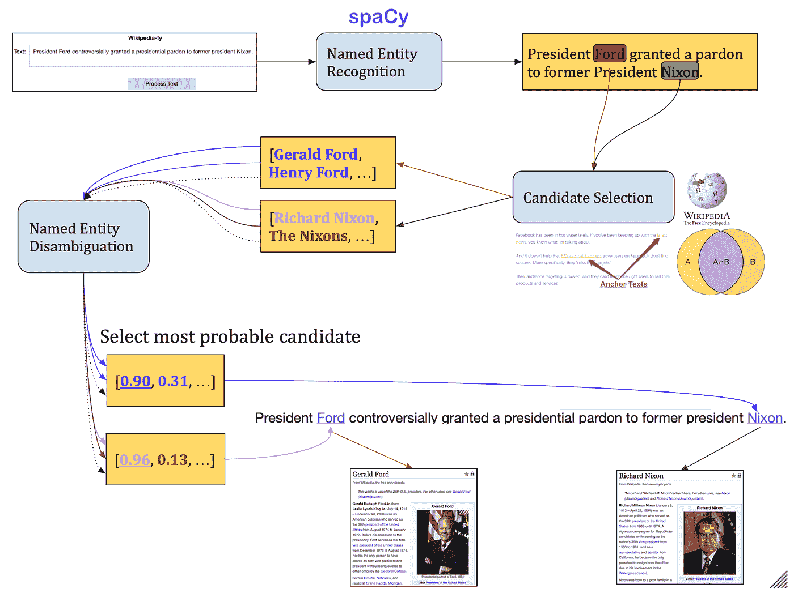

作为人类，我们发现使用来自周围文本的上下文信息来正确地识别‘福特’是前总统杰拉尔德·福特是很容易的。人们可能期望一个合理设计的模型也应该能够使用文本信息来这样做。然而，如果我们能够访问知识图，消歧的过程可以进一步改进。

# 单词嵌入

我们希望利用文本的上下文来确定正确的实体。为此，我们首先需要将每个单词表示为一个实数向量，这就是所谓的单词嵌入。理论上，我们想要一种嵌入，使得具有相似含义的单词在向量空间中彼此接近。例如，我们希望与政治相关的单词在向量空间的一部分，而与汽车相关的单词在另一部分。

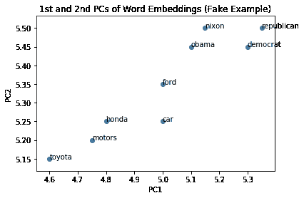

# 知识图表

知识图本质上是知识库的图形表示，其中实体及其关系分别表示为节点和边。维基数据是维基百科的结构化形式，是一个知识库。例如，在 [Gerald Ford](https://en.wikipedia.org/wiki/Gerald_Ford) 的 Wikidata 知识库条目中，“Ford”是一个实体/节点，带有一个边/关系“party”，它链接到另一个实体/节点“Republican Party”。

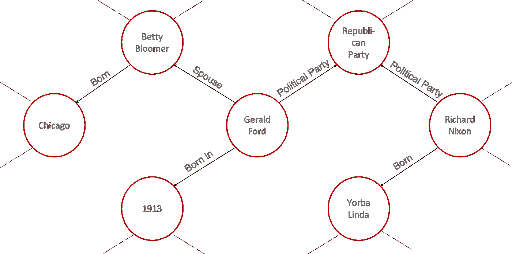

重要的是，我们期望在知识图中，文本文档中识别的实体彼此靠近。然后，我们可以根据文本的上下文推断出每个实体的唯一身份！

但是，知识库和图形会占用大量内存。对于深度学习方法，我们使用图形嵌入来表示低维向量空间中的信息。图形嵌入有多种方法。我们使用杨等人(2015)的 DistMult 来嵌入知识图，而不是使用不是为知识图设计的典型图形嵌入方法。[DGL——知识图嵌入](https://github.com/dmlc/dgl/tree/master/apps/kg)实现用于高效训练 760 万维基数据实体的子集。对于图完成任务，这产生了 90.1%的前 1 命中率，其中我们试图预测 a(头部，边缘，？？？)三连音和头在(？？？、边缘、尾部)三个一组。

# 动机

大多数当前的 NED 方法依赖于文本方法，其中使用文档的上下文信息来推断实体的身份。还有相当多的研究是关于在知识图上使用图形方法，如图形卷积网络。然而，据我们所知，结合文本和图形信息的方法研究不多。具体来说，我们使用前一节中提到的新的图形嵌入来显著改善消歧结果。

# 数据

我们使用维基百科的文章和维基数据库来训练我们的模型。几乎所有文章在知识库中都有相应的条目。此外，每篇维基百科文章都有现成的超链接文本，称为锚文本，将维基百科文章相互链接。这些是我们在 NED 任务中使用的数据中的重要特征。

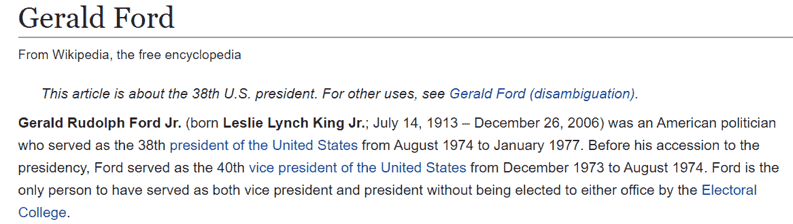

由于维基百科的规模，我们在所有可用维基百科文章的大约 1%上进行训练(385，000)。此外，我们只包括每篇文章的“介绍”部分；由于维基百科不重复超链接，所以在识别所有感兴趣的单词时，介绍部分是最全面的。此外，我们注意到，在典型的 NED 任务中，超链接识别的感兴趣的单词不需要对应于命名的实体。例如，苹果(水果)可能在维基百科的文章中被链接，但它不被认为是一个命名的实体。然而，尽管数据集不完美，但由于数据集的稀有性，它可能是用于 NED 的监督方法的最佳数据集。

以下是所使用的一些相关数据集。我们的数据集是 2019 年 8 月 8 日的维基百科快照。Kensho Technologies 计划向公众开放数据集，我们将相应地更新每个数据集的链接。Kensho 现在已经[向公众开放了数据集](https://blog.kensho.com/announcing-the-kensho-derived-wikimedia-dataset-5d1197d72bcf)。

*   **enwiki.k_link** :维基百科文章上链接到其他维基百科文章的超链接数据集。超链接在源页面上，而超链接链接到目标页面。锚文本是超链接的实际可点击文本(即蓝色文本)。

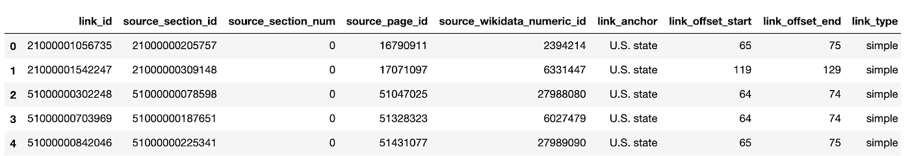

*   **enwiki.k_plaintext** :维基百科文章章节的文本数据集。

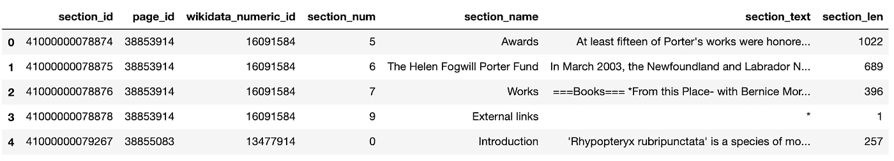

*   **enwiki.page** :维基百科页面的数据集。

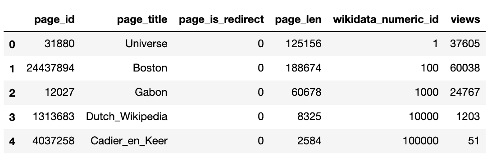

*   enwiki.k_raw_anchors :链接到其他维基百科文章的超链接的锚文本数据集。如果是锚文本，则用于指示不是目标维基百科页面标题的实体的同义词/其他名称！=目标页面标题。

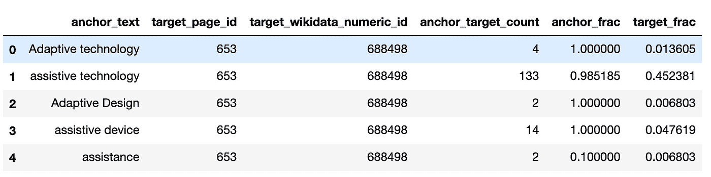

以下数据集与维基数据相关:

*   **wiki data . item:**wiki data 项目的数据集。知识图的节点。

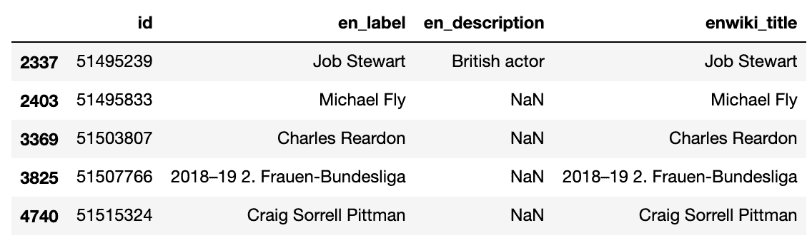

*   **wiki data . qpq _ item _ statements**:wiki data 三元组数据集:(源，边，目标)

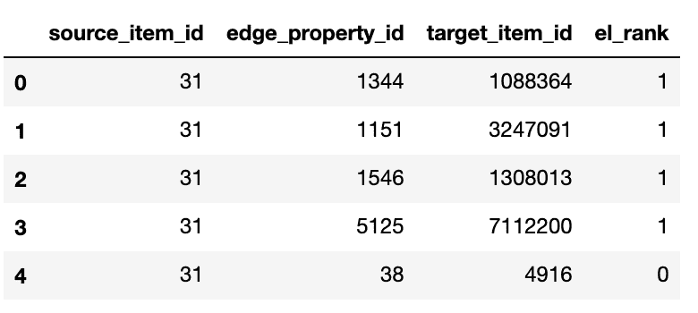

# 命名实体识别

在对维基百科介绍进行典型的文本预处理之后，我们使用 [SpaCy](https://spacy.io/usage/spacy-101/) 库来识别介绍(NER)中的所有命名实体。SpaCy 是一个著名的工业级 NLP 库，具有实体识别功能。

注意:由于 SpaCy 使用广泛的特征工程来降低其模型的复杂性，它在实体识别中对文本的大小写特别敏感。因此，在降低文本的大写字母之前，我们识别所有具有空间的实体。

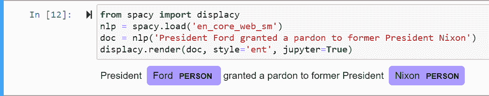

# 候选人选择

对于一个被识别的实体，我们需要从我们的知识图中选择能够对应于被识别实体的真实实体的实体。在这一步中，我们结合了两种方法:锚文本频率和 MinHash 位置敏感哈希(LSH)森林。

*锚文本频率*

对于维基百科上的每个锚文本，我们有锚文本对应于目标页面的频率。我们存储了一个锚文本字典和它们的目标页面列表，按照锚文本映射到目标页面的频率降序排列。请注意，我们的预处理对锚文本进行了小写处理，因此有一些处理后的锚文本频率的总和不为 1。然后，对于一个被识别的实体，我们得到被识别的实体文本在字典中映射到的前 anchor_k 个实体。直觉上，我们会认为，如果一些锚文本映射到维基百科上出现频率很高的实体，那么当锚文本在维基百科上下文之外被提及时，该锚文本很有可能会引用该实体。

*LSH 森林*

仅有锚文本方法是不够的，因为它要求被识别的实体与锚文本完全匹配。即使拼写错误导致一个字符的差异也可能导致不匹配。因此，还应该利用相似性匹配，其中我们检索与所识别的实体文本具有相似名称的实体。具体来说，我们利用 Jaccard 相似性。Jaccard 相似性可以用来检查两个文本有多相似，它可以通过米哈斯 LSH 有效地近似。关于 Jaccard 相似性和 MinHash LSH 的更详细的概述，请看[这篇教程](https://www.learndatasci.com/tutorials/building-recommendation-engine-locality-sensitive-hashing-lsh-python/)，我们的代码就是从它改编而来的。我们在字符级别上测量文本的相似性，以解决拼写错误。然后，对于一个已识别的实体文本，我们可以得到前 lsh_k 个相似实体。

因此，对于一个已识别的实体，从我们的候选项选择中，我们可以从锚文本和 LSH 中获得排名靠前的实体，这就是我们的已识别实体的候选项。

# 实体链接

我们将该模型视为一个分类问题。该模型预测每个候选词是否是感兴趣的词的真实实体。首先，我们在每个感兴趣的单词周围创建一个上下文窗口(例如 10 个单词)，并将其作为模型的一部分输入到嵌入层中。这种上下文单词嵌入被馈送到双向 LSTM 中；其输出与知识图嵌入连接，并被馈送到前馈神经网络。FFNN 创建了知识图嵌入和局部上下文嵌入之间的映射。

# 结果

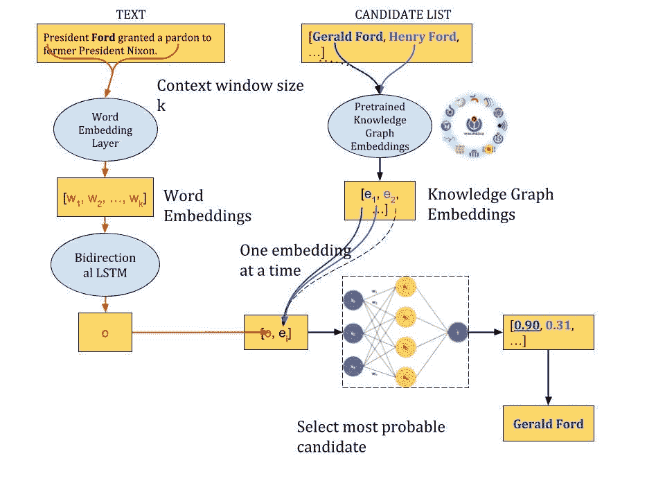

对于训练，我们包括 10 个假实体，如果可能的话，用真实体作为潜在候选。我们有大约 1200 万个数据点，有 20.11%的正面标签和 79.89%的负面标签。我们将数据分成一个训练/测试集，确保同一识别实体的候选数据在同一个集中，以防止泄漏。我们实现了 0.8678 的测试准确度和 0.9000 的 AUC。我们主要关心 0.57 的召回；我们能够在 57%的时间里预测正确的实体。

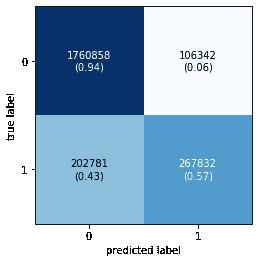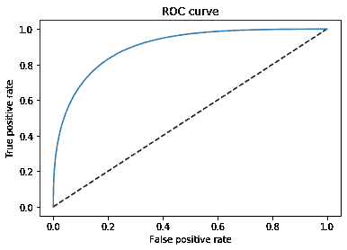

然而，有可能不止一个候选被预测为正确的实体，或者没有候选被预测为正确的实体。相反，我们然后预测具有最大概率的候选作为正确的实体。然后，该模型能够在 75.8%的时间内预测正确的实体，这是一个显著的改进。

# 模型演示

因此，完整的管道是 NER、候选人选择和 NED 阶段的组合。当给定一个文本文档时，我们识别所有感兴趣的单词，并将它们链接到 Wikidata 知识库中的相应条目。为了演示我们的管道，我们使用了一个简单的 Jupyter 小部件，它接收一个文本文档，并返回相同的文本文档，其中包含链接到相应维基百科文章页面的感兴趣的超链接单词。

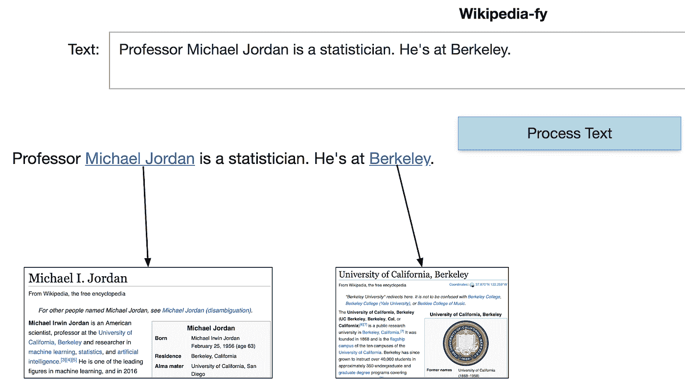

# 测试我们的模型

这是我们的管道的[演示，我们的管道在这里完美地工作。](https://imgur.com/uWTR0T5)

我们可以看到，我们的模型能够区分篮球运动员迈克尔·乔丹和机器学习研究员迈克尔·乔丹。这意味着我们的模型能够根据句子中发现的实体之间的上下文和图形连通性来消除正确候选词的歧义。

这是另一个[演示](https://imgur.com/hOrUc3u)，我们的管道无法获得正确的实体。我们看到，我们的模型指向的不是史蒂夫·乔布斯，而是一部模仿史蒂夫·乔布斯的电影《iSteve》。进一步检查我们的模型，我们看到我们的候选人名单甚至不包括史蒂夫·乔布斯。这表明我们的候选人选择失败，而我们的 NED 模型似乎做出了明智的选择，选择了一部与史蒂夫·乔布斯有关的电影。

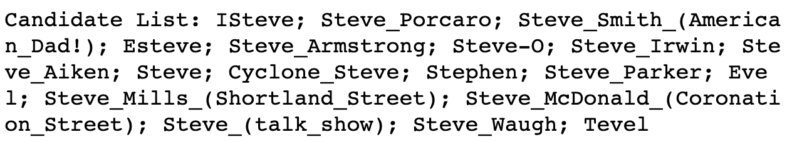

另一方面，第二个失败之处在于 NED 机型对 iOS 的排名高于 iPhone。

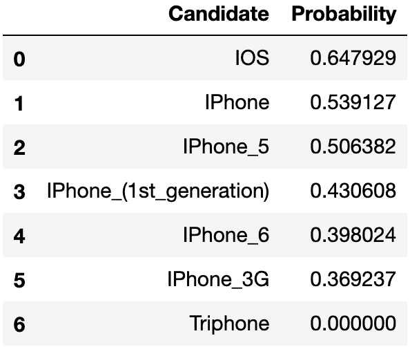

这个失败是由于 NED 模型仅仅基于来自图嵌入的单词和连接的上下文。值得注意的是，我们可以将句子中的 iOS 替换为 iPhone，这样读起来仍然很好。因此，当考虑实体的 iOS 时，上下文和底层连接是完全合理的。这是一个失败，因为没有在消歧阶段惩罚文本差异。

# 未来的工作

正如我们的结果所指出的，一个主要的瓶颈肯定是候选人选择阶段。可以通过更仔细的特征工程来改进候选选择字典。至于 NED 模型，我们可以在损失函数中惩罚所选候选的文本不相似性，以避免具有完全不同的文本的实体在相同的上下文中完美地工作而被选为候选的情况。此外，考虑到 BERT 在许多 NLP 任务中的主导性能，它仍然值得考虑作为我们的单词嵌入的替代品，但它需要更强大的 GPU 来进行适当的微调。如果有更多资源，将 NER 和候选人选择公式化为深度学习问题，并共同训练所有阶段，以在每个任务中共享信息，这将是很有趣的。

# 参考

[1] B. Yang，W. Yih，X. He，J. Gao，L. Deng，[在知识库中嵌入用于学习和推理的实体和关系](https://arxiv.org/pdf/1412.6575.pdf)，2015

[2] J. Devlin，M. Chang，K. Lee，K. Toutanova， [BERT:用于语言理解的深度双向转换器的预训练](https://arxiv.org/pdf/1810.04805.pdf)，NAACL 2019