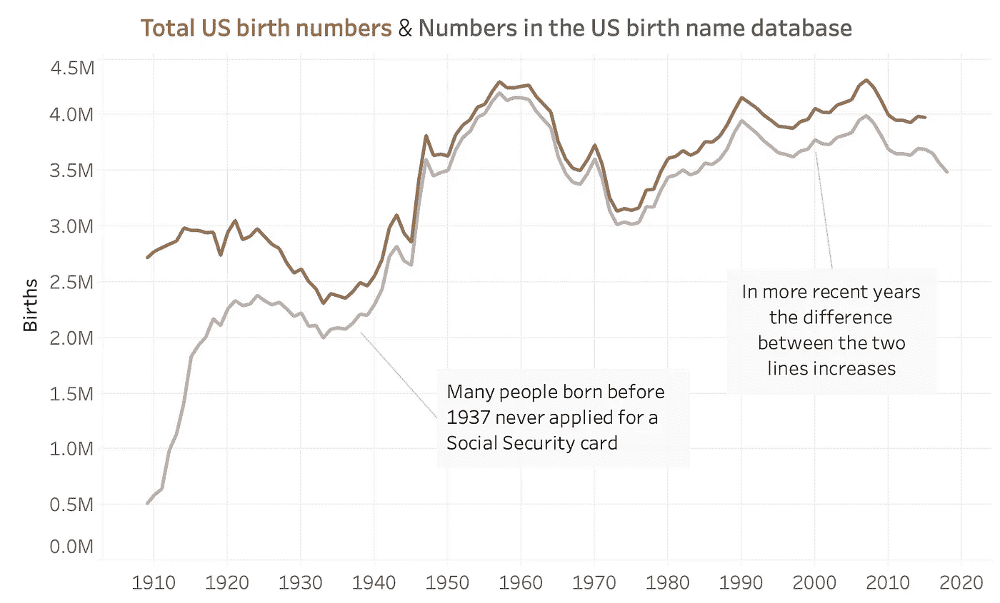
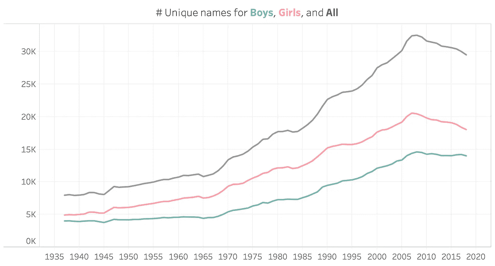
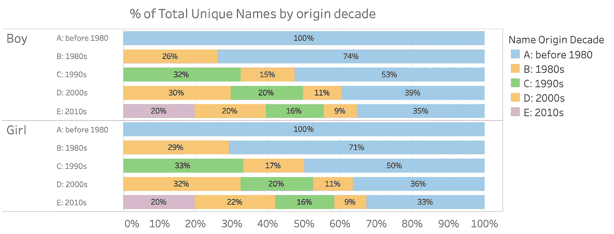
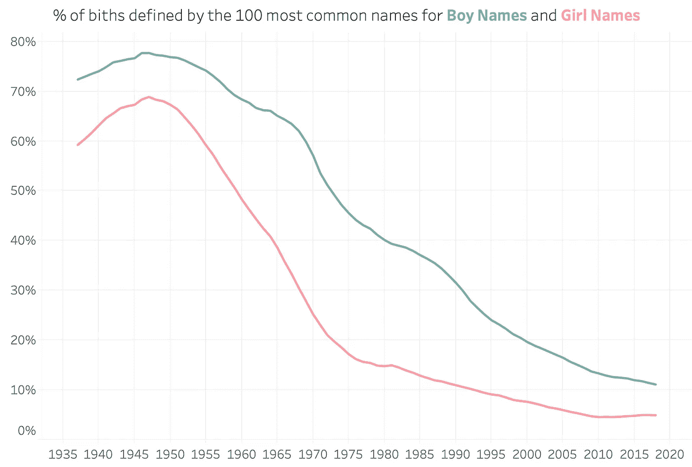
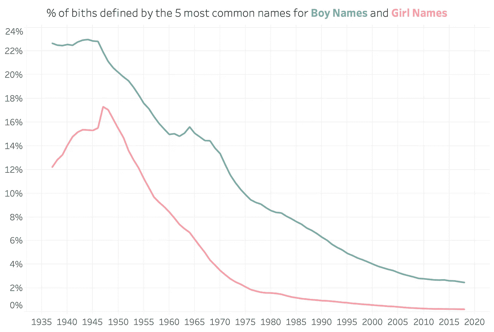
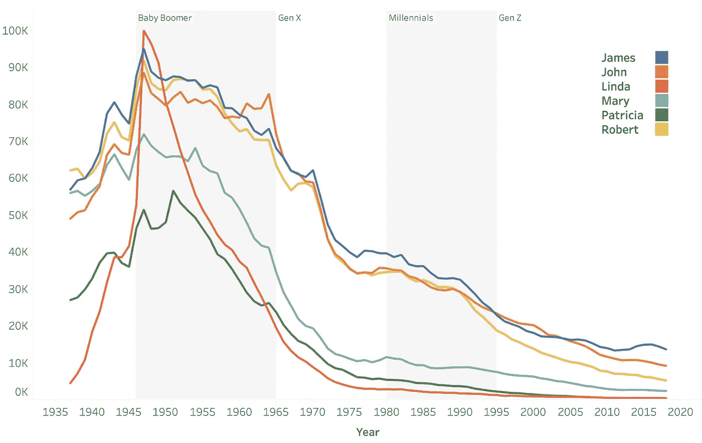

# 名称唯一性

> 原文：<https://towardsdatascience.com/names-uniqueness-2a7cbd449447?source=collection_archive---------18----------------------->

## 你的名字有多独特？

有了像我这样的名字，关于名字的话题就出现了很多。幸运的是，我非常喜欢我的名字和它在美国的独特性。不管魔鬼经济学家怎么说，我愿意相信我名字的独特性对我的生活有所帮助，或者至少让它变得更有趣。

为了量化我的名字有多独特，我发现在我出生的那一年，我是美国一个由 101 个名叫简的男孩组成的俱乐部的成员。简单的说，我的名字在那一年出生的所有男婴中不到 0.005%是很不常见的。到目前为止，我还没有见过其他 100 个难以捉摸的简中的一个。

我从 www.ssa.gov[社会安全管理局(SSA)网站](https://www.ssa.gov/oact/babynames/background.html)的美国婴儿名字数据集中找到了这个数据。虽然他们有一些很好的视图(比如某个时期最受欢迎的名字)来找到上面的统计数据，但我需要下载数据并自己使用它。我把它上传到 Tableau，发现自己发现了许多比自己更有趣的名字和趋势。

## 数据

在开始可视化之前，确保理解数据是如何生成的总是明智的。在阅读了 SSA 文档并发现数据集故意排除了一些出生数据后，我找到了第二个数据来源。将美国的总出生人数(下面的棕色线)与婴儿名字数据集(下面的灰色线)中的每年出生人数进行比较，我可以想象出有多少数据丢失了。

SSA 的文件解释说，许多 1937 年以前出生的人从未申请过社会保障卡，所以他们的名字不包括在婴儿姓名数据集中。这解释了我们在这个日期之前看到的两条线之间的巨大但正在缩小的差异。(接下来，我们将删除这些不完整的数据。)

Visualization 1: Total Births

近年来，这两条线之间的差异越来越大。文档再次告诉我们，出于匿名的原因，任何在给定年份出现少于 5 次的名字都不会被记录。所以，这个差距实际上告诉我们出生时有非常独特的名字(< 5 次)的数量，并表明最近每年比几十年前有更多非常独特的名字。

这引起了我的好奇心，我决定随着时间的推移深入研究名称唯一性和名称通用性的想法。

## 名称唯一性

当我们观察任何一年中唯一名字的数量(出现 5 次或更多次)时，我们会发现几十年来有很大的变化。下图显示了 20 世纪 40 年代不到 10000 个唯一名称，到 2000 年代增加了两倍多，达到 30000 个。此外，女婴的名字总是比男婴的名字更多样化。

Visualization 2: Unique Names

穿越时间到 20 世纪 60 年代末，我们开始看到独特名字的数量在加速增长，并持续到新千年的开始。20 世纪 60 年代中期标志着婴儿潮一代的结束和 X 一代的开始，虽然美国历史不是我的强项，但我假设当时的大文化转变(部分原因是越战、非裔美国人民权运动、英国入侵等)。)在我们看到的趋势中扮演了一个因素。

继续我们的时间之旅，我们开始看到这种加速在 2000 年代后期逆转。这一次，一代人的转变与我们在图中看到的趋势并不完全一致。维基百科将千禧一代(又名 Y 代)的终结时间定在 20 世纪 90 年代中期至 21 世纪初。这种转变正好发生在一些唯一名称增长最快的地方。当我们看到下降趋势时，我们已经进入 z 世代了。

宏观下降趋势似乎是由独特的女孩名字的减少所驱动的(因为男孩名字持平/略有下降)。很难说为什么会发生这种逆转，我也没有一个很好的假设来解释为什么会这样。根据我的挖掘，以下假设不太可能是原因。

*   假设 1:与男婴相比，父母给女婴起的独特名字越来越少。不太可能。当研究数据时，在 2010 年代首次使用(或产生)的新的独特名字的百分比代表了 2010 年代男女所有独特名字的 20%。男孩和女孩之间几乎没有差别，这不太可能导致我们上面看到的只生女孩的趋势。

Visualization 3: Unique name distribution by origin decade

*   **假设 2:女孩非常独特的名字(<每年出生 5 个)比男孩增加得多，从而弥补了我们可以测量的独特女孩名字减少的趋势。**不太可能。虽然我们无法确定这一点，因为我们无法获得这些数据，但鉴于我们拥有的数据，我们可以提出强有力的理由。下图显示了用独特性桶着色的十年间的增长情况(51-500 独特性桶中的一个名字在该十年中有 51-500 个同名新生儿)。在最近十年中，所有独特性存储桶都以类似的负速率增长，因此，很可能，我们无法衡量的非常独特的存储桶也将以类似的负速率增长(而不是正速率)。最重要的是，我们可以测量的非常独特的名字的数量(第一桶:< 50 个)是男孩的，而不是女孩的。

Visualization 4: “Uniqueness” growth — note that 2010 is not a full decade

虽然我们仍然没有一个很好的假设来解释为什么女婴名字的独特性在几十年来首次下降，但男婴名字的独特性似乎仍在增加——只是速度比以前小。如果你有另一个假设，请在回答中分享(如果你用这个数据集或其他地方的证据支持它，会加分)。

顺便提一下，上图中 20 世纪 70 年代相当有趣的趋势与我们在可视化 1 中看到的增长趋势一致，并为正在发生的事情增添了色彩。随着所有其他存储桶开始加速增长，代表超过 1 万个出生的名称的唯一性开始下降。名字越独特，成长越大。

## 名称通用性

虽然这些年来我们通过观察名字的独特性学到了很多，但我们忽略了一些非常重要的东西:出生的分布。

这种分布是很重要的，因为如果没有它，我们就不能确定大多数新生儿是只集中在一小部分独特的名字上，还是均匀分布在所有的名字上。快速猜一下是哪一个。

利用帕累托原则(或更广为人知的 80/20 法则)，让我们看看最常见的名字有多少出生。简单地说，80/20 法则认为 80%的结果可以归因于 20%的原因。如果这在名字世界中成立，我们应该会发现，20 世纪 40 年代的大约 200 个名字和 21 世纪初的大约 600 个名字应该占出生人数的大约 80%(见我们在第一部分的学习)。

当计算这些数字时，我们发现 20 世纪 40 年代 20%的独特名字占出生人数的 64 %, 2000 年代占 60%。虽然我们没有达到神话中的 80/20 的比例，但这个理论仍然成立，即名字的一小部分促成了许多出生。下图显示了前 100 个最常见的名字在一段时间内的贡献，但是是按性别划分的。

Visualization 5: Contribution of the top 100 names

我们看到男婴的名字比女婴的名字更常见(在 1947 年的高峰期为 78%到 70%)。根据我们之前的发现，这并不奇怪——男孩的名字不那么独特，普通的名字比女孩的名字更受欢迎。

20 世纪 40 年代末，名字的普通性开始减少。女婴的死亡率非常高，而男婴的死亡率则逐渐下降。到 2010 年，我们看到前 100 个男孩和女孩的名字分别只占 11%和 5%。对于男孩来说，这个比例从排名前 100 名的婴儿中的五分之四下降到十分之一。

Visualization 6: Contribution of the top 5 names

看看 1947 年的顶级名字，23%的男婴被命名为詹姆斯、罗伯特、约翰、威廉或理查德。然而，排名前五的女孩名字(见下文)仅占所有女婴出生的 17%。对于女孩来说，名字的共性下降得如此之快，以至于在 1975 年，排名前五的女孩名字只占 2%,而男孩的这一比例仍然是 10%。

Visualization 7: Top 10 — # births in 1947

随着时间的推移，看看这些名字，我们看到其中许多在 1947 年达到顶峰，即婴儿潮一代的开始。看看琳达！这个名字在不到十年的时间里非常流行，然后迅速急剧下降。虽然琳达的变化是最引人注目的，但这些名字中的许多如今远不如婴儿潮一代受欢迎。

Visualization 8: Names over generations — Want to type in your name? [Click here](https://public.tableau.com/profile/jan.van.zeghbroeck#!/vizhome/USBabyNames_15631215667820/NamesoverGenerations)

是什么影响了这些尖峰信号？现在流行什么名字？最近有没有什么旧名死灰复燃？如果你想研究这些问题或想发现自己的趋势，请查看[这个 Tableau 仪表盘](https://public.tableau.com/profile/jan.van.zeghbroeck#!/vizhome/USBabyNames_15631215667820/NamesoverGenerations)，在这里你可以用任何你喜欢的名字来重现上述情节——你的名字，你妈妈的名字，甚至你的英雄的名字。

感谢阅读。👶

更新:如果你有兴趣阅读更多关于婴儿名字数据集的有趣趋势，请查看[这篇后续报道](/what-if-our-first-names-were-generated-by-corporations-9c1109b13dd7)，在这篇报道中，我用这些数据展示了一个初创企业或商业的衡量框架。