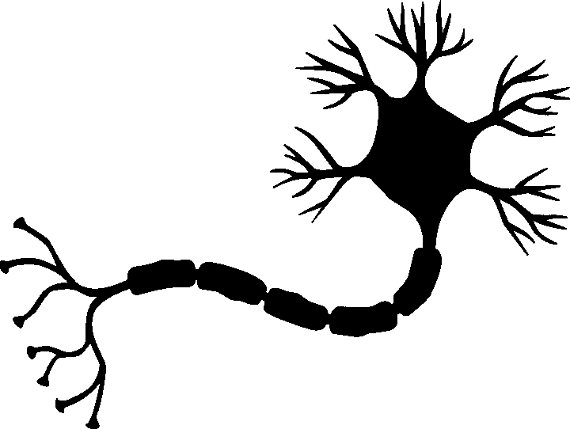
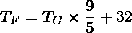
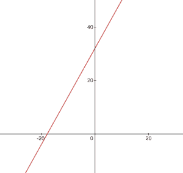
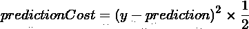
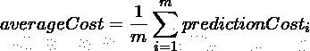
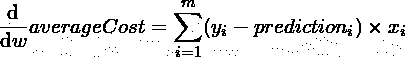
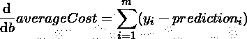
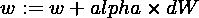
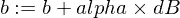

# 纳米神经元——解释机器如何学习的 7 个简单 JS 函数

> 原文：<https://towardsdatascience.com/nanoneuron-7-simple-js-functions-that-explain-how-machines-learn-d2d647b21497?source=collection_archive---------30----------------------->

> *7 个简单的 JavaScript 函数，让你感受一下机器是如何“学习”的。*



Image by [mohamed_hassan](https://pixabay.com/users/mohamed_hassan-5229782/) on [pixabay](https://pixabay.com/vectors/nerve-cell-neuron-brain-neurons-3759541/)

# TL；速度三角形定位法(dead reckoning)

[纳米神经元](https://github.com/trekhleb/nano-neuron)是神经网络中神经元概念的*过度简化*版本。纳米神经元被训练成将温度值从摄氏温度转换成华氏温度。

[NanoNeuron.js](https://github.com/trekhleb/nano-neuron/blob/master/NanoNeuron.js) 代码示例包含 7 个简单的 JavaScript 函数(模型预测、成本计算、向前和向后传播、训练)，这些函数将让您感受到机器实际上是如何“学习”的。没有第三方库，没有外部数据集和依赖，只有纯粹简单的 JavaScript 函数。

☝🏻这些函数无论如何都不是机器学习的完整指南。很多机器学习的概念在那里被跳过，被过度简化！这种简化的目的是让读者对机器如何学习有一个真正基本的理解和感受，并最终使读者有可能称之为“机器学习魔法”而不是“机器学习数学”🤓。

> 对于更高级的机器学习示例(在 TensorFlow 和 Python 上实现递归和卷积神经网络),您可以继续🤖 [**交互式机器学习实验**](https://github.com/trekhleb/machine-learning-experiments) s 知识库。

# 纳米神经元会学习什么

你可能在[神经网络](https://en.wikipedia.org/wiki/Neural_network)中听说过神经元。我们下面要实现的纳米神经元有点像它，但简单得多。为了简单起见，我们甚至不打算在纳米神经元上建立网络。我们将独自拥有它，为我们做一些神奇的预测。也就是说，我们将教会这个简单的纳米神经元将温度从摄氏温度转换(预测)为华氏温度。

顺便说一下，把摄氏温度转换成华氏温度的公式是这样的:



但是现在我们的纳米神经元还不知道它…

# 纳米神经元模型

让我们实现我们的纳米神经元模型函数。它实现了`x`和`y`之间的基本线性依赖，看起来像`y = w * x + b`。简单的说我们的纳米神经元就是一个可以在`XY`坐标中画直线的“小孩”。

变量`w`、`b`是模型的参数。纳米神经元只知道线性函数的这两个参数。
这些参数是纳米神经元在训练过程中将要“学习”的东西。

纳米神经元唯一能做的就是模仿线性依赖。在其`predict()`方法中，它接受一些输入`x`并预测输出`y`。这里没有魔法。

```
function **NanoNeuron**(w, b) {
  this.w = w;
  this.b = b;
  this.predict = (x) => {
    return x * this.w + this.b;
  }
}
```

*(…等等…* [*线性回归*](https://en.wikipedia.org/wiki/Linear_regression#:~:targetText=In%20statistics%2C%20linear%20regression%20is,is%20called%20simple%20linear%20regression.) *是你吗？)* 🧐

# 摄氏到华氏的转换

以摄氏度为单位的温度值可以使用以下公式转换为华氏温度:`f = 1.8 * c + 32`，其中`c`是以摄氏度为单位的温度，`f`是以华氏温度为单位的计算温度。

```
function **celsiusToFahrenheit**(c) {
  const w = 1.8;
  const b = 32;
  const f = c * w + b;
  return f;
};
```

最终，我们希望教会我们纳米神经元模仿这一功能(学习`w = 1.8`和`b = 32`)，而无需事先知道这些参数。

这是摄氏到华氏转换函数的样子:



Celsius to Fahrenheit conversion function

# 生成数据集

在训练之前，我们需要基于`celsiusToFahrenheit()`函数生成**训练**和**测试数据集**。数据集由成对的输入值和正确标记的输出值组成。

> 在现实生活中，大多数情况下，这些数据是收集的，而不是生成的。例如，我们可能有一组手绘数字图像和一组相应的数字，这些数字解释了每张图片上写的是什么数字。

我们将使用训练样本数据来训练我们的纳米神经元。在我们的纳米神经元成长并能够自己做出决定之前，我们需要用训练样本教会它什么是对的，什么是错的。

我们将使用测试示例来评估我们的纳米神经元在训练期间没有看到的数据上的表现。在这一点上，我们可以看到我们的“孩子”已经长大，可以自己做决定了。

```
function **generateDataSets**() {
  // xTrain -> [0, 1, 2, ...],
  // yTrain -> [32, 33.8, 35.6, ...]
  const xTrain = [];
  const yTrain = [];
  for (let x = 0; x < 100; x += 1) {
    const y = celsiusToFahrenheit(x);
    xTrain.push(x);
    yTrain.push(y);
  } // xTest -> [0.5, 1.5, 2.5, ...]
  // yTest -> [32.9, 34.7, 36.5, ...]
  const xTest = [];
  const yTest = [];
  // By starting from 0.5 and using the same step of 1 as we have used for training set
  // we make sure that test set has different data comparing to training set.
  for (let x = 0.5; x < 100; x += 1) {
    const y = celsiusToFahrenheit(x);
    xTest.push(x);
    yTest.push(y);
  } return [xTrain, yTrain, xTest, yTest];
}
```

# 预测的成本(误差)

我们需要一些指标来显示我们的模型预测与正确值的接近程度。纳米神经元产生的正确输出值`y`和`prediction`之间的成本(误差)的计算将使用以下公式:



这是两个值的简单区别。数值越接近，差异越小。我们在这里使用`2`的能力只是为了去掉负数，这样`(1 - 2) ^ 2`就和`(2 - 1) ^ 2`一样了。除以`2`只是为了进一步简化反向传播公式(见下文)。

这种情况下的成本函数非常简单:

```
function **predictionCost**(y, prediction) {
  return (y - prediction) ** 2 / 2; // i.e. -> 235.6
}
```

# 正向传播

进行前向传播意味着对来自`xTrain`和`yTrain`数据集的所有训练样本进行预测，并计算这些预测的平均成本。

我们只是让我们的纳米神经元说出它在这一点上的意见，只是让他猜一猜如何换算温度。这可能是愚蠢的错误。平均成本将显示我们的模型现在是多么的错误。这个成本值非常有价值，因为通过改变纳米神经元参数`w`和`b`并再次进行正向传播，我们将能够评估纳米神经元在参数改变后是否变得更聪明。

将使用以下公式计算平均成本:



其中`m`是训练示例的数量(在我们的例子中是`100`)。

下面是我们如何用代码实现它:

```
function **forwardPropagation**(model, xTrain, yTrain) {
  const m = xTrain.length;
  const predictions = [];
  let cost = 0;
  for (let i = 0; i < m; i += 1) {
    const prediction = nanoNeuron.predict(xTrain[i]);
    cost += predictionCost(yTrain[i], prediction);
    predictions.push(prediction);
  }
  // We are interested in average cost.
  cost /= m;
  return [predictions, cost];
}
```

# 反向传播

现在，当我们知道纳米神经元的预测有多正确或错误(基于此时的平均成本)时，我们应该做些什么来使预测更精确呢？

反向传播是这个问题的答案。反向传播是评估预测成本和调整纳米神经元参数`w`和`b`的过程，以便下一次预测更加精确。

这就是机器学习看起来像魔法🧞‍♂️.的地方这里的关键概念是**导数**，它显示了采取什么步骤来接近成本函数最小值。

记住，找到一个成本函数的最小值是训练过程的最终目标。如果我们会发现`w`和`b`的值使得我们的平均成本函数很小，这将意味着纳米神经元模型做了非常好和精确的预测。

衍生品是一个独立的大话题，我们不会在本文中讨论。MathIsFun 是一个很好的资源，可以让你对它有一个基本的了解。

关于导数，有一点可以帮助你理解反向传播是如何工作的，那就是导数的含义是函数曲线的切线，它指出了函数最小值的方向。

*图片来源:* [*马蒂斯芬*](https://www.mathsisfun.com/calculus/derivatives-introduction.html)

例如，在上面的图中，你可以看到，如果我们在`(x=2, y=4)`点，那么斜率告诉我们走`left`和`down`到达函数最小值。还要注意，斜率越大，我们向最小值移动的速度越快。

我们的`averageCost`函数对参数`w`和`b`的导数如下所示:



其中`m`是一些训练例子(在我们的例子中是`100`)。

*你可以在这里* *阅读更多关于导数规则以及如何得到复杂函数的导数* [*。*](https://www.mathsisfun.com/calculus/derivatives-rules.html)

```
function **backwardPropagation**(predictions, xTrain, yTrain) {
  const m = xTrain.length;
  // At the beginning we don't know in which way our parameters 'w' and 'b' need to be changed.
  // Therefore we're setting up the changing steps for each parameters to 0.
  let dW = 0;
  let dB = 0;
  for (let i = 0; i < m; i += 1) {
    dW += (yTrain[i] - predictions[i]) * xTrain[i];
    dB += yTrain[i] - predictions[i];
  }
  // We're interested in average deltas for each params.
  dW /= m;
  dB /= m;
  return [dW, dB];
}
```

# 训练模型

现在，我们知道如何评估我们的模型对于所有训练集示例的正确性(*正向传播*)，我们也知道如何对纳米神经元模型的参数`w`和`b`(*反向传播*)进行小的调整。但问题是，如果我们只运行一次前向传播和后向传播，我们的模型从训练数据中学习任何规律/趋势是不够的。你可以把它和给孩子上一天小学相比较。他/她应该去学校不是一次，而是日复一日，年复一年地学习一些东西。

因此，我们需要为我们的模型多次重复向前和向后传播。这正是`trainModel()`功能的作用。它就像是我们纳米神经元模型的“老师”:

*   它将花一些时间(`epochs`)在我们还有点愚蠢的纳米神经元模型上，并尝试训练/教授它，
*   它将使用特定的“书籍”(`xTrain`和`yTrain`数据集)进行训练，
*   它将通过使用学习率参数`alpha`来推动我们的孩子更努力(更快)地学习

说几句学习率`alpha`。这只是我们在反向传播期间计算的`dW`和`dB`值的乘数。因此，导数为我们指出了找到成本函数的最小值需要采取的方向(`dW`和`dB`符号)，它还为我们指出了需要多快到达那个方向(`dW`和`dB`绝对值)。现在，我们需要将这些步长乘以`alpha`，以使我们的移动更快或更慢。有时，如果我们使用一个大值`alpha`，我们可能会跳过最小值，永远找不到它。

与老师的类比是，他越是逼迫我们的“纳米孩子”，我们的“纳米孩子”就会学得越快，但是如果老师逼得太紧，“孩子”就会精神崩溃，什么也学不到🤯。

下面是我们如何更新模型的`w`和`b`参数:



这是我们的培训师职能:

```
function **trainModel**({model, epochs, alpha, xTrain, yTrain}) {
  // The is the history array of how NanoNeuron learns.
  const costHistory = []; // Let's start counting epochs.
  for (let epoch = 0; epoch < epochs; epoch += 1) {
    // Forward propagation.
    const [predictions, cost] = forwardPropagation(model, xTrain, yTrain);
    costHistory.push(cost); // Backward propagation.
    const [dW, dB] = backwardPropagation(predictions, xTrain, yTrain);
    nanoNeuron.w += alpha * dW;
    nanoNeuron.b += alpha * dB;
  } return costHistory;
}
```

# 把所有的碎片放在一起

现在让我们使用上面创建的函数。

让我们创建我们的纳米神经元模型实例。此时，纳米神经元不知道参数`w`和`b`应该设置什么值。所以我们随机设置`w`和`b`。

```
const w = Math.random(); // i.e. -> 0.9492
const b = Math.random(); // i.e. -> 0.4570
const nanoNeuron = new NanoNeuron(w, b);
```

生成训练和测试数据集。

```
const [xTrain, yTrain, xTest, yTest] = generateDataSets();
```

让我们在`70000`时期用小的(`0.0005`)步骤来训练模型。你可以摆弄这些参数，它们是根据经验定义的。

```
const epochs = 70000;
const alpha = 0.0005;
const trainingCostHistory = trainModel({model: nanoNeuron, epochs, alpha, xTrain, yTrain});
```

让我们检查一下成本函数在培训期间是如何变化的。我们期望培训后的费用会比以前低得多。这意味着纳米神经元变得更加聪明。相反的情况也是可能的。

```
console.log('Cost before the training:', trainingCostHistory[0]); // i.e. -> 4694.3335043
console.log('Cost after the training:', trainingCostHistory[epochs - 1]); // i.e. -> 0.0000024
```

这就是培训成本在不同时期的变化。在`x`轴上是纪元编号 x1000。


Training cost change over the epochs

让我们来看看纳米神经元的参数，看看它学到了什么。我们期望纳米神经元参数`w`和`b`与我们在`celsiusToFahrenheit()`函数中的参数`w = 1.8`和`b = 32`相似，因为我们的纳米神经元试图模仿它。

```
console.log('NanoNeuron parameters:', {w: nanoNeuron.w, b: nanoNeuron.b}); // i.e. -> {w: 1.8, b: 31.99}
```

评估我们的模型对测试数据集的准确性，看看我们的纳米神经元如何处理新的未知数据预测。对测试集进行预测的成本预计将接近训练成本。这将意味着纳米神经元在已知和未知数据上表现良好。

```
[testPredictions, testCost] = forwardPropagation(nanoNeuron, xTest, yTest);
console.log('Cost on new testing data:', testCost); // i.e. -> 0.0000023
```

现在，由于我们看到我们的纳米神经元“孩子”在训练期间在“学校”表现良好，即使对于它没有看到的数据，他也可以正确地将摄氏温度转换为华氏温度，我们可以称之为“智能”，并问他一些问题。这是整个培训过程的最终目标。

```
const tempInCelsius = 70;
const customPrediction = nanoNeuron.predict(tempInCelsius);
console.log(`NanoNeuron "thinks" that ${tempInCelsius}°C in Fahrenheit is:`, customPrediction); // -> 158.0002
console.log('Correct answer is:', celsiusToFahrenheit(tempInCelsius)); // -> 158
```

如此接近！和所有人一样，我们的纳米神经元是好的，但并不理想:)

祝你学习愉快！

# 如何发射纳米神经元

您可以克隆存储库并在本地运行它:

```
git clone https://github.com/trekhleb/nano-neuron.git
cd nano-neuronnode ./NanoNeuron.js
```

# 跳过机器学习概念

为了解释简单，跳过并简化了以下机器学习概念。

**列车/测试装置拆分**

通常你有一大组数据。根据该集合中示例的数量，您可能希望对训练/测试集按 70/30 的比例进行拆分。在分割之前，应该随机打乱数据集中的数据。如果示例的数量很大(即数百万)，那么对于训练/测试数据集，拆分可能以更接近 90/10 或 95/5 的比例发生。

**网络带来力量**

通常你不会注意到仅仅一个独立神经元的使用。力量就在这类神经元的[网络](https://en.wikipedia.org/wiki/Neural_network)中。网络可以学习更复杂的特性。纳米神经元本身看起来更像简单的线性回归，而不是神经网络。

**输入归一化**

在训练之前，最好将输入值[标准化](https://www.jeremyjordan.me/batch-normalization/)。

**矢量化实现**

对于网络来说，矢量化(矩阵)计算比`for`循环要快得多。通常，如果以矢量化形式实现并使用 [Numpy](https://numpy.org/) Python 库进行计算，前向/后向传播会工作得更快。

**成本函数的最小值**

我们在这个例子中使用的成本函数过于简化。它应该有[对数分量](https://stackoverflow.com/questions/32986123/why-the-cost-function-of-logistic-regression-has-a-logarithmic-expression/32998675)。改变成本函数也将改变其导数，因此反向传播步骤也将使用不同的公式。

**激活功能**

正常情况下，神经元的输出应该通过激活函数，如 [Sigmoid](https://en.wikipedia.org/wiki/Sigmoid_function) 或 [ReLU](https://en.wikipedia.org/wiki/Rectifier_(neural_networks)) 或其他。

> *更多更新和新文章* [*在 Twitter 上关注我*](https://twitter.com/Trekhleb)