# 美国宇航局小行星分类

> 原文：<https://towardsdatascience.com/nasa-asteroid-classification-6949bda3b1da?source=collection_archive---------17----------------------->

## 对小行星是否危险进行分类。

Source: [https://unsplash.com/](https://unsplash.com/)

## 介绍

太空中的一切仍然是个谜。科学家们继续努力在外层空间寻找新的东西。虽然预计会发现很多东西，但让我们看看已经发现了什么。

**小行星**
是的！！意大利牧师兼天文学家朱塞普·皮亚齐在 1801 年**的一次*偶然发现*，导致了我们今天所称的小行星。朱塞佩发现第一颗名为**谷神星**的小行星在火星和木星之间运行。从那以后，许多小行星被像美国宇航局这样的太空组织发现和研究。**

小行星是小行星，尤其是太阳系内部的小行星。较大的小行星也被称为小行星。存在着数百万颗小行星，并且绝大多数已知的小行星在位于火星和木星轨道之间的中央小行星带内运行，或者与木星共轨运行(木星木马**)。**

对小行星的研究也至关重要，因为历史事件证明其中一些是危险的。还记得**希克苏鲁伯**陨石坑吗？—6500 万年前，一颗小行星形成的陨石坑*可能*毁灭了所有的恐龙。

作为一名数据科学爱好者，我想到了使用机器学习来预测小行星是否危险。在 Kaggle 上搜索，我找到了美国国家航空航天局关于迄今发现的一些小行星的数据集。该数据集包含关于小行星的各种信息，并将每个小行星标记为危险或无害。
你可以在这里 找到数据集 [**。**](https://www.kaggle.com/shrutimehta/nasa-asteroids-classification)

现在让我们看看数据集。

## 小行星数据集

数据是关于小行星的，由 NEOWS(近地天体网络服务)提供

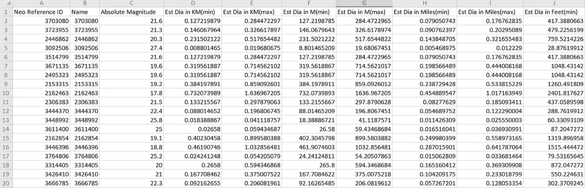

A glimpse of the dataset

数据集由 **4687 个数据实例(行)**和 **40 个特征(列)**组成。此外，数据集中没有空值。

下面给出了一些特征的描述；

1.  *‘近地天体参考号’:*该特征表示分配给小行星的参考号。
2.  *‘名字’:*这个特征表示给小行星起的名字。
3.  *‘绝对星等’:*这个特征表示小行星的**绝对星等**。一颗**小行星的绝对星等**是如果**小行星**被放置在 1 个天文单位(AU)之外，距离太阳 1 个天文单位，并且相位角为零，观察者将记录的视觉**星等**。
4.  *‘以千米(分钟)为单位的估计直径’:*该特征表示以千米(公里)为单位的小行星的估计直径。
5.  *‘以米(分)为单位的估计直径’:*这个特征表示以米(米)为单位的小行星的估计直径。
6.  *‘相对速度千米每秒’:*这个特征表示小行星的相对速度千米每秒。
7.  *‘相对速度千米每小时’:*这个特征表示小行星的相对速度千米每小时。
8.  *“轨道天体”:*这一特征表示小行星围绕其旋转的行星。
9.  *“木星 Tisserand 不变量”:*该特征表示小行星的 Tisserand 参数。 **Tisserand 的参数**(或 **Tisserand 的不变量**)是由一个相对较小的天体和一个更实质的‘扰动体’的几个轨道要素(半长轴、轨道偏心率、倾角)计算出来的值。它被用来区分不同种类的轨道。
10.  *‘偏心度’:*该特征表示小行星轨道的偏心度值。就像太阳系中的许多其他天体一样，**小行星**形成的领域不是正圆，而是椭圆。标有**偏心率**的轴是每个轨道离圆形有多远的量度:偏心率**数字越小，范围越圆。**
11.  *‘半长轴’:*该特征表示小行星轨道的**半长轴**的值。如上所述，小行星的领域是椭圆形而不是圆形。因此，半长轴存在。
12.  *“轨道周期”:*这个特征表示小行星的轨道周期值。**轨道周期**是指小行星绕其轨道运行一周所需的时间。
13.  *‘近日点距离’:*这个特征表示小行星的近日点距离值。对于绕太阳运行的天体，距离最近的点是**近日点。**
14.  *‘远日点距离’:*该特征表示小行星的远日点距离值。对于绕太阳运行的天体来说，最远点是远日点。
15.  *‘危险’:*这个特征表示小行星是否危险。

总之，数据集中的特征不仅包括小行星的几何信息，还包括其路径和速度。

## 方法

和往常一样，你可以在下面的 [**Github 资源库**](https://github.com/ShubhankarRawat/NASA-asteroid-Classification) **中找到这篇文章的代码。**

值得注意的事实是，一般来说，体积较大的小行星比相对较小的小行星更危险。
如果我们考虑在这个数据集中被标记为危险的小行星的平均直径，那么结果是 **0.70 公里。**相比之下，非危险小行星的平均直径为 **0.40 公里。** 因此，我们得出结论，数据集支持一般理论。

让我们开始吧。

## 特征工程

可以看出，数据集中存在几个不必要的特征，这些特征对分类几乎没有贡献。
特征“*名称*”和“*近地天体参考号*”表示给予小行星的识别号。这些特征对于机器学习模型是没有用的，因为小行星的名称并没有促成它是危险的事实。此外，这两个特征包含相同的值。
因此，我们可以删除这两个特征。

特征*‘接近日期’*也是不必要的，因为它给出了小行星接近地球的日期。小行星最接近地球的时间并不能说明小行星是否会对 T21 造成危险。相反，当出现时，它会告诉**。因此，我们也将删除此功能。
出于类似的原因，我们也将删除*‘轨道确定日期’*特征*。***

现在，让我们看看*‘轨道体’*的特性。它只包含一个值“地球”。因此，也删除这个特征(因为只有一个值的特征对机器学习技术没有贡献)。
此外，特征*‘Equinox’*只包含一个值‘j 2000’，因此也删除了该特征。

考虑以下特征:

*‘以千米(分)为单位的预计直径’，
‘以米(分)为单位的预计直径’，
‘以英里(分)为单位的预计直径’，
‘以英尺(分)为单位的预计直径’，*

所有这些特征以不同的单位表示小行星的估计直径，公里=公里，米=米，等等。这是冗余数据的一个很好的例子，因为它是以不同方式表示的相同值。这种冗余应该删除。统计分析的美妙之处在于，它能识别数据集中的这类错误，即使数据科学家会忽略它们。让我们现在不要删除这些特征，而是用统计方法识别它们。

到目前为止，对上述特征的去除是基于直觉的。现在让我们看看统计分析，找出哪些特征是统计相关的。

## 统计分析

在此之前，我们先来看一下*‘危险’*特性。值为“真”或“假”，分别编码为 1 和 0。

现在，让我们形成数据集的相关矩阵。

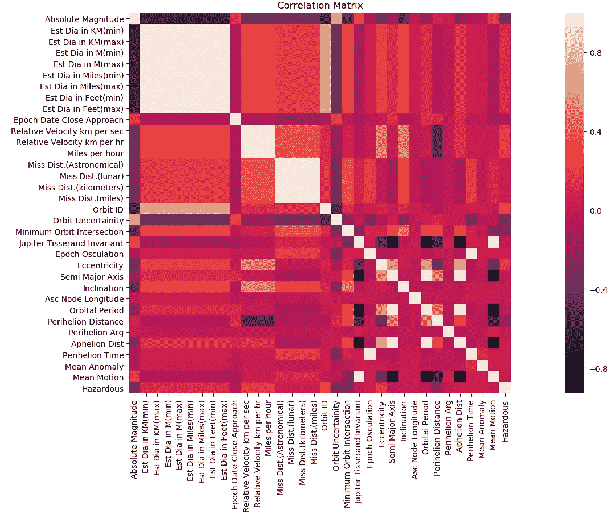

Correlation matrix

因此，相关矩阵表示存在一些彼此相关的特征，这意味着它们可以毫不犹豫地被移除。

回到特征:
*‘预计直径，单位为千米(最小)’，‘预计直径，单位为千米(最大)’，
‘预计直径，单位为米(最小)’，
‘预计直径，单位为英里(最小)’，‘预计直径，单位为英里(最大)’，
‘预计直径，单位为英尺(最小)’，‘预计直径，单位为英尺(最大)’*

就像上面提到的，相关矩阵很快识别出这个冗余，我们现在可以删除重复的信息了。
我要删除特征；
*‘以米(最小)为单位的预计直径’，‘以米(最大)为单位的预计直径’，
‘以英里(最小)为单位的预计直径’，
‘以英尺(最小)为单位的预计直径’，‘以英尺(最大)为单位的预计直径’。*

对于这些特征可以给出类似的解释；
*‘相对速度公里每秒’，‘相对速度公里每小时’，* ， *‘脱靶量’。‘天文’，Dist 小姐。‘阴历’，Dist 小姐。‘公里’，‘距离小姐。(英里)'*

除了上面提到的特征，我将保留*‘相对速度千米每秒’*和*‘脱靶量’。(天文数字)’。*

如果我们查看*‘预计直径，单位为千米(最大)’*和*‘预计直径，单位为千米(最小)’*，我们可以看到它们之间有很强的相关性。

让我们看看他们的散点图，以便有一个清晰的概念。

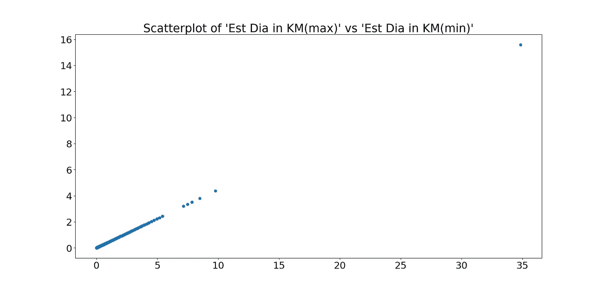

散点图显示特征*‘预计直径，单位为千米(分)’*和*‘预计直径，单位为千米(最)’*完全相关，因为从散点图中可以观察到两者之间的线性关系。
所以建议删除其中一个功能。我将删除*‘以千米(最大)为单位的估计直径’*特征。

现在让我们看看*【危险】*特性的变化

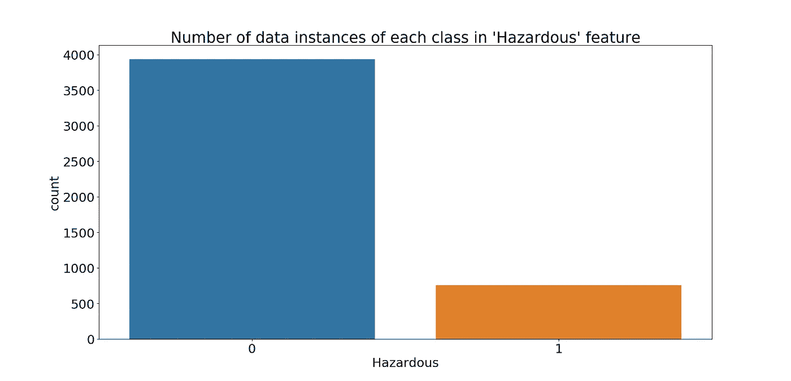

计数图描述了**不平衡**数据集的情况。我们有一个类，在数据条目的数量上领先于另一个类。
**83.89%的数据实例被标记为 0(不危险)，只有
16.10%被标记为 1(危险)。**

**这意味着，即使我们有一个预测所有值都为 0(不危险)的破损模型，那么准确率也会是 **83.89%** 。因此，我们不能仅仅依靠准确性来评估在这个数据集上训练的机器学习分类器。为了清楚地了解用于评估分类模型的不平衡数据和众多指标，请阅读 [**这篇文章**](/is-accuracy-everything-96da9afd540d) 。**

## **机器学习模型**

**数据已经过分析和清理；现在，是时候建立那些机器学习模型了。**

**让我们将数据集分成一个 **80:20** 的比例，分别作为训练集和测试集。**

**训练集(根据 [my code](https://github.com/ShubhankarRawat/NASA-asteroid-Classification) 生成)包含 **3749** 个数据实例，并有 **610** 个案例标记为 1(危险)，这意味着如果一个模型预测所有值为 0，那么准确率将为 **83.72%** 。这将被视为训练集的基线精度。
类似地，测试集的基线精度(根据我的代码)将是 **84.54%** 。
我们的模型应该比这些精度做得更好，或者应该足够健壮以处理类别不平衡。**

**使用了以下模型:**

*   ****朴素贝叶斯分类器****
*   ****SVM****
*   ****决策树****
*   ****LightGBM****

**结果在表中列出，如下所示:**

**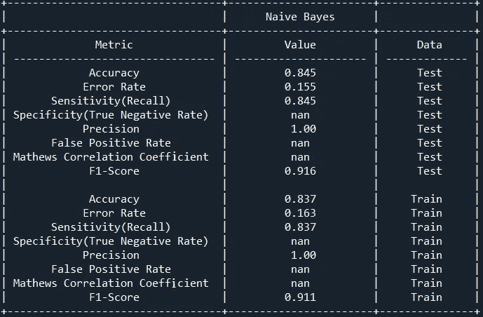****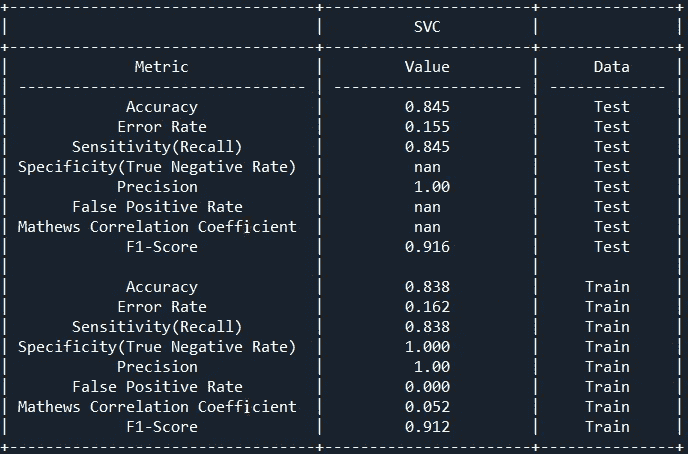********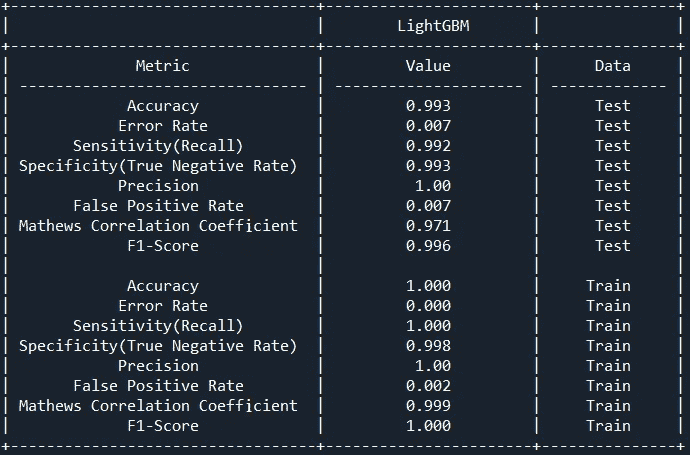**

**如果你想了解更多关于上面用于模型评估的指标，那么请参考[**这篇文章**](/is-accuracy-everything-96da9afd540d) 。现在让我们来讨论每种型号。**

## **朴素贝叶斯**

**如果我们查看朴素贝叶斯的表格，我们会看到测试集和训练集的精度**等于基线精度**。此外，如果我们查看测试集的**特异性、Mathews 相关系数**和**假阳性率**，则这些是**【nan】**，意味着模型**被破坏**，并且预测所有值为 0(无危险)。这样的模型没有任何意义，因为当一个模型永远无法实现它的目的时，使用它是没有意义的。**

**让我们也看看混淆矩阵，因为没有混淆矩阵，分类问题似乎是不完整的。**

**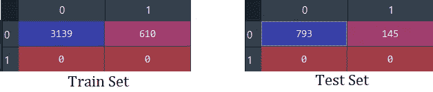**

**Confusion matrices for Naive Bayes Classifier**

**混淆矩阵清楚地表明，该模型甚至未能将单个数据实例预测为 1(危险)，因此该模型**不够稳健**。**

## **SVM**

**根据记录，就计算速度而言，SVM(SVC)被证明是最慢的**。****

****SVC 的结果表非常类似于朴素贝叶斯的结果表。因此，它清楚地表明 SVC 也**失败**(因为特异性、Mathews 相关系数和假阳性率再次为‘nan’)。
让我们看看 SVC 的混淆矩阵。****

****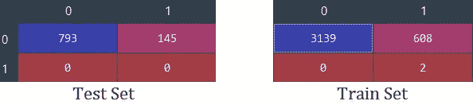****

****Confusion matrices of Test and Train set for SVC****

****测试集的混淆矩阵显示，SVC 甚至无法将单个值预测为 1(危险)。训练集的混淆矩阵显示只有两个数据实例(3749 个中的)被预测为一个，并且所做的两个预测是正确的。****

****与朴素贝叶斯分类器相比，这是一个微小的(但可以忽略不计的)改进。但尽管如此，我还是要说，这个模型完全被打破了，没有**零实际意义。******

****如果您是数据科学的新手，那么您可能会想知道如何找到一种方法(或模型)来处理数据不平衡，因为这是一个迫在眉睫的严重问题。****

****多亏了研究人员，一些分类模型足够强大，可以处理这种不平衡的数据。请考虑以下情况。****

## ****决策图表****

****决策树分类器的结果表证明它是一个非常健壮和几乎完美的模型。测试集的准确率为 **99.4%** ，非常好，而且 **Mathews 相关系数和 F1 得分的值几乎接近 1，**表明模型实际上是完美的。****

****让我们看看决策树的相关矩阵。****

****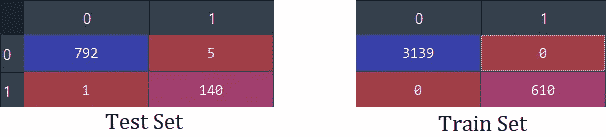****

****Confusion matrices for the test set and train set for Decision Tree****

****混淆矩阵也描述了这样一个事实，即该模型是稳健的，几乎是完美的。****

****在测试集中只有六个错误预测的**值，而在训练集中没有。******

****决策树是能够处理类别不平衡数据的健壮模型的一个很好的例子。****

****决策树可能已经给了我们很好的结果，但是还有比它更健壮、更有效的模型。****

******集合**模型更稳健，因为它们是弱预测器的“集合”。因此，我也将使用 LightGBM。****

## ****LightGBM****

****LightGBM 的结果表显示，该模型几乎是完美的，并给出了很好的结果。测试集的**准确率**为 **99.3%** ，**马修斯相关系数为 0.971，F1 得分为 0.996** 。****

****让我们看看 LightGBM 的混淆矩阵；****

****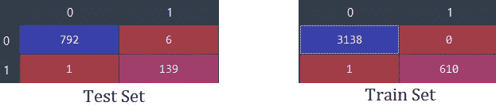****

****Confusion matrices for Train and Test set for LightGBM****

****测试集的混淆矩阵显示，只有 7 个**(比决策树多 1 个)不正确的预测，而训练集只有一个错误的预测。******

## ******结论******

******在这篇文章中，我们了解了小行星，更重要的是建立了一个几乎完美的分类器来预测小行星是否危险。******

******为数据集选择的特征是完美的，因为机器学习模型获得的结果非常好。******

******我希望你喜欢这篇文章，我相信你一定从中有所收获。******

******如果有任何疑问或建议，请在评论中告诉我。******

******谢谢你。******