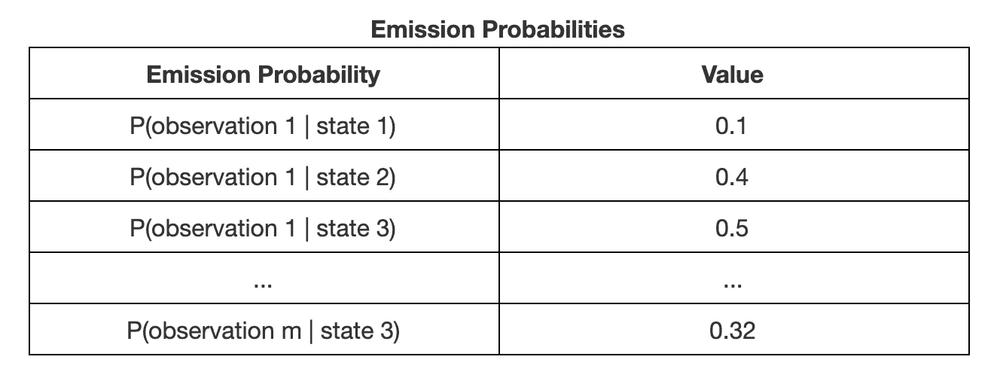
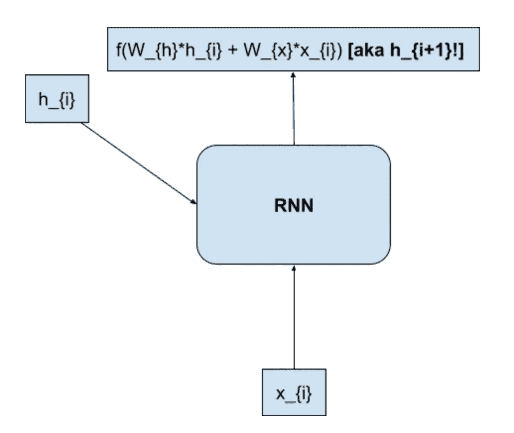
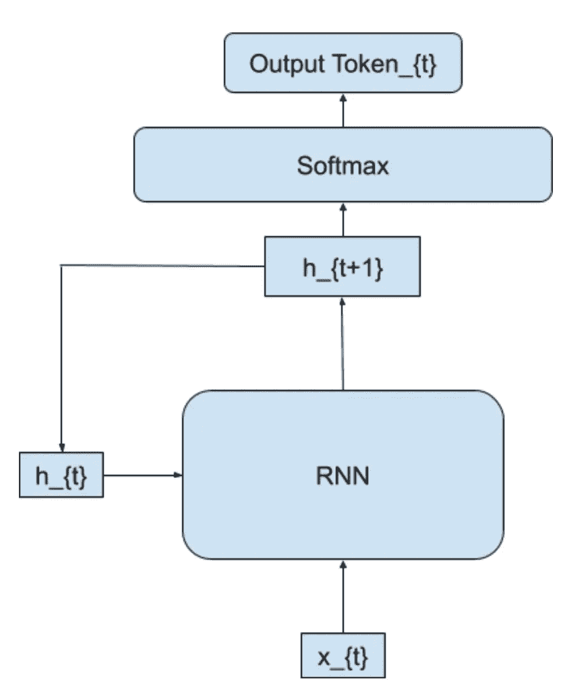

# 自然语言处理:速成班！

> 原文：<https://towardsdatascience.com/natural-language-processing-a-crash-course-73d7a07c240c?source=collection_archive---------8----------------------->


Next word prediction is one of the applications of NLP

自然语言处理(NLP)是机器学习的一个越来越重要的子领域，它通过从各种大型文本语料库开发各种语言模型来处理一般理解。在本文中，我们讨论了 5 种常见的 NLP 问题及其相关模型:

**(i) *文本分类***

**(二)*文字嵌入创作***

**(三)*词性标注***

**(iv) *序列间翻译***

**(v) *命名实体识别***

# 文本分类


Spam classification is a famous example of Text Classification

这是 NLP 最基本的用途之一，而输入模型给定一个单词或一个单词集，它必须预测给定的一个或多个单词属于一组类别中的哪一个。这与任何其他类型的分类问题非常相似！让我们看一个例子，并介绍一些方法。

文本分类问题的一个主要例子是垃圾邮件分类。这种特殊类型的问题是二元分类，这意味着任何给定的电子邮件只能属于两种可能的类别，即垃圾邮件或非垃圾邮件。现在，让我们强调并讨论解决这个问题的三种可能的方法:

*   感知器
*   最大熵分类器
*   多层感知器(又名神经网络)

## 感知器


The perceptron algorithm is an error-based approach

单层感知器是一种错误驱动的方法，旨在通过不断调整其权重来最小化训练数据的分类错误数量。

感知器训练算法的伪代码如下:

```
weights = random vector of weights
for the desired number of epochs:
   for point in training points:
      predicted_class = maximum score index(weights^T*point)
      if predicted_class is not actual_class
         weights[predicted_class]-=point
         weights[actual_class]+=point
```

让我们一点一点地分析一下:

> (1)第一行随机初始化感知器的权重
> 
> (2)外部循环指定历元的数量(或者我们将在所有给定的训练数据点上“训练”我们的感知器的次数)
> 
> (3)内部循环简单地循环所有的训练数据
> 
> (4)第 4 行有意思。表达式 w^Tx 实际上是计算各个类的分数，然后取最大分数的指数表示我们将预测这个特定输入点属于哪个类。
> 
> 这就是奇迹发生的地方。如果我们的预测类与当前点的实际类不匹配，算法会“惩罚”错误预测类的权重，并“提升”实际类的权重。因此，感知器在未来不太可能犯同样的错误。

感知器预测算法的伪代码非常简单。我们通过训练简单地使用更新的权重来为每个可能的输出类分配单独的分数，并挑选具有最高结果分数的一个:

```
predicted_class = maximum score index(updated_weights^T*test_point)
```

## 最大熵分类器

与单层感知器相反，最大熵分类器试图最大化所有给定训练数据点的可能性，然后旨在找到一组权重，进而最大化该总体可能性。

我们先来探讨一下什么是可能性。一般来说，似然性告诉我们在特定的参数配置下，一组给定的观察值(数据点)的概率。

特别是对于最大熵分类器，唯一的参数是我们用来形成预测的权重向量。因此，存在的单个数据点的概率表达式如下:


以下是上述表达式中两个主要部分的概述:

**w** -我们的分类器正在训练的一组权重

**phi(X，y)** —输入向量 X 和输出类别标签 y 的特征向量

此外，整个训练数据的似然性的表达式简单地通过遍历所有单独的训练数据点并乘以单独的概率来获得训练数据出现的总概率而导出:

最后，我们可以将上述个体概率的自然对数(ln)值相加，从而将似然表达式转换为一个称为对数似然的等价表达式，得到以下公式:


因此，这种类型的分类器的整体优化将涉及找到权重以最大化对数似然量，并且可以数学地写成如下:


## 多层感知器(神经网络)

经常用于文本分类的第三种方法是多层感知器，这只是神经网络的另一个名称。虽然我们不能在这篇文章中深入神经网络如何工作的所有细节，但让我们涵盖一些核心方面。

为了理解多层感知器，我们可以从理解单个神经元如何工作开始。一个神经元只是接受一些

一组输入，将它们乘以各自的权重，然后将这组乘积相加，并将总和传递给激活函数。听起来像是满嘴？下图很好地总结了这个过程:


Structure of a single neuron

这里有三个主要组件:

(1) **X1 & X2** :神经元的输入

(2) **W1 & W2** :用于乘以输入的权重

(3) **f** :上述神经元的激活函数

现在，一个多层感知器包括将这些单个的神经元堆叠在一起，这样就会有多层神经元。典型地，多层感知器的最简单结构将包括**一个输入层**，**一个单一隐藏层**，以及**最后一个输出层**，如下所示:


Sample Multi-layer Neural Network

具体到垃圾邮件分类的情况，我们最终的神经网络架构如下所示:


上述模型从输入的电子邮件中导出一组特征，将这些特征馈送到多层网络的输入层，然后通过单个隐藏层传播，最后通过输出层，并为每个类别产生大小为 2 的概率向量。在这种情况下，电子邮件是垃圾邮件的概率和不是垃圾邮件的概率。

在上图中，“常规激活函数”是指常用于神经网络的激活函数，包括但不限于:

*   **s 形函数**


*   **ReLU 功能**


*   **Tanh 功能**


Softmax 函数是一种特殊类型的激活函数，它将一组类得分转换成一组等价的类概率:


本质上，上面的 softmax 函数将一个向量作为输入，并返回一个概率向量作为输出。

**训练神经网络**

在我们结束对神经网络的介绍之前，让我们简单地谈谈训练网络。培训任何网络都涉及到一些基本组件，所以让我们在下面讨论一下:

**损失函数**

损失函数将用来衡量我们当前的一组预测与相应的真实值之间的差距。机器学习中常用的损失函数的一些例子包括:

*   **均方误差**


*   **均方根误差**


*   **交叉熵损失(二元分类)**


均方误差和均方根误差都用于连续预测，而交叉熵损失用于分类问题，因此交叉熵损失的二进制版本可以用于垃圾邮件分类。

**梯度下降**

训练神经网络的第二个主要部分是一种称为梯度下降的算法，它能够优化神经网络损失函数。整个伪代码如下所示:

```
Pick a random start point for a loss function
while magnitude of gradient is < threshold:
   - store current gradient value
   - update the point based on the calculated derivative
```

可视化这个算法使它变得相当直观，所以让我们走这条路。作为起点，假设我们有以下平滑凸函数:


在这种情况下，我们的主要目标是尝试找到使函数 y 的值最小化的 x 的值。作为这种方法有效的证明，让我们以函数 y 的最小值两侧的点为例。首先，让我们从最小值左侧的点开始:


由于上述函数在点 x0 处的导数为负，我们将在梯度下降更新函数中看到上述移动:

*   **数学上**


*   **视觉上**


现在很容易看出重复应用这一更新将如何最终找到使函数 y 最小的 x 值。请注意，我们将多快达到这一最小值，或者我们最终是否会完全超过它，在很大程度上取决于我们为学习速率α选择的值。

对于最小值右边的点，很容易看到现在 dy/dx > 0，所以 x 会不断地向左移动，直到它达到函数 y 的全局最小值。

最后但同样重要的是，让我们通过接触**前向和后向传播**来完成训练神经网络的循环。

**正向传播**

前向传播，顾名思义，就是遍历构建好的神经网络，得出一组当前预测的过程。

**反向传播**

反向传播，或称为反向传播，是一种真正开始使实现神经网络可行的算法。它用于有效地计算损失函数相对于权重的导数。

因此，训练神经网络的整个伪代码将如下所示:

```
for desired number of epochs (aka training cycles):
    for data_point in training_data:
       forward propagate on the current inputs
       backward propagate to calculate dL/dw(current data point)
       dL/dw+=dL/dw(current data point)
    average out dL/dw based on size of training_data
    weight update: w_{i+1} = w_{i} - learning_rate*[dL/dw]
```

# 单词嵌入创建


Photo by [Giulia May](https://unsplash.com/@giuliamay?utm_source=unsplash&utm_medium=referral&utm_content=creditCopyText) on [Unsplash](https://unsplash.com/search/photos/word-embeddings?utm_source=unsplash&utm_medium=referral&utm_content=creditCopyText)

单词嵌入是简单的向量，用于表示不同的单词，并帮助获得更好的个人和词组的数学意义。在深入研究将单词转换为单词嵌入的技术细节之前，让我们先了解一下单词嵌入的一些最常见的应用:

*   **分析文档/句子/单词相似度**:智能地将文档或语料库中的单个单词嵌入组合在一起，可以让我们将该文档或语料库表示为单词嵌入。
*   **序列到序列的转换**:这将在本文后面讨论，用于从给定的输入序列预测期望的输出序列。

除此之外，事实仍然是向量更适合机器学习背后的所有数学，因此在 NLP 中到处都使用了单词嵌入。

所以，事不宜迟，让我们直入主题吧。将单词转换为单词嵌入的方法有很多种，但是让我们来看看三种最流行、最基本的方法:

*   **跳格模型**
*   **连续词袋(CBOW)模型**
*   **单词表示的全局向量(手套)模型**

## 跳格模型

让我们通过首先查看我们可能在极大的训练语料库中遇到的例句来介绍 Skip-Gram 模型:

> 保持饥饿，保持愚蠢。

我们的第一个目标是大致了解在任何给定的句子中哪些单词可能彼此接近。自然地，我们从定义“近”的含义开始，结果，我们得到了**上下文**的概念。

你看，上面句子中的每个单词都有一个语境**，**，它仅仅是由周围的单词组成的。此外，我们可以定制我们希望的上下文的大小。例如，在大小为 1 的上下文的情况下，单词“hungry”将具有[“Stay”、“Stay”]的上下文。另一方面，单词“stay”会有[“hungry”、“傻瓜”]的上下文。


The respective length-1 contexts for ‘hungry’ and ‘stay’

对数百个、数千个甚至数百万个句子重复做这个练习会建立一个敏锐的直觉，知道哪些单词可能是给定单词的上下文单词。跳跃语法模型利用了这种直觉，然后根据语料库中每个独特的单词在输入单词的上下文中出现的可能性来分配概率。

## 连续词袋模型

与 Skip-Gram 模型不同，CBOW 模型将一组上下文单词作为输入，并尝试预测这些单词所在的上下文中的单词。本质上，对于上面的两种情况，这将如下所示:


## 单词表征的全局向量(GloVe)模型

最后，与上述两个模型不同，GloVe 模型不依赖于单词上下文来训练单词嵌入，而是依赖于**共现矩阵**的概念。

到底什么是共生矩阵？简单地说，这是一个 2d 整数数组，它捕捉了所有可能的单词组合在同一个句子或跨度中出现的频率。然后，它利用这个矩阵中的所有计数来导出每个单词的嵌入。

# 词性标注


Photo by [Edho Pratama](https://unsplash.com/@edhoradic?utm_source=unsplash&utm_medium=referral&utm_content=creditCopyText) on [Unsplash](https://unsplash.com/search/photos/part-of-speech?utm_source=unsplash&utm_medium=referral&utm_content=creditCopyText)

词性标注是自然语言处理领域的一个研究热点，有多种方法。让我们从回顾一些基本的语言建模概念开始，然后逐步为**维特比算法**开发一个框架。

## 隐马尔可夫模型


A sample HMM for M total observations and 3 hidden states

当我们必须表示一系列无法直接观察到的元素时，隐马尔可夫模型非常有用。这使得它们成为用于词性标注的理想模型，因为我们只观察单个单词，并且必须推断它们的相关标签。下面是用于词性标注的 HMM 的基本组件的分类:

*   **Q = q_{1}q_{2}…q_{N}【一组隐藏状态】:**在我们的例子中，这些将是我们所有可能的词性标签(例如。{'O '，' VBG '，' NN '，' NP '，…})
*   **A = a_{11}…a_{ij}…a_{NN}[转移概率矩阵]:** 这些将是特定状态之后一个状态的个体概率。比如 a_{11} = Pr(下一个单词的 tag = q_{1} |当前单词的 tag = q_{1})。
*   **O = o_{1}，…，o_{M}【一组观察值】:**这些只是我们模型的一组单独的输入单词。
*   **S = s_{1}，…，s_{N}【一组起始状态概率】:**每个可能状态的一组概率，它们是所讨论的序列的起始状态。

上述 HMM 也受两个假设支配:

*   **马尔可夫假设:**一个观察对应的状态只取决于这个观察之前的状态。[ P(q_{i} | q_{i-1}) ]
*   **输出独立性假设:**一个观测只与当前对应的状态有关。[ P(o_{i} | q_{i}) ]


An example transition probabilities matrix for the sample HMM from above.



Example emission probabilities for the above examples.

## HMMs 的 3 个主要功能

事实证明，hmm 用于对一组顺序观察执行 3 个主要功能:

(1) **序列评分:**给定一个观察序列{o_{1}，…，o_{n}}，指定一个概率，表示该序列有多大可能给出上述一组跃迁和发射概率。

(2) **序列解码:**给定一个观测序列，找出最大化该观测序列发生概率的隐藏状态序列。

(3) **HMM 学习:**给定一个观察序列，调整 HMM 模型的转移和发射概率，以最大化该观察序列发生的概率。

## HMMs 的问题是

为什么 hmm 不是我们在顺序位置标签中使用的主要结构？事实证明，我们为了计算一个最优的状态序列而必须经历的概率的绝对数量是非常大的，并且对于具有大的转移矩阵的数据集的计算是不可行的！

让我们通过基于上面的 HMM 计算样本观察值序列{观察值 1、观察值 2、观察值 3 }的可能性的示例来说明这一点:


本质上，这里我们有需要求和的个体概率！扩展也变得很困难。如果总共有 n 个隐藏状态和 m 个观测值，那么总起来说，就有 N^M 总数的情况！

## 解决方案:动态编程！

在本节的其余部分，我们将利用一种非常流行和有用的算法技术，称为动态编程。虽然了解细节很容易，但您需要理解的是，动态编程通过重用过去已经计算过的信息来加快算法运行时间！

## 介绍:格子架

听到关于动态编程的总结后，合乎逻辑的下一个问题是我们计划如何重用过去的信息。对于词性标注问题，我们将使用一种称为 Trellis 的结构，它由一组用于每个观察时间戳的节点组成:


A Trellis for our example given {observation 1, observation 2, observation 3}. The first layer of probabilities is labeled.

但是每个单独的节点持有什么确切的信息呢？嗯，隐藏状态 I 在时间步长 j 的节点，代表了处于隐藏状态 I 的概率，给定前 j 个观察值。在数学上，这可以表示如下:


现在，我们可以很容易地计算序列{观察 1，观察 2，观察 3}的可能性，方法是将上面网格的最后一层中的值相加:


## 介绍:维特比算法(通过词性标注)！

现在我们可以将维特比算法应用于我们的词性标注问题。让我们从设置我们的中心问题开始:我们有一个令牌序列，我们试图找到一组相关的词性标签(我们的隐藏状态)。

这是我们将用来有效重用子序列概率的网格结构:


让我们定义维特比算法的两个主要组成部分，即最佳 POS 标签序列概率和相应的反向指针:

> **(1)最优序列概率**


> **(2) POS-Tag 反向指针**


此外，维特比算法可以分为以下三个阶段:

> **(1)初始化:**这里我们需要为隐藏状态概率以及节点反向指针的初始集合设置第一层的值:


> **(2)递归:**这代表所有中间步骤，在这些步骤中，我们计算所有单个时间步长最佳标签，以及每一层的最佳后向指针:


> **(3)终止:**这最后一个阶段涉及计算可能的最高整体隐藏状态序列概率，并且还设置我们将遵循的最终反向指针，以找到我们的 POS 标签的最佳序列。


下图直观地显示了这三个阶段分别应用于网格的哪些部分:


一旦我们正确地设置了反向指针，我们就可以简单地按照它们来获得我们的 POS 标签的最佳序列！伪代码类似于:

```
current_tag = end
optimal_tag_sequence = [end]
while backpointers[current_tag] != start:
   current_tag = backpointers[current_tag]
   optimal_tag_sequence = [current_tag] + optimal_tag_sequence
optimal_tag_sequence = [start] + optimal_tag_sequence
```

# 序列间翻译


Photo by [Romain Vignes](https://unsplash.com/@rvignes?utm_source=unsplash&utm_medium=referral&utm_content=creditCopyText) on [Unsplash](https://unsplash.com/search/photos/translation?utm_source=unsplash&utm_medium=referral&utm_content=creditCopyText)

序列到序列的翻译包括利用神经网络结构将输入的单词序列转换成期望的输出单词序列。它经常用于语言翻译，例如将提供的单词集从英语翻译成其他语言，比如法语。

从整体模型的宏观视图开始，然后讨论各个组件如何工作。整个系统看起来如下:


本质上，该模型将输入的令牌序列分解为单个单元，将这些单个单元输入到左侧所示的编码器模型中，然后该编码器模型产生一个整体序列嵌入，这是一个捕获输入序列中整体信息的向量。然后，这个序列嵌入被传递给解码器，解码器又返回一个输出令牌序列。现在，让我们来分解各个组件:

## 单个 RNN(递归神经网络)节点

与常规的神经网络节点相反，rnn 经常用于我们想要在更广泛的序列中对单个标记进行预测的情况。这种潜在的使用差异在 RNN 节点的整体结构中非常明显:

*   设 x_{i} =输入序列中的第 I 个记号
*   设 h_{i} =隐藏层输出中的第 I 个令牌


“展开”上面的 RNN，我们可以看到下面的结构:


到目前为止，我们一直在黑盒子 RNN 节点的内部结构，所以让我们打破它真正快速。它由两个权重组成，一个充当时间戳 t 处的输入令牌的系数，另一个充当时间戳 t 处的隐藏状态的系数。这两个权重分别乘以其对应的权重，两个结果相加并最终传递到激活函数 f:



这是 RNN 节点在时间戳 t 的输出，并作为时间戳(t+1)的节点的隐藏层输出！这种递归性质就是为什么 rnn 是递归神经网络的原因。

## 编码器型号

好消息是，一个简单的编码器模型遵循了我们前面举例说明的精确结构！它将简单地一个接一个地接受输入标记，并继续计算中间隐藏状态。最后，它将把生成的最终隐藏状态向量传递给解码器模型。

我们可以使用各种各样的创造性策略来提高编码器模型的嵌入能力，其中大多数策略包括将每个单独导出的隐藏状态巧妙地组合到最终的嵌入向量中。你也可以选择使用更复杂的递归神经网络结构，比如 LSTMs(长短转记忆网络)和 GRUs(门控递归单元)。

## 解码器模型

解码器模型结构将与编码器模型结构非常相似，但在这种情况下，我们将有一个最终的 softmax 层，以便我们为输出词汇表中的每个单词分配概率，并尝试通过最大概率预测输出序列中的每个标记:



Single Decoder Node


A more complete picture of the model.

## 关于训练序列间模型的简要说明

正如在训练机器学习模型中常见的那样，在序列到序列模型的训练阶段，主要焦点是调整我们之前提到的所有权重，以希望提供最好的结果。然而，简单的梯度下降在这种情况下根本不会很好地工作。相反，必须利用一种称为**随机梯度下降**的方法来训练模型。

# 命名实体识别


Photo by [Kyle Glenn](https://unsplash.com/@kylejglenn?utm_source=unsplash&utm_medium=referral&utm_content=creditCopyText) on [Unsplash](https://unsplash.com/search/photos/organization?utm_source=unsplash&utm_medium=referral&utm_content=creditCopyText)

最后但同样重要的是，让我们触及命名实体识别问题。**命名实体识别(NER)** 是一个非常普遍的问题，涉及到给命名实体分配类别。下面是一个简单的例子:


Example from Wikipedia’s Named Entity Recognition article.

## 命名实体识别的组件

(1)一个输入句子 s，由一串单独的单词标记表示，我们想要在其中识别命名实体。


(2)给定句子中每个标记的一组可能的命名实体标签 t。


(3)一组特征函数 f，其接受诸如给定单词的相邻标签和句子信息的信息，并输出相应的第 I 个标签以分配输入句子中的第 I 个单词。


## 条件随机场

我们将探索**条件随机场(CRFs)** ，它是用于 NER 提取和其他类型的顺序分类任务的最基本模型之一。通用报告格式由两个关键部分组成:

> (I)评分功能，其接受一组预测的标签和输入的句子，并返回指示标签与句子标记匹配程度的分数；


> (ii)用于归一化上面得到的标签序列分数的公式，使得每个分数在 0 和 1 之间:


然后，该模型简单地利用这些导出的概率来返回输入句子的最佳标签序列。

## 培训通用报告格式

以上两个部分清楚地说明了我们如何为任何输入的句子选择一个最优的 NER 标签序列，但是在训练 CRF 的过程中到底发生了什么呢？我们查看训练数据，并为特征函数 f 的集合调整各个系数(c_{1}，…，c_{n})。训练它们的一种方法是利用**梯度下降**，这一点我们在前面的文本分类部分已经强调过了！

## 额外挑战

目前，在上面的概率公式中，我们正在查看分母中所有可能的 NER 标签集，这是非常低效的。使用我们之前关于动态编程的讨论，尝试提出一个可以更有效地计算最佳标签集的算法！

# 摘要


Photo by [Aaron Burden](https://unsplash.com/@aaronburden?utm_source=unsplash&utm_medium=referral&utm_content=creditCopyText) on [Unsplash](https://unsplash.com/search/photos/summary?utm_source=unsplash&utm_medium=referral&utm_content=creditCopyText)

总的来说，本文旨在提供自然语言处理领域中常用的一些主要问题和算法的概述。这是一个压缩在一个地方的大量信息，所以最好是多次重温或按照自己的速度阅读！