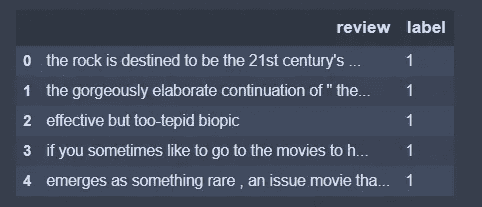
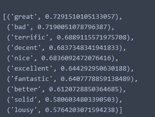
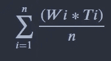
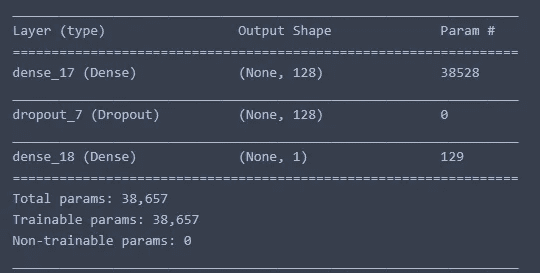
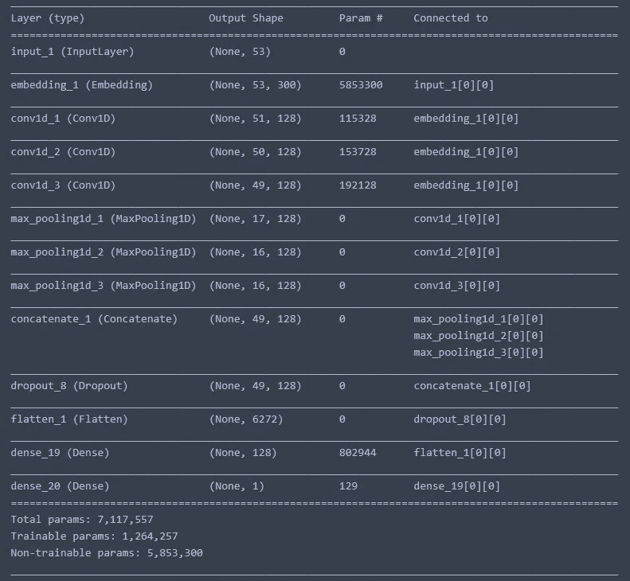
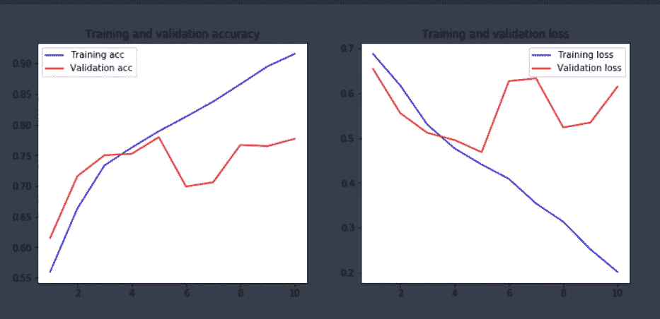

# 使用深度学习和 Word2Vec 的自然语言处理分类

> 原文：<https://towardsdatascience.com/natural-language-processing-classification-using-deep-learning-and-word2vec-50cbadd3bd6a?source=collection_archive---------3----------------------->

Photo by [Victoria Kubiaki](https://unsplash.com/@vikubi?utm_source=medium&utm_medium=referral) on [Unsplash](https://unsplash.com?utm_source=medium&utm_medium=referral)

# 介绍

我以前体验过机器学习算法，用于不同的问题，如货币汇率预测或图像分类。我最近在做一个文本分类的项目，我读了很多关于这个主题的文献。NLP(自然语言处理)的例子很吸引人。当你开始思考的时候，你意识到没那么简单，在分类之前，还有这个问题:
“一个算法到底是怎么读懂文字的？”。一种解决方案是将单词转换成向量，用数字来表示它们。这种解决方案并不新鲜，几年前，一篇文章提出了 Google Word2Vec 无监督算法:[向量空间中单词表示的高效估计(Mikolov & al。，2013)](https://arxiv.org/pdf/1301.3781.pdf) 。可以找到许多关于它的文档，但本文的重点是从头到尾详细介绍如何构建用于文本分类的机器学习算法。我将演示如何将 Word2Vec 与预训练的 Google 新闻数据集一起使用，以及如何用您的数据自己训练它。然后，我将演示两种技术；一个是做你的文档词的意思，另一个是保持你的数据像他们一样，这保留了更多的信息，但它有点复杂，需要更多的时间来训练。所以这取决于你，你认为在你的情况下和你的数据下什么更好。

# **1 首先我们需要导入数据**

对于这一步，确保包含您的评论的文件夹与笔记本在同一个文件夹中。

我用的数据是可以在这里找到的影评:[影评](https://www.cs.cornell.edu/people/pabo/movie-review-data/)。我拿的是“句子极性数据集 1.0 版”。我拿的是“句子极性数据集 1.0 版”。我选择这些是因为我可以将我的结果与论文[用于句子分类的卷积神经网络(Yoon Kim，2014)](https://arxiv.org/pdf/1408.5882.pdf) 进行比较。本文的优势在于为该数据集提供了一个神经网络，但它将其结果与表 2 中的其他算法进行了比较，这非常有趣，因为我们有许多来自不同论文的算法来比较我们的结果。

提取你下载的带有链接的文件。
好了，现在我们基本上有一个名为**“rt-polarity data”**的文件夹，其中有两个名为**“rt-polarity . neg”**和**“rt-polarity . pos”**的文件。负面评价和正面评价)。我们在这里的工作将是把每一个数据放入熊猫数据框进行分析。开始将它们转换成 CSV 文件。

现在，我们正在创建数据的“标签”, 1 表示正面评价，0 表示负面评价。

现在结果应该如下

Figure 1: Our Dataframe, with the text of the review, and its label

好的，看起来很棒！现在，我们将每个评论都放入我们的 pandas dataframe，命名为“评论”，并带有特定的标签(1 表示正面评论，0 表示负面评论)。

# 2 使用 Word2Vec 查看我们单词之间的相似性距离

ord2Vec 是一个很好的用于单词嵌入的神经网络模型。它主要用于词语的相似上下文。我们将在我们的数据上训练模型，使我们所有的词之间有一个距离，以查看哪些词在语义上彼此接近。还有其他型号，但我选择这款有两个原因:

1.  这是尹金在他的文章中使用的
2.  是 Google 开发的模型，似乎是完全推荐的，文档也很容易找到，而这篇文章:[向量空间中单词表示的高效估计(Mikolov & al，2013)](https://arxiv.org/pdf/1301.3781.pdf) 很好地解释了所有的过程。

# 2.1 标记化

现在，你的数据帧应该是这样的

Figure 2 : The dataframe, with the tokens

对于培训来说，重要的是将每个评论表示为单词列表，如“令牌”列中所示。

# 2.2:使用预先训练好的谷歌新闻数据集

首先你需要在这里下载数据集:[谷歌新闻数据集](https://s3.amazonaws.com/dl4j-distribution/GoogleNews-vectors-negative300.bin.gz)。然后，将其提取到您的文件夹中。我将它提取到名为“model”的子文件夹中

就这么简单！现在你已经有了一个名为**“w2v _ model”**的模型，它经过了训练，包含了数据集中用向量表示的每个单词。

# 2.2.1 根据您的数据训练模型

你也可以用你的个人数据来训练这个模型。但是，我不建议对小文档使用这种技术，因为 Word2Vec 不能正确地捕捉单词的上下文，并且它不会给出令人满意的结果。我在这篇文章的数据上进行了测试，结果明显比预先训练的 Google Word2Vec 要好。在另一个平均每个文档 200 个单词的数据集上，它更可靠，并且在某些情况下显示出比预训练模型更好的结果。

我们将把工作分成 3 个步骤

1.  `Word2Vec()`。用模型的所有参数初始化模型
2.  从一系列句子中构建词汇
3.  `.train()`我们训练我们的模型

# 2.3 结果

现在，我们可以用一些单词来测试我们的模型，看看哪些单词与它们最相似。
我们用以下方式进行测试:

1.  电影
2.  小说
3.  好的

对于“好”这个词，我有这些结果

Figure 3 : Words that are the most similar to “good”

这些结果是通过预先训练的谷歌新闻数据集获得的。

然而，我们可以看到，该模型并不完美，没有捕捉到单词的语义，因为我们有[很好、很差、很棒、不错]。这可能是一个问题，因为在这里好在“语义上”接近坏。事实上，它们可以在相同的上下文中使用，但它们的含义是不一样的。

# 2.5 一点点数据可视化

上面是我们数据集的一万字的图。语义相近的，在地图上是挨着的。我用散景让地图变得动态，我们可以和它互动，你可以把鼠标放在一个点上，看看对应的单词。我们现在可以清楚地看到所有单词之间的关系，以及哪些是近的或远的。

Figure 4 : Bokeh chart of 10000 words of our dataset

# 3 对数据做一点工作

# 3.1 列车测试分割

现在我们有了数据框架，我们需要将数据分成一个训练变量和一个测试变量。通过训练，我们的算法将学习它的参数，通过测试，我们将测试它们。
我们将训练和测试分开，以查看是否存在**不过度拟合**的问题，这在深度学习领域是经常出现的。这意味着我们的模型对它所学习的数据有很好的结果，但它有一个概括的问题，并且它在其他数据集上会有不好的结果，这显然不是目标。

# 3.2 构建向量

我们在这里做的是使用来自`sklearn`的`TfidfVectorizer`。该功能反映了文档中单词的强度。
我们使用行`tfidf = dict(zip(vectorizer.get_feature_names(), vectorizer.idf_))`将所有的单词放入一个名为`tfidf`的向量中，如果你执行它，你可以在上面看到。这是我在 Ahmed BESBES 的博客上发现的一个提示。这真的很有趣，值得一读。

现在只是为了好玩，为了形象化，我用 WordCloud 来描绘我们字典中最重要的 100 个单词。我们可以看到像**戏剧、电影、场景和故事**这样的词，它们显然对关于电影评论家的数据集很重要。我使用了 Ahmed BESBES 的另一个博客来使用这个库。

Figure 5 : The most “important” words in our corpus

现在我们将构建一个函数来计算给定评论家的“平均值”。我们的 w2v_model 给了我们哪些单词彼此接近，所以对于每一个单词，我们都将它们乘以它们在“字典”中的重要性:`w2v_model[word].reshape((1, size)) * tfidf[word]`。
注意:我们使用 reshape 函数，因为我们对语料库的每个文本都这样做，所以例如在`X_train`中我们有 8529 个文本，如果我们对其应用该函数，我们将得到一个二维形状矩阵(8529，300)。

1.  8529 代表我们语料库中的文本数量
2.  300 代表 Word2Vec 创建的向量的大小。

就这样，现在我们把它除以观察次数，我们很好地得到了所有这些的平均值。

该计算可以恢复如下:

Figure 6: Formula of the mean of the words by ponderation with their Tf-idf

其中:

1.  `n`是文本中的字数
2.  对于给定的字 *i* ，向量 *Word2Vec* 的大小是 300
3.  `Ti`是给定字 *i* 的值 *tfidf*

现在我们将这个函数应用于我们的数据。
所以我说过，`buildWordVector`有两个参数，令牌，和大小。尺寸是 300 因为 word2vec 模型我们得到了 300 的形状。对于标记，它将循环增加，以覆盖我们的训练语料库的所有 8529 个文本和我们的测试语料库的 2133 个文本。

# 4 第一个神经网络

第一个神经网络只是一个简单的人工神经网络，只有两个密集层，为了避免过拟合，压差为 0.7。对于这一个，我们把给定评论中每个词的平均向量作为输入。

# 4.1 构建神经网络

下面是这个简单分类器的特征。

*   **致密层数:** 2
*   **激活函数:** relu，和 sigmoid 为最后一个密集层
*   **辍学:** 0.7
*   **优化器:** Adadelta
*   **损失:**二元交叉熵

Figure 7 : summary of the classifier

# 4.2 训练神经网络

现在，我们使用批量为 50 的训练数据和 20 个时期来训练我们的神经网络。
做更多的历元似乎不会改变精度。使用不同的 batch_size 和时期数进行网格搜索以查看更好的参数可能是有用的。

最后，我们绘制训练的历史以观察演变，并比较训练和测试预测

Figure 8: accuracy and loss for the first classifier

最终，我们的训练精度为 0.8342，测试精度为 0.7286。这并不坏，重要的是要注意，我们没有太多的过度拟合。

# 5 A 卷积神经网络

CNN 主要用于图像分类，因为它可以通过模式的过滤图来识别模式。但在 2014 年，当 Yoon Kim 发表他的文章时，他表明它们也可以用于文本分类。事实上，这个想法并不完全疯狂，因为句子也有模式。

# 5.1 构建神经网络

首先，我们试图找到所有的参数来构建我们的神经网络。这将是一个 CNN，但不是给他一个句子中所有单词向量的意思，我们会给他一个给定句子中所有的单词向量。
还有，结构有点变化，每层神经元更多。

Figure 9: structure of our CNN

我们的神经网络与我上面描述的 Yoon Kim (2014)构建的神经网络相同。

*   **卷积层数:** 3
*   **致密层数:** 2
*   **特征图数量:**每卷积 128
*   **激活功能:** relu，和最后一个致密层的 sigmoid
*   **滤镜尺寸:** 3、4、5
*   **辍学:** 0.5
*   **优化器:** Adadelta
*   **损失:**二元交叉熵

这个 CNN 和 Yoon Kim 用的差别不大:
1。他刚有了 1 密层
2。他从来没有用过乙状结肠。他在每个卷积中使用了 100 个特征图，而不是 128 个

然而，我有更好的结果与那些小的变化，所以我保持他们那样。

为了构建它，我们需要一些参数，嵌入维数(word2vec 向量的大小)，vocab 大小的最大值(我们有多少个唯一的词)，以及最大序列长度(每次评论的最大字数)。
下面的代码为您提供了所有这些参数，如果您用另一个数据集测试它，只需用代码的结果更改三个变量:

现在，我们创建将在 CNN 中使用的训练和测试输入。对于少于最大字数的每个文档，我们用“0”来完成它们。这并没有改变我们的结果，因为 CNN 识别模式，无论在某一点或另一点，模式仍然是相同的。例如，对于一个图像，这意味着如果一个图像比其他图像小，我们将把它的黑色边框。这不会改变形象。

# 5.2 定义 CNN

汇总的结果应该如下所示:

Figure 10: Summary of the CNN

让我们进行 10 个纪元的训练课程，再来一次批量 50 个！

Figure 11: accuracy and loss for the cnn

在 10 个时期结束时，训练集的准确度为 0.915，测试集的准确度为 0.7768。我们有一点过度拟合，验证损失相当不稳定，但结果在这里。我用更多的纪元来训练它，但这似乎是我们能做到的最好的了。

# 6 个结论

我们可以清楚地看到 CNN 更适合这个任务，用我的其他数据帧，我个人也有同样的结果。
但是，它仍然有一个不方便的地方，它要更深，有更多的参数，并且需要更多的时间来训练。对于这个小数据集，差异并不重要，但我必须根据我的工作数据来训练它，简单的分类器需要 13 分钟训练，而 CNN 需要 5 个小时！所以要用哪个由你自己决定。
这两个分类器仍然显示出一些不错的结果，我注意到它们拥有的数据越多，文档的长度越重要，它们就越好。对于一个包含 70 000 个数据和最大长度为 2387 个文档的数据集，我的测试精度是 0.9829，这非常令人鼓舞！

# 7 个视角

我有两个主要的想法去尝试更好的结果。首先，使用第一个分类器，我们可以使用另一个更复杂的神经网络，如递归神经网络([CA-:使用上下文对齐的递归神经网络对句子相似性建模(陈，胡& al ., 2018).](https://www.aaai.org/ocs/index.php/AAAI/AAAI18/paper/viewFile/17114/15696))或现在开始使用的注意网络([用于文档分类的分层注意网络(Yang & al .，2016)](https://www.cs.cmu.edu/~./hovy/papers/16HLT-hierarchical-attention-networks.pdf) )。
第二个想法是针对单词嵌入，2018 年谷歌展示了一个新的模型，叫做 BERT ( [BERT:用于语言理解的深度双向转换器的预训练(Devlin，Chang & al。，2018)](https://arxiv.org/pdf/1810.04805.pdf) )谁更有优势使用分割令牌。例如，如果我们的数据中有单词考古学家，它可以记住“考古”，当像“考古”这样的单词出现时，它会知道它与考古学家有关，而 word2Vec 会忽略它不认识的单词。