# 自然语言处理—事件提取

> 原文：<https://towardsdatascience.com/natural-language-processing-event-extraction-f20d634661d3?source=collection_archive---------5----------------------->

## 从新闻文章中提取事件

每天生成的文本量令人震惊。数以百万计的数据以新闻文章、博客、消息、手稿等形式发布，自动组织和处理它们的能力变得不可或缺。

随着神经网络算法的改进，计算机能力的显著提高，以及对综合框架的轻松访问，自然语言处理似乎从未如此吸引人。它的一个常见应用称为事件提取，这是一个收集文本中发现的周期性事件的知识的过程，自动识别关于发生了什么以及何时发生的信息。

例如:

> 2018/10-唐纳德·特朗普总统的政府禁止各国进口伊朗石油，七个国家除外。
> 
> 2019/04-美国国务卿迈克·蓬佩奥宣布，他的国家将不会在最后期限后开放更多的例外。
> 
> 2019/05-美国结束了允许各国从伊朗进口石油而不受美国制裁的豁免。

这种将信息置于背景中的能力让我们能够将时间分布的事件联系起来，吸收它们的影响，以及一系列事件如何随着时间的推移而展开。这些有价值的见解推动了像 [EventRegistry](https://eventregistry.org/) 和 [Primer 这样的组织。AI](https://primer.ai/) ，为不同的市场领域提供技术。

在本文中，我们将构建一个简单的事件提取脚本，它接收新闻提要并输出事件。

## 获取数据

第一步是收集数据。它可以是任何类型的文本内容，只要它可以在时间线中表示。这里我选择使用 [newsapi](https://newsapi.org/) ，这是一个简单的新闻源 api，免费开发者计划每天最多 500 个请求。以下是为处理请求而构建的函数:

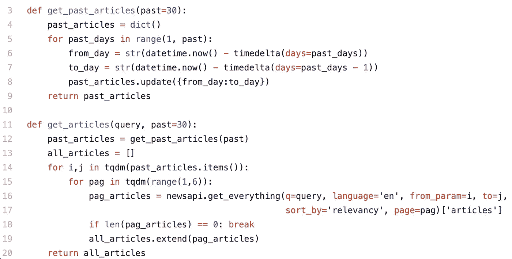

给定一个特定的查询，最后一个函数返回大约 2，000 篇文章的列表。我们的目的只是提取事件，因此，为了简化过程，我们只保留标题(理论上，标题应该包含新闻背后的核心信息)。

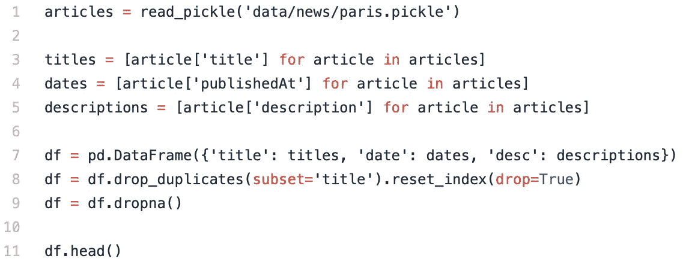

这给我们留下了一个类似下面的数据框，包括日期、描述和标题。

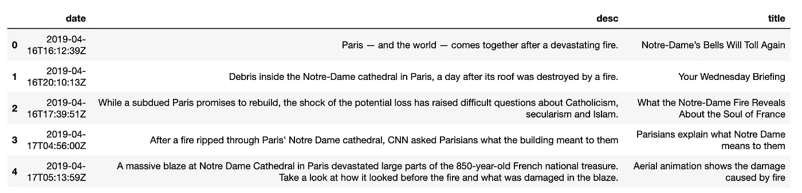

## 赋予句子意义

准备好标题后，我们需要用机器可读的方式来表示它们。注意，我们在这里跳过了整个预处理阶段，因为这不是本文的目的。但是如果你从 NLP 开始，确保在应用模型之前包括那些基本的预处理步骤→ [这里有一个很好的教程](https://machinelearningmastery.com/clean-text-machine-learning-python/)。

为了给独立的单词赋予意义，从而给整个句子赋予意义，让我们使用 Spacy 的预训练单词嵌入模型( [en_core_web_lg](https://spacy.io/models/en#en_core_web_lg) )。或者，您可以使用任何预先训练的单词表示模型(Word2Vec、FastText、GloVe……)。

默认情况下，Spacy 将句子的向量视为其标记向量之间的平均值。这是一种简单的方法，不考虑单词的顺序来编码句子。对于更复杂的策略，看看像 [Sent2Vec](https://github.com/epfml/sent2vec) 和 [SkipThoughts](https://github.com/ryankiros/skip-thoughts) 这样的模型。这篇关于无监督摘要的文章很好地介绍了跳过思想。

现在，让我们保持简单:

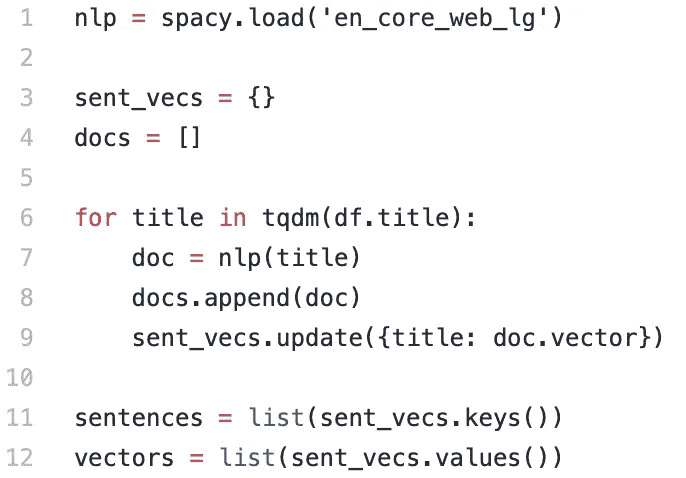

因此，每个标题都有一个第 300 维的数组，如下所示:

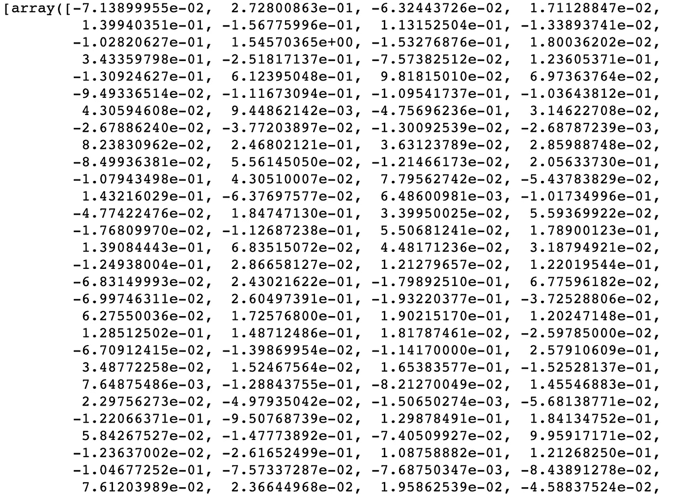

## 聚集这些向量

即使我们是通过搜索词来过滤文章，不同的主题也可能出现在同一个查询中。例如，搜索“巴黎”可能会得到:

> 一场毁灭性的火灾后，巴黎团结起来

或者:

> 巴西足球传奇人物贝利在巴黎住进医院

为了对不同主题的文章进行分组，我们将使用聚类算法。

在这个特殊的例子中，我想尝试 DBSCAN 算法，因为它不需要预先指定集群的数量。相反，它自己决定要创建多少个集群，以及它们的大小。

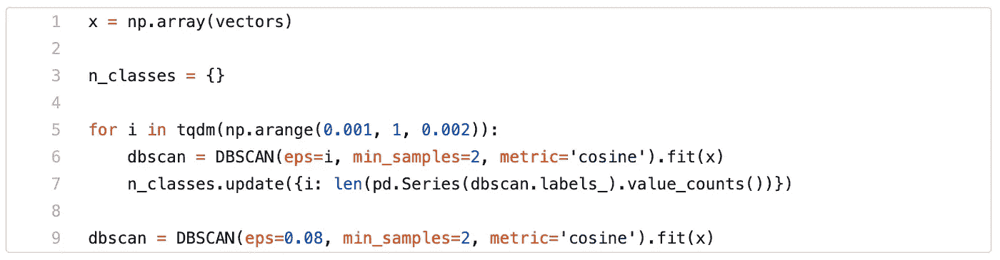

*ε*参数决定了两个样本之间的最大距离，使它们被视为处于相同的邻域中，这意味着如果 *eps* 太大，将形成较少的聚类，但如果太小，大多数点将被分类为不属于某个聚类，这也将导致一些聚类。下图显示了 epsilon 的集群数量:

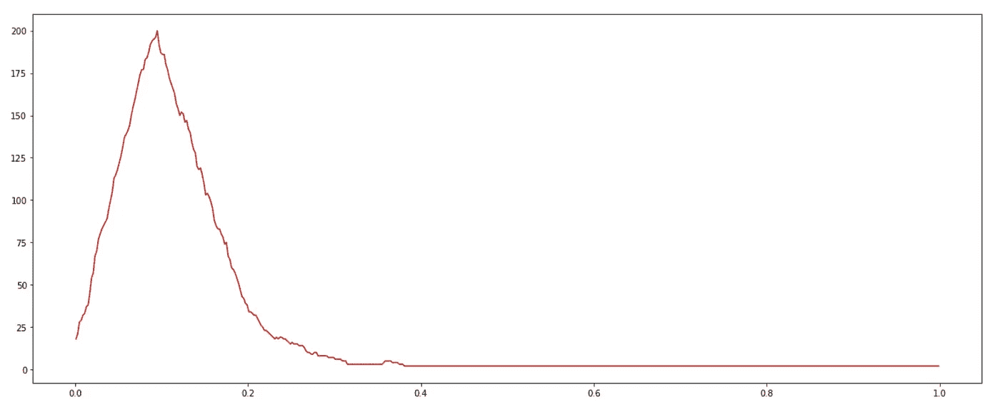

调整 *eps* 值可能是最微妙的步骤之一，因为结果会根据您认为句子相似的程度而有所不同。正确的值将通过实验得出，试图保留句子之间的相似性，而不会将相近的句子分成不同的组。

一般来说，因为我们希望在同一个集群中得到非常相似的句子，所以目标应该是返回更多类别的值。因此，我选择了一个介于 0.08 和 0.12 之间的数字。查看 [Scikit Learn](https://scikit-learn.org/stable/modules/generated/sklearn.cluster.DBSCAN.html) 文档，了解更多关于该参数和其他参数的信息。

以下是一些集群及其大小:

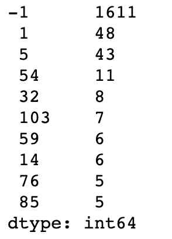

**-1** 类代表没有聚类的句子，其余为聚类索引。最大的集群应该代表评论最多的主题。

让我们来看看其中的一个集群:

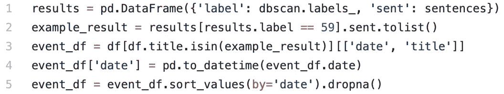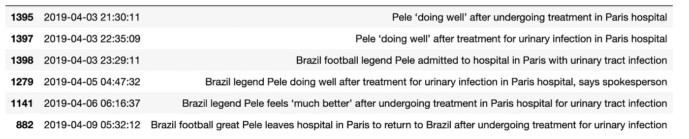

## 转换成事件

下一步是按时间顺序排列这些句子，并根据相关性进行过滤。这里，我选择每天显示一篇文章，这样时间线就清晰一致了。

由于每天都有很多关于同一主题的句子，我们需要一个标准来从中选择一个。它应该是最能代表事件本身的，也就是那些标题试图传达的意思。

为此，我们可以对每日标题进行聚类，并为每个聚类选择离聚类中心最近的标题。给定一系列句子，下面是查找中心向量的函数:

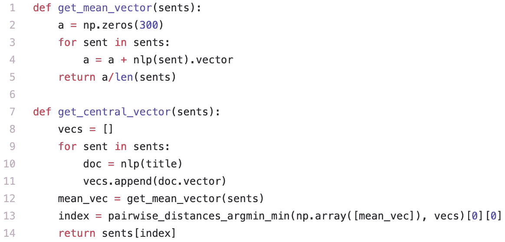

s

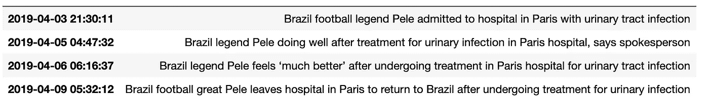

最后，使用 Plotly，我们可以想出一种方法来绘制一个方便的时间线图:

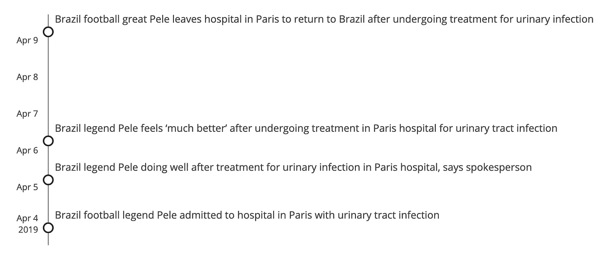

就是这样。使用 2000 篇随机文章，我们制作了一个脚本来提取和组织事件。想象一下，每天将这种技术应用到数百万篇文章中会有多有用。以股票市场和每日新闻的影响为例，我们可以开始窥视事件提取的价值。

可以包括几个组件来改善结果，比如适当地预处理数据，包括[词性标注和 NER](https://spacy.io/usage/linguistic-features) ，应用更好的句子到向量模型，等等。但是从这一点出发，可以很快达到一个理想的结果。

感谢你阅读这篇文章。这是一篇关注自然语言处理和事件提取的文章。如果你想了解更多关于数据科学和机器学习的知识，请确保关注我的个人资料，并随时留下任何想法、评论或担忧。