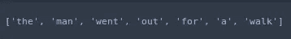
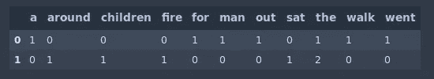
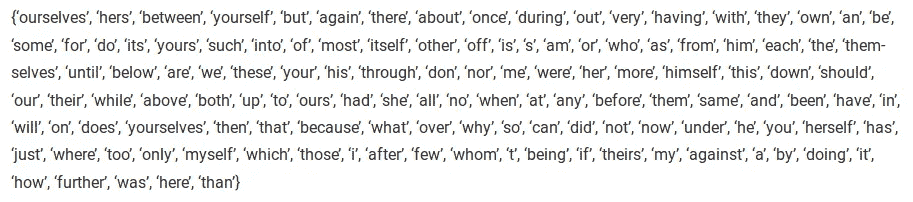
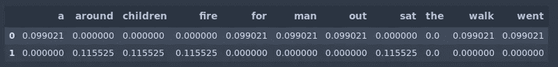
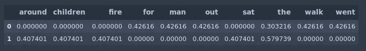

# TF IDF | TFIDF Python 示例

> 原文：<https://towardsdatascience.com/natural-language-processing-feature-engineering-using-tf-idf-e8b9d00e7e76?source=collection_archive---------0----------------------->


Photo by [Raphael Schaller](https://unsplash.com/@raphaelphotoch?utm_source=medium&utm_medium=referral) on [Unsplash](https://unsplash.com?utm_source=medium&utm_medium=referral)

自然语言处理(NLP)是人工智能的一个子领域，处理理解和处理人类语言。鉴于机器学习的新进展，许多组织已经开始将自然语言处理应用于翻译、聊天机器人和候选人筛选。

不再拖延，让我们深入一些代码。首先，我们将导入必要的库。

```
import pandas as pd
from sklearn.feature_extraction.text import TfidfVectorizer
```

在本文中，我们将使用两个简单的文档，每个文档包含一个句子。

```
documentA = 'the man went out for a walk'
documentB = 'the children sat around the fire'
```

机器学习算法不能直接处理原始文本。相反，文本必须转换成数字向量。在自然语言处理中，从文本中提取特征的一种常见技术是将文本中出现的所有单词放在一个桶中。这种方法简称为**袋字**模型或**弓**。它被称为一个 ***【袋】*** 的单词，因为任何关于句子结构的信息都丢失了。

```
bagOfWordsA = documentA.split(' ')
bagOfWordsB = documentB.split(' ')
```



通过将单词包转换为一个集合，我们可以自动删除任何重复的单词。

```
uniqueWords = set(bagOfWordsA).union(set(bagOfWordsB))
```

接下来，我们将为语料库(文档集合)中的每个文档创建一个单词及其出现次数的字典。

```
numOfWordsA = dict.fromkeys(uniqueWords, 0)for word in bagOfWordsA:
    numOfWordsA[word] += 1numOfWordsB = dict.fromkeys(uniqueWords, 0)for word in bagOfWordsB:
    numOfWordsB[word] += 1
```



单词袋方法的另一个问题是它没有考虑噪音。换句话说，某些单词被用来构成句子，但没有给文本增加任何语义。例如，英语中最常用的单词是*，它代表了所有书面或口头单词的 7%。考虑到文本中包含单词**和**，你无法对文本做出任何推断。另一方面，像 **good** 和 **awesome** 这样的词可以用来确定一个评级是否是正面的。*

*在自然语言处理中，无用词被称为停用词。python **自然语言工具包**库提供了一个英文停用词列表。*

```
*from nltk.corpus import stopwordsstopwords.words('english')*
```

**

*通常，当以理解文本为目标构建模型时，您会看到所有停用词都被删除了。另一种策略是使用 TF-IDF 对单词的相对重要性进行评分。*

## ***词频(TF)***

*一个单词在文档中出现的次数除以文档中的总单词数。每个文档都有自己的词频。*

**

*以下代码在 python 中实现了词频。*

```
*def computeTF(wordDict, bagOfWords):
    tfDict = {}
    bagOfWordsCount = len(bagOfWords)
    for word, count in wordDict.items():
        tfDict[word] = count / float(bagOfWordsCount)
    return tfDict*
```

*下面几行计算了我们每个文档的词频。*

```
*tfA = computeTF(numOfWordsA, bagOfWordsA)
tfB = computeTF(numOfWordsB, bagOfWordsB)*
```

## ***逆数据频率(IDF)***

*日志中的文档数除以包含单词 ***w*** 的文档数。逆数据频率决定了语料库中所有文档中稀有词的权重。*

**

*以下代码在 python 中实现了反向数据频率。*

```
*def computeIDF(documents):
    import math
    N = len(documents)

    idfDict = dict.fromkeys(documents[0].keys(), 0)
    for document in documents:
        for word, val in document.items():
            if val > 0:
                idfDict[word] += 1

    for word, val in idfDict.items():
        idfDict[word] = math.log(N / float(val))
    return idfDict*
```

*所有文件的 IDF 计算一次。*

```
*idfs = computeIDF([numOfWordsA, numOfWordsB])*
```

*最后，TF-IDF 就是 TF 乘以 IDF。*

**

```
*def computeTFIDF(tfBagOfWords, idfs):
    tfidf = {}
    for word, val in tfBagOfWords.items():
        tfidf[word] = val * idfs[word]
    return tfidf*
```

*最后，我们可以计算语料库中所有单词的 TF-IDF 分数。*

```
*tfidfA = computeTFIDF(tfA, idfs)
tfidfB = computeTFIDF(tfB, idfs)df = pd.DataFrame([tfidfA, tfidfB])*
```

**

*我们可以使用 sklearn 提供的类，而不是自己手动实现 TF-IDF。*

```
*vectorizer = TfidfVectorizer()vectors = vectorizer.fit_transform([documentA, documentB])feature_names = vectorizer.get_feature_names()dense = vectors.todense()denselist = dense.tolist()df = pd.DataFrame(denselist, columns=feature_names)*
```

**

*这些值略有不同，因为 sklearn 使用了平滑版本的 idf 和各种其他小优化。在具有更多文本的示例中，单词*的得分将大大降低。**