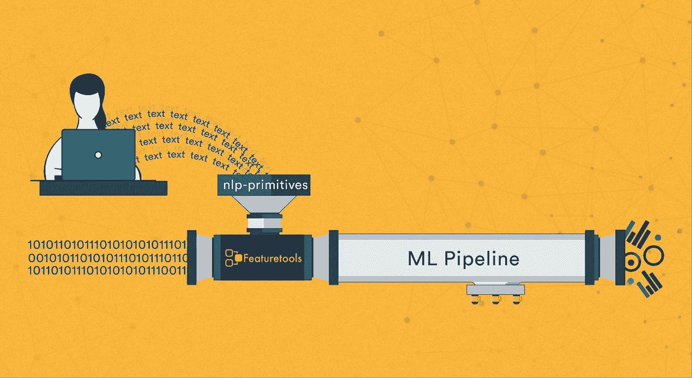
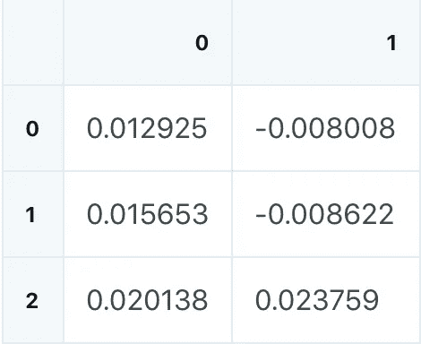

# 面向自动化特征工程的自然语言处理

> 原文：<https://towardsdatascience.com/natural-language-processing-for-automated-feature-engineering-46a61a3930b1?source=collection_archive---------21----------------------->



*如何使用 Featuretools 应用 nlp-primitives 库。*

当试图在机器学习管道中利用真实世界的数据时，经常会遇到文本。文本数据可以包含许多有价值的信息，但经常被忽略，因为很难将文本翻译成算法可以解释的有意义的数字。

在 [Featuretools](https://github.com/Featuretools/featuretools) 、[、*原语函数*、](https://docs.featuretools.com/automated_feature_engineering/primitives.html)用于为不同类型的数据自动创建*特征*，使机器学习模型能够充分利用你的数据集中的数据。

在本文中，我探索了使用 [nlp-primitives 库](https://github.com/FeatureLabs/nlp_primitives)从文本数据中创建特征，通过使用一个示例数据集来研究机器学习模型中的这些附加特征。然后，我解释为什么这些原语对模型的准确性有如此大的影响。

## 一个使用 nlp 原语的机器学习演示

在这个演示中，我将使用来自[这个 Kaggle 数据集](https://www.kaggle.com/jkgatt/restaurant-data-with-100-trip-advisor-reviews-each)的数据，该数据集包含旧金山地区 57 家餐馆的 100 条评论。数据集相对较小，但足以用 Featuretools 和 nlp-primitives 库演示特征工程。您可以使用这个库中的[Jupyter 笔记本继续学习。](https://github.com/FeatureLabs/predict-restaurant-rating)

首先，让我们确定问题:根据每个评论者的反馈，确定他们对餐厅的看法。该模型的成功与否将取决于它能在多大程度上准确预测每个评审者根据给定数据和评审给出的评级。在数据集中，评论有 5 个可能值，从 1 星到 5 星，所以问题是一个 5 类分类问题。

为了评估 NLP 原语的有效性，我还使用没有这些新原语函数的[深度特征合成](https://blog.featurelabs.com/deep-feature-synthesis/) (DFS)创建了一个基线特征矩阵，以便我可以看到这些新原语的有效性。利用这个基线特征矩阵，我创建了一个机器学习模型，准确率大约为 50%。

```
baseline_feature_matrix, baseline_features = ft.dfs(entityset=es,
                                            target_entity='reviews',
                                            verbose=True,
                                            ignore_variables=ignore)**built 33 features**base_rfc = RandomForestClassifier(n_estimators=100,
                                  class_weight = "balanced", 
                                  n_jobs=-1)
base_rfc.fit(baseline_train_fm, baseline_y_train)
base_rfc.score(baseline_test_fm, baseline_y_test)**0.5156462585034014**
```

这个模型预测大多数评论属于最常见的评论类别，所以它的预测不是很准确，正如你在下面的混淆矩阵中看到的。

在基线模型和使用 nlp 原语的模型之间，只有一个因素发生了变化:NLP 原语库的使用。

```
trans = [DiversityScore, LSA, MeanCharactersPerWord, 
         PartOfSpeechCount, PolarityScore, PunctuationCount, 
         StopwordCount, TitleWordCount, UniversalSentenceEncoder,      
         UpperCaseCount]

features = ft.dfs(entityset=es, target_entity='reviews', 
                  trans_primitives=trans, verbose=True,
                  features_only=True, ignore_variables=ignore,
                  drop_contains=drop_contains, max_depth=4)**Built 333 features**
```

通过 DFS 调用中的这个小变化，生成的特性数量**增加了 10 倍。**

这个库非常容易合并，只需要几行额外的代码就可以导入库和原语，然后将这些原语添加到`ft.dfs`函数用来创建特征的默认原语中。在基线模型和 nlp-图元模型中，DFS 用于查找特征，尽管 NLP-图元具有修改的深度场，允许 DFS 创建堆叠在 NLP 特征之上的图元。

在运行 DFS 并创建结果特征矩阵后，我们可以将数据分成训练集和测试集，并在 [sklearn 机器学习模型](https://scikit-learn.org/stable/)中使用这些集来测试它们的准确性。

```
vot = VotingClassifier(voting='soft', 
                       estimators=[('lgr', lgr),('rfc', rfc),   
                                  ('hgbc', hgbc)],
                       weights=[3, 1, 6])
vot.fit(train_feature_matrix, y_train)
vot.score(test_feature_matrix, y_test)**0.6925170068027211**
```

当使用 nlp-primitives 库时，模型能够实现大约 70%的准确性，混淆矩阵被准确地分布(深蓝色表示猜测)，大多数不正确的猜测非常接近实际答案(1-由更明显的对角线上的深蓝色表示)(完美的算法将在向下的对角线上有 1，表示预测和真实标签一致，在每个其他类别中有 0-了解更多关于混淆矩阵的信息[此处](/understanding-confusion-matrix-a9ad42dcfd62))。

这两个模型使用相似的训练和测试步骤(基线模型使用稍微不太复杂的函数，因为更复杂的函数不会改变准确性)，但是具有 NLP 功能的模型的准确性比基线高大约 40%。由于其他一切都保持不变，很明显 NLP 原语库是准确性大幅提高的原因。此外，当我们检查特性重要性时，我们看到使用 NLP 原语的特性排名最高(更多详细信息，请参见[笔记本](https://github.com/FeatureLabs/predict-restaurant-rating))。

## 为什么这些原语会有所不同？

数据必须格式化为数字，以便机器学习模型从中“学习”。文字很难放进数字，或者至少很难放进数字而不失去很多意义。例如，获得一段文本的字数是相当简单的，但是，通常这并不是一个足够的意义度量。尽管这有时可能是一个有用的功能，但文本的意义远不止它包含的字数。

那么，解决办法是什么呢？如何以有意义的方式将文本编码成数字？一种解决方案是将文本的含义矢量化。NLP 原语，如 UniversalSentenceEncoder、LSA(潜在语义分析)和 PartOfSpeechCount 都使用这种方法。它们都是多输出原语，这意味着它们接受一个字段并创建一个具有多个字段的要素。在这种情况下，这些字段表示向量的维数。在下面的例子中，每个文本字符串对应两个输出，因为 [LSA(潜在语义分析)](https://docs.featuretools.com/generated/nlp_primitives.LSA.html)为每个给定的字符串创建一个长度为 2 的向量。

```
from nlp_primitives import LSA
import pandas as pd
data = ["hello, this is a new featuretools library",
        "this will add new natural language primitives",
        "we hope you like it!"]
lsa = LSA()
pd.DataFrame(lsa(data).tolist()).T
```



在下一个示例中，原语 PartOfSpeechCount 为每个输入生成 15 个值。这个向量的每个维度代表一个词性，以及该词性在输入文本字段中出现的次数。

```
from nlp_primitives import PartOfSpeechCount
data = ["hello, this is a new featuretools library",
        "this will add new natural language primitives",
        "we hope you like it!"]
pscount = PartOfSpeechCount()
pd.DataFrame(pscount(data).tolist()).T
```


这些原语以这样一种方式对向量中文本字段的含义进行编码，即具有相似含义的两个文本字段具有相似的向量，即使它们由不同的单词组成。这使得这些方法特别有用，因为以类似方式编码类似含义的能力允许机器学习模型学习特定向量的结果，并将该向量的结果与类似向量相关联。

然而，处理许多输出常常是具有挑战性的，尤其是当试图堆叠原语时——将一些原语的输出用作其他原语的输入。当存在许多实体或数据源时，这会产生更多的信息。Featuretools 很好地处理了这一点，这使用户能够跨实体以及在实体内收集信息，以最大限度地利用当前数据。Featuretools 自动[【堆叠】图元的能力进一步增强了这一点](https://docs.featuretools.com/automated_feature_engineering/afe.html#creating-deep-features)，甚至在特征工程步骤中进一步扩展了任何单个图元转化特征的能力。

# 关键要点

1.  **NLP-primitives 库在处理文本数据时增强了模型的准确性。**这种额外的准确性源于对文本含义的编码，而不仅仅是计算简单的描述性指标。
2.  **使用正确的工具使机器学习过程变得更容易。**当我们修改了几行代码来合并 nlp-primitives 库时，准确性提高了，而代码的复杂性保持不变。
3.  **正确性可以通过多种方式进行评估。**当一个模型不准确的时候，理解哪里出了问题是很重要的——它仅仅是错误的(像基线模型)还是错误的，但接近正确的(像 nlp-primitives 模型)？

# 最后的想法

这个库已经发布，[可以独立安装](https://github.com/FeatureLabs/nlp_primitives/)或者通过使用`pip`的功能工具安装。但是，它仍处于发展的初级阶段，我们欢迎任何关于它的反馈。此外，自然语言处理领域是一个快速发展的领域，所以如果您看到一个添加新原语的机会，请作为 [GitHub 问题](https://github.com/FeatureLabs/nlp_primitives/issues)提出建议，或者尝试自己创建——该库是开源的，因此任何人都可以做出贡献！

*原载于 2019 年 8 月 23 日*[*https://blog.featurelabs.com*](https://blog.featurelabs.com/natural-language-processing-featuretools/)*。*