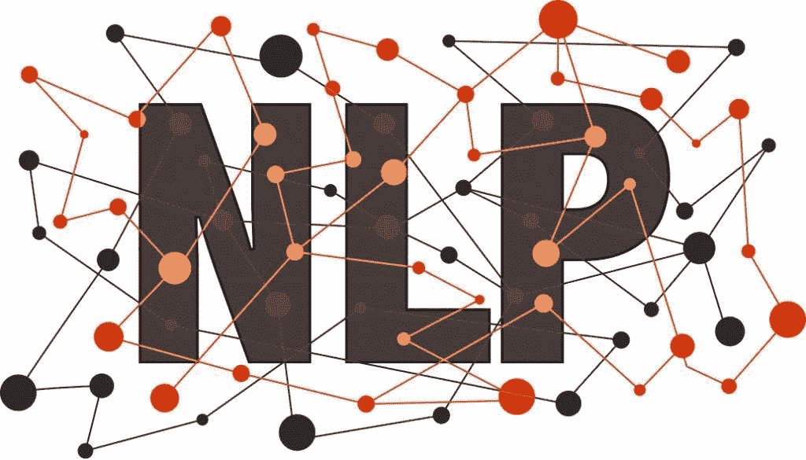
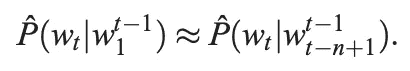
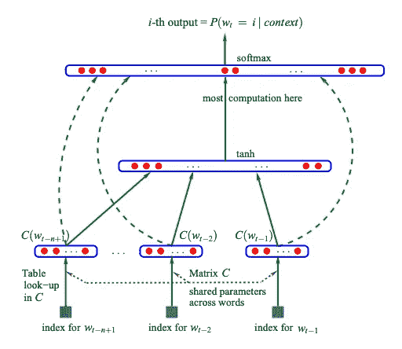

# “神经概率语言模型”中的自然语言处理

> 原文：<https://towardsdatascience.com/natural-language-processing-in-a-neural-probabilistic-language-model-a-summary-19c9cd7cf6c4?source=collection_archive---------29----------------------->

Credit: smartdatacollective.com

这是 PLN(计划):在 Bengio 等人于 2003 年提出的名为 NPL(神经概率语言)的模型中，通过概率的镜头讨论 NLP(自然语言处理)。论文发表的那一年对于一开始就考虑是很重要的，因为它是我们如何使用计算机分析人类语言的历史上的一个支点时刻。诺姆·乔姆斯基的语言学可以被看作是像机器一样使用人类大脑并系统地将语言分解成越来越小的成分的努力。他从句子开始，到单词，然后是语素，最后是音素。计算机化利用了这个强大的概念，并使它成为对人类更重要的东西:它从与个人相关开始，到团队，然后到公司，最后到政府。乔姆斯基博士真正改变了我们交流的方式，这种影响至今仍能感受到。语言学刚引入的时候很强大，今天也很强大。N-gram 分析，或者任何一种计算语言学，都来源于这位伟人，这位先行者的工作。本博客将总结本吉奥小组的工作，他们是思想领袖，高举知识的火炬，推进我们对自然语言以及计算机如何与之交互的理解。

自 2003 年以来，人工智能已经发生了巨大的变化，但本文提出的模型抓住了它为什么能够起飞的本质。自从这篇论文发表以来，机器学习和深度学习都已经成为人工智能经典的一部分，随着计算能力的不断增长，它们变得越来越重要。数据科学是多个领域的融合，今天我们将考察作为该学科基石的一个领域:概率。本文提出的概率分布模型，本质上是我们提高处理自然语言能力的主要原因。

英语，被认为是所有字母语言中单词最多的，是一个概率噩梦。甚至在最基本的句子中排列单词组合的可能性也是不可思议的。我们正面临着所谓的**维度的诅咒**。为了更具体地说明这一点，作者提供了以下内容:

> …如果想要对自然语言中 10 个连续单词的联合分布进行建模，并且词汇量 v 的大小为 100，000，则可能存在 100,000^10 1 = 10^50 1 自由参数。

在数据驱动的自然语言处理任务中，实际上存在无限的离散变量，因为英语词汇的数量以指数形式超过 100K。当试图比较被分成训练集和测试集的数据时，你怎么能期望提出一个容易概括的语言模型呢？你的数据中的这两个部分几乎肯定是非常不同的，非常不可概括的。你被模型中大量的可能性，大量的维度所诅咒。能做些什么？

本吉奥小组的创新不是通过使用神经网络，而是通过大规模使用它们。语言学及其创始人诺姆倾向于了解一个词如何与句子中的所有其他词相互作用。Bengio 等人专注于学习单词序列分布的统计模型。该研究论文首先通过不考虑给定单词如何与同一个句子中的其他单词相似，而是考虑可以填充给定单词角色的新单词来改进 NLP。其次，他们考虑了 n 元语法方法，超出了单元语法( *n* = 1)、二元语法( *n* = 2)甚至三元语法(研究人员通常使用的 *n* )直到 5 的 *n* 。

n 元模型的数学公式如下:

该公式用于为要预测的下一个单词构建条件概率表。当对 NLP 建模时，可以通过利用单词顺序，以及通过认识到单词序列中时间上更接近的单词在统计上更具依赖性，来提高对抗维数的几率。在所讨论的上下文中，这最终意味着什么？这是在解决什么问题？提出的语言模型减少了维数灾难，增加了不便。也就是说，计算和存储复杂性是以线性方式而非指数方式增长的。它通过学习每个单词的特征向量来表示相似性，并通过神经网络学习单词如何连接的概率函数，从而改进了过去的工作。让我们仔细看看所说的神经网络。

我们现在看到的是一种叫做多层感知器的东西。那些层是什么？三个输入节点构成了底部的基础，由所研究文本上下文中单词的索引提供。中间标记为 tanh 的层代表隐藏层。Tanh 是一种称为 hyberbolic tangent 的激活函数，是 s 形的，有助于减少在为正在处理的语言赋值时模型“卡住”的机会。**这是怎么回事？**在该研究团队建立的系统中，负值很大的值被赋予非常接近-1 的值，反之亦然。只有零值输入被映射到接近零的输出。最上层是输出，即 softmax 函数。它用于将我们的值范围带入概率领域(在从 0 到 1 的区间内，其中所有向量分量的总和为 1)。

也不要忽略将输入直接连接到输出的绿色虚线。该特性的可选包含在本文的结果部分中提出。它提供了一个有趣的权衡:包括输入和输出之间的直接连接导致训练时间减半(10 个时期收敛而不是 20 个)。没有它们，模型通过隐藏层中形成的更紧密的瓶颈产生更好的概括。

如果一个句子中包含的单词与之前观察到的单词相似，则该句子有可能获得高概率(即使模型之前从未遇到过它)。难就难在:诺姆·乔姆斯基和后来的语言学家受到批评，说他们发展的系统太脆弱了。这种方法为一种新的学习——深度学习——奠定了基础。当与向量语义结合使用时，这确实是强大的东西。通过这篇论文，Bengio 团队打开了通往未来的大门，并帮助开创了一个新时代。一个 AI 的时代。

**作品引用:**

[一个神经概率语言模型](http://www.jmlr.org/papers/volume3/bengio03a/bengio03a.pdf)，Bengio 等人。

试图在 5 篇论文中描述 NLP 的历史:第二部分。

[https://theclevermachine.wordpress.com/tag/tanh-function/](https://theclevermachine.wordpress.com/tag/tanh-function/)