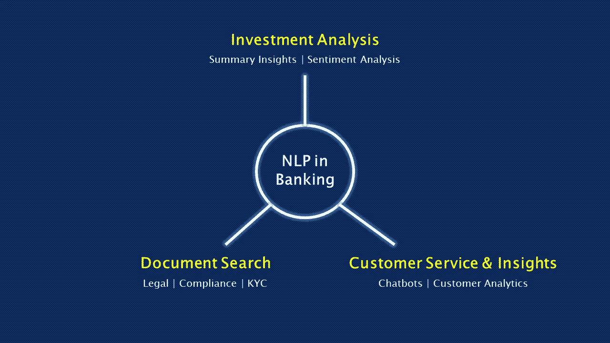

# 银行业务中的自然语言处理:当前应用

> 原文：<https://towardsdatascience.com/natural-language-processing-in-banking-current-uses-7fbbaee837de?source=collection_archive---------6----------------------->

## 银行应用自然语言处理的三个领域

Photo by [Jordan](https://unsplash.com/@suspected?utm_source=unsplash&utm_medium=referral&utm_content=creditCopyText) on [Unsplash](https://unsplash.com/s/photos/bank?utm_source=unsplash&utm_medium=referral&utm_content=creditCopyText)

银行正在使用一种称为自然语言处理(NLP)的人工智能分支来自动化某些文档处理、分析和客户服务活动。三种应用包括:

*   **智能文档搜索**:在大量扫描文档中查找相关信息。
*   **投资分析**:自动化收益报告和新闻的常规分析，以便分析师可以专注于阿尔法世代。
*   **客服&洞察**:部署聊天机器人回答客户查询，了解客户需求。

我们将讲述银行在这些领域所做工作的真实例子。首先，让我们回顾一下自然语言处理的能力。

# 自然语言处理导论

**自然语言处理(NLP)** 是人工智能的一个分支，使计算机能够理解人类的语言，并做出类似的反应。这包括训练计算机处理文本和语音，并在上下文中解释单词、句子和段落的含义。

## 人机交互

人机“对话”可以分解如下(我们稍后会谈到具体的人工智能方法):

1.  我们提供文本或语音输入(例如，键入聊天机器人界面或与智能扬声器交谈)。
2.  计算机将文本/语音转换成它能理解的格式(例如，将语音转换成文本，将单词转换成矢量)。这有助于计算机对不同的单词进行聚类和分类。
3.  计算机使用自己的数据集计算出意思和上下文。
4.  计算机确定一个适当的反应，并将其转换成我们理解的文本或语音，并对我们做出反应。

我们每天都与使用自然语言处理的应用程序进行交互:

*   谷歌翻译:我们输入文本和语音，谷歌为我们翻译。
*   **Gmail 智能撰写**:你可能会注意到 Gmail 会提示你已经开始输入的句子的剩余部分。此功能[使用](https://www.theregister.co.uk/2018/05/19/ai_roundup_may18/)电子邮件主题和以前的电子邮件来建议相关文本。有点吓人，但也有点酷。
*   语法上:你使用的流行的语法检查工具，因为它比微软 Word 的拼写检查好得多。
*   **智能音箱**:不，你和 Alexa 的对话并不神奇(抱歉)。

## 理解、处理和生成语言

自然语言处理实际上是一个包含两种相关方法的总称:**自然语言理解**和**自然语言生成**。

自然语言理解(NLU)指出文本和语音背后的含义。把这个当成阅读或者听力。这包括从人类那里获取非结构化的文本和语音输入，并将其转换为计算机可以理解的结构化格式。例如，当你向 Alexa 请求天气预报时，它会使用自然语言理解来判断你在说什么。

自然语言生成(NLG)是指计算机生成的文本和语音。NLG 将结构化数据转化为人类能够理解的文本和语音。继续我们之前的例子，Alexa 在回应“今天天气晴朗”时使用自然语言生成。你想订购太阳镜吗？

## 用于自然语言处理的人工智能方法

自然语言处理经常与其他人工智能方法一起使用，如**神经网络**、**深度学习**和**光学字符识别**。两个流行的自然语言模型是 **Word2vec** 和**单词包。**

在没有获得技术的情况下，神经网络是机器学习的子集。当用于自然语言处理时，它们可以处理文本，对单词进行分类，对相似的单词进行聚类，并将单词和短语与含义相关联。也使用深度学习方法(即多层神经网络)，如[递归神经网络](/understanding-neural-networks-from-neuron-to-rnn-cnn-and-deep-learning-cd88e90e0a90)。

光学字符识别(OCR)使计算机能够识别扫描文档中的文本。OCR 可以与自然语言处理一起使用，以分析扫描的文档或手写文本。

各种自然语言技术[用于确定语法规则和词义。**语法分析**涉及确定单词的语法规则，并根据相似度对其进行聚类。**语义分析**涉及推导意义，用于生成人类语言。语义分析很有挑战性，因为人类语言规则很复杂。单词和短语在不同的上下文中有不同的含义。俗语、习语和讽刺使事情更加复杂。](/whatnlpscientistsdo-905aa987c5c0)

**单词袋**和[相关算法](https://pathmind.com/wiki/bagofwords-tf-idf)是流行的自然语言技术，通过类别或类型对短语和文档进行分类。单词包简单地统计每个单词在文档中出现的频率(计数)。该算法然后比较文档并确定每个文档的主题。这可以用来训练神经网络。Gmail 的 Smart Compose(前面提到过)使用了谷歌的[单词包和递归神经网络模型](https://ai.googleblog.com/2018/05/smart-compose-using-neural-networks-to.html)。搜索引擎也使用这些技术。

**Word2vec** 是另一种流行的自然语言模型。它是一个[两层神经网络](https://pathmind.com/wiki/word2vec)对文本进行分类以确定含义。它将单词转换成计算机可以理解的数学“向量”。矢量转换是必需的，因为神经网络更好地处理数字输入。

给定足够大的数据集，代表相似单词的向量被分组在一起——相似单词被数学地检测。如果部署得当，Word2vec 可以根据过去的外观高精度地推断单词含义。这对于文档搜索、情感分析，甚至建议接下来应该用哪些词来完成一个句子都很有用。

# 银行如何使用自然语言处理

Image by Author

银行可以对大量文本和语音数据应用自然语言处理，以提取信息、获得洞察力并简化手动任务。虽然节省时间和成本是显而易见的好处，但识别关键信息的能力(众所周知的大海捞针)可以成为一个有竞争力的差异制造者。

以下是银行应用自然语言处理的三个领域。

## 智能文档搜索

摩根大通的 [COIN](https://emerj.com/ai-sector-overviews/natural-language-processing-banking-current-applications/) (合同智能)软件使用自然语言处理来帮助银行的法律团队搜索和审查大量的法律文件。

据报道，COIN 每年可以为银行的法律团队节省 360，000 小时或 15，000 天的文档搜索任务。例如，它可以提取关键数据和条款来帮助信贷员审查商业贷款协议。

COIN 显然受过训练，能够识别银行法律团队标记为重要的文档中的关键信息(属性)。这使得软件能够从结构不同的文档中提取关键信息。该银行声称，它在几秒钟内从 12，000 份商业信贷协议中提取了 150 个相关属性。

该软件的工作是不公开的，因为是内部使用。我们可以推测，它可以由自然语言处理(在文档中搜索)、光学字符识别(识别扫描文档中的字符)和机器学习(对文档中的数据进行分类和聚类，并随着时间的推移改进搜索算法)来驱动。

这些方法可以应用于其他银行活动。它可以帮助银行提取他们没有时间跟踪的客户数据类型。这些数据有助于预测客户需求和识别交叉销售机会。它还可以加快需要文档分析的“了解您的客户”( KYC)流程，从而使客户的加入更加容易。

## 投资分析

银行的证券研究部门正在使用自然语言处理在堆积如山的公司报告和电话会议中寻找有价值的见解。

银行以前雇佣大量分析师来梳理收益报告和其他文件，并将相关数据输入数据库和估值模型。

现在，银行正在使用自然语言处理工具，一次“阅读”数百份文件，并为人类分析师总结关键信息。语音分析工具可以“倾听”分析师电话会议，以确定公司管理层讲话背后的语气和情绪，这可以为股票分析提供洞察力。这些工具节省了大量的时间，并允许分析师专注于 alpha 生成。

银行也使用自然语言处理进行情绪分析。这些工具分析大量新闻和社交媒体帖子，以提取关键见解，确定公司的观感，或跟踪市场对重大事件的反应。这些及时的见解可以为分析师的建议提供信息。

银行要么使用内部开发的工具，要么使用供应商开发的工具。一家供应商 Dataminr 声称可以分析社交媒体和金融新闻，以识别相关信息，包括意想不到的新闻、新兴趋势或风险。

 [## 实时事件和风险检测

### Dataminr 的客户最先知道关键事件和突发信息，使他们能够更快地采取行动…

www.dataminr.com](https://www.dataminr.com/) 

例如，在卖方，自然语言生成工具会根据收益报告和新闻自动生成报告。

## 客户服务和见解

各大银行正在通过聊天机器人引入某种程度的**客户服务**自动化。2019 年初，美国银行推出了移动虚拟助理 [Erica](https://promo.bankofamerica.com/erica/) ，通过美国银行的移动应用程序，很快积累了超过[百万用户](https://netfinance.wbresearch.com/bank-of-america-ai-powered-chatbot-strategy-ty-u)。

Erica 接受语音和文本命令，并将预测分析与自然语言处理相结合，以帮助客户:

*   检查余额并转账
*   按需搜索过去的交易和账户信息
*   跟踪消费习惯*(可能使用预测分析，这是一种鼓励更多使用聊天机器人的增值)*
*   帮助客户管理经常性付款或逾期付款

聊天机器人让客户可以在手机上访问账户信息和进行基本交易，而不是使用网上银行或访问当地分行。通过干净的聊天机器人界面执行交易也可能花费更少的时间。

对银行来说，一个更大的胜利将是使用自然语言处理进行**客户洞察。**使用上述智能文档搜索和情感分析相关方法，银行可以更好地了解和预测客户需求和痛点。情绪分析工具可以监控社交媒体，了解人们对这家银行的看法。文档搜索工具可以分析反馈表和客户信息，以应对问题，提供定制产品，并增加客户保留率。

# 银行高管的关键要点

银行业领导人意识到，自然语言处理可以实现日常文档分析、研究和客户服务的自动化。

节约成本只是冰山一角。通过更快地分析文本和语音数据，并提取更多关于客户和市场的可行见解，银行可以更好地为客户服务，并做出更好的投资。更大的市场份额和收入的潜力是真正的差异制造者。

虽然我们没有涵盖所有可能的用例，但银行可以将自然语言技术应用于任何处理大量文本或语音数据的功能。例如，在合规、风险管理或订单执行方面有许多应用。

关键考虑因素包括是否在内部构建人工智能和自然语言处理工具，或者从人工智能供应商那里获得软件许可。内部建设需要数据科学家、开发人员和有组织的人工智能战略。虽然这需要时间，但内部开发的解决方案可能比供应商产品更能满足银行的需求。此外，还必须解决跨部门的数据质量和可用性问题。

鉴于自然语言处理可以应用于广泛的银行活动，跨部门应用这些解决方案的银行可能会看到更大的投资回报。