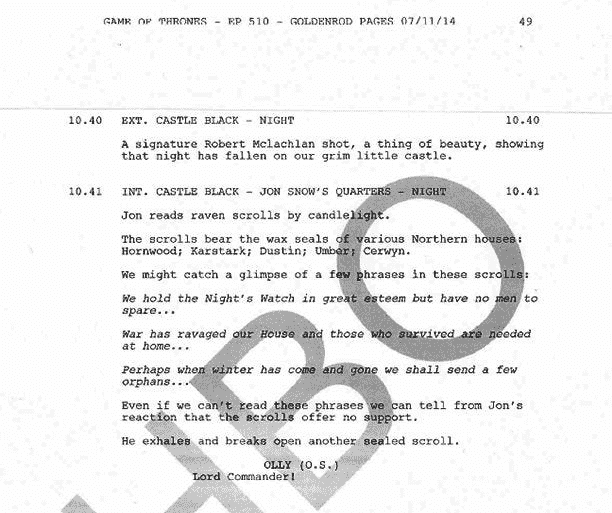
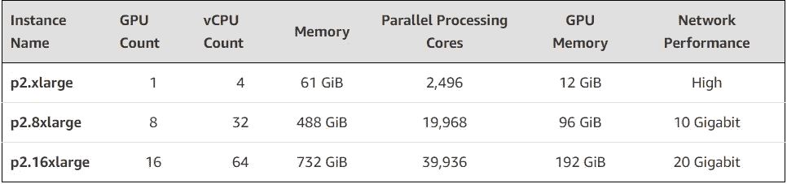
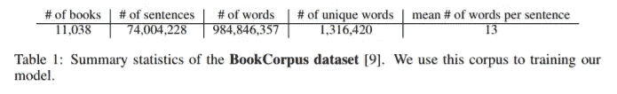

# 自然语言处理:概述《权力的游戏》的剧本

> 原文：<https://towardsdatascience.com/natural-language-processing-summarizing-the-script-of-game-of-thrones-part-ii-7054839b973a?source=collection_archive---------24----------------------->

> 这篇文章将使用“现成的”数据科学工具，使用 [Trifacta](https://www.trifacta.com/) 、数据争论软件和 [SkipThoughts](https://github.com/ryankiros/skip-thoughts) 来更好地理解《权力的游戏》。



GOT Script

这篇文章的灵感来自于下面这篇文章中提供的代码: [**使用句子嵌入的无监督文本摘要**](https://medium.com/jatana/unsupervised-text-summarization-using-sentence-embeddings-adb15ce83db1) **。本帖包含完整的代码和对实现的详细解释。**

然而，这篇文章是在几封短邮件上实现的，所以我对这些技术如何有效地应用于更长更复杂的文本很感兴趣。

包含第七季剧集的剧本可以在 Kaggle 上的[这里](https://www.kaggle.com/gunnvant/game-of-thrones-srt)找到。

仅供参考，一个 Amazon EC2 p2.xlarge 实例断断续续使用了大约一周，粗略估计成本不超过 15 美元。我在使用较小的实例时遇到了超时问题。使用 p2.xlarge，执行在这里找到的笔记本需要大约半个小时。



计算时间不包括为模型定型所花费的计算时间。该模型在 **BookCorpus 数据集**上进行训练，该数据集包含来自 16 种不同流派的超过 11，000 本书籍。



SkipThoughts 论文陈述了具有 2400 尺寸的**单跳、**单向**编码器**和包含具有 1200 尺寸的前向和后向编码器的**双跳、**双向**编码器**模型总共花费了四周的时间进行训练。(E[n 编码器型号](https://github.com/ryankiros/skip-thoughts) s)

**bi-skip** 型号包含两个具有不同参数的编码器:一个编码器以正确的顺序给出句子，而另一个编码器以相反的顺序给出句子。然后将输出连接起来形成一个 2400 维的向量。

即使使用扩展的 **BookCorpus** 仍然有可能没有包括一些单词，为了解决这个问题，使用了 [word2Vec](https://en.wikipedia.org/wiki/Word2vec) 嵌入，并将其映射到包含在 BookCorpus 词汇表中的单词。

如前所述，可以在上面提到的帖子中找到总结文本所需的 NLP 管道的更好、更全面的解释。但是，该逻辑的高级描述如下:

1.  **将文本分词成句子**
2.  **将每个句子编码成一个向量，(创建每个句子的数字表示)**
3.  **聚类得到的句子嵌入；每个簇代表一个主题句。然后，概要由每个聚类的一个主题句组成，并且每个主题句代表来自原始文本内的所有最相似的句子嵌入。**

第一季的每一集都在这个[笔记本](https://github.com/dkyol/NLP_Notebook/blob/master/GOT_Text_Summary.ipynb)里有总结，下面包括的一个总结是关于 is **第一季第一集**原文的 **10%** :

```
This stitch is very... - It's beautiful. I saw the white walkers. Get back on your horse. A man of his... stature? Go on. - Quick, Bran! What is it? Viserys of House Targaryen, the third of his name, the rightful King of the Andals and the First Men, and his sister, Daenerys of House Targaryen. Would you please shut up? It won't be long now. They murdered the last Hand. ...King of the Andals and the First Men... - Father will know if you do. he showed me What was what. No, Your Grace. - Oh. Hey, Hey, Hey, hey. Ned. Who have we here? - No? Go on, Tommy, shear him good. Your Grace. The Dothraki are not known for their punctuality. It's a direwolf. I'm a Northman. Winter is coming. You should be the Hand of the King. Lord Eddard Stark... Now you want Ned to take the job? Of course, they will behead you as a deserter. And I know I'm a deserter. I hear he's more than earned it. - And you never worry about anything. Soon? Where's the Imp? I want to pay my respects. Why is your mother so dead set on us getting pretty for the king? Arya! Thank you for saying yes. - Your Grace. Uncle Benjen. Did I offend you? - Thank you. A different time. I know what I'm putting you through. - Don't get up. It's Maester Luwin, my lord. The king rode for a month to ask for Lord Stark's help. Lady Stark thought it might insult the royal family to seat a bastard in their midst. I take you for a king. I don't know how to say "thank you" in Dothraki. Is this your first time in the North, Your Grace? Jadi, zhey Jorah andahli! No. She always does it and it's not funny! Thank you, ser. - He saw us.
```

这段文字也来自第一季第一集第 17 集，然而这段摘要只代表了原文的 30%。这种方法在一个方面稍加修改。在开始编码步骤之前，整个段落被分成 4 个相等的部分(桶),并且每个桶被单独处理。每个部分产生的主题句加在一起。这个微小的修改使得 simplify 试图对结果摘要的顺序有更多的控制。

***第一集更长的摘要如下…***

```
'They won't trouble us no more.You don't think he'll ask us how they died?Get back on your horse.Whatever did it to them could do it to us.They even killed the children.It's a good thing we're not children.You want to run away south, run away.Of course, they will behead you as a deserter.If I don't catch you first.Get back on your horse.I won't say it again.Your dead men seem to have moved camp.They were here.See where they went.What is it?It's...Go on, Father's watching.And your mother.Fine work, as always. They won't last without their mother.- Right. "Our way is the old way"?The man who passes the sentence should swing the sword.Is it true he saw the white walkers?The white walkers have been gone for thousands of years.So he was lying?A madman sees what he sees.What is it?Mountain lion?There are no mountain lions in these woods.It's a freak.It's a direwolf.Tough old beast.There are no direwolves south of the Wall.Now there are five.You want to hold it?Where will they go?Their mother's dead.They don't belong down here.Better a quick death. "What if Jon Arryn told someone? - we should head back to the Wall.Do the dead frighten you?Our orders were to track the wildlings.We tracked them.'   'Our way is the old way"?The man who passes the sentence should swing the sword.Is it true he saw the white walkers?The white walkers have been gone for thousands of years.So he was lying?A madman sees what he sees.What is it?Mountain lion?There are no mountain lions in these woods.It's a freak.It's a direwolf.Tough old beast.There are no direwolves south of the Wall.Now there are five.You want to hold it?Where will they go?Their mother's dead.They don't belong down here.Better a quick death. - But who would he tell?My husband.If he told the king, both our heads would be skewered on the city gates by now.Whatever Jon Arryn knew or didn't know, it died with him.And Robert will choose a new Hand of the King,someone to do his job while he's off fucking boars and hunting whores.Or is it the other way around?And life will go on.You should be the Hand of the King.That's an honour I can do without.Their days are too long,their lives are too short.All these years,and I still feel like an outsider when I come here.You have five northern children.You're not an outsider.I wonder if the old gods agree.It's your gods with all the rules.I am so sorry, my love.- Tell me. They won't last without their mother.- Right. - There was a raven from King's Landing.Jon Arryn is dead.A fever took him.I know he was like a father to you.- Your sister, the boy? - They both have their health,gods be good.The raven brought more news.The king rides for Winterfell...' 'Our way is the old way"?The man who passes the sentence should swing the sword.Is it true he saw the white walkers?The white walkers have been gone for thousands of years.So he was lying?A madman sees what he sees.What is it?Mountain lion?There are no mountain lions in these woods.It's a freak.It's a direwolf.Tough old beast.There are no direwolves south of the Wall.Now there are five.You want to hold it?Where will they go?Their mother's dead.They don't belong down here.Better a quick death. I won't say it again.Your dead men seem to have moved camp.They were here.See where they went.What is it?It's...Go on, Father's watching.And your mother.Fine work, as always. - But who would he tell?My husband.If he told the king, both our heads would be skewered on the city gates by now.Whatever Jon Arryn knew or didn't know, it died with him.And Robert will choose a new Hand of the King,someone to do his job while he's off fucking boars and hunting whores.Or is it the other way around?And life will go on.You should be the Hand of the King.That's an honour I can do without.Their days are too long,their lives are too short.All these years,and I still feel like an outsider when I come here.You have five northern children.You're not an outsider.I wonder if the old gods agree.It's your gods with all the rules.I am so sorry, my love.- Tell me. They won't last without their mother.- Right. "What if Jon Arryn told someone?' 'Our way is the old way"?The man who passes the sentence should swing the sword.Is it true he saw the white walkers?The white walkers have been gone for thousands of years.So he was lying?A madman sees what he sees.What is it?Mountain lion?There are no mountain lions in these woods.It's a freak.It's a direwolf.Tough old beast.There are no direwolves south of the Wall.Now there are five.You want to hold it?Where will they go?Their mother's dead.They don't belong down here.Better a quick death. - No!Put away your blade.- I take orders from your father, not you. He's got hundreds of people. - But who would he tell?My husband.If he told the king, both our heads would be skewered on the city gates by now.Whatever Jon Arryn knew or didn't know, it died with him.And Robert will choose a new Hand of the King,someone to do his job while he's off fucking boars and hunting whores.Or is it the other way around?And life will go on.You should be the Hand of the King.That's an honour I can do without.Their days are too long,their lives are too short.All these years,and I still feel like an outsider when I come here.You have five northern children.You're not an outsider.I wonder if the old gods agree.It's your gods with all the rules.I am so sorry, my love.- Tell me. - I'm told he drinks all night.How much could he possibly drink?'
```

此外，第一季每一集的摘要都可以在这个[笔记本](https://github.com/dkyol/NLP_Notebook/blob/master/GOT_Text_Summary.ipynb)中找到。

**参考文献:**

[SkipThoughts 论文](https://arxiv.org/pdf/1506.06726.pdf)

[SkipThoughts Github](https://github.com/ryankiros/skip-thoughts)

```
**@article{zhu2015aligning,
    title={Aligning Books and Movies: Towards Story-like Visual Explanations by Watching Movies and Reading Books},
    author={Zhu, Yukun and Kiros, Ryan and Zemel, Richard and Salakhutdinov, Ruslan and Urtasun, Raquel and Torralba, Antonio and Fidler, Sanja}, journal={arXiv preprint arXiv:1506.06724}, year {2015}
}**
```