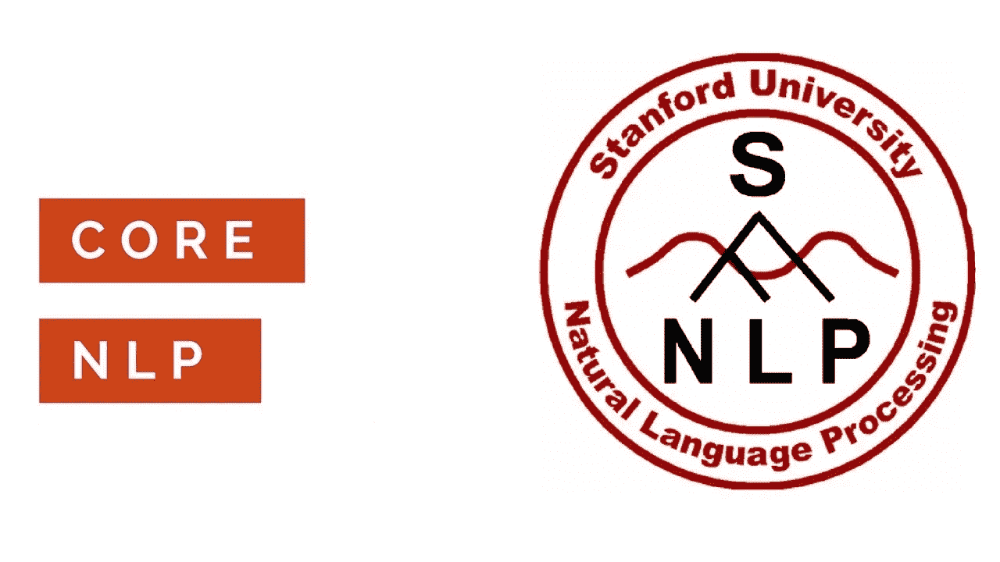
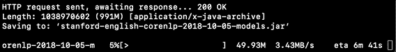
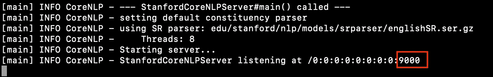
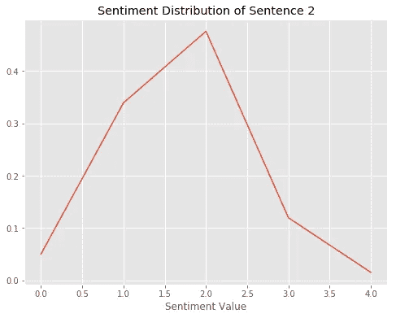

# 使用斯坦福 CoreNLP 的自然语言处理

> 原文：<https://towardsdatascience.com/natural-language-processing-using-stanfords-corenlp-d9e64c1e1024?source=collection_archive---------7----------------------->

## 只用两行代码分析文本数据



# 介绍

使用斯坦福的 CoreNLP 分析文本数据使文本数据分析变得简单高效。只需几行代码，CoreNLP 就可以提取所有类型的文本属性，比如命名实体识别或词性标注。CoreNLP 是用 Java 编写的，需要在您的设备上安装 Java，但它为几种流行的编程语言提供了编程接口，包括 Python，我将在本演示中使用 Python。此外，它还支持英语以外的四种语言:阿拉伯语、中文、德语、法语和西班牙语。

# 一、如何安装 CoreNLP

首先，我们要下载 CoreNLP。如果您使用的是 MacBook，请打开终端，输入以下代码行，然后按回车键:

```
**wget** https://nlp.stanford.edu/software/stanford-corenlp-full-2018-10-05.zip https://nlp.stanford.edu/software/stanford-english-corenlp-2018-10-05-models.jar
```

这将开始下载 CoreNLP 的最新版本(截至 2019 年 2 月为 3.9.2)。您应该会在屏幕上看到类似这样的内容:



下载 CoreNLP 需要一段时间，取决于您的互联网连接。下载完成后，剩下的工作就是用以下命令解压文件:

```
**unzip** stanford-corenlp-full-2018-10-05.zip
**mv** stanford-english-corenlp-2018-10-05-models.jar stanford-corenlp-full-2018-10-05
```

命令 **mv A B** 将文件 A 移动到文件夹 B，或者将文件名从 A 改为 B

# 二。启动服务器并安装 Python API

为了能够使用 CoreNLP，您必须启动服务器。这样做非常简单，因为您所要做的就是移动到步骤 1 中创建的文件夹中，并使用 Java 运行 CoreNLP。让我们看看为此需要的命令:

```
**cd** stanford-corenlp-full-2018-10-05
**java -mx6g** -cp "*" edu.stanford.nlp.pipeline.StanfordCoreNLPServer **-timeout 5000**
```

**cd** 命令打开我们创建的文件夹。然后，为了运行服务器，我们使用 Java。参数`**-mx6g**` 指定 CoreNLP 允许使用的内存量。在这种情况下，它是 6gb。`**-timeout 5000**` 参数以毫秒为单位指定超时时间。

现在，您应该看到类似这样的内容:



在 Python 中使用 CoreNLP 时，我所强调的数字将非常重要。

在开始分析文本之前，最后需要安装一个 Python API:

```
**pip install** pycorenlp
```

我将使用 py-corenlp，但是还有其他 Python 包，您可以在这里查看。如果您碰巧是 NLTK 的狂热用户，也有一个 NLTK API 可以让您使用 CoreNLP。完整的说明可以在[这里](https://github.com/nltk/nltk/wiki/Stanford-CoreNLP-API-in-NLTK)找到。

# 三。带核心语言的语言

安装完 CoreNLP 后，我们终于可以开始分析 Python 中的文本数据了。首先，让我们导入 py-corenlp 并初始化 corenlp。这就是我上面强调的数字发挥作用的地方:

```
**from** pycorenlp **import** StanfordCoreNLPnlp = StanfordCoreNLP('[http://localhost:**9000**'](http://localhost:9000'))
```

NLTK 中的语法非常相似:

```
**from** nltk.parse **import** CoreNLPParser

result = CoreNLPParser(url='http://localhost:**9000**')
```

本演示的其余部分将集中在 py-corenlp 上，但是正如上面指出的，您也可以使用 NLTK。这两者之间的主要区别是，在 py-corenlp 中，输出一个原始的 JSON 文件，然后您可以用它来提取您特别感兴趣的内容，而 NLTK 为您提供了这样做的函数。

使用 py-corenlp 执行 NLP 所需的唯一其他函数是`**nlp.annotate()**` 。在函数内部，可以指定 CoreNLP 应该执行什么样的分析。在这个演示中，我将看看四个不同的句子，它们有着不同的情感。所有这些都可以在一行代码中完成，但是出于可读性的考虑，最好将其扩展到几行。

```
text = "This movie was actually neither that funny, nor super witty. The movie was meh. I liked watching that movie. If I had a choice, I would not watch that movie again."result = nlp.annotate(text,
                   properties={
                       'annotators': 'sentiment, ner, pos',
                       'outputFormat': 'json',
                       'timeout': 1000,
                   })
```

**注释器**参数指定 CoreNLP 将要做什么样的分析。在这种情况下，我已经指定让 CoreNLP 进行情感分析以及命名实体识别和词性标注。JSON 输出格式将允许我轻松地对结果进行索引，以便进一步分析。

## 情感分析

CoreNLP 的情感分析非常简单。运行完上面的代码块后，就不需要进一步的计算了。让我们看看上面定义的四个句子的结果:

```
for s in result["sentences"]:
    print("{}: '{}': {} (Sentiment Value) {} (Sentiment)".format(
        s["index"],
        " ".join([t["word"] for t in s["tokens"]]),
        s["sentimentValue"], s["sentiment"]))
```

运行这个 for 循环输出情感分析的结果:

```
0: 'This movie was actually neither that funny , nor super witty.': 1 (Sentiment Value) Negative (Sentiment)1: 'The movie was meh.': 2 (Sentiment Value) Neutral (Sentiment)2: 'I liked watching that movie.': 3 (Sentiment Value) Positive (Sentiment)3: 'If I had a choice , I would not watch that movie again.': 1 (Sentiment Value) Negative (Sentiment)
```

情绪值的范围从 0 到 4。零意味着这个句子非常消极，而四意味着它非常积极。如你所见，CoreNLP 做得非常好。第一句话很棘手，因为它包含了像“滑稽”或“机智”这样的积极词汇，然而，CoreNLP 正确地意识到它们被否定了。较简单的句子也能正确分类。

当试图理解这些分类时，另一个选择是看一看情绪分布，其范围也是从零到四。我们来看看第二句的情绪分布:



如您所见，分布峰值在情感值 2 附近，因此可以归类为中性。

## 词性标注

词性标注，就像情感分析一样，不需要任何额外的计算。与上面的代码块类似，检索所需信息所需要的只是一个 for 循环:

```
pos = []
for word in result["sentences"][2]["tokens"]:
    pos.append('{} ({})'.format(word["word"], word["pos"]))

" ".join(pos)
```

运行该代码将返回以下内容:

```
'I (PRP) liked (VBD) watching (VBG) that (IN) movie (NN) . (.)'
```

括号中的缩写代表 POS 标签，遵循 Penn Treebank POS 标签集，您可以在这里找到。给你一个直觉，PRP 代表人称代词，VBD 代表过去时态的动词，NN 代表名词。

## 命名实体识别

CoreNLP 的另一个可能用途是命名实体识别。为了让命名实体识别更有意义，让我们创建一个新句子:

*吉姆在美国芝加哥机场逛苹果店时给杰西卡买的耳机很棒*

同样，我们需要做的就是定义一个 for 循环:

```
pos = []
for word in result["sentences"][1]['tokens']:
    pos.append('{} ({})'.format(word['word'], word['ner']))

" ".join(pos)
```

运行上面的代码会得到以下结果:

```
'The (O) earphones (O) Jim (PERSON) bought (O) for (O) Jessica (PERSON) while (O) strolling (O) through (O) the (O) Apple (ORGANIZATION) store (O) at (O) the (O) airport (O) in (O) Chicago (CITY) , (O) USA (COUNTRY) , (O) was (O) meh (O) . (O)'
```

我们可以看到，CoreNLP 已经正确地识别出 Jim 和 Jessica 是人，Apple 是组织，芝加哥是城市，美国是国家。

在解释如何关闭服务器之前，我想指出 CoreNLP 提供了许多其他功能(词汇化、词干化、标记化等。)都可以被访问，而不必运行任何额外的计算。可以在 **的[处找到`**nlp.annotate()**` 所有参数的完整列表。](https://stanfordnlp.github.io/CoreNLP/annotators.html)**

# 四。关闭服务器&结论

如果您想关闭服务器，请导航到您之前用来启动服务器的终端窗口，然后按`**Ctrl + C**` 。

总而言之，CoreNLP 的效率是它如此方便的原因。您只需指定一次您感兴趣的分析，并避免不必要的计算，这些计算可能会在处理较大的数据集时降低您的速度。如果你想知道更多关于 CoreNLP 如何工作的细节以及有哪些选项，我推荐你阅读[文档](https://stanfordnlp.github.io/CoreNLP/index.html)。

*参考文献:*

[1] Manning、Christopher D .、Mihai Surdeanu、John Bauer、Jenny Finkel、Steven J. Bethard 和 David McClosky，[斯坦福 CoreNLP 自然语言处理工具包](http://nlp.stanford.edu/pubs/StanfordCoreNlp2014.pdf) (2014)，计算语言学协会第 52 届年会会议录:系统演示，第 55–60 页

[2] Taylor A .、Marcus M .、Santorini B .，[宾夕法尼亚树库:概述](http://citeseerx.ist.psu.edu/viewdoc/download?doi=10.1.1.9.8216&rep=rep1&type=pdf) (2003)，文本、语音和语言技术，第 20 卷