# 张量流自然语言处理

> 原文：<https://towardsdatascience.com/natural-language-processing-with-tensorflow-e0a701ef5cef?source=collection_archive---------0----------------------->

Photo by [Kelly Sikkema](https://unsplash.com/@kellysikkema?utm_source=medium&utm_medium=referral) on [Unsplash](https://unsplash.com?utm_source=medium&utm_medium=referral)

嘿大家好！在这篇文章中，我试图总结 Deeplearning.ai 在 TensorFlow 中关于[自然语言处理的课程。](https://www.coursera.org/learn/natural-language-processing-tensorflow)

**第一周**

在处理图片时，我们已经有了像素值，这些像素值就是数字。然而，在处理文本时，必须对其进行编码，以便神经网络能够轻松处理。

为了对单词进行编码，我们可以使用它们的 ASCII 值。然而，使用 ASCII 值限制了我们对句子的语义理解。

例如:-

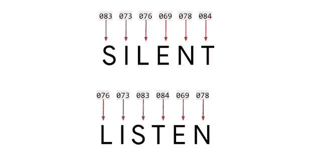

在上面两个单词中，我们有相同的字母，因此有相同的 ASCII 值，但每个单词都有完全相反的意思。因此，使用 ASCII 值从单词中提取含义是一项艰巨的任务。

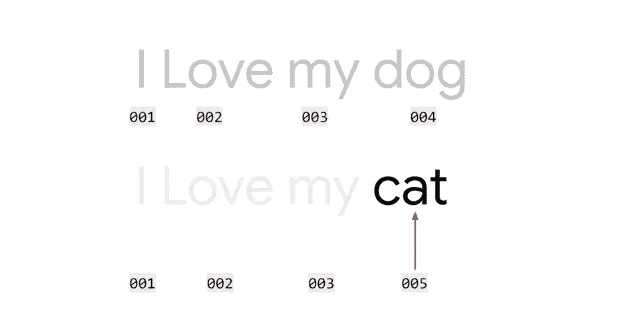

现在，我们不再用数字即 ASCII 值来标记每个字母，而是标记每个单词。在上面的句子中，我们已经标注了每个单词。唯一不同的是最后一个词。当我们只看标签时，我们观察到一种模式。

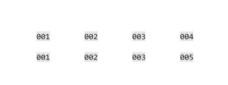

我们现在开始看到句子之间的相似之处。现在我们可以从中得出意义。从这里开始，我们可以开始训练一个能够理解句子意思的神经网络。

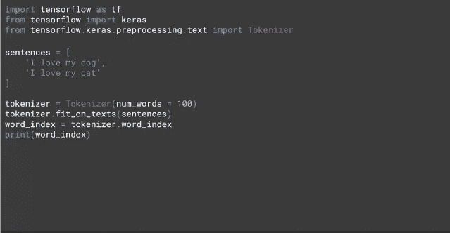

Tokenizer 将处理代码中的繁重工作。使用 tokenizer，我们可以标记每个单词，并提供句子中使用的单词的字典。我们创建了一个 tokenizer 实例，并将一个超参数 ***num_words*** 赋值为 100。这实际上是将最常见的 100 个单词进行记号化。对于上面的句子，这太大了，因为只有 5 个不同的单词。

使用 ***fit_on_texts()*** 方法对句子进行编码。

***word_index*** 方法返回一个键值对字典，其中键是句子中的单词，值是分配给它的标签。人们可以通过印刷来阅读这本词典。

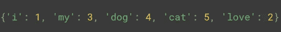

***word_index*** 返回上述键值对。注意“我”已经被“我”代替了。这就是 tokenizer 所做的；它省略了标点符号。

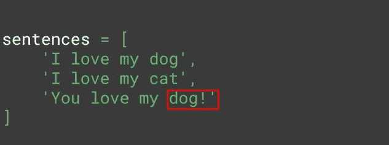

以上句子的 ***word_index*** 返回以下词典。

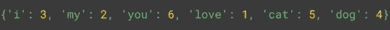

注意，那条**‘狗！’**不会因为旁边有感叹号就被当作一个单独的词。相反，作为标点符号的感叹号被去掉，只包括单词。“你”是另一个新词，被赋予了新的价值。

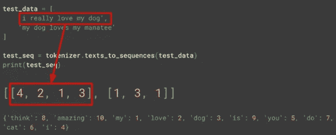

将一组句子传递给***' text _ to _ sequences()'***方法，根据传递给它的单词集将句子转换成它们的标签等价形式。

如果语料库缺少句子中存在的一个单词，则该单词在被编码为等价标签时被省略，而其余的单词被编码和打印。

例如:-在上面的 **test_data** 中，语料库中缺少了**‘真的’**这个词。因此，在编码时，省略了单词**‘真的’**，取而代之的是编码句子**‘我爱我的狗’。**

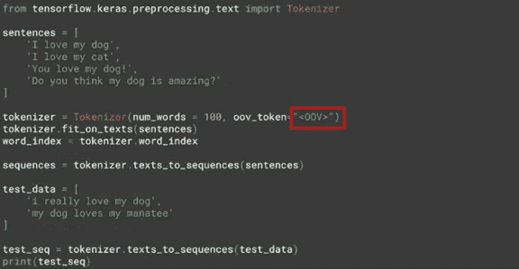

同样，对于第二个句子，单词语料库中缺少单词**‘loves’，‘manatee’**。因此，编码的句子是**‘我的狗我的’**。

为了克服上述示例中面临的问题，我们可以使用巨大的单词语料库，或者使用超参数***【oov _ token】***并将其分配给某个值，该值将用于对语料库中以前未见过的单词进行编码。***【oov _ token】***可以赋给任何东西，但是应该给它赋一个唯一的值，这样它才不会和原来的单词混淆。

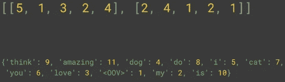

以上代码片段的输出。注意， **' < 00V > '** 现在是 ***word_index*** 的一部分。句子中不存在的任何单词被替换为 **' < 00V > '** 编码。

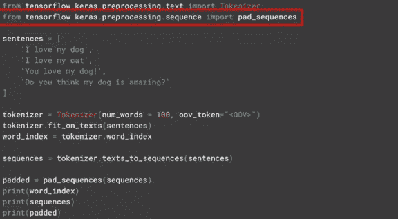

当向神经网络输入训练数据时，必须保持数据的一致性。例如，在为计算机视觉问题输入图像时，所有输入的图像都具有相似的尺寸。

类似地，在 NLP 中，当以句子的形式输入训练数据时，使用填充来提供句子的一致性。

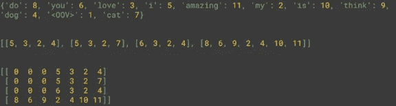

我们可以看到，在句子的开头生成了形式为**‘0’**的填充。参考最长的句子进行了填充。

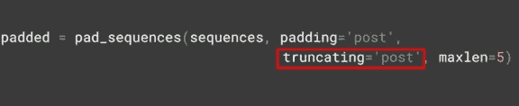

如果要在句子后进行填充，可以将超参数*设置为***【post】***。通常参考最长的句子进行填充，但是可以提供超参数 ***maxlen*** 来覆盖它并定义句子的最大长度。现在，有了 ***maxlen*** 的知识，人们可能会想，如果只取了句子的一定长度，信息是否会丢失。这是真的，但人们可以指定从哪里单词被省略。将它设置为***【post】***允许从句尾开始释放单词。*

***第二周***

***单词嵌入:**将单词和关联单词在多维空间中聚类为向量。**和*词出现在一个句子中，意思相近的词往往彼此接近。****

*Eg:- *“电影本来是* ***沉闷*** *和* ***无聊*** *。”；“这部电影是* ***好玩的*** *和* ***刺激的*** *”**

*现在想象一下，我们在一个更高维度的空间中获得一个向量，假设 16 个维度和单词一起被赋予相似的向量。久而久之，意思相近的词开始聚集在一起。单词的含义可以来自对数据集的标注。*

*所以以上面的句子为例，单词*和 ***无聊*** 在负面评论中出现了很多，因此它们有相似的情感，并且它们在一个句子中出现得很近，因此它们的向量会相似。随着神经网络的训练，它可以学习这些向量，并将它们与标签相关联，以产生所谓的嵌入，即每个单词的向量及其相关的情感。**

****相似的词在负面评论中出现很多————>相似的情绪****

****相似的单词在一个句子中彼此靠近出现— — →相似向量****

**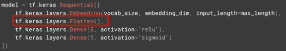**

**现在，在构建神经网络时，我们使用嵌入层，该层给出 2D 数组形状的输出，其中句子的长度作为一个维度，嵌入维度(在我们的例子中为 16 个维度)作为另一个维度。**

**因此，我们使用展平层，就像我们在计算机视觉问题中使用它一样。在基于 CNN 的问题中，像素的 2D 阵列需要被展平以将其馈送到神经网络。在基于 NLP 的问题中，需要展平嵌入的 2D 阵列。**

**型号摘要:-**

**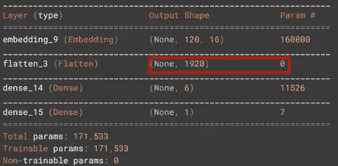**

**或者，我们可以使用***GlobalAveragePooling1D***层，其工作方式类似。**

**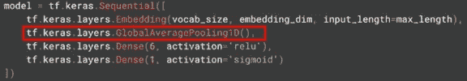**

**该模型的摘要现在看起来如下**

**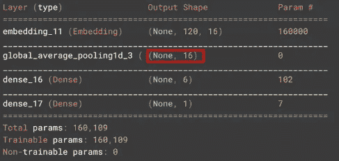**

**现在模型更简单，因此速度更快。然而，经分析发现，上述模型虽然比 ***展平*** 模型更快，但精度稍低。**

**损失函数**

**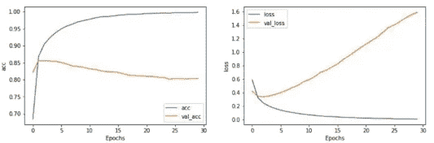**

**为了理解损失函数，我们需要根据预测的置信度来处理它。因此，尽管准确预测的数量随着时间的推移而增加，但损失的增加意味着每次预测的可信度实际上降低了。我们需要探索训练集和验证集之间的损失差异。**

**我们现在尝试调整超参数**

**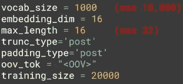**

**现在我们收到以下结果:-**

**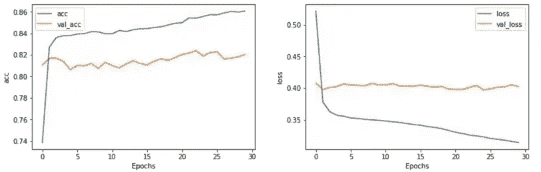**

**我们注意到损失函数变平了，这比以前的结果好，但精度不高。**

**对超参数执行另一个调整，其中嵌入向量中使用的维数被改变。**

**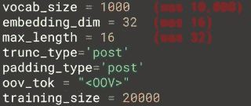****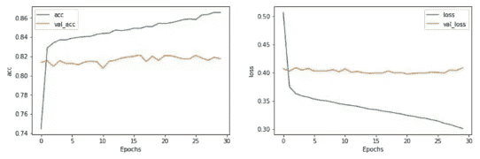**

**得到的结果与前一个没有太大的不同。**

****总结最终代码:****

**我们首先通过提供 ***词汇大小*** 和 vocab (oov) 标记中的 ***来实例化一个标记化器。*****

**接下来，我们使用***fit _ on _ texts()***方法对用于训练的句子进行分词。**

*****word_index*** 让我们可以查看单个单词被编号或标记了什么。**

*****text _ to _ sequences()***以数字格式对用于训练的整个句子进行编码。**

**接下来，我们通过指定 ***来填充序列，填充什么，填充是在句子之前还是之后，以及被填充句子的最大长度。*****

**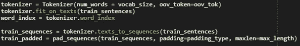**

**类似于编码训练句子，我们编码验证句子并填充它们。**

**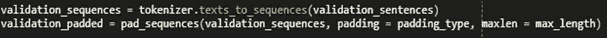**

**现在我们创建一个名为***label _ tokenizer***的单独的标记器来标记标签，并将其安装在标签上进行编码。**

**现在，我们为训练标签和验证标签创建一个 numpy 编码标签数组。**

**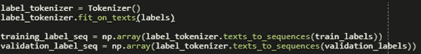**

**该模型被创建并被训练 30 个时期。**

**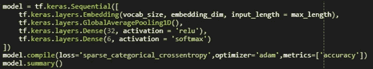****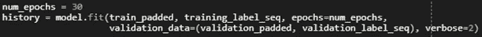**

**使用下面的代码，可以绘制训练集和验证集的准确性和损失。**

**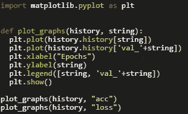**

**我们使用一个帮助函数来反转包含编码单词的字典，该函数有助于我们绘制嵌入。**

**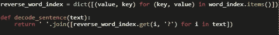****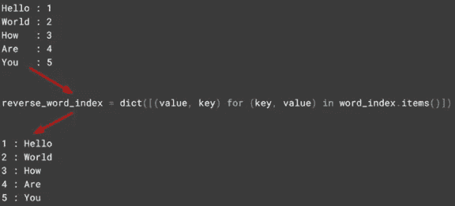**

**我们创建矢量和元文件，并存储元数据和矢量嵌入。**

**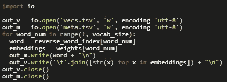**

**我们可以在下面提到的链接中上传矢量化和元数据文件，并通过绘制在更高维度的空间中查看单词嵌入。**

** [## 嵌入式投影仪-高维数据的可视化

### 可视化高维数据。

projector.tensorflow.org](http://projector.tensorflow.org/) 

**第三周**

在前几周，我们试图实现一个分类器，试图根据文本对句子进行分类。我们试图通过标记单词来做到这一点，并注意到我们的分类器未能获得任何有意义的结果。原因是当单词被分解成子单词时，很难理解单词的上下文。理解子词出现的顺序对于理解它们的意思是必要的。

例如:-

下图是斐波纳契数列的序列。

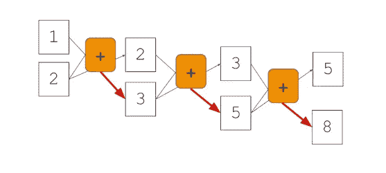

上述序列以循环方式工作，即

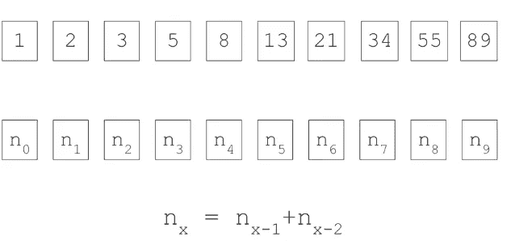

通过分析这种循环，我们可以确定数字的顺序。没有明确提到这个顺序。提供数据及其标签，并通过神经网络导出序列。

斐波纳契数列的递归函数可以用上图表示，其中 **Xt** 是数列的初始数字。该函数然后输出 **yt，**，即前两个数的和。总和值被带入下一次迭代，在那里它被加到第二个数字上并输出另一个值。序列继续。

展开后，上面的递归函数看起来像这样

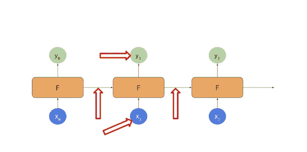

**X0 - > 1，2；f->(1+2)；y0 - > 3**

**X1 - > 2，3；f->(2+3)；y1 - > 5**

**X2 - > 3、5；f->(3+5)；y2 - > 8**

我们观察到， ***电流输出高度依赖于紧接的前一步，并且如果序列特别大，则最不依赖于初始步骤*** ，即 **y2** 高度依赖于前一步( **X1，F，y1** )并且较少依赖于( **X** 0， **F，y0** )。类似地， **y1** 高度依赖于前一个步骤( **X** 0， **F，y0** )，如果它存在于序列中，那么它对初始步骤的依赖性会小一些。

这形成了递归神经网络(RNN)的基础。

这给文本分类带来了新的挑战。

假设在下面的例子中，我们需要预测 blue 后面的单词。

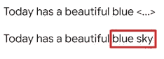

当看这个句子时，我们可以预测，当在上下文中谈论一个美丽的蓝色东西时，我们很可能指的是“天空”。

在这种情况下，帮助我们预测下一个单词的上下文单词与我们感兴趣的单词非常接近，即单词“blue”与我们感兴趣的单词“sky”相邻。

然而，我们也可能遇到预测*感兴趣单词*所需的*上下文单词*可能出现在句子开头的情况。在这里，RNN 的概念可能会失败，因为它试图通过考虑紧接在它前面的单词来预测感兴趣的单词。

例如:

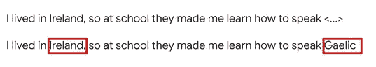

在上面的句子中，我们可以观察到上下文单词“Ireland”在句子中出现得更早，而感兴趣的单词“Gaelic”出现得更晚。RNN 人最有可能通过考虑紧接在单词“盖尔语”之前的单词，即“说话”、“说话”、“如何”，来预测单词“盖尔语”；但这些单词都不会有助于“盖尔语”这个词的预测。

在这种情况下，我们需要修改 RNN。

LSTM(长短期记忆)

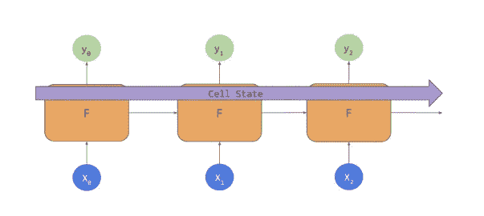

在这些类型的网络中，除了像在 RNN 中那样传递上下文之外，LSTM 还具有通过网络的称为 ***信元状态*** 的附加上下文管道。这有助于保持上下文与前面的令牌或后面的步骤相关，以克服上面示例中刚刚讨论的挑战

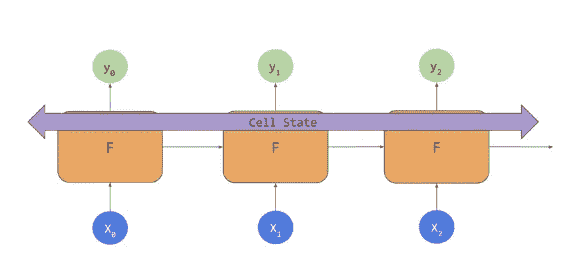

***单元状态*** 可以是双向的，以便句子中后面出现的标记可以影响前面的标记。

**在代码**中实现 LSTMs

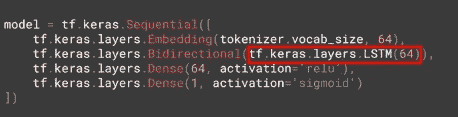

LSTM 层是使用上面的代码实现的。传递的参数是该层所需的输出数量。在这种情况下是 **64** 。

我们以双向格式包装 LSTM 层，它将使 ***单元格状态*** 向两个方向移动。

因此，模型摘要如下所示。

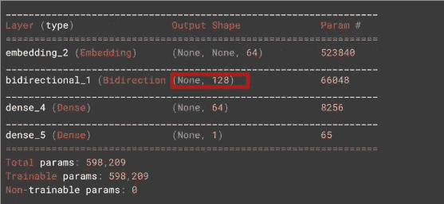

请注意，双向层的输出形状是 **128** ，尽管我们已经将 **64** 作为参数传递。这是由于双向层有效地使 LSTM 层的输出加倍。

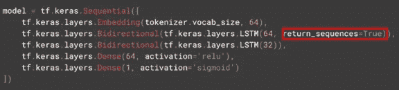

我们也可以堆叠 LSTM 层，但是我们需要确保***return _ sequences = True***存在。这使我们能够将当前 LSTM 图层的输出与下一个 LSTM 图层的输出进行匹配。

该模型的总结如下:

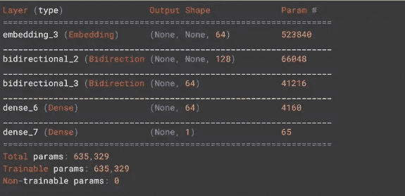

**比较准确度和损耗**

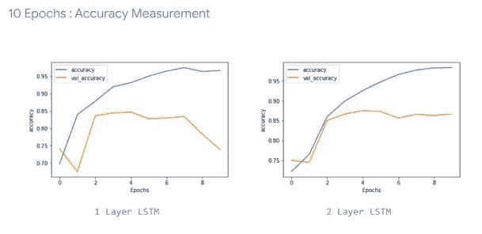

我们注意到 1 层 LSTM 网络的训练精度似乎不均匀，而 2 层 LSTM 网络的训练精度平滑得多。这种不均匀性的出现通常表明模型需要改进。

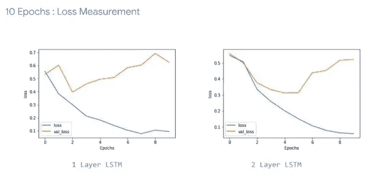

在绘制损失函数时，我们注意到类似的结果。1 层 LSTM 网络似乎具有锯齿状的表面，而 2 层 LSTM 网络具有平滑的表面。

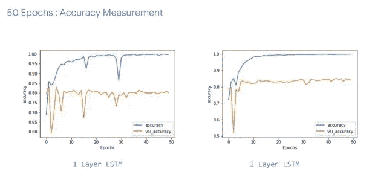

当我们训练 50 个时代的网络时，我们注意到 1 层 LSTM 容易出现一些非常急剧的下降。即使最终的精度是好的，这些下降的存在使我们对模型产生怀疑。相比之下，2 层 LSTM 具有平滑的曲线，并且实现了类似的结果，但是因为它是平滑的，所以该模型更加可靠。

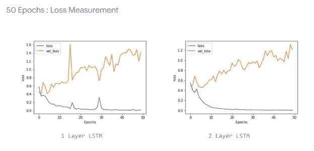

在绘制损失函数时，可以观察到类似的趋势。2 层 LSTM 网络的曲线看起来比 1 层 LSTM 网络平滑得多。两条曲线中的损耗都逐渐增加，并且需要密切监控，以检查其是否如所期望的那样在以后的时期变平。

**比较非 lstm 和 lstm**

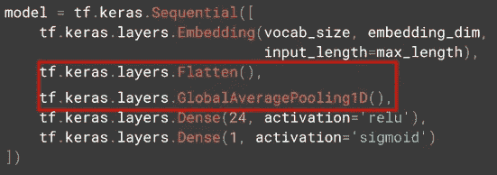

i) Without LSTM

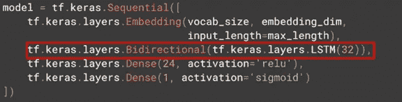

ii) With LSTM

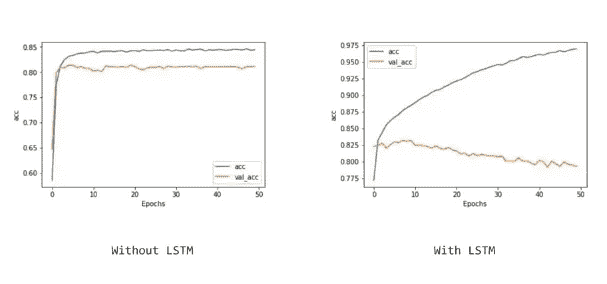

当使用池化和扁平化的组合时，我们很快达到了 85%的准确率，然后它变平了。验证集有点不太准确，但是曲线看起来与训练准确性同步，在 80%的准确性处变平。

另一方面，当在网络中使用 LSTM 层时，我们很快就达到了 85%的准确率，并继续上升到 97.5%。验证集的准确率提高到 82.5%，但随后下降到 80%，与之前的网络相似。精确度的下降暗示着某种过度拟合肯定正在发生。要解决这个问题，需要对模型进行一点调整。

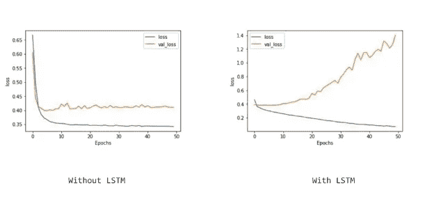

当比较损失函数时，观察到类似的趋势。培训损失迅速下降，然后趋于平缓。验证准确性似乎表现类似。而在 LSTM 网络中，训练精度下降得很好，但是验证精度增加了，从而暗示了模型中可能发生的可能的过度拟合。直观地说，这意味着当模型的准确性增加时，对它的信心减少了。

**使用卷积层**

在网络中应用了卷积层，现在**单词将按照滤波器的大小分组，即 5 个**和**卷积将被学习，它们可以将单词分类映射到期望的输出**。

**过滤器数量->128；过滤器尺寸- > 5**

我们观察到，我们的模型甚至比以前的模型表现得更好，在训练集上接近 100%的准确性，在验证集上接近 80%的准确性，但与以前一样，我们在验证集上的损失增加，表明过度拟合，因此预测置信度下降。

如果我们回到我们的模型，探索卷积层的参数，我们会注意到**每组 5 个字**有 128 个滤波器。

在查看模型摘要时，我们注意到句子的输入**长度是 120** 并且**过滤器大小是 5** ，因此**前面的 2 个单词和后面的 2 个单词**被去掉，留给我们的**句子大小是 116** 。因为我们使用了一个 **128 卷积**，所以我们得到了 **(116，128)** 的输出维数。

**第四周**

标记器被初始化，并以由 **"\n"** 分隔的句子的形式提供数据。然后将句子转换成小写字母，并使用拆分方法检索单个句子，并将其作为列表项存储在 ***【语料库】*** 列表中。使用 ***fit_on_texts*** 方法对列表中的单词进行标记和标注。数据中存在的总唯一字存储在变量 ***total_words*** 中。额外的 **1** 是因为 **oov_token** 的存在。

上面突出显示的代码给出了下面的输出。检索并编码 ***语料库*** 列表中的第一行文本。

下一个循环将整个编码句子分解成一个***n _ gram _ sequence***，并将每个序列添加到***input _ sequences***列表中。

下图中的"**输入序列"**中的每一行都是一个 **n_gram_sequence。**

然后，我们试图通过遍历所有可用的**输入序列**来确定最大句子的长度。

一旦确定了最大句子的长度，我们就用**pre****pad****输入序列**。

上面的代码给出了下面的输出。

我们**预填充**上述**输入序列**的原因是，我们可以将整个训练数据放在每个**输入序列**的左侧，而将代表它的标签放在右侧。在这种情况下，由于我们预测每个句子末尾的单词，我们将每个**输入序列**的最后一个单词视为要预测的目标标签。

现在，我们开始分离**输入序列**，收集最后一个单词之后的所有编码单词作为模型的输入，最后一个编码单词作为目标标签，并将它们存储在单独的列表中，如下所示。

由于这是一个多类分类模型，我们使用下面的代码对其进行编码。

如前所述，给定编码的句子，直到倒数第二个编码单词的所有编码单词被存储为模型的输入 **X** 。在如下所示的情况下，所有编码字直到 **69** 被存储为 **X** ，最后一个编码字 **70** 被存储为**标签**。

**标签**的**一键**编码如下图所示 **Y** 。第 70 个元素存储为 **1** ，因为编码标签与之对应，其余为 **0** 。

问题的模型如下所示。我们使用 **adam** 优化器，因为它碰巧在这种情况下表现得特别好。

上述模型的性能精度绘制如下。

我们注意到，某些已经被预测到的单词在最后往往会重复出现。这是因为模型中使用的 LSTM 层是单向的，并且同一个单词一旦被预测就继续向前传递，从而影响句子中稍后被预测的单词。

为了克服上述问题，我们使用双向 LSTM 层，使得即使在目标单词影响预测之后，单词仍然存在。

包含双向层的精度绘制如下。

包含双向层的输出如下所示。我们观察到单词的重复确实继续存在，但是它的频率降低了。也就是说，下面的文本是一首诗的一部分，其中的单词需要押韵，因此必须遵循一定的顺序。因此，重复可能不是由于模型中的错误，而是由于句子的固有结构。

我们现在尝试通过给它一组初始单词来生成一首诗。

因为单词 Laurence 不在语料库中，所以它没有被编码。

在填充句子之后，我们以下面提到的一个序列结束。

试图预测输入句子后面的大量单词是不可取的，因为最初预测的单词本身是基于某种概率的。随着更多的单词被预测，概率持续降低，因此预测的质量持续恶化，直到预测的单词不再相关并且作为输出出现乱码。

解决上述问题的方法是使用更大的单词库。

我们知道这样一个事实，Adam optimizer 在这类问题中表现良好。为了更好地进行调优，我们可以显式地实例化优化器，并用学习率进行实验。

由于英语的单词比单个字母多，我们可以通过提供编码的字母来训练模型，并训练它预测下一个字母。这样，我们就不必担心拥有一个超大的文本语料库。** 

**感谢您阅读本博客。我希望听到你对此的想法。**