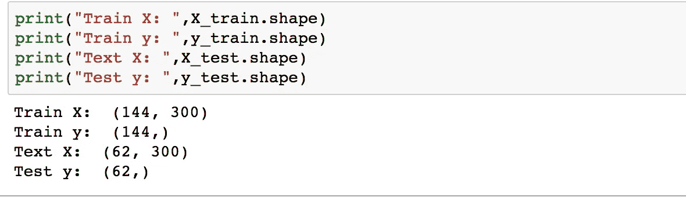

# 自然语言理解——对话代理的核心组成部分

> 原文：<https://towardsdatascience.com/natural-language-understanding-core-component-of-conversational-agent-3e51357ca934?source=collection_archive---------11----------------------->

# 摘要


BI Intelligence, [https://i.insider.com/5970ca60552be5ad008b56ce?width=600&format=jpeg&auto=webp](https://i.insider.com/5970ca60552be5ad008b56ce?width=600&format=jpeg&auto=webp)

我们生活在一个信息应用处理我们各种日常活动的时代，事实上，这些应用已经超过了社交网络，正如 BI Intelligence 报告中所指出的那样。除了这一点之外，消息平台的消费预计在未来几年将进一步显著增长；因此，在人们积极参与的情况下，这是不同企业获得关注的巨大机会。

在这个即时满足的时代，消费者希望公司能够毫不拖延地对他们做出快速反应，当然，这需要公司花费大量的时间和精力来雇佣和投资他们的员工。因此，现在是任何组织考虑与最终用户保持联系的新方法的时候了。

许多正在经历数字化转型的组织已经开始利用人工智能的力量，如人工智能辅助的客户支持系统、使用人工智能辅助面试的人才筛选等。甚至还有许多对话式人工智能应用程序，包括 Siri、谷歌助理、个人旅行助理，这些应用程序可以个性化用户体验。

# 概述

有两种创建对话代理的方法，即基于规则和自学习/机器学习。对于基于规则的方法，您可以使用正则表达式来创建一个简单的聊天机器人。

在这篇文章中，我将向你展示如何使用机器学习和单词向量来将用户的问题分类成意图。除此之外，我们还将使用一个预建的库来识别文本中的不同实体。这两个组件属于自然语言理解，在设计聊天机器人时非常关键，以便用户可以从机器获得正确的响应。

# 自然语言理解

NLU(自然语言理解)是自然语言处理的重要组成部分，它允许机器理解人类语言。这有两个重要的概念，即意图和实体:

> 我想订一张从 A 到 c 的机票。

**Intent:** 在这种情况下，最终用户的目标是预订从一个地点(A)到另一个地点(C)的航班。因此，这个问题的目的或意图是“预订票”。

**实体:**这个查询中有两个概念/实体；出发城市(A)和目的地城市(B)。

总而言之，意向“保留票”具有以下实体:

**出发城市
目的城市**

我们现在可以使用这些信息为我们的用户提取正确的响应。

作为本教程的一部分，我们将使用聊天机器人语料库([https://github.com/sebischair/NLU-Evaluation-Corpora](https://github.com/sebischair/NLU-Evaluation-Corpora))，由 206 个问题组成，由作者标记。数据有两种不同的意图(出发时间和查找连接)和五种不同的实体类型。在本帖中，我们将使用问题和意图进行意图分类。然而，当涉及到实体时，我们不会训练我们的自定义实体，相反，我们将利用预先训练的命名实体识别器从文本中提取实体。当然，可以使用不同的算法来训练自定义实体，但是我们可以稍后再研究它。

# **第 1 部分:意图分类**

为了将用户的话语分类为一个意图，我们可以利用正则表达式，但是当规则很容易定义时，它工作得很好。

我们现在将转向机器学习方法来对用户的话语进行分类；这是一个有监督的文本分类问题，我们将利用训练数据来训练我们的模型来对意图进行分类。

这里的一个重要部分是理解单词向量的概念，以便我们可以将词汇中的单词或短语映射到实数向量，从而使相似的单词彼此接近。例如，单词“冰川”的矢量应该接近单词“山谷”的矢量；出现在相似上下文中的两个单词有相似的向量。因此，单词向量可以捕捉单词集合中的上下文含义。


Please use this link to play with : [http://projector.tensorflow.org/](http://projector.tensorflow.org/)

我们将利用 Python 中的 Spacy 包，它自带了加载训练向量的内置支持。经过训练的向量包括 word2vec、glove 和 FastText。

如果我们谈论 word2vec，它有两种风格，连续词包(CBOW)和跳格模型。


[http://idli.group/Natural-Language-Processing-using-Vectoriziation.html](http://idli.group/Natural-Language-Processing-using-Vectoriziation.html)

连续单词包(CBOW)试图使用相邻单词来猜测单个单词，而 skip gram 使用单个单词来预测其在窗口中的相邻单词。

**简要细节**

输入以一个热向量的形式输入到网络。

隐藏层是神奇的部分，这就是我们想要的。隐藏层权重矩阵是我们感兴趣的词向量，它只是作为一个查找表，因为当你在输入词的一个热向量和隐藏层的权重矩阵之间应用点积时，它将挑选对应于 1 的矩阵行。(注意:根据词汇量的大小，单词向量的维数通常在 100 到 300 之间)

输出部分是 Softmax 函数，它给出了目标单词的概率。

我们不会深入讨论与此相关的更多细节。

## 使用预训练的单词向量训练意图分类器

**第一步:加载数据**

```
df=pd.read_excel(“Chatbot.xlsx")
queries=np.array(df['text'])
labels=np.array(df['intent'])
```


Image by author

**步骤 2:加载预训练的空间 NLP 模型**

Spacy 是 Python 的一个自然语言处理库，带有内置的单词嵌入模型，它使用 300 维的手套单词向量

```
# spacy NLP Model
nlp = spacy.load(‘en_core_web_lg')

n_queries=len(queries)
dim_embedding = nlp.vocab.vectors_length
X = np.zeros((n_queries, dim_embedding))
```

**第三步:预处理——词向量**

现在，如果我们在查询部分看到包含以下内容的数据:

```
print(queries)
```


Image by author

为了训练模型，我们需要使用 Spacy 预训练模型将这些句子转换为向量。

```
for idx, sentence in enumerate(queries):
   doc = nlp(sentence)
   X[idx, :] = doc.vector
```


Image by author

现在，我们已经将句子转换为向量格式，可以将其输入到机器学习算法中。

**步骤 4:使用 KNeighborsClassifier 的训练模型**

```
#########Splitting Part###########

from sklearn.model_selection import train_test_split
X_train, X_test, y_train, y_test = train_test_split(X, labels, test_size=0.30, random_state=42)
```



Image by author

```
#############Training Part###########
from sklearn.neighbors import KNeighborsClassifier
neigh = KNeighborsClassifier(n_neighbors=1)
neigh.fit(X_train,y_train)
```

我们来评价一下。

```
###########Evaluating##############
print("Accuracy on Test Set: ",np.count_nonzero(neigh.predict(X_test)==y_test)/len(y_test))
```


让我们检查一下示例查询


请注意，这是正确地标识了 FindConnection 意图。您可以尝试不同的变体来测试这一部分。

恭喜你，我们已经成功构建了我们的意图分类器，它可以理解用户话语的目的。现在机器知道了用户问题的目的，它需要提取实体来完整地回答用户试图问的问题。

# 第 2 部分:实体识别

实体提取帮助我们计算出正确的字段，以便用户可以从机器得到正确的响应。例如，分类为 FindConnection 的查询“从 olympia einkaufszentrum 到 hauptbahnhof”有两个实体:olympia einkaufszentrum(起始位置)和 hauptbahnhof(目的地位置)。

在从文本中识别出意图和实体之后，我们可以生成一个查询，该查询可以从数据库中获取响应。

```
EXAMPLE SQL to FETCH from the database:
 SELECT ___ FROM CONNECTIONS
 WHERE START_LOCATION=‘olympia einkaufszentrum’
 AND END_LOCATION=‘hauptbahnhof’
 __________
 FURTHER CONDITIONS IF REQUIRED
 ___________
```

这只是 SQL 的一个例子，向您展示了意图和实体对于为用户提取正确响应的重要性。

为了识别实体，我们将使用 Spacy 命名实体识别，它已经支持实体类型，如 PERSON、FAC(建筑物、机场、高速公路)、ORG(公司、组织)、GPE(县、州、城市)等。要查看更多的实体类型，请参考此链接:【https://spacy.io/api/annotation 

```
doc = nlp('from olympia einkaufszentrum to hauptbahnhof')
for ent in doc.ents:
    print(ent.text,ent.label_)
```


Image by author

正如你所看到的，斯帕西·NER 已经从文本中识别出了这两个实体。但是，这个库只支持基本的实体，如人、位置等。在我们的例子中，olympia einkaufszentrum 应被标记为起点位置，hauptbahnhof 应被标记为终点位置。

我们还可以训练自定义实体来支持我们的问题。有各种实体提取器可用，如 CRFEntityExtractor、MitieEntityExtractor、EntitySynonymMapper 等，通过它们可以训练您的自定义实体。你甚至可以用自定义实体来训练 NER 空间。这由你来决定。

# 结论

在这篇文章中，我们看到了自然语言理解的一个重要概念，它可以推断出最终用户的意思。更准确地说，它是自然语言处理的理解部分，可以消化、理解文本以向最终用户输出相关的响应。意图和实体是 NLU 的两个重要组成部分，我们看到了如何使用 Spacy 和 scikit-learn 的简单方法来执行意图分类和实体识别。有各种支持 NLU 的聊天机器人平台，包括 RASA NLU，Dialog Flow，IBM Watson，Amazon Lex。从文本中提取意图和实体，拉莎·NLU 将是一个很好的起点。

除了自然语言理解，其他几个组件在构建人工智能辅助的聊天机器人中也很重要。你需要探索槽填充部分，内存元素和更多来创建一个好的工作对话代理。

# 参考

[1][https://medium . com/bhavaniravi/entity-extraction-除雾-rasan Lu-part-3-13a 460451573](https://medium.com/bhavaniravi/entity-extraction-demistifying-rasanlu-part-3-13a460451573)
【2】[https://github.com/sebischair](https://github.com/sebischair)
【3】[https://repl.it/@just_a_girl/Datacamp-Using-Spacy-for-NLP](https://repl.it/@just_a_girl/Datacamp-Using-Spacy-for-NLP)
【4】[https://www.datacamp.com/community/tutorials](https://www.datacamp.com/community/tutorials)
【5】[https://www . SIG dial . org/files/workshop/conference 18/proceedings/pdf/sigdial 2](https://www.sigdial.org/files/workshops/conference18/proceedings/pdf/SIGDIAL22.pdf)