# 基于序列对序列模型的自然语言理解

> 原文：<https://towardsdatascience.com/natural-language-understanding-with-sequence-to-sequence-models-e87d41ad258b?source=collection_archive---------5----------------------->

## 如何预测客户询问背后的意图？Seq2Seq 型号说明。使用 Keras 在 ATIS 数据集上演示槽填充。

自然语言理解(NLU)，对话式人工智能(聊天机器人、虚拟助理、增强分析)背后的技术通常包括意图分类和槽填充任务，旨在为用户话语提供语义工具。意图分类侧重于预测查询的意图，而槽填充提取查询中的语义概念。例如，用户查询可以是“给我找一部史蒂文·斯皮尔伯格的动作片”。这里的目的是“寻找电影”，而槽是值为“动作”的“类型”和值为“史蒂文·斯皮尔伯格”的“导演”。

意图分类是预测意图标签的分类问题，而槽填充是标记输入单词序列的序列标记任务。在研究中，通常会发现使用基于递归神经网络(RNN)的方法，特别是门控递归单元(GRU)和长短期记忆(LSTM)模型，在意图分类和槽填充方面的最新表现。

本文处理槽填充任务。我们首先介绍机器翻译任务，以激励序列到序列模型，这已经统治了神经机器翻译的世界多年。我们用序列到序列模型来解决槽填充的任务。该方法是从理论上提出的，并使用 ATIS 数据集进行了实践，该数据集是一个广泛用作意图分类和缝隙填充任务的标准基准数据集。

# 迷失在翻译中

## 古老的语言

语言翻译很难，不仅仅是对人类。过去，我们使用**基于规则的机器翻译**，让语言学家在词汇、句法或语义层面创建和维护将源语言文本转换成目标语言的规则。后来，**统计机器翻译**更倾向于使用统计模型来学习翻译给定的大量例子。给定源语言的文本，例如法语 *(f)* ，在目标语言中最有可能的翻译是什么，例如英语 *(e)* ？在平行语料库上训练**翻译模型** *p(f|e)* ，并且仅在目标语料库(英语)上计算**语言模型** *p(e)* 。

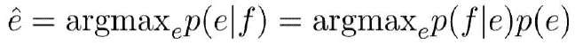

尽管统计机器翻译方法有效，并被 IBM 和 Google 等大公司应用和商业化多年，但它局限于翻译的短语，失去了目标文本的广泛本质。此外，统计方法需要仔细调整翻译管道中的每个模块。

回到过去，传统的基于短语的翻译系统通过将句子分解成多个组块并逐个短语地翻译它们来完成工作。这种方法造成了不流畅的翻译。

神经机器翻译于 2014 年问世，引入了使用神经网络模型来学习机器翻译的统计模型。从那时起，我们不必计算条件概率的规则。网络学习它们的权重，发现所有的规则和概率，语言学家和统计学家将花费巨大的精力来编码。

在我们的上一篇文章中，我们展示了递归神经网络，尤其是 LSTMs 如何在 20 年中根据时间步长 *t-1* 的前一个元素来预测时间步长 *t* 的序列元素。递归神经网络也能帮助语言翻译吗？

 [## 基于 LSTM 的非洲语言分类

### 厌倦了德法数据集？看看 Yemba，脱颖而出。力学的 LSTM，GRU 解释和应用，与…

towardsdatascience.com](/lstm-based-african-language-classification-e4f644c0f29e) 

直接使用 LSTM 将一系列单词从一种语言映射到另一种语言很快就会遇到问题。要使单个 LSTM 工作，您需要输入和输出序列具有相同的序列长度，而对于翻译来说，这种情况很少发生。例如，两个单词的英语短语“正在播放”被翻译成一个单词的德语短语“spielt”

## 序列对序列学习

前一节介绍的问题的最佳解决方案是编码器-解码器架构，即所谓的**序列到序列学习和神经网络**，以及将源文本编码为内部固定长度表示(称为**上下文向量**)的能力。一旦编码，不同的解码系统可以用来翻译成不同的语言。

[Sutskever 等人，2014](https://papers.nips.cc/paper/5346-sequence-to-sequence-learning-with-neural-networks.pdf) ， [Cho 等人，2014](http://emnlp2014.org/papers/pdf/EMNLP2014179.pdf) 发明了这种方法。Sutskever 的模型在 2014 年获得了 34.81 的 BLEU 分数，与统计机器翻译系统为英法翻译开发的 33.30 的基线分数相比，这是一个巨大的飞跃。这是神经机器翻译系统在大规模问题上胜过基于短语的统计机器翻译基线的第一个例子。Sutskever 的模型被用来对最佳翻译名单进行重新评分，并将分数提高到 36.5 分，接近当时的最佳成绩 37.0 分。 [BLEU 算法](https://en.wikipedia.org/wiki/BLEU)(双语评估替补)通过比较候选译文和参考译文之间的 n 元语法数量来评估译文的质量。Sutslever 的模型是在数据集中 1200 万个句子的子集上训练的，包括 3.48 亿个法语单词和 3.04 亿个英语单词。

[source](https://github.com/tensorflow/nmt)

编码器和解码器通常是 LSTMs 或 gru 的层。虽然不建议太深入，但 Google Translate 使用的是 ca。7 层。很少有博客建议将单词以相反的顺序输入网络以提高性能。在许多实际情况下，在编码器中使用双向架构，通过使用以正常顺序从原始句子学习的层和以单词的相反顺序从原始句子学习的另一层。来自两层的上下文向量被连接以产生唯一的上下文向量，该上下文向量被馈送到解码器中。

在一个对话代理的例子中，输入序列“你好吗”首先通过使用一个[预训练嵌入](/representing-text-in-natural-language-processing-1eead30e57d8)或通过在我们的数据集上训练我们自己的嵌入被转换成单词嵌入。

 [## 自然语言处理中的文本表示

### 理解书面单词:温习 Word2vec、GloVe、TF-IDF、单词袋、N-grams、1-hot 编码…

towardsdatascience.com](/representing-text-in-natural-language-processing-1eead30e57d8) 

嵌入向量的大小通常为 200 或 300。这样的向量通过编码器的 LSTM 单元，以创建它的较小维度的表示。该表示然后被转发到解码器网络，该解码器网络生成其自己的表示输出“我很好”的序列。

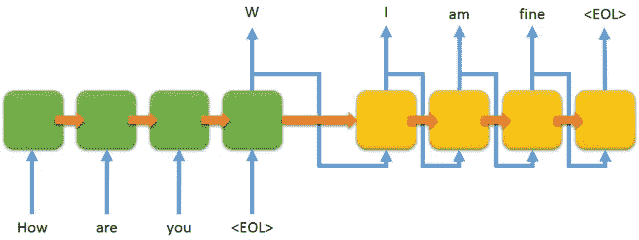

因为编码器和解码器都是递归神经网络，每个时间步，其中一个 rnn 做一些处理，它根据它的输入和它看到的以前的输入更新它的隐藏状态。编码器的输入是来自输入句子的当前单词的矢量嵌入，例如“Je suis étudiant”。编码器的隐藏状态是先前单词的记忆表示。最后一个隐藏状态实际上是传递给解码器的上下文，它自己生成一个序列，表示输出“我是学生”。

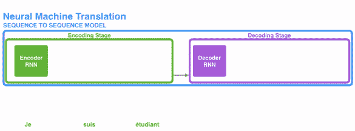

(source: [Jay. Alammar](https://jalammar.github.io/visualizing-neural-machine-translation-mechanics-of-seq2seq-models-with-attention/), 2018)

上下文是一个数字向量。其大小通常是编码器 RNN 中隐藏单元的数量。下面，我们展示了一个大小为 4 的示例向量，但是上下文向量的大小通常是 256、512 或 1024。

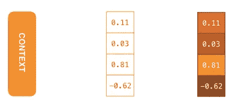

(source: [Jay. Alammar](https://jalammar.github.io/visualizing-neural-machine-translation-mechanics-of-seq2seq-models-with-attention/), 2018)

编码器-解码器架构中使用的 RNNs 模型可以是单向或双向的、单层或多层的、简单的普通 RNN 或 LSTM 或 GRU。下面我们展示一个使用 LSTM 作为循环单元的深度多层单向 RNN 的示例。这里，“~~”表示解码过程的开始，而“~~”告诉解码器停止。

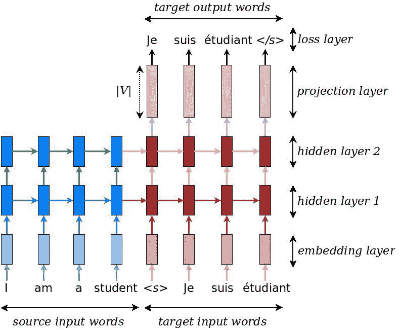

[source](https://github.com/lmthang/thesis)

# 解码人类意图

在本节中，我们将实现一个用于自然语言理解的序列到序列模型。通常，这涉及两个任务:意图检测(ID)和槽填充(SF)。前者试图将用户话语分类为意图。后者试图找到这种意图的“论据”是什么。

## 探索数据集

我们在著名的 [ATIS 数据集](https://catalog.ldc.upenn.edu/docs/LDC93S4B/corpus.html)(航空旅行信息系统)上训练我们的模型。Pickle 格式的数据集的预处理版本从[这个库](https://www.kaggle.com/siddhadev/atis-dataset-from-ms-cntk)获得。数据集包含旅行者提交给信息系统的查询。用户的意图以及话语被标记(槽填充)。

下面的代码片段将字典和张量中的训练数据存储在单独的变量中。它还显示了几个查询示例、它们的词向量、意图、槽和槽向量。

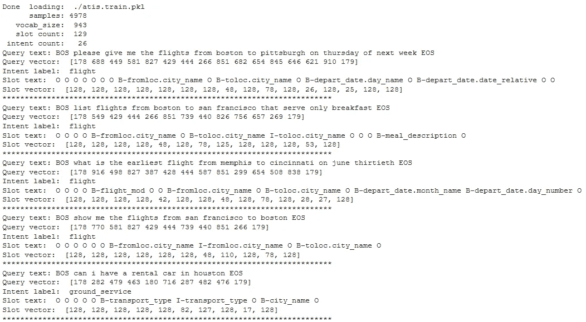

下面我们用一个漂亮的布局展示了每个意图类的查询示例。

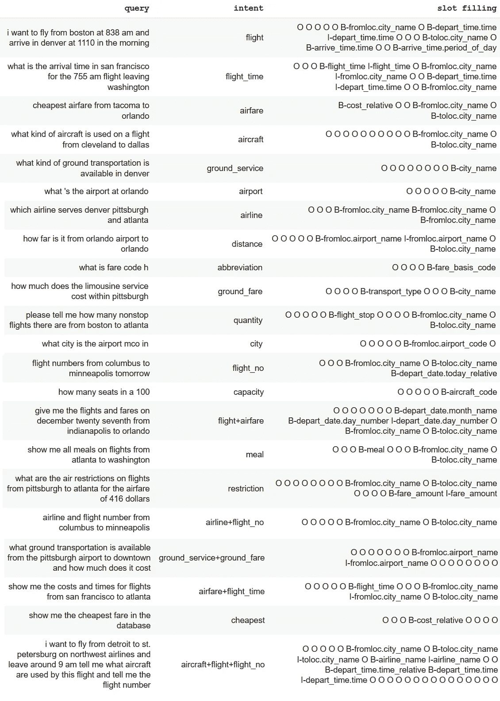

ATIS Intent Dataset

例如，让我们考虑用户查询“我想在上午 838 从波士顿起飞，并在上午 11:10 到达丹佛”。该模型应该将该用户查询分类为“飞行”意图。它还应该解析查询，识别并填充理解查询所需的所有槽。虽然单词“我”、“想要”、“飞”、“从”、“在”、“到达”、“在”、“该”有助于理解意图的上下文，但是模型应该正确地标记实现用户的飞行意图中的目标所需的实体。分别是“波士顿”作为出发城市(B-fromloc.city)、“上午 8:38”作为出发时间(B-departy _ time . time)、“丹佛”作为目的地城市(B-toloc.city_name)、“11:10”作为到达时间(B-arrival _ time . time)以及“早晨”作为一天中的到达时段(B-arrival _ time . period _ of _ day)。下图显示了 129 个插槽类别中的一些。

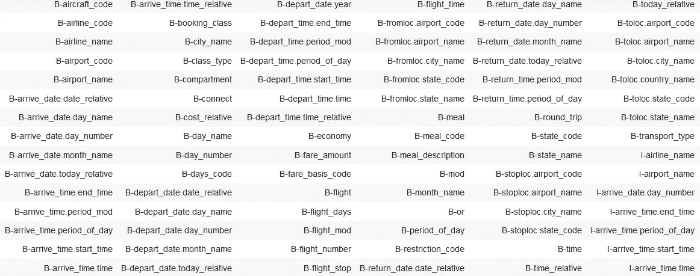

您可能已经注意到，查询文本已经被标记化，ATIS 数据集中也提供了词汇表。查询有一个*开始*(“BOS”)和*结束*(“EOS”)标记，如下所示。

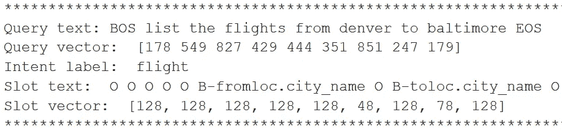

## 创建张量

我们通过将每个查询向量和槽向量填充到最大长度来创建张量。我们为目标槽提供两个张量。一个是**教师张量**，它迫使解码器遵循正确的输出时隙。另一个是真正的目标张量，它定义了给定教师张量时解码器应该输出什么。两者之间唯一的区别是目标张量只是左移了一个槽标签的教师张量。这个技巧被用于序列到序列模型的英语到西班牙语翻译[(来源](https://github.com/neonbjb/ml-notebooks/blob/master/keras-seq2seq-with-attention/keras_translate_notebook.ipynb))。输入和目标张量都具有形状(无，48)。

换句话说，为了计算词汇表的大小，我们将训练和测试词汇表结合起来。输入词汇有 943 个单词，而输出词汇有 129 个单词。

## 为槽填充建立 Seq2Seq 模型

seq2seq 模型是在编码器和解码器中使用 GPU 就绪的 LSTM 创建的。输入通过一个编码器模型，该模型给出形状 *(batch_size，max_length，hidden_size)* 的编码器输出和形状 *(batch_size，hidden_size)* 的编码器隐藏状态。编码器和解码器都使用嵌入层来投影句子，以学习用户查询的有意义的表示，该表示被馈送到具有 1024 个单元的单向 LSTM 层。

## 训练 Seq2Seq 模型

因为我们的目标(槽向量)不是一次性编码的，所以我们使用稀疏分类交叉熵作为损失函数。利用 Adam 作为 50 个时期的优化器，我们使用 3982 个训练样本和 996 个验证样本。在训练数据上准确率高达 98%，验证准确率略低于 96%。验证准确性在 45 年左右开始趋于平稳，表明该模型不再真正推断，并开始过度拟合。

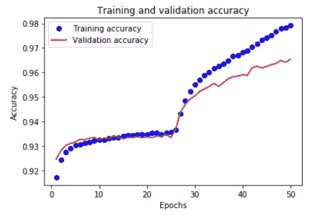

## Seq2Seq 模型的推理

预测将需要两个独立于训练的模型。我们需要打破编码器和解码器的机制。然后，我们通过编码器运行整个输入序列，然后通过解码器一步一步地预测来创建输出。

下面我们看到为一个看不见的查询预测的槽填充。该模型通过将“最便宜的航班”标识为 B-cost_relative slot，将“波士顿”标识为 B-fromloc.city_name，将“旧金山”标识为 B-toloc.city_name，从而很好地理解了自然语言文本。

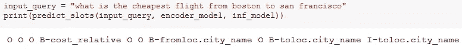

我们现在使用 [BLEU 算法](https://en.wikipedia.org/wiki/BLEU)(双语评估替角)在完整的测试数据集上评估训练的模型，该算法用于通过比较预测的槽填充和真实的槽填充之间的 n-grams 的数量来测量翻译的质量。

下面的结果表明，总的来说，该模型表现非常好，特别是在比较预测槽和真实槽之间的 4-gram 组时。69%的 BLEU 分数是可接受的结果。

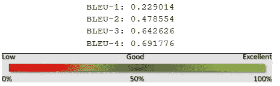

# 结论

在这篇文章中，我们看了自然语言理解，特别是在槽填充的特殊任务。我们介绍了序列数据处理和语言翻译的当前方法。由于在 ATIS 数据集上关于航班请求的几个模型的实际实现，我们展示了序列到序列模型如何在空位填充任务上实现 69%的 BLEU 分数。

最近，提出了几种用于意图分类和槽填充的联合学习方法，以利用注意机制并提高相对于独立模型的性能(郭等人，2014；哈卡尼-图尔等人，[2016](https://www.groundai.com/project/bert-for-joint-intent-classification-and-slot-filling/#bib.bib6)；刘和巷，[2016](https://www.groundai.com/project/bert-for-joint-intent-classification-and-slot-filling/#bib.bib10)；咕等， [2018](https://www.groundai.com/project/bert-for-joint-intent-classification-and-slot-filling/#bib.bib4) )。

谢谢你读到这里。在下一篇文章的[中，我们用注意力方法改进了我们的序列对序列模型。继续读！](/practical-guide-to-attention-mechanism-for-nlu-tasks-ccc47be8d500)

 [## NLU 任务注意机制实用指南

### 测试动手策略以解决注意力问题，从而改进序列到序列模型

towardsdatascience.com](/practical-guide-to-attention-mechanism-for-nlu-tasks-ccc47be8d500)