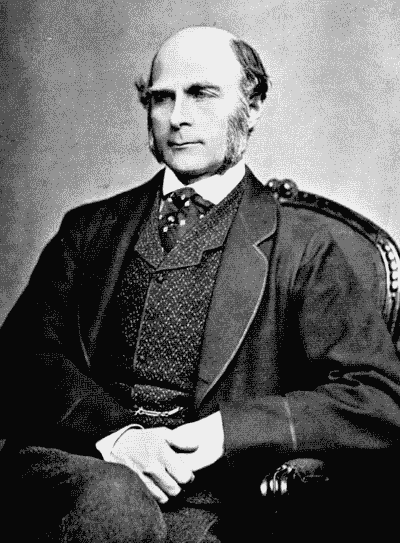

# 先天与后天。在人工智能中。

> 原文：<https://towardsdatascience.com/nature-vs-nurture-in-ai-3fec240a10bb?source=collection_archive---------17----------------------->

[https://en.wikipedia.org/wiki/Francis_Galton](https://en.wikipedia.org/wiki/Francis_Galton)

当查尔斯·达尔文的堂兄弗朗西斯·高尔顿爵士在 19 世纪晚期普及“先天与后天”这个术语时，他当然在思考人类的行为在多大程度上由遗传基因决定，在多大程度上由他们一生的经历决定。这位著名的优生学家研究了人类的特征，并开发了回归的统计概念(大量用于机器学习)，作为他改善人类基因库的探索的一部分，并得出结论，人类在很大程度上是其遗传的结果。

虽然高尔顿的提议，比如付钱给名门望族的个人让他们一起生孩子，并不赞成今天的平等主义社会，但是先天与后天的概念仍然是很多争论的主题。在 2007 年由史蒂芬·列维特和史蒂芬·都伯纳合著的有趣的书《魔鬼经济学》中，有人声称在你的房子里放 50 本书可以提高孩子 5%的考试成绩。100 本书进一步提高了 5%。这是养育帮助孩子的明显迹象。但是同样的研究也表明实际阅读和书籍之间没有关联。该理论认为，买书的父母通常是那些将智力基因传递给孩子的人——是天性，而不是后天培养。

**人工智能怎么样？**

但是，在人工智能中，先天与后天又如何呢？问这样的问题有意义吗？大自然没有进化出人工智能软件。它不会繁殖和传递有利于生存的特征。培育对一台机器来说意味着什么？

**自然**

AI 软件可能并不处于自我繁殖和进化以及适者生存的阶段，但在人类程序员的帮助下，它最有可能展现出一个进化物种的一些属性。人工智能算法的一个竞争领域是 kaggle 网站。Kaggle 为数据科学家举办比赛，试图编写最好的人工智能，做出最好的预测。数据科学家在这些比赛中相互竞争，获胜者可以赚取巨额金钱。有多大？例如，国土安全部举办了一场奖金为 150 万美元的竞赛，以提高国土安全部威胁识别算法的准确性。

很少有数据科学家自己编写真正原创的算法。相反，大多数人正在结合现有的开源代码，为他们的特定任务制定最佳算法。随着新的开源算法的发布，如果它们成功了，那么越来越多的 kaggle 竞赛项目将使用它们，而较弱的算法的受欢迎程度会下降。好的算法增强，弱的算法忽略。一个著名的例子是陈天琦在 2014 年创建的 xgboost。它是一种梯度推进算法，允许将许多弱算法组合在一起以获得好的结果。它支持正则化的能力使它明显优于早期的算法，现在它可以说是 kagglers 使用的最流行的算法。

这与动物的适者生存有明显的相似之处——最强的算法继续被广泛使用，而较弱的算法成为孤立的 git 库。最强的算法得到大量的拉取请求，并得到增强，变得更强，而弱的算法则无人维护。这是自然推动人工智能向前发展的一个明显例子。

**培育**

我们已经看到自然选择是如何让最好的人工智能代码茁壮成长，而最弱的代码死亡。培育人工智能怎么可能行得通？在人类中，养育是通过父母为孩子树立榜样来实现的。这可以是良性行为，比如吃光你的蔬菜或读书(或者只是拥有书籍)，也可以是不良习惯，比如吸烟。研究表明，如果父母吸烟，青少年吸烟的可能性是 T2 的两倍，而其他研究表明，孩子吃足够蔬菜的最强预测因素是他们的父母也吸烟。但是这怎么能适用于 AI 呢？

今天的人工智能主要是通过机器学习来实现的。在这里，计算机算法被输入带标签的数据，以建立一个世界的模型。或者至少是世界的一小部分。比如我们教机器，猫长这样，狗长那样。或者我们告诉它谁拖欠贷款，谁没有，以及这些人的家庭特征。计算机被告知过去发生了什么，以便它能预测未来会发生什么。这应该允许我们建立一个真实的世界模型。我们从未来的决策中去除人类的个人意见。我们基于过去发生的事实，而不是我们自己习得的偏见。鉴于人工智能只有在我们对数据进行训练的情况下才能建立一个有用的世界模型，它似乎更强烈地依赖于我们如何培养它——我们教给它关于世界的什么。

**偏向**

但如果过去告诉它的东西有一些偏差，会发生什么呢？一些影响世界的人性弱点。在上面的例子中，有人必须决定什么是猫，什么是狗。也许有些照片贴错了标签。

如果只是一些随机的错误，可能没什么大不了的。但如果更恶意呢？当在英国监狱工作的囚犯将历史人口普查数据数字化时，他们进入了执法人员不喜欢的职业。不仅仅是罪犯也会这么做。大多数图片标签是由人们在网上完成的。想想你在社交媒体上看到的一些人，告诉我你不能想象他们中的任何一个人为了寻求刺激而贴错标签。

或者也许我们的数据集已经为猫和狗训练好了，但是当我第一次给它看一只羊时会发生什么呢？甚至第一百次？它会给它贴上猫或狗的标签，因为这就是它所接受的全部训练。这类似于 2015 年谷歌开始给黑人贴上“大猩猩”的标签。谷歌本来没打算这么做，但是对黑人缺乏足够的图像识别训练，导致它无法正常学习。

 [## 当谈到大猩猩时，谷歌照片仍然是盲目的

### 2015 年，一名黑人软件开发者在推特上发文称谷歌的照片服务将照片标记为…

www.wired.com](https://www.wired.com/story/when-it-comes-to-gorillas-google-photos-remains-blind/) 

另一个可能发生的问题是无意中使用了图像中的背景信息。来自弗吉尼亚大学的维森特 more 发现，如果照片是在厨房里拍摄的，他的图像识别人工智能更有可能猜出某人是一名女性。将这两者结合起来，麻省理工学院的 Joy Buolamwini 在 2018 年 2 月发现，虽然 IBM、微软和旷视科技可以在 99%的情况下正确识别白人男性的性别，但他们只能在 35%的情况下正确识别深色皮肤的女性。

 [## 性别阴影

### 性别分类的交叉准确性差异

gendershades.org](http://gendershades.org/overview.html) 

贷款违约用例呢？在训练这样的系统时，银行会通过传递过去的贷款来训练算法，并让它学习好贷款和坏贷款的样子。像照片这种棘手的东西不在其中。它使用冷酷的事实。但是如果银行过去在发放贷款时有偏见，人工智能也会有同样的偏见。想象一下，银行过去主要向 40 岁以上的人发放贷款，算法要学习好的借款人年龄都在 40 岁以上。这个算法会有年龄偏差，因为这是我们训练它的依据。直到 1980 年，英国银行还可以拒绝向女性贷款，除非她们有男性担保人。如果没有这些贷款发生的过往数据，人工智能不会认为这是一个有效的选择

当然，我们可以很容易地修正这种偏见。我们只是不告诉算法申请人的年龄或性别。不幸的是，今天的机器学习算法在从数据中挑选线索方面非常惊人。你叫诺曼吗？这一数字在 20 世纪 20 年代达到顶峰，此后一直稳步下降。好的，我们会去掉的。也许你有一个 aol.com 的电子邮件地址。哎呀——这是一个赠送。你有多少份工作，是自己的还是租来的，你有车吗，你打高尔夫吗？所有表明一个年龄段比另一个年龄段的可能性更大的事情。

亚马逊最近试图使用人工智能来改善其招聘流程。这个想法是通过让人工智能查看过去成功聘用的人，并挑选看起来像这样的新候选人，来自动化简历筛选。他们给它输入了 10 年的数据，发现它总是选择男人而不是女人。名字被删除，运动和俱乐部被隐藏。当这些消失时，像语言这样的东西被人工智能选中了——男性比女性更经常使用像“处决”和“俘虏”这样的词。亚马逊最终放弃了这个项目，再也没有用它来雇佣任何人。

 [## 亚马逊杀死了一个 AI 招聘系统，因为它无法阻止工具的歧视…

### 据报道，亚马逊不得不废除一个性别歧视的基于机器学习的招聘系统，因为它偏爱男性候选人。

fortune.com](http://fortune.com/2018/10/10/amazon-ai-recruitment-bias-women-sexist/) 

**公平**

单就 AI 而言偏见不一定是问题。我天生不喜欢进入有饥饿狮子的房间，但大多数人会认为这是完全合理的。我也不喜欢雇佣幼儿园的孩子去扫烟囱，也不喜欢给那些主动给我发邮件的尼日利亚王子们寄钱。大多数人认为这些偏见是合理的。它们并非不公平——在所有这些情况下，我都面临着不小的风险。当我们认为偏见是不公平的时候，人工智能中的偏见问题就出现了。

人工智能的问题在于，公平是人类的产物。我们已经决定了一系列不公平的歧视(性别、愤怒、年龄、宗教)，但仍有一些被认为公平的歧视，如智力和犯罪。机器怎么会知道区别呢？简单的答案是，我们需要少关注闪亮的新算法(自然)，多关注我们训练系统的方式(培育)。