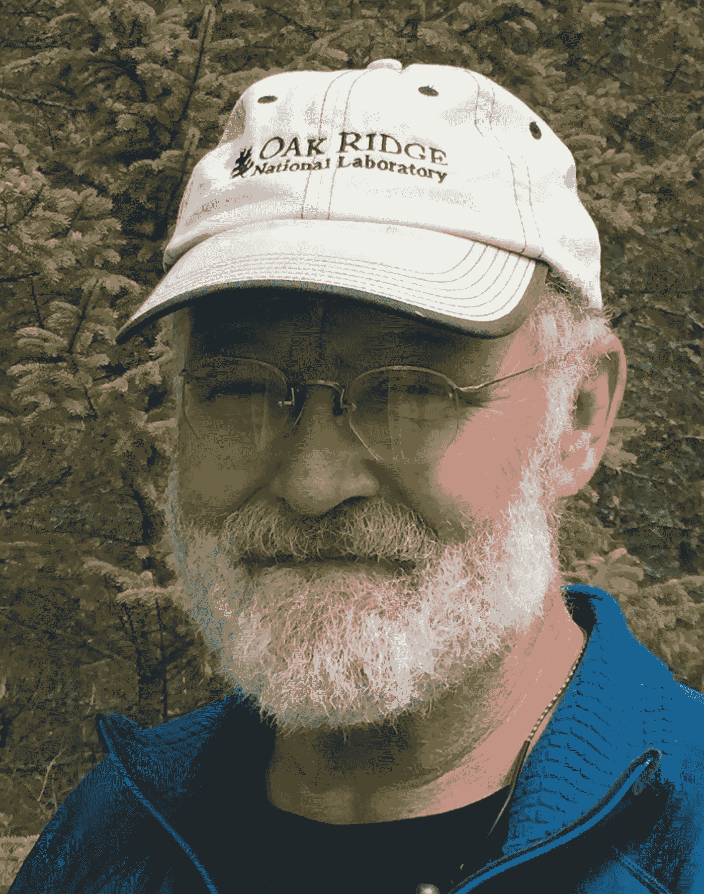
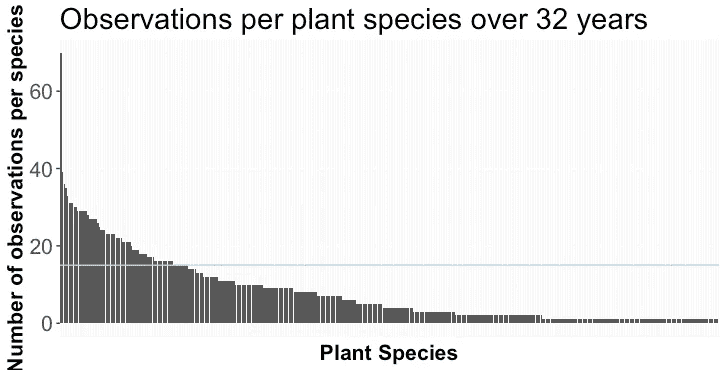
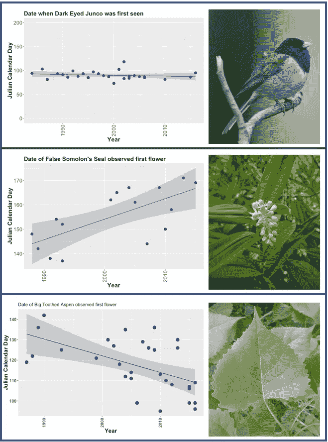

# 大自然的模式正在改变:探索 32 年的社区科学数据

> 原文：<https://towardsdatascience.com/natures-patterns-are-changing-explore-32-years-of-community-science-data-4a4fe132e07e?source=collection_archive---------15----------------------->

## 三十多年来，拉蒂默记录了大自然的秘密


Photo by [Landon Martin](https://unsplash.com/@lbmartin12?utm_source=medium&utm_medium=referral) on [Unsplas](https://unsplash.com?utm_source=medium&utm_medium=referral)

拉蒂默记录了蝴蝶抵达、花朵开放和鸟儿出现的时间。这些自然观察和更多的观察都被细致地记录下来，包括日期、时间和地点。这是他在美国明尼苏达州北部农村沿着 100 英里的路线投递邮件时的一个爱好，并在他最后一个信封投递后很快成为一种生活方式。这些类型的观察，称为物候学，被拉蒂默恰当地定义为与气候相关的事件的节律性生物性质。

> “物候学是与气候相关的事件的有节奏的生物学性质。~约翰·拉蒂默"

或者换句话说，物候学是研究由环境因素驱动的季节性植物和动物活动。几千年来，一个物种的物候通过自然选择进化，以适应环境条件并最大限度地适应环境。这个渐进的过程使得物种能够很好地适应它们的自然环境。自然科学的一个重点领域是确定[变化的气候条件](https://www.ipcc.ch/)将如何改变物候，物候变化对物种适应性的影响——也许最重要的是——物候变化将如何改变物种的相互作用。



Retired postoffice employee and long-time community scientist John Latimer. For over 32 years Latimer has collected thousands of observations on bird and insect migrations, flowering patterns and tree leaf drop that are now [publicly available](https://github.com/dwestontn/Latimer_phenology) for you to explore. Photograph by David J. Weston

我们可以用一个野生鸟类的例子来简要说明物候学和物种相互作用的概念。鸟蛋必须在食物(如昆虫)充足时孵化。因此，幼体出生的时间和昆虫的数量已经共同进化成同步的，或者说匹配的。如果气候变化改变了这些环境线索，那么鸟类的物候就会改变，但是鸟类捕食的昆虫的物候又会如何呢？孵化出的幼体和昆虫的数量会继续匹配吗？或者气候变化会改变它们，并且[会使高度共同进化的捕食者-猎物的相互作用不匹配吗？](https://www.pnas.org/content/99/21/13379.full)

拉蒂默是日益壮大的社区科学运动的一部分。代表那些通常没有被训练成科学家，但是仍然为科学和人类做出贡献的人。

> 然而，似乎缺少的是关于如何使用和分析社区科学数据的更广泛的讨论。

一个复杂的问题是数据的巨大剪切。仅拉蒂默一人就记录了大约 104，840 个条目！再者，数据质量如何，谁来分析？合乎逻辑的答案是公共机构的科学家和教授，然而资金和资源的限制往往使这几乎不可能。正是带着这样的想法，我产生了下面的问题:

> "基于社区的数据分析是科学领域的下一个重大转变吗？"

我最近接触到的 [Medium](https://medium.com/) 的开放数据科学社区和的出版物[提供了一个关于这个问题的有趣视角，因为它表明并不缺少渴望使用新数据集的有才华的数据科学家。](https://towardsdatascience.com/)

***作为这个小社区基础科学实验的开始，我提供访问*** [***Latimer 的数据和初始***](https://github.com/dwestontn/Latimer_phenology)[***exemplar***](https://github.com/dwestontn/Latimer_phenology)*[***R 代码***](https://github.com/dwestontn/Latimer_phenology) ***。****

*这绝不是详尽的，因为目的是向数据科学家介绍环境数据，反过来，向社区科学家介绍 r。*

> *人们希望这种握手能够转化为使用开放数据和复杂分析的协作。*

***数据初看和数据合成***

*安装下面的 R 库并加载它们。*

```
*install.packages(c(‘lubridate’, ‘tidyverse’))
library(tidyverse)
library(lubridate)*
```

*将数据读入 R `datphen<-read.csv(“Latimer_Cleaned_1.csv”)`并查看一下`head(datphen)`。数据令人印象深刻！在 32 年的时间里，拉蒂默人工收集了 10，484 次物候观测数据。除了记录的日期，拉蒂默和同事南宁加还增加了 9 个其他变量(如属、种、俗名、生活型等。)总共 104，840 个观察值。这只是一个开始，我们的数据集将在 2016 年停止，而拉蒂默将继续记录物候观测，直到今天！*

*数据是典型的“日期”格式。然而，科学家通常使用儒略日格式来提供从每年 1 月 1 日开始的连续天数。每一年将包含 365 天，如果是闰年，则为 366 天。*

```
*datphen$date<- as.Date(datphen$date, "%m/%d/%y")*
```

*快速浏览一下数据可以发现，拉蒂默并没有每天记录观察结果。这是有道理的，因为植物在冬天处于休眠状态，鸟类季节性迁徙。*

*这些数据包括对植物、鸟类和其他动物的观察。要对观察到的植物种类有所了解，请使用以下方法:*

```
*datphen2 %>% select(common_name, lifeform, event) %>% filter(lifeform == "PLANTS" & event =="FLOWERING") %>% group_by(common_name) %>% tally() %>% arrange(-n)*
```

*这会生成一个表格，其中包含植物的通用名和 Latimer 对该物种的观察次数。下面是前 10 个条目的表格。*

*从上表中我们可以看出，有些物种的观测值很多，而有些物种的观测值较少。下面我们使用下面的代码来可视化拉蒂默在 32 年的数据收集过程中对每个物种的观察次数。*

```
*a<-datphen2 %>% select(common_name, lifeform, event) %>% filter(lifeform == "PLANTS" & event =="FLOWERING") %>% group_by(common_name) %>% tally() %>% arrange(-n)ggplot(a, mapping = aes(x = reorder(common_name, -n), y = n)) +
  geom_bar(stat = "identity") +
  geom_hline(yintercept = 15, color="lightblue") +
  theme(axis.text.x=element_blank(),
        axis.text.y=element_text(size=16),
        axis.title=element_text(size=16,face="bold"),
        plot.title = element_text(size=22),
        axis.ticks.x=element_blank()) +
  labs(title = "Observations per plant species over 32 years", x = "Plant Species", y = "Number of observations per species")*
```

**

*仅就植物而言，拉蒂默就记录了令人印象深刻的 392 种物种——如上面水平 x 轴上的条形数所示。然而，每个物种的观测数量差异很大。为了确保我们对每个物种都有足够的观察来检测物候变化，我们将分析限制在那些有 15 个或更多观察值的物种(观察值在上图蓝线以上的物种)，这导致了 76 个物种。*

*从选出的 76 个物种中，我们将对每个物种拟合一个线性回归模型，以确定开花时间物候的变化是否与一年中的变化一致。*

***为线性回归循环和图形准备数据:***

```
*#subset species that have 15 or more years of flowering observations # Prep or tidy the data for lm model fittingb<- a %>% filter(n >= 15)
c<-b %>% select(common_name)
lm.data<-inner_join(c, datphen2, by = "common_name") %>% filter(event =="FLOWERING") #%>% group_by(common_name) %>% distinct(year, .keep_all = TRUE)lm.data$year<-as.numeric(lm.data$year)*
```

*以下代码显示了如何通过所有 76 个物种连续运行一个线性模型(即循环),并巧妙地提取模型斜率和 p 值，以识别候选物种供进一步研究。*

```
*library(broom)#run an lm model across all rows, genotypes
lm.results<- lm.data %>% group_by(common_name) %>% do(fitdata = lm(julian ~ year, data = .))#getting tidy data output from model run
lmSlopePvalue <- tidy(lm.results, fitdata) %>% select(common_name, term, estimate, p.value) %>% filter(term =="year")lmRsquare <- glance(lm.results, fitdata) %>% select(common_name, r.squared)lmtidyoutput<-left_join(lmSlopePvalue, lmRsquare, by = c("common_name" = "common_name"))*
```

*回归分析显示，76 个物种中有 10 个物种的 p 值< 0.05\. Meaning that there is a significant relationship between when Latimer noticed first flowering (Julian day) for a given species, and the year the observations were recorded (year). Interpreting significance and ensuring that model assumptions are met should be further [被调查](http://www.r-tutor.com/elementary-statistics/simple-linear-regression/significance-test-linear-regression)，超出了本文的范围。*

*为了绘制所有重要的物种，按照 [R 笔记本](https://github.com/dwestontn/Latimer_phenology)中所示准备数据，并运行以下功能:*

```
*#Looping graph function for phenology relationshipplant.species <- function(df, na.rm = TRUE, ...)
  # create list to loop over 
  plant_list <- unique(df$common_name)
  # create for loop to produce ggplot2 graphs 
  for (i in seq_along(plant_list)) { 
    # create plot for each specis in df 
    plot <- 
      ggplot(subset(df, df$common_name==plant_list[i]),
        aes(y= julian, x= year, group = common_name)) + 
        geom_point(size=4, colour = "dark blue")+
        geom_smooth(method = lm) +
        theme(axis.text=element_text(size=12),
        axis.title=element_text(size=16,face="bold"),
        axis.text.x = element_text(angle = 90, vjust = 0.5),
        legend.text=element_text(size=16)) +
        ggtitle(paste(plant_list[i]))
    print(plot)
  }
}*
```

***结果:***

*上面的代码示例以及在 [R 笔记本](https://github.com/dwestontn/Latimer_phenology)中详细描述的代码示例可用于调查 Latimer 数据集中的其他植物和动物物种。下面的三个图表被选择来显示物候的各种趋势。例如，黑眼灯心草似乎每年都在同一时间出现，尽管当时的天气条件很好。记住[天气变化会在短时间内局部出现，从几分钟到几小时到几天；而气候是鳄龙-长期区域和全球平均值](https://climate.nasa.gov/resources/global-warming/)。因此，如果明尼苏达州北部正在经历气候变化，黑眼灯心草迁徙的早期阶段似乎不会受到影响。*

*与灯心草相反，下面显示的植物显示了开花时间的趋势。假所罗门印章显示，在观察到的年份中，该地点的开花日反应延迟，而白杨显示了较早的开花日物候。请注意，白杨图左侧的观察值比右侧少。排除早年会怎样？你有没有得到同样的趋势——提示，请看 [R 笔记本](https://github.com/dwestontn/Latimer_phenology)。*

**

***最终想法:***

*忘掉任何提到“气候”这个词的帖子似乎都带有的政治意味吧。相反，这意味着向数据科学界介绍拉蒂默毕生的工作。我鼓励你对这些数据形成自己的看法。数据是否足够完整，足以构建稳健的模型？应该使用什么模型，哪些额外数据会有所帮助，例如，与天气相关的变量？或者说，我们应该把物候学留给专业的科学家吗？你准备好为这项事业做出贡献并开始记录你自己的[物候数据](https://www.usanpn.org/natures_notebook)了吗？*

*对于社区科学家来说，参与全球数据科学社区能学到什么？你准备好以记录物候的同样热情来看待你的数据了吗？*

*采访快结束时，我不得不问拉蒂默，是什么驱使着他。为什么他不顾明尼苏达州严寒的气候条件，记录了 30 多年的数据。他的回答很简单:*

> *发现的喜悦，以及对每天都有新发现的期待。*

*也许基于社区的数据分析是科学领域的下一个重大转变——只有时间能证明，但对拉蒂默来说，这真的无关紧要。他要下床，漫步树林，继续记录大自然的秘密。*

***关于作者:***

*韦斯顿最早的记忆中充满了大自然的图像。在专业上，他着迷于宿主-微生物组的相互作用，对能源解决方案和环境以及所有与开放分析相关的事情充满热情。就个人而言，他是一个想当农民的人，和一个了不起的配偶一起抚养三个了不起的孩子。*

***致谢**:*

*这个故事是由[约翰·拉蒂默](https://toppodcast.com/podcast_feeds/northern-community-radio-presents-phenology-john-latimer/)的辛勤工作促成的，他在过去的 35 年里热切地记录着大自然的秘密。*

*将拉蒂默的数据翻译并注释成电子表格的艰巨任务是由真正的物候学专家[克劳迪娅·南宁加](https://www.forestry.umn.edu/claudia-nanninga)完成的。*

*非常感谢那些在知识共享许可下制作了[白杨](http://chalk.richmond.edu/biology/trees/htmls/populus_grandidentata.htm)、假[所罗门海豹](https://commons.wikimedia.org/wiki/File:False_solomon%27s_seal_(26516495113).jpg)和 [Junco](https://www.flickr.com/photos/andrej_chudy/32472051942) 照片的人。*

*感谢克里斯汀·卡布高的精心剪辑和溢美之词。*