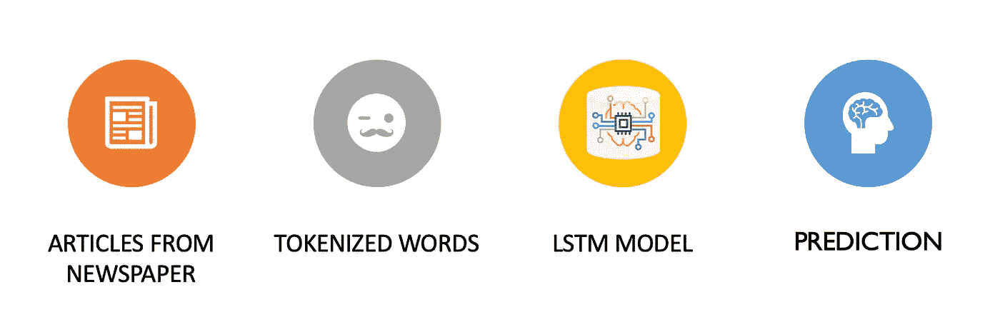
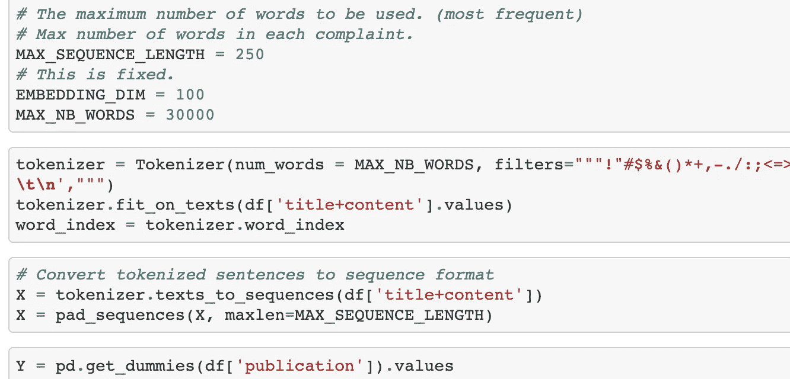
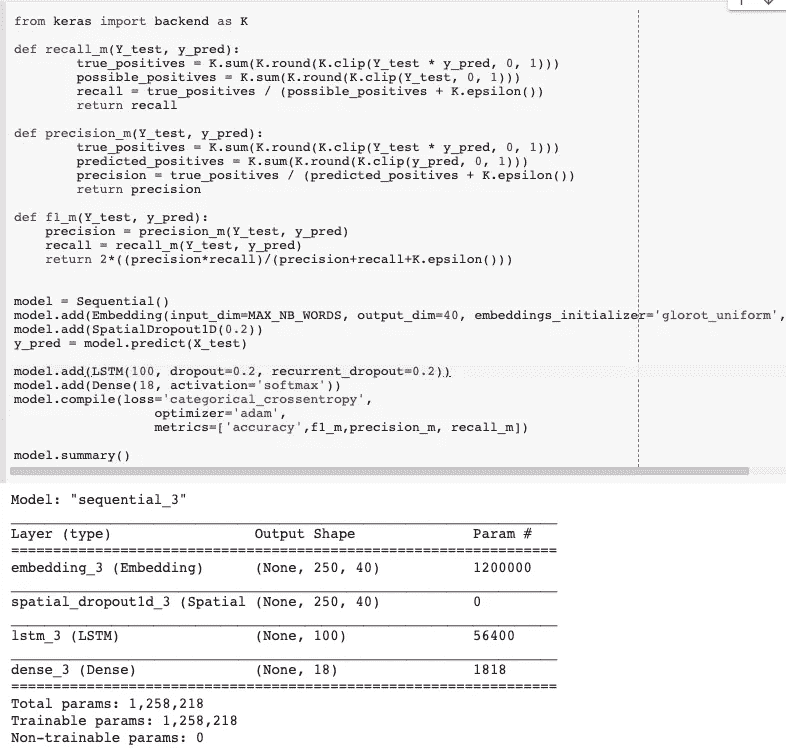
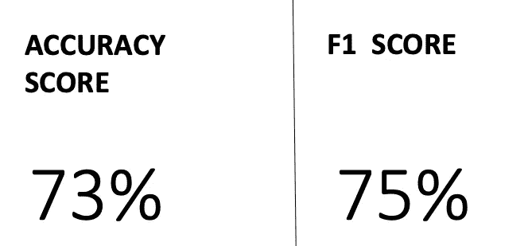
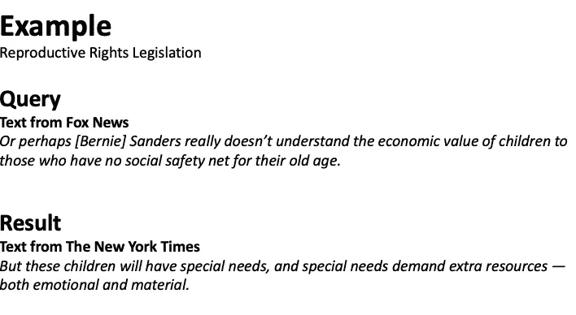
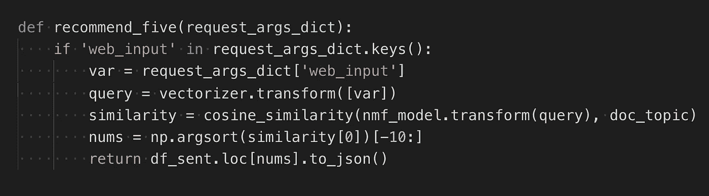
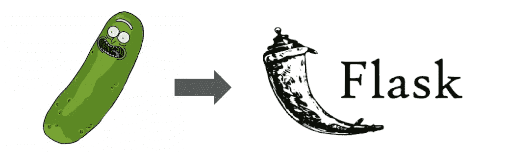
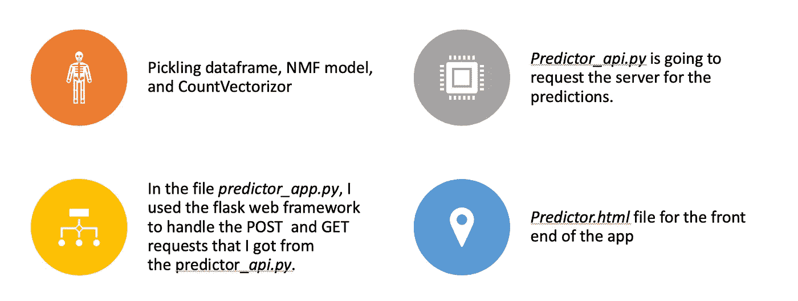

# 用数据科学导航媒体泡沫

> 原文：<https://towardsdatascience.com/navigating-media-bubbles-with-data-science-be9196bc94f2?source=collection_archive---------18----------------------->

通过在世界不同地方生活的经历，我意识到每个人对正在发生的事情的看法是不同的，这主要是因为他们所处的媒体泡沫。我在不同媒体泡沫的地方阅读的新闻报道越多，我就越能通过阅读新闻报道对媒体的偏见变得敏感。这种文化层面造成了人与人之间的脱节。

但除了文化方面，很明显美国目前是如何被左右政治光谱分割的。我认为协同过滤系统影响了它，它使人们与不同意他们观点的信息分离，有效地将他们隔离在他们自己的文化或意识形态泡沫中。

Image attributed to DuckDuckGo

# 我的目标

我认为，对于人们来说，了解不同的媒体泡沫对任何给定话题的叙述会有所帮助。这促使我创建了一个*新闻推荐平台*，提供不同出版物的叙述。

但在我开始之前，我如何从经验上证明媒体来源有自己的偏见？

为了回答这个问题，我从两个不同的来源收集了一个数据集:

*   卡格尔
*   哈佛数据世界

我的数据集包括来自 18 个不同出版物的 146，394 篇文章。出版物包括:美国保守派、美国自由派、欧洲、俄罗斯报纸。

通过研究数据集，我提出了以下假设。

# 假设

我的第一个假设是，报纸有自己的偏见，神经网络可以仅凭文本预测任何文章的发表。

因此，上面的陈述意味着，如果不同的新闻媒体以一致可预测的方式报道主题，神经网络将能够预测文本来自哪个出版物，这可能导致出版物出现偏差的概率很高。

在我的情况下，作为神经网络，我将使用长短期记忆网络(LSTM)。

**什么是 LSTM？**

LSTM 网络是一种特殊的递归神经网络(RNN)，能够学习长期依赖关系。

RNN 有能力理解先前事件的推理，并以此来告知后来的事件。

Christopher Olah 写了一个很棒的博客，解释了 LSTM 是如何工作的，我会在参考资料中包含链接。

**为什么是 LSTM？**

在我的例子中，根据文本预测出版物是一个序列分类问题，LSTM 网络是解决这个问题的最先进的方法。

将 LSTM 网络应用于各种问题已经取得了令人难以置信的成功:语音识别、语言建模、翻译、图像字幕。

**流程**

下面是使用 LSTM 模型的过程:

为了进一步解释什么是标记化单词以及如何为建模准备数据，我决定包含代码。我使用 NLTK 的包标记器对单词进行了标记。Tokenizer 将文章拆分成标记化的句子，并将标记化的句子转换成序列格式。

当数据准备好适合模型时，我将我的数据分为训练和测试，并将测试集用作验证集。我用 Keras 的框架建立了 LSTM 模型。Keras 内置指标是一个准确度分数。为了确保我的类是平衡的，我手动计算了精确度、召回率和 f1 分数，我将把它们作为额外的指标添加到我的模型中。请参考下面的代码。

将我的数据拟合到模型中后，我的模型给出了以下结果:

我的模型的预测有 73%是正确的，我的 F1 分数是 75%，这意味着我的模型上的所有类都是平衡的。

因为我的模型返回了成功的结果，所以我能够证明我的假设。根据我的假设，神经网络确实可以预测一篇文章的出版，仅基于其文本，这可以表明每个出版物都有可检测的语言偏见。

因此，我受到鼓励，继续推进我的新闻推荐平台。

# 新闻推荐平台

下面的例子展示了推荐平台的用法。主题是生殖权利立法。

受到质疑的那段文字来自福克斯新闻频道的文章，他们在文章中描述了生孩子对老年人来说是一种经济价值。

结果下面的另一段文字，是我的推荐平台的结果之一，来自《纽约时报》的文章。正文指出，孩子需要情感和物质资源，不是每个人都能负担得起的。我展示这个例子是为了理解阅读不同的视角来理解问题是多么有价值。

**流程**

平台的过程很简单，因为平台上的推荐是基于余弦相似度的。

*余弦相似度是一种度量标准，用于衡量文档的相似程度，而不考虑其大小。在数学上，它测量的是在多维空间中投影的两个向量之间的角度余弦。余弦相似性是有利的，因为即使两个相似的文档相距欧几里德距离很远(由于文档的大小)，它们仍有可能更靠近在一起。角度越小，余弦相似度越高。*

但在我将数据拟合成余弦相似度之前，我必须经历两个步骤:

首先，使用 Countvectorizer 获得每篇文章中的单词数。它的输出是一个稀疏矩阵。

第二，使用非负矩阵分解(NMF)来分解高维向量并将它们转换成低维向量。

我将这两个步骤分别应用到查询(您输入到平台中的文章或主题)和数据框中。余弦相似性连接查询和数据集以提供推荐。

请参见下面的代码:

**烧瓶应用**

作为一名数据科学家，我的大部分工作都是在 Jupyter 笔记本上完成的。为了让人们使用我的工作，我决定使用 Flask 应用程序创建一个 web 应用程序。Flask 是一个轻量级的开源 web 应用程序框架。

为了连接我在 Jupyter notebook 中运行的模型和数据，我使用了 pickle 库。Pickle 允许我保存 NMF 模型、数据和计数矢量器，我可以在我的 Flask 应用程序中运行它们。

Pickle Rick from Rick & Morty and Flask logo

下面是 Flask APP 的搭建过程。

我不会在这里发布代码，因为你可以在我的 GitHub 库的 flask app 文件夹中找到所有代码。

下面的视频举例说明了我的应用程序是如何工作的。我使用了 Vox 报纸的文本，只是为了展示你如何从不同的出版物中获得相似的文章推荐，基于你正在寻找的信息。

该应用程序还提供了每篇文章的情感评分，你可以点击出版物访问原始网站。

# 未来的工作

1.  公开部署应用程序—应用程序的重量是 30GB，所以我需要找到一种方法来获得一个可以容纳它的开源域或云存储。
2.  通过自动抓取新文章来更新模型。
3.  将应用程序部署为 Chrome 扩展。

# 参考

[如何获得 keras 模型的准确度、F1、精度和召回率？](https://datascience.stackexchange.com/questions/45165/how-to-get-accuracy-f1-precision-and-recall-for-a-keras-model)

了解 https://colah.github.io/posts/2015-08-Understanding-LSTMs/ LSTM 网络—

谨防网上“过滤泡沫”——[https://www . ted . com/talks/Eli _ pariser _ deep _ online _ filter _ bubbles/抄本？language=en](https://www.ted.com/talks/eli_pariser_beware_online_filter_bubbles/transcript?language=en)

# GitHub 知识库

[https://github.com/AisOmar/Media_bubbles](https://github.com/AisOmar/Media_bubbles)