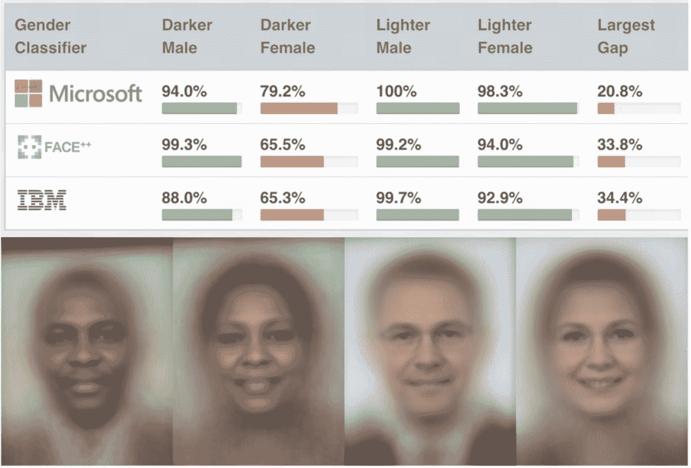
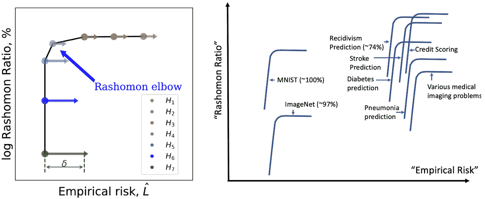
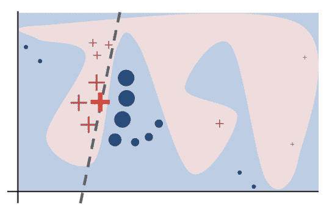
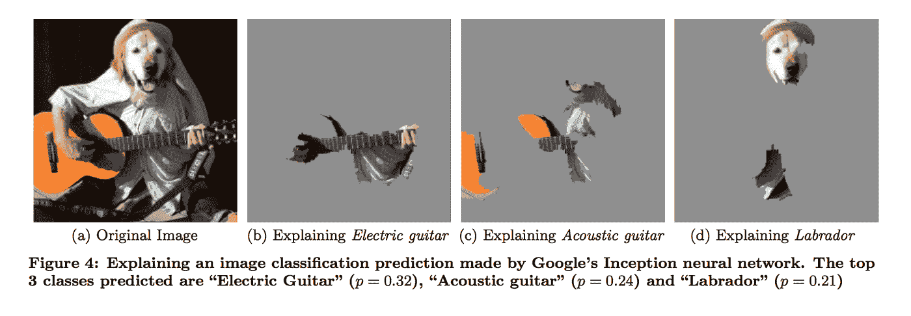
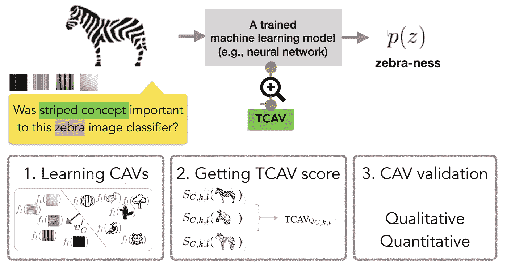

# 在可解释的海洋中航行

> 原文：<https://towardsdatascience.com/navigating-the-sea-of-explainability-649672aa7bdd?source=collection_archive---------17----------------------->

## *设定正确的路线并负责任地驾驶*

*本文由*[*Joy rim chala*](https://medium.com/@Joy_Rimchala)*和*[*Shir Meir Lador*](https://medium.com/@DataLady)*合著。*

# 设定正确的路线

近年来复杂机器学习(ML)模型的快速采用给当今公司带来了新的挑战:如何解释、理解和解释这些复杂模型预测背后的推理。将复杂的人工智能系统视为可信赖的黑盒而不进行健全检查已经导致了一些灾难性的结果，正如最近在 [GenderShades](http://proceedings.mlr.press/v81/buolamwini18a.html) 中披露的性别和种族偏见所证明的那样。

随着 ML 辅助预测更深入地整合到高风险决策中，如医疗诊断、累犯风险预测、贷款审批流程等。了解 ML 预测的根本原因变得至关重要。如果我们知道某些模型预测反映了偏见，并且不符合我们的最佳知识和社会价值观(如平等机会政策或结果公平)，我们可以检测这些不良的 ML 缺陷，防止部署此类 ML 系统，并纠正模型缺陷。

The [GenderShades](http://gendershades.org/overview.html) study reported noticeable differences in gender classification accuracy of widely used face detection algorithms including [Microsoft Cognitive Services Face API](https://azure.microsoft.com/en-us/services/cognitive-services/face/), [FACE++](https://www.faceplusplus.com/), and [IBM watson visual recognition](https://www.ibm.com/watson/services/visual-recognition/?mhsrc=ibmsearch_a&mhq=face%20recognition). There’s a large gap in gender misclassification rates among different subgroups, with the largest gap of 34.4% observed between a lighter skinned male face compared to darker skinned female face.

我们在 Intuit 的使命是*为全世界的繁荣提供动力*。为了帮助小企业和个人增加成功的几率，在过去几年中，Intuit 一直在其平台和解决方案中注入人工智能和人工智能。作为 Intuit 的数据科学家，我们拥有独特的特权和权力来开发 ML 模型，这些模型做出的决策会影响人们的生活。有了这种权力，我们也有责任确保我们的模型符合最高标准，不以任何方式进行歧视。*“不妥协的诚信”*是 Intuit 的核心价值观之一。随着我们成为一个人工智能/人工智能驱动的组织，机器可理解性已经成为 Intuit 人工智能/人工智能产品的优先事项。

今年，Intuit 在 [KDD 2019](https://www.kdd.org/kdd2019/#!) 举办了一场可解释的人工智能研讨会( [XAI 2019](https://xai.kdd2019.a.intuit.com/) )。我们从此次研讨会中获得了许多宝贵的经验，并将开始将其融入我们的产品和服务战略中。

# 理解可解释性的当前状态

可解释性是一个活跃的研究领域，下面提供的描述旨在提供该领域当前状态的高度概括。根据被解释的模型是(a)黑盒(不可理解)还是(b)玻璃盒(可理解)，可解释性方法分为两大类。在下一节中，我们将解释和比较每种方法。我们还将描述如何使用可理解的模型来更好地理解我们的数据。然后，我们将回顾一种检测任何用例(罗生门曲线)的高性能可理解模型的方法。最后，我们将比较局部和全局解释以及基于特征和基于概念的解释。

# 黑匣子:

黑盒可解释性方法试图解释已经存在的 ML 模型，而不考虑模型的内部工作(即，学习的决策函数)。这类可解释性方法是模型不可知的，可以轻松地与各种 ML 模型集成，从基于决策树的模型到复杂的神经网络[⁴](https://arxiv.org/abs/1705.07857)[⁵](https://arxiv.org/abs/1807.08024)。应用黑盒可解释性并不要求 ML 从业者创建和训练模型的方式有任何改变。由于这个原因，黑盒可解释性方法在 ML 从业者中享有更广泛的采用。黑盒可解释性方法也被称为“事后”可解释性，因为它们可以用于在训练和部署后询问 ML 模型，而无需任何训练程序的知识。黑盒可解释性方法的例子包括[石灰](https://arxiv.org/pdf/1602.04938.pdf)、 [Shapley⁶、](http://papers.nips.cc/paper/7062-a-unified-approach-to-interpreting-model-predictions.pdf) [综合渐变](https://arxiv.org/abs/1703.01365) ⁷、[深度提升](https://arxiv.org/abs/1704.02685) ⁸等。事后模型解释是解释的代理。以这种方式得出的解释不一定保证对人友好、有用或可行。

# 玻璃盒子:

具有可理解的 ML 模型的玻璃盒子方法要求模型在前面是“可解释的”(也称为“预先的”)[⁰](https://arxiv.org/abs/1405.4047)。这种方法的优点是，ML 从业者可以轻松地梳理出模型解释，检测数据和/或标记缺陷，并且在某些情况下，如果模型决策与从业者的价值观或领域知识不一致，可以编辑模型决策。[微软研究院高级首席研究员、KDD·XAI 2019 主题演讲人之一 Rich Caruana](https://www.microsoft.com/en-us/research/people/rcaruana/) ，展示了他的团队如何基于广义可加模型(GAMs) 构建了一个高度准确、可理解、可编辑的 ML 模型，并将其应用于肺炎病例的死亡率预测  。[这个版本](https://www.cs.cornell.edu/~yinlou/papers/lou-kdd12.pdf)，也被命名为 GA2M(或 *"GAM on steroids"* )，通过[梯度增强](https://en.wikipedia.org/wiki/Gradient_boosting)而不是原始版本中的三次[样条](http://mathworld.wolfram.com/CubicSpline.html)进行优化，并实现了与现代 ML 模型(如随机森林或梯度增强树)相当的结果。

# 使用可理解的模型

卡鲁阿纳分享了他的团队如何使用可理解的模型来更好地理解和纠正他们的数据。例如，可理解模型了解到一条规则，即有哮喘病史的肺炎患者死于肺炎的风险低于普通人群。这一规则是违反直觉的，但反映了训练数据中的真实模式:有哮喘病史并表现出肺炎症状的患者通常不仅被送入医院，而且直接被送入重症监护室。哮喘性肺炎患者接受的积极治疗非常有效，与普通人群相比，降低了他们死于肺炎的风险。因为这些患者的预后好于平均水平，根据数据训练的模型错误地认为哮喘降低了死亡风险，而事实上哮喘患者的风险要高得多(如果不积极治疗的话)。

如果更简单、更易懂的模型可以学习违反直觉的关联——例如，*患有哮喘意味着更低的肺炎风险*——更复杂的基于神经网络的算法可能也能做到这一点。即使我们可以从数据中去除哮喘偏见，还有哪些不正确的事情被了解到？这是[统计混淆](https://en.wikipedia.org/wiki/Confounding)的经典问题:当一个变量(在我们的例子中，治疗强度)同时与因变量和自变量相关时，会导致虚假关联。治疗强度受哮喘变量的影响，从而降低死亡风险。

这一观察说明了模型可理解性在高风险决策中的重要性。捕捉数据中真实但虚假的模式或特质的模型——如肺炎例子中的虚假关联或社会偏见——可能会产生导致不良后果(如虐待患者)的预测。当前的 ML 模型被训练为最小化训练数据的预测误差，而不是与任何人类直觉和概念一致，因此不能保证模型将与人类的价值观一致。通常，在人类管理的数据集上训练的 ML 模型将反映数据中的缺陷或偏差  。一个可理解的模型允许这些缺陷在模型验证期间出现。

目前，只有一小部分算法——即基于决策树的模型和广义加性模型(gam)——是可理解的。基于决策树的模型和 gam 不用于 ML 应用(如计算机视觉、自然语言处理和时间序列预测)，因为这些模型的最佳可能版本目前不能在复杂的基于深度神经网络的模型的最先进水平上执行。

# 为任何用例检测高性能的可理解模型

当我们能够在同等性能的可理解和黑盒模型之间进行选择时，最佳实践是选择可理解的那个 [⁴](https://arxiv.org/abs/1811.10154) 。我们如何知道对于一个特定的应用程序是否存在一个高性能的可理解的模型？[杜克大学计算机科学教授、数理统计研究所(IMS)2019 年研究员(也是 KDD XAI 2019 的小组成员)辛西娅·鲁丁](https://users.cs.duke.edu/~cynthia/)提出了一种诊断工具，称为“*罗生门曲线*”、 [⁵](https://arxiv.org/abs/1908.01755) ，可以帮助 ML 从业者回答这个问题。

我们先定义几个术语。“罗生门效应”指的是这样一种情况，在这种情况下，存在许多不同的、几乎同样准确的描述来解释一种现象。“罗生门效应”一词源自一部受欢迎的日本电影([罗生门](https://en.wikipedia.org/wiki/Rashomon))，这部电影以涉及不同角色对同一事件进行自私描述的情节而闻名。在模型类中所有可能模型的假设空间上定义的*“罗生门集”*，是训练性能接近类中最佳模型的 ML 模型的子集。*“罗生门比率”*是罗生门集的基数除以所有可能模型的基数(精确度不同)。因此，为每个 ML 任务/数据集对唯一地定义了*“罗生门比率”*。当罗生门比率较大时，存在几个同样高精度的 ML 模型来解决该 ML 任务。罗生门集合中的这些高精度模型中的一些可能具有期望的属性，例如可理解性，并且寻找这样的模型可能是值得的。因此，罗生门比率作为最大似然问题简单性的指标。

在她的 [KDD 2019 主题演讲](https://www.youtube.com/watch?v=wL4X4lG20sM)中，Rudin 介绍了*“罗生门曲线”* [*⁵*](https://arxiv.org/abs/1908.01755) (见下图)，这是一条连接模型类层次结构的对数罗生门比率的诊断曲线，其复杂性随着经验风险(模型类上的错误率界限)的增加而增加。

**Left figure** : Empirical Rashomon sets are defined for each ML task/dataset pair and class of model (hypothesis space). Rashomon curves connect the Rashomon ratio of increasingly complex model classes as a function of empirical risk (the observed error of a particular model class). The horizontal part of the Γ-shape corresponds to a decrease in the empirical risk (increase in model accuracy) as we move through the hierarchy of hypothesis spaces (H1 on the top right to H7 on the bottom left). The length of arrow delta is the generalization error. If the ML problem is too complex for a model class considered, only the horizontal part of the Rashomon curve is observed. This is an indication that the model class considered is not complex enough to learn the training data well. On the other hand, if the ML model class considered is too complex for the training data, only the vertical part of the Rashomon curve is observed. **Right Figure:** The state-of-the-art for the various public ML problems/datasets on their own Rashomon curve, indicating whether it’s likely to be too complex or too simple for the given ML task/dataset pairs.

当解决一个 ML 问题时，人们可能会考虑从简单到复杂的模型(假设)类的模型类层次结构。起初，模型类对于 ML 任务来说仍然过于简单，并且模型的错误率随着复杂性的增加而不断降低。该观察对应于沿着罗生门曲线的水平部分从右向左移动。在这种情况下，罗生门体积以与所有可能模型的所有集合的体积大约相同的速率增长(具有不同的精度)。在 ML 模型类开始变得对 ML 任务太复杂的情况下，模型错误率保持不变。这相当于从顶部到底部遍历罗生门曲线的垂直部分。在这种情况下，所有可能模型的集合超过了罗生门集合，罗生门比率急剧下降。罗生门曲线的转折点(*“罗生门肘”*)是较低复杂性(较高的对数罗生门比率)和较高准确性(较低的经验风险)的最佳结合点。因此，在模型类的层次结构中，落在罗生门弯头附近的那些可能具有适当的复杂度水平，以实现高精度与期望属性(如概化和可解释性)之间的最佳平衡。

# 本地与全球解释

可解释性方法可以提供两种类型的解释:局部和全局 [⁶](https://arxiv.org/abs/1702.08608) 。本地解释描述了模型如何对单个数据实例进行分类，并回答了诸如*“哪个(些)数据元素对分类输出最负责？”*在图像分类中，这相当于识别哪个像素负责“猫”图像类别预测，以及负责多少。局部解释对于围绕单个数据点研究 ML 决策是至关重要的。

**LIME** [local interpretable model-agnostic explanations taken from [[2]](https://arxiv.org/pdf/1602.04938.pdf)]. The original model’s decision function is represented by the blue/pink background, and is clearly nonlinear. The bright red cross is the instance being explained (let’s call it X). Perturbed instances are sampled around X and are weighted according to their proximity to X (weight here is represented by size). Original model predictions are calculated on these perturbed instances. These are used to train a linear model (dashed line) that approximates the model well in the vicinity of X. Note that the explanation in this case is not faithful globally, but it is faithful locally around X.

This figure illustrates a local explanation of Google’s [Inception neural network](https://github.com/google/inception) on some arbitrary image. (4) keep as explanations of the parts of the image that are most positive toward a certain class. In this case, the classifier predicts Electric Guitar, even though the image contains an acoustic guitar. The explanation reveals why it would confuse the two: the fretboard is very similar.

另一方面，全局解释试图提供模型如何为整个对象类或数据集生成预测的整体概括，而不是集中在单个预测和数据点上。

The plots above demonstrate **global explanations** for a model trained on the [census income dataset](https://archive.ics.uci.edu/ml/datasets/census+income) to predict the income level for adults, based on demographic features. **The left figure** (calculated using [InterpertML](https://github.com/microsoft/interpret)) shows the score predicted by a GA2M model as a function of age. This directly illustrates the age contribution to the model. **The right figure** shows the mean absolute score of each feature to the model (aka feature importance).

两种最流行的全局解释技术是特征重要性和[部分依赖图](https://scikit-learn.org/stable/modules/partial_dependence.html)。特征重要性提供了一个分数，表明每个特征在模型构建中的有用性或价值。在基于决策树的模型中(如随机森林或梯度推进)，在决策树中用于做出关键决策的特征越多，其相对重要性就越高。部分相关性图(PDP)显示了目标变量和一组“目标”特征之间的相关性，忽略了所有其他特征(“补充”特征)的值。直观上，我们可以将部分相关性解释为作为“目标”特征的函数的预期目标响应。部分相关图有助于我们理解特定特征值如何影响预测，这对模型和数据调试很有用，如  所示。

# 基于特征与基于概念的解释

早期的可解释性方法依赖于使用输入特征来构建解释。这种方法被称为基于特征的解释。基于特征的解释的一个关键困难是，大多数 ML 模型对特征(如像素值)进行操作，这些特征不符合人类容易理解的高级概念。在她的 KDD XAI 2019 主题演讲中，谷歌大脑的高级研究科学家 [Been Kim](https://ai.google/research/people/106045/) 指出，基于特征的解释应用于最先进的复杂黑盒模型(如 [InceptionV3](https://arxiv.org/abs/1512.00567) 或 [GoogleLeNet](https://ai.google/research/pubs/pub43022) )可能会产生不合理的解释 [⁷](https://arxiv.org/abs/1810.03292) [⁸](https://arxiv.org/abs/1907.09701) 。更重要的是，对于输入特征具有高维数的 ML 问题的基于特征的解释不一定导致人类友好的解释。

**Testing with concept activation vectors (TCAV)** quantitatively measures how a “concept” (defined by a collection of inputs) is learned by a trained model by quantifying sensitivity of a model prediction class along the direction of concept activation vectors (CAVs). CAVs are defined per layer and per concept by training a linear classifier [such as support vector machine (SVM)] over the activation states of a layer of a pre-trained network using a collection of “concept-defining” inputs vs. random inputs (CAV testing inputs). These CAV testing inputs can be constructed post-hoc and do not need to be part of the training/evaluation and target task-specific datasets. TCAV can be used with both black box complex models as well as interpretable models. TCAV is currently publicly available at : [https://github.com/tensorflow/tcav](https://github.com/tensorflow/tcav)

基于概念的可解释性基于人类定义的概念构建解释，而不是基于特征和内部模型(激活)状态的输入表示。为了实现这一点，输入特征和模型内部状态以及人类定义的概念分别在两个向量空间中表示:(Em)和(Eh)。这两个向量空间之间的函数映射(如果存在的话)提供了一种从输入特征和 ML 模型内部状态中提取人类定义的概念的方式。

在她的主题演讲中，Kim 介绍了概念激活向量(TCAV)测试，这是一种在人类定义的概念空间(Eh)和模型内部状态(Em) [⁹](https://arxiv.org/abs/1711.11279) 之间进行定量翻译的程序。TCAV 需要两个主要成分:(1)包含概念的输入和负样本(随机输入)，以及(2)测试概念的预训练 ML 模型。为了测试训练的 ML 模型捕获特定概念的程度，在训练的 ML 模型的子组件(层)上推断包含概念的输入和随机输入。然后，训练诸如支持向量机的线性分类器，以区分由包含概念的输入和随机输入引起的网络激活。这种训练的结果是概念激活向量(CAV)。一旦定义了 CAV，就可以为属于一个类的每个实例计算沿着 CAV 的类概率的方向导数。最后，一个类的“概念重要性”被计算为该类中被包含输入的概念相对于随机输入积极激活的实例的分数。这种方法允许人类询问模型是否“学习”了特定的可表达概念，以及学习得如何。

例如，人类可以使用 TCAV 询问计算机视觉模型“X”如何学习关联医生图像中的“白大褂”或“听诊器”的概念。为了做到这一点，人类测试人员可以首先收集一组包含白大褂和随机图像的图像，然后对这组图像应用预训练的“X”来获得预测，并计算“白大褂”概念的 TCAV 分数。该 TCAV 分数量化了在图像分类任务中“白大褂”的概念对于“医生”类别的预测的重要性。TCAV 是一种示例驱动的方法，所以它仍然需要仔细选择概念数据实例作为输入。TCAV 还依赖人类来生成要测试的概念，并让概念可以在概念输入中表达出来。

Example of a realistic use of **TCAV** to quantify how much the concepts of “white coat,” “stethoscope,” and “male” are important for an image classification model for a positive prediction of the “doctor” class.

像 TCAV 这样基于概念的可解释性方法是提取“人类友好”的 ML 解释的一个步骤。对于模型预测是否明智，以及它们是否符合我们的积极价值观，这取决于今天的 ML 从业者做出负责任和正确的判断。纠正训练有素的黑盒 ML 模型中的缺陷取决于我们，TCAV 可以帮助说明缺陷在哪里。

# 我们能做得更好吗？

作为一个人工智能实践者的社区，我们有责任清楚地定义我们希望可解释的人工智能成为什么，并建立指导方针，以产生考虑到使用*什么*条信息、*如何*(以什么方式)以有益(而不是有害或滥用)的方式构建可解释性，以及*何时*(在什么情况/背景下和向谁)交付它的解释。虽然今天可解释的人工智能方法有助于查明 ML 系统中的缺陷，但我们面前还有很多工作要做。

现在，这里有一些将可解释性带到当今实践最前沿的技巧:

*   尽可能选择易于理解的模型。
*   使用易懂的模型和当地的解释，确保模型和数据符合你的领域知识和社会价值观。
*   衡量机器学习模型的性能，以确保决策符合社会价值观(例如，当建模数据包括受保护的群体时，优化一致性和平等机会以及准确性) [⁰](https://arxiv.org/abs/1806.07538) 。
*   将因果关系构建到模型解释中  。
*   衡量解释的有用性和可操作性  。

# 结束语

在短短的几年时间里，可解释的人工智能作为一个领域已经走了很长的路。作为本次研讨会的共同组织者，我们有幸见证了对 ML 中可解释性的巨大热情。对我们所有人来说，可解释性可能是我们的“正北”为了人类的利益，我们如何通过确保“我们的价值观一致，我们的知识得到反映”来负责任地使用 ML。这超出了获得最终用户信任或获得狭义公平的范围。我们希望将可解释性与社会价值观结合起来，为那些生活和生计与多发性硬化症接触或受其影响的人造福。

# 承认

我们要感谢及时帮助审查 XAI·KDD 研讨会论文的志愿者团体。我们也非常感谢我们的研讨会发言人和小组成员分享他们的知识，智慧和精彩的内容。

# 参考资料:

*【1】Joy Buolamwini，Timnit Gebru。性别差异:商业性别分类的交叉准确性差异。【2018 年 [PMLR 第一届公平、问责和透明会议论文集 81:77–91](http://proceedings.mlr.press/v81/buolamwini18a.html)。*

[2]马尔科·图利奥·里贝罗、萨梅尔·辛格和卡洛斯·盖斯特林。机器学习的模型不可知可解释性。 [arXiv 预印本 arXiv:1606.05386](https://arxiv.org/abs/1606.05386) ，2016。

*[3]露丝·C·方和安德里亚·韦达尔迪。通过有意义的扰动对黑盒的可解释的解释。*2017 年 IEEE 计算机视觉国际会议(ICCV)论文集[第 3429–3437 页](https://arxiv.org/abs/1704.03296)。

*[4]彼得·达布考斯基和亚林·加尔。黑盒分类器的实时图像显著性。*神经信息处理系统进展(NIPS) 2017，[第 6967–6976 页](https://arxiv.org/abs/1705.07857)。

*[5]春-常昊、埃利奥特·克里奇尔、安娜·戈登堡和大卫·杜文瑙德。通过反事实生成解释图像分类器。*载于[2019 年第三届学习表征国际会议(ICLR)论文集](https://arxiv.org/abs/1807.08024)。

6 Scoot Lundberg 和 Su-In Lee。解释模型预测的统一方法。于 [*神经信息处理系统进展，2017*](https://arxiv.org/abs/1705.07874) *。*

[7]穆昆德·孙达拉扬，安库尔·塔利，奇奇扬。*深度网络的公理化属性。*载于《第 34 届国际机器学习大会(ICML)论文集》2017 年第 70 卷，[第 3319–3328 页](https://arxiv.org/abs/1703.01365)。

[8]两代情·什里库马尔、佩顿·格林赛德、安舒尔·昆达耶。*通过传播激活差异学习重要特征。*ICML 2017 与 PMLR 第 70 卷第 3145–3153 页。

[9]基姆、辛西娅·鲁丁和朱莉·沙阿。*贝叶斯案例模型:基于案例推理和原型分类的生成方法。*在 NIPS 2014 中，[第 1952–1960 页](https://arxiv.org/abs/1503.01161)。

[10] B .乌斯顿和 c .鲁丁。可解释线性分类的方法和模型。*[arXiv:1405.4047](https://arxiv.org/abs/1405.4047)2014*。**

*[11]特雷弗·哈斯蒂·罗伯特·蒂布拉尼。广义可加模型:一些应用。美国统计协会杂志 1987 年 [82:398，371–386](https://www.tandfonline.com/doi/abs/10.1080/01621459.1987.10478440)。*

*【12】[里奇·卡鲁阿纳](https://www.microsoft.com/en-us/research/people/rcaruana/)，[保罗·科赫](https://www.microsoft.com/en-us/research/people/paulkoch/)，尹娄，马克·斯特姆[，约翰内斯·戈尔克](https://www.microsoft.com/en-us/research/people/johannes/)，小糯米·埃尔哈达德。*可理解的医疗保健模型:预测肺炎风险和住院 30 天再入院。*第 21 届 ACM SIGKDD 知识发现和数据挖掘国际会议论文集[第 1721–1730 页](https://www.microsoft.com/en-us/research/publication/intelligible-models-healthcare-predicting-pneumonia-risk-hospital-30-day-readmission/)。*

*[13] Yair Horesh，Noa Haas，Elhanan Mishraky，Yehezkel S. Resheff，Shir Meir Lador*Paired-Consistency:一种基于示例的模型不可知方法，用于机器学习中的公平性正则化。于*[*arXiv:1908.02641*](https://arxiv.org/abs/1908.02641)*，2019。**

*14 辛西娅·鲁丁。停止解释高风险决策的黑盒机器学习模型，转而使用可解释的模型。载于《自然机器智能》(2019)第 1 卷，[第 206–215 页](https://arxiv.org/abs/1811.10154)。*

*[15] Semenova、Lesia 和 Cynthia Rudin。*罗生门曲线和体积研究:机器学习中泛化和模型简单性的新视角。*arXiv 预印本 [arXiv:1908.01755](https://arxiv.org/abs/1908.01755) ，2019。*

*[16]金，后土和多希-维勒兹，终曲。*迈向可解释机器学习的严谨科学。于*[*arXiv:1702.08608*](https://arxiv.org/abs/1702.08608)*，2017。**

*[17]朱利叶斯·阿德巴约，贾斯汀·吉尔默，迈克尔·穆勒，伊恩·古德菲勒，莫里茨·哈特，被金。显著图的完整性检查。在*[*neur IPS 2018*](https://arxiv.org/abs/1810.03292)*。***

**[18]杨和 Been Kim *BIM:用地面真值对可解释性方法进行量化评估。在*[*arXiv:1907.09701*](https://arxiv.org/abs/1907.09701)*，2019。***

**[19] Been Kim、Martin Wattenberg、Justin Gilmer、Carrie Cai、James Wexler、Fernanda Viegas 和 Rory Sayres。*特征归因之外的可解释性:用概念激活向量进行定量测试(TCAV)。在 ICML 2018，* [*第 2673–2682 页*](https://arxiv.org/abs/1711.11279) *。***

**[20]汤米·雅各布拉·大卫·阿尔瓦雷斯-梅利斯。*用自解释神经网络实现健壮的可解释性。*于 [arXiv:1806.07538](https://arxiv.org/abs/1806.07538) ，2018。**

**[21] Yash Goyal，Uri Shalit，Been Kim。*用因果概念效应(CaCE)解释量词。在*[*arXiv:1907.07165*](https://arxiv.org/abs/1907.07165)*，2019。***

**[22]伯克·乌斯顿，亚历山大·斯潘赫，刘洋。*线性分类中的可操作追索权。*在 2019 年公平、问责和透明会议(FAT*)会议记录中，[第 10–19 页](https://arxiv.org/abs/1809.06514) *。***