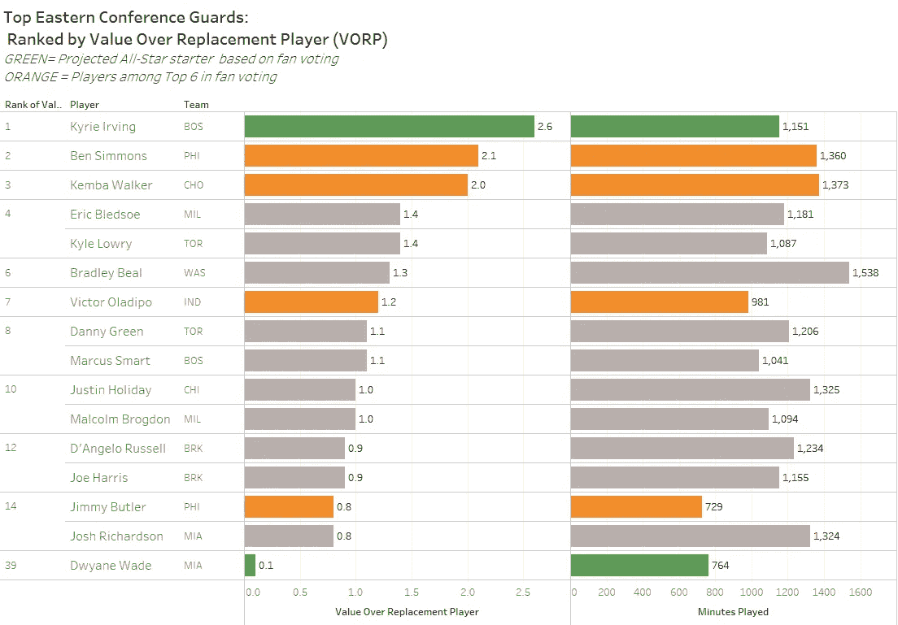
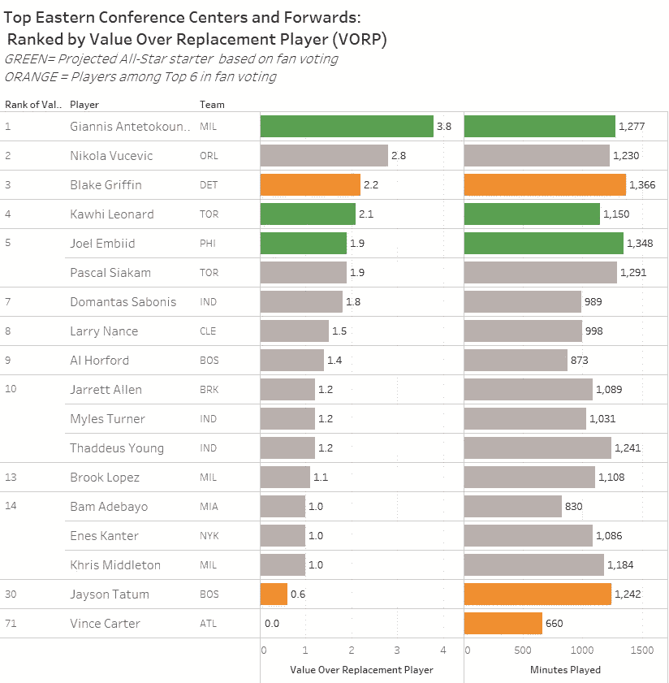
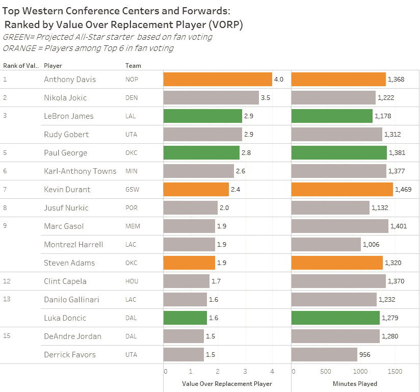
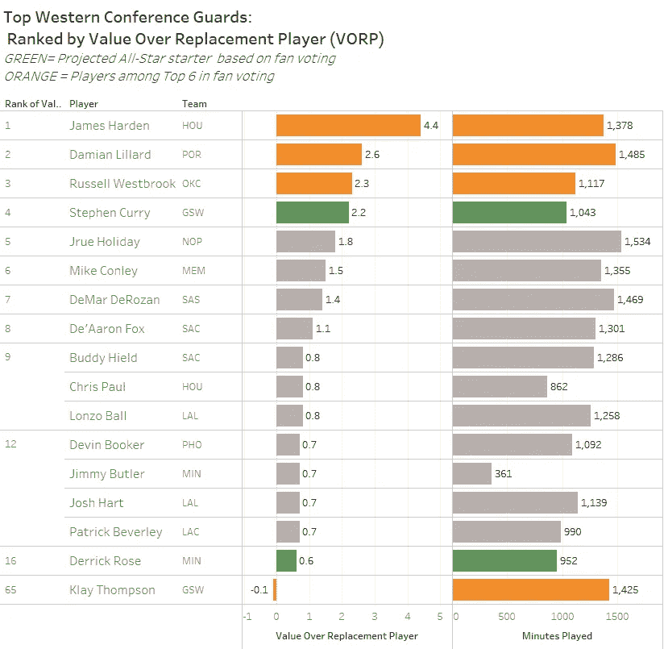

# NBA 全明星球迷投票与球员价值(VORP):谁真的值得成为全明星首发？

> 原文：<https://towardsdatascience.com/nba-all-star-fan-voting-vs-player-value-vorp-who-really-deserves-to-be-an-all-star-starter-325e750d6f6a?source=collection_archive---------11----------------------->

*作为本月早些时候我的帖子的后续，其中* [*比较了赢份额和上场时间*](/nba-all-star-votes-vs-on-court-production-which-players-really-belong-in-the-all-star-game-e0749012cb17) *等游戏内指标中领先的全明星投票接受者，我今天写的是关于哪些球员(根据 1 月 10 日**NBA 报道的球迷投票结果)目前被预测为全明星冷门，哪些可能不是最值得全明星首发的球员。*

在这份报告中，我将比较球员的球迷投票和他们的 VORP，或替换球员的价值(定义如下)，这是一个有用的高级指标，可以估计每个球员对他们球队的价值。没有一个标准可以完全理解一个球员的价值，但是 VORP 提供了一个很好的指示。

注意，粉丝投票占流程的 50%。剩下的 50%的加权全明星投票被委托给 NBA 球员和媒体。这个规则的改变是几年前做出的，目的是帮助最值得的球员获得全明星首发的荣誉，但是球迷的投票仍然占加权投票的很大一部分。

*我来看看全明星投票的四个部分(东部联盟后卫、东部联盟前场、西部联盟后卫和西部联盟前场)的以下指标:*

- ***超过替补球员的价值(VORP)****:*[*篮球参考*](https://www.basketball-reference.com/about/bpm.html#vorp) *将 VORP 定义为一个衡量每个球员对球队的整体贡献的标准，衡量的是理论上的“替补球员”会提供什么，其中“替补球员”被定义为拿最低工资的球员或者不是球队轮换中的正常成员。*

-***VORP 排名*** *:每个玩家由 VORP 排名，从高到低决定哪个玩家的 VORP 最高。*

- ***上场分钟*** *:本赛季(截至 2019 年 1 月 11 日)的上场分钟数。*

- ***全明星投票*** *:*

o 绿色的 ***条*** *表示基于球迷投票，目前处于全明星首发位置的球员。*

o

****东部会议守卫****

****

*****预计全明星首发(基于球迷投票)*****

**东部的首发后卫和他们的 VORP 截然相反。凯里·欧文的 VORP 2.6 的成绩令人印象深刻，比紧随其后的东部后卫高出 0.5，显然他赢得了比赛的首发位置。另一方面，未来的名人堂成员德韦恩·韦德(Dwayne Wade)管理着一个可怜的. 1 VORP，只排在第 39 位，然而他的遗产使他的投票数上升到前 2 位。**

*****谁应该首发(以 VORP 为准)*****

**虽然我不怪球迷多愁善感，但基于本·西蒙斯 2.1 的 VORP，他应该和欧文一起首发。他在粉丝投票中排名前 6，但在第二首发位置的投票中落后于德韦恩·韦德。**

****气泡上的*气泡上的*****

***肯巴·沃克的赛季在 VORP 排名第三，在投票中也是前六名之一，但是如果他想在这场大赛中首发，他需要与媒体和他的队友和解。***

***东部联盟前场***

******

******预计全明星首发(基于球迷投票)******

*****扬尼斯·阿德托昆博**，又名希腊怪胎，以领先的 3.8 VORP，比第二名高出 1 分，碾压东部联盟前场。***

*****科怀·伦纳德**和**乔尔·恩比德**分别拥有第四和第五高的 VORPs，但发现自己目前处于首发位置，因为在粉丝投票中名列前三。***

******【VORP】谁应该首发******

***单从 VORP 来看，詹尼斯应该会和**尼古拉·武切维奇**和**布雷克·格里芬**一起进入首发阵容。尽管拥有第二好的 VORP，奥兰多的尼古拉·武切维奇在球迷投票中甚至没有进入前 6 名，这使得全明星首发不太可能。布雷克·格里芬通过增加一个越来越有效的三分球彻底改变了他的比赛，并在他的新家接受了他的领导角色，产生了第三高的 VORP，但目前在球迷投票中排名前三。***

******其他玩家的注意事项******

***杰森·塔图姆的第二季无论如何都不算差，但从他轰动的新秀赛季开始，表现出了生产力的下降。他的 VORP 目前是 0.6，与上赛季他以 1.8 的 VORP 成绩结束比赛时相差甚远。尽管前场球员 VORP 排名第 30，但他目前在投票中排名前 6。**文斯·卡特**在仅仅 660 分钟的比赛中拥有 0.0 的 VORP，但仍然是前场领袖之一。***

*****西部联盟前场球员*****

******

******预计全明星首发(基于球迷投票):******

***正如他们在他因伤缺席期间所见证的那样，很容易看出勒布朗·詹姆斯对一支多年未能进入季后赛的湖人队的重要性。然而，特别是由于前面提到的伤停补时，勒布朗发现自己的 VORP 排名第三。不过，看到国王再次领先粉丝投票并不奇怪。保罗·乔治在西部前场球员中拥有第二多的选票。他对 OKC 的成功起了很大作用，即使面对威斯布鲁克糟糕的投篮，但乔治只有第五高的 VORP。排在第 13 位的是卢卡·东契奇，尽管他是年度最佳新秀，但还没有全明星级别的 VORP。然而，球迷们对东契奇感到兴奋，他已经向达拉斯展示了未来几年的期望，他目前在球迷投票中保持着前 3 名的位置，这使他在全明星赛中处于有利的位置。***

******谁应该首发(以 VORP 为准)******

***除了詹姆斯，安东尼·戴维斯和尼古拉·约基奇都属于开球时的场地。超级巨星，潜在的交易目标，安东尼·戴维斯以 4.0 的 VORP 领先所有前场球员。这两支球队正在努力在一个满载的西部联盟中生存，但安东尼·戴维斯荒谬的比赛水平仍然让鹈鹕队在几场比赛之内成为第八种子。他是粉丝投票的前六名之一，但不是前三名，需要帮助才能获得首发位置。掘金的尼古拉·约基奇拥有第二高的 VORP，但在球迷投票中甚至没有进入前 6 名。他为西部领先的丹佛掘金队效力，但这仍然不足以让他得到球迷应有的关注。***

*****西域都护府*****

******

****预计全明星首发(基于球迷投票):****

*****斯蒂芬·库里**和**德里克·罗斯**目前被设定为预计的西部首发前锋(根据目前的球迷投票统计)，尽管他们分别拥有第 4 和第 16 名最佳前锋，并且本赛季比其他精英后卫多打了数百分钟。***

******【VORP】***谁应该首发***

*****詹姆斯·哈登传奇般的赛季至今和灼热的 4.4 VORP 不足以使他成为全明星首发，如果粉丝投票保持原样，他将不得不依靠媒体和球员投票。**达米恩·利拉德**拥有第二高的 VORP，但目前在粉丝投票方面不在前两名之内。*****

******上泡******

***尽管拉塞尔·维斯特布鲁克经历了历史上糟糕的投篮赛季，但他仍然拥有第三高的 VORP，显示了他在球场上的积极影响。他在粉丝投票中是前 6 名，但不是前两名。***

******其他玩家注意******

***上赛季克莱·汤普森的受欢迎程度已经进入了前 6 名，尽管 VORP 排名第 65 位，VORP 排名惊人的 0.1。***

****感谢您阅读我最新的数据贴。* [*点击这里我的第一篇 NBA 全明星帖子，比较全明星投票和上场时间以及赢球份额*](/nba-all-star-votes-vs-on-court-production-which-players-really-belong-in-the-all-star-game-e0749012cb17) *。请继续关注我的后续帖子，在那里我将看看哪些值得的玩家目前发现自己在外面观望。作为一名产品营销和数据分析专业人士，我对数据支持的讲故事充满热情。这些数据新闻帖子是我将真实数据与我个人的不同兴趣整合起来的方式，这些兴趣包括从旅行和娱乐到经济和社会问题的任何事情。
如果您有任何评论、故事想法或预期的数据项目，请随时发送电子邮件至 dwpwriting <邮箱至> gmail < dot > com，访问我的网站至*[*dwpeterson.com*](http://dwpeterson.com)*，或通过*[*LinkedIn*](https://www.linkedin.com/in/davidwpeterson/)*联系我。****