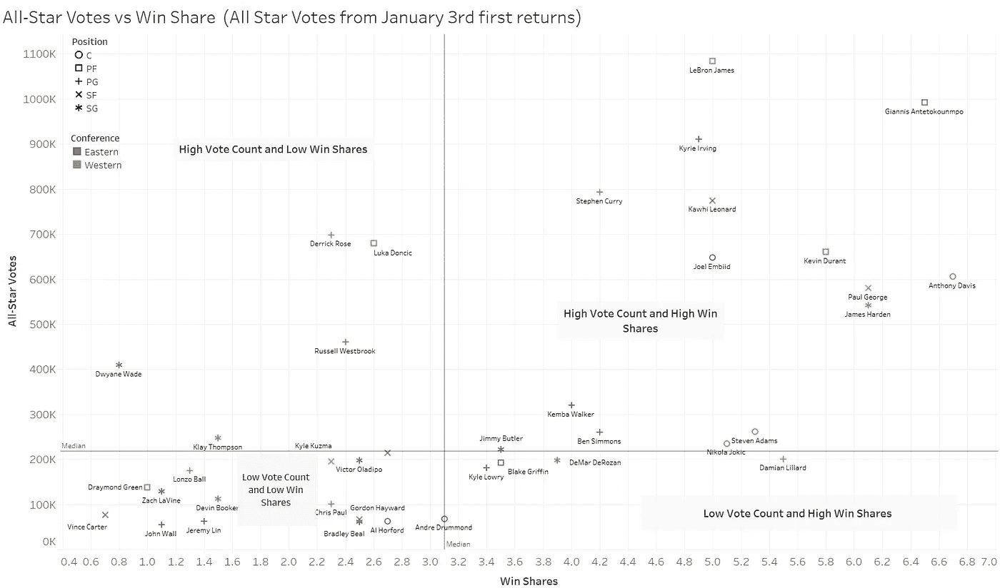

# NBA 全明星投票与场上表现:哪些球员真正属于全明星赛？

> 原文：<https://towardsdatascience.com/nba-all-star-votes-vs-on-court-production-which-players-really-belong-in-the-all-star-game-e0749012cb17?source=collection_archive---------25----------------------->

这篇文章分析了迄今为止获得全明星投票最多的 NBA 球员，并将其与他们在球场上的表现进行了比较。

周四，NBA 发布了[首届 2019 NBA 全明星投票结果](http://www.nba.com/article/2019/01/03/all-star-voting-2019-first-returns-official-release)。因为报道的总数是基于球迷的投票，所以有一种固有的偏见倾向于那些知名度更高、过去更成功的球员，或者是在大市场的球员。在今天的报道中，我将通过几个场上指标(上场时间和提前获胜份额统计)来比较这些票数领先的人，以了解这些潜在的全明星球员中谁属于这场大赛，以及谁在场上每分钟获得的票数最多。

在接下来的帖子里，我会看看哪些值得的玩家发现他们自己在看外面。这篇文章着眼于[第一轮投票结果](Http://Www.Nba.Com/Article/2019/01/03/All-Star-Voting-2019-First-Returns-Official-Release)，并使用了从[1 月 4 日](https://www.basketball-reference.com/leagues/NBA_2019_advanced.html)开始的球员数据。

**每分钟得分票数(2018-2019 赛季):** *谁是每分钟得分最高的全明星球员？*

不出所料，勒布朗·詹姆斯进军大市场并没有影响他的人气。詹姆斯在所有投票接受者中领先，本赛季每分钟获得 919.7 票。有点令人惊讶的是，扬尼斯·阿德托昆博(每分钟 851 票)和凯里·欧文(每分钟 828 票)获得票数的速度比斯蒂芬·库里(每分钟 816 票)快。

尽管詹姆斯·哈登的表现超凡脱俗，但他每分钟仅获得 429 张选票，在榜单上仅排在第 14 位。

在名单的底部，华盛顿奇才队的后场约翰·沃尔和布拉德利·比尔分别获得每分钟 49 票和 43 票。

这可能是一个很好的时机来提一下，德马库斯·考辛斯以 92，977 张选票名列前茅，尽管今年到目前为止没有参加一场比赛。

**(会议)每分钟收到的投票数**

即使吉米·巴特勒和科怀·莱昂哈德转投东部联盟，勒布朗的西部之旅也推动了西部联盟的优势。再一次，尽管本赛季打了 0 分钟，德马库斯·考辛斯获得的票数超过了 7 名东部球员。

**全明星投票 vs 赢股:**这些潜在的全明星球员在球场上对球队的实际影响如何？

赢股是一种玩家统计，试图将团队成功的功劳分配给团队中的个人。关于赢股更深入的解释可以在 [*这里*](https://www.basketball-reference.com/about/ws.html) *找到。*

这个散点图比较了每个顶级投票接受者的全明星投票数和他们对自己团队的估计价值。

**为球队的成功做出巨大贡献并获得大量全明星投票的球员:**正如你在散点图中看到的，这些超级巨星为他们的球队创造了非凡的价值(赢得 4.8+的股份)，迄今为止已获得超过 500，000 次全明星投票。安东尼·戴维斯在赢得份额(6.7)方面领先，但在多数投票中排名第十。

**被低估的高影响力玩家:**赢得份额高但票数低的玩家。尽管他们为球队的成功做出了很大的贡献，但像凯尔·洛瑞(多伦多)、布雷克·格里芬(底特律)、德马尔·德罗赞(圣安东尼奥)和达米恩·利拉德(波特兰)这样的小市场明星发现自己也在这个名单上。

**被高估的低影响力球员:**这些球员的投票受欢迎程度目前超过了他们在球场上的影响力。常年全明星如拉塞尔·维斯特布鲁克和克莱·汤普森，以及罗伊候选人卢卡·东契奇发现自己在这个名单上。

**在球场上影响力低、投票率低的球员:**这个群体是一个大杂烩，既有低迷时期的前全明星球员(克里斯·保罗、德雷蒙德·格林和戈登·海沃德)，也有由于市场大而投票率高的优秀球员(但不是全明星球员)(湖人队的朗佐·鲍尔和凯尔·库兹马，凯尔特人队的戈登·海沃德和艾尔·霍福德)。

*感谢您阅读我最新的数据帖子。请继续关注我的后续帖子，在那里我将看看哪些值得的玩家目前发现自己在外面观望。作为一名产品营销和数据分析专业人士，我对数据支持的讲故事充满热情。这些数据新闻帖子是我将真实数据与我个人的不同兴趣整合起来的方式，这些兴趣包括从旅行和娱乐到经济和社会问题的任何事情。
如果您有任何评论、故事想法或预期的数据项目，请随时发送电子邮件至 dwpwriting <至> gmail < dot > com 或通过*[*LinkedIn*](https://www.linkedin.com/in/davidwpeterson/)*联系我。*