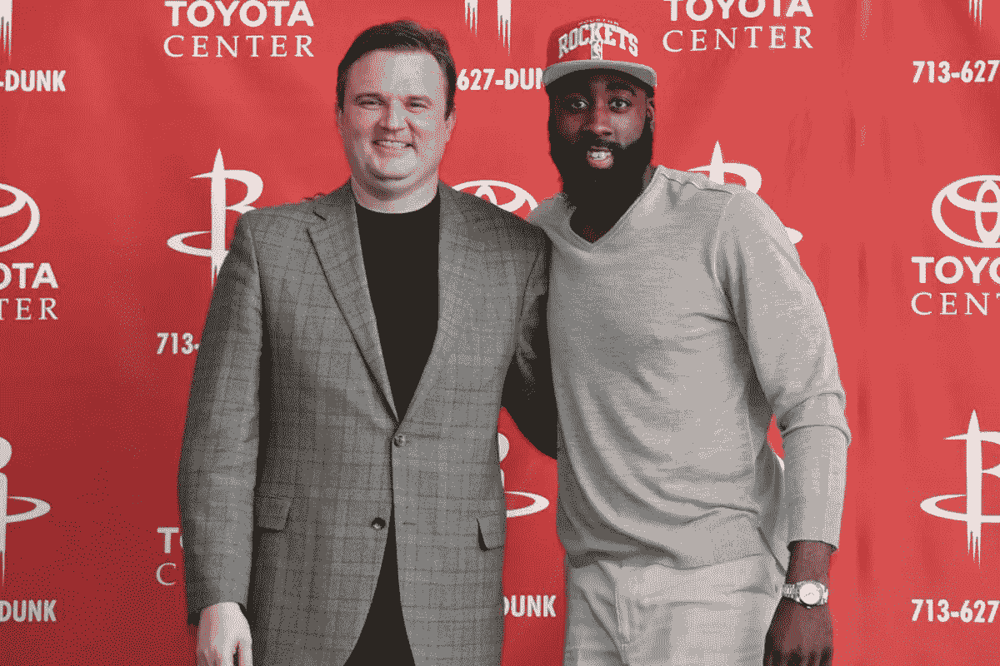
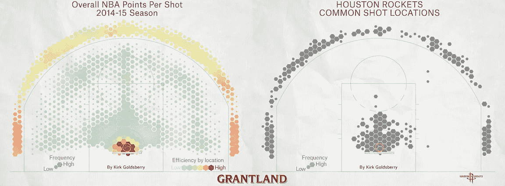
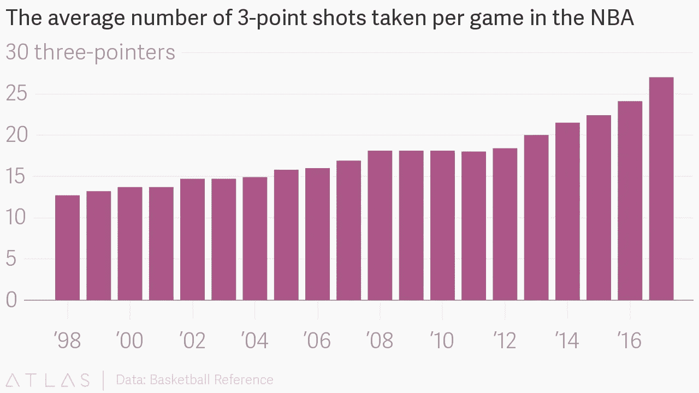
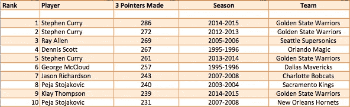
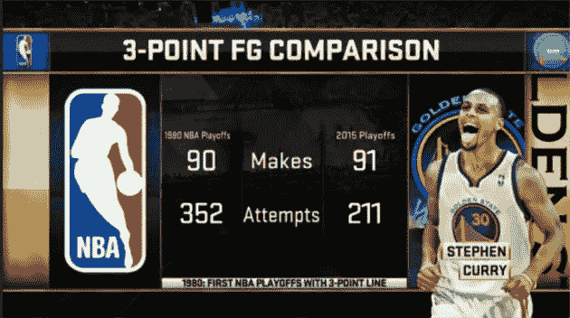
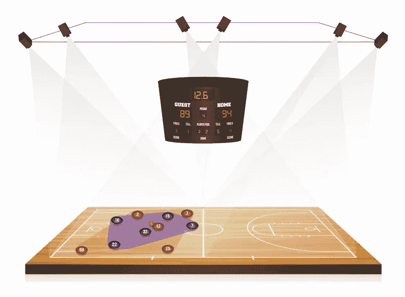
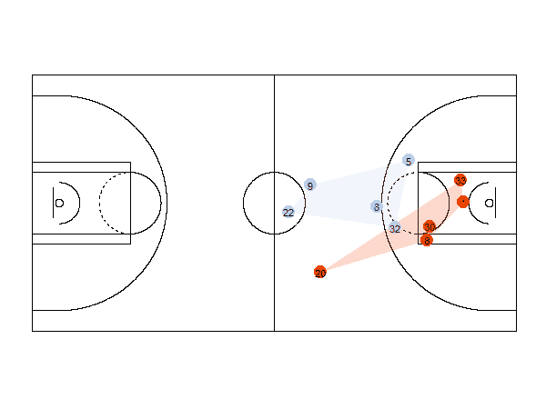
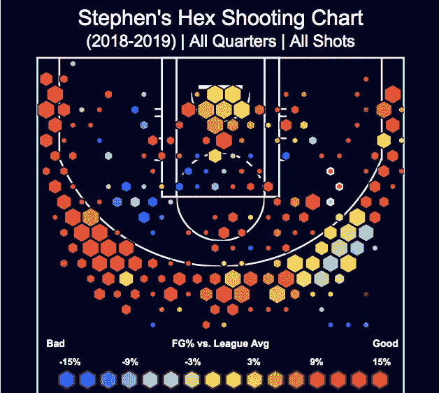

# NBA 数据分析:改变游戏

> 原文：<https://towardsdatascience.com/nba-data-analytics-changing-the-game-a9ad59d1f116?source=collection_archive---------3----------------------->

## 三点射击和数据可视化工具

> “分析是我们现在做的几乎所有事情的一部分”——NBA 专员亚当·席尔瓦

如果你是 NBA 的粉丝，你会很清楚 NBA 正在经历一场巨大的变革。比赛本身也在改变，因为球队正在发现新的方法来制定策略，以克服平庸的障碍，成为争夺冠军的球队。成为冠军争夺者的这一“过程”在很大程度上是由于**数据分析**。尽管备受争议，但它已被证明是将过去的平庸球队转变为竞争者的有效策略。

就在十年前，只有几支 NBA 球队在他们的前台办公室里有分析部门。今天，几乎所有 NBA 球队的前台都有数据分析师员工。利用数据分析是一种趋势，渗透到这项运动的每个方面，从新秀球探，发现被低估的球员，计算有效投篮，三分球的崛起，等等。所有这些都是为了打造一支冠军球队。

尽管这场革命很酷，但它不会没有批评者。查尔斯·巴克利等许多前玩家是数据分析的坚定反对者。

# 达里尔·莫雷-休斯顿火箭队

真正推动数据分析驱动篮球的个人之一是达里尔·莫雷，他自 2007 年以来一直是休斯顿火箭队的总经理。

因为莫雷的背景是统计学而不是篮球，他受到了评论员和球迷的批评，他们厌倦了莫雷和他的休斯顿火箭队重复的比赛风格。这种玩法是数据驱动的。

但是尽管有这些批评，火箭在最近几年已经证明了他们是强大的对手和竞争者。在 2017-2018 赛季，尽管有伤病，火箭队还是进入了西部决赛。在同一个赛季，他们创造了单赛季三分球数量的历史记录，同时在人才济济的西部联盟中排名第一。

[Houston Shot Locations](https://digital.hbs.edu/platform-digit/submission/moreyball-the-houston-rockets-and-analytics/)

正如你在上面看到的，休斯顿的投篮选择开始变得可预测了。

## **三分球的改编**

数据分析改变篮球比赛的最大方式之一是三分球尝试的增加。分析师们研究了比赛和投篮，以确定哪些投篮更有可能推动球队取得胜利。

其中一个分析是，很多球员都投了远距离低效的 2 分球。由于缺乏成为一个篮子的可能性，整个联盟的分析师和教练组开始鼓励他们球队的射手在三分线上投更多的球。从统计学上来说，一个相当不错的射手有 35%的几率会投中。如果一个射手投了 3 次球，其中一次成功了，那么这份财产就值了。

主要的收获是，从 3 点线上的额外点获得的 50%的回报使得长距离的尝试是值得的。下面，你可以查看 1998-2017 年平均每场 3 分出手次数的时间线。

## 斯蒂芬·库里和金州勇士队

另一支从早期就大量采用数据分析的球队是金州勇士队。在过去的 5 年里，他们都进入了 NBA 总决赛。勇士队一贯使用的方法之一是三分球。

[The Golden State Warriors hold 4 out of the top 10 record holders for 3 point shots made in a single season.](https://www.theatlantic.com/entertainment/archive/2015/06/nba-data-analytics/396776/)

Source: [Welcome to Smarter Basketball](https://www.theatlantic.com/entertainment/archive/2015/06/nba-data-analytics/396776/)

> 在美国广播公司转播总决赛期间发布的一张图表显示了库里领先他的同龄人有多远。库里在季后赛中的三分球已经超过了 1980 年整个 NBA 的三分球数。

在 2015 年季后赛中，金州勇士队的斯蒂芬·库里在季后赛系列赛中的三分球比 1980 年 NBA 季后赛的所有球员都多。这并不是将 1980 年的球员归类为天赋较低，而是代表了篮球运动在过去十年中发生了多么彻底的变化。

# 数据可视化工具和视频跟踪

现在数据分析趋势中出现的一个更酷的东西是正在被创建和调整以收集和可视化数据的技术。

NBA 与一家名为 STATS 的公司合作，在每个篮球馆安装 6 个摄像头，以每秒 25 帧的速度跟踪球员和裁判的动作，以获得最具分析性的数据，供球队和 NBA 进行分析。

这个系统的好处是数不胜数的，对于一个推动球队找到最好的竞争策略的联盟来说。

Source: [Analyzing NBA Basketball Data with R](https://blog.revolutionanalytics.com/2016/09/analyzing-nba-basketball-data-with-r.html)

有了这项技术，教练团队可以跟踪和分析比赛，根据他们将要对阵的球队或球星调整他们的防守和进攻策略。这些数据让玩家在如何根据对手和个人健康状况调整比赛和努力方面拥有优势。

金州勇士队在过去 5 年中如此成功的原因之一是他们愿意让他们的关键球员休息，如斯蒂芬·库里，T2 减少受伤的可能性，T4 确保球员可以打得更久。

这项技术有助于追踪球员最佳投篮的位置。我在研究中发现了以下网站，完全被玩家信息的详细程度所折服。

[看看吧！](https://bigleaguegraphs.com/nba/shot-charts)

这是斯蒂芬·库里在球场某些区域投篮时与联盟其他球队的差距。显然，斯蒂芬·库里更喜欢在三分线和内线投篮。

# 最后的反思和笔记

当团队考虑将数据分析纳入他们的战略时，他们需要明智地制定决策。策略不是简单的投三分。如果你没有一个能有效投三分球的球员，你就不会成功。

> “……团队取得了不同程度的成功。如果没有合适的球员来采用重分析的策略，团队很容易无法实现预期的结果。虽然三分球可能更有效率，但如果一支球队没有任何优秀的三分球手，这种策略仍然会让他们失败。”

也就是说，这种策略在大学篮球赛中也被采用。在 2018 年的三月疯狂中，维拉诺瓦大学打破了一场比赛中最多三分球的四强记录。

许多评论员是数据分析驱动篮球的坚定批评者。如前所述，NBA 鼓励球队在他们的策略中使用数据分析。但 NBA 和球队(特别是休斯顿火箭队)一直因重复的比赛风格和不受欢迎的方法而受到批评。为了避免重复的比赛风格，使比赛成为一场 3 分的比赛，一些人说要把 3 分线推得更远，让比赛变得更困难。

不管用什么方法，在 NBA 总裁亚当·席尔瓦的领导下，我毫不怀疑 NBA 正在考虑每一种可能的方式来保持篮球运动对球迷的吸引力。我确信联盟也在使用数据分析来应对这一挑战。

NBA 对进一步将分析纳入其系统持非常开放的态度。他们实际上在今年九月有一个[黑客马拉松。](https://hackathon.nba.com/)

如果你是一名学生，一名 NBA 球迷，并且正在寻找挑战，我强烈建议你尝试一下。

# 来源

 [## 这不是你爸的 NBA:感谢大数据

### 随着 NBA 经历其分析革命，大数据的兴起正在使旧学派与新学派对立起来。在…

www.theatlantic.com](https://www.theatlantic.com/entertainment/archive/2015/06/nba-data-analytics/396776/)  [## 大联盟图表

### 编辑描述

bigleaguegraphs.com](https://bigleaguegraphs.com/nba/shot-charts)  [## 篮球

### 流动数据

flowingdata.com](https://flowingdata.com/tag/basketball/)  [## 数据分析让 NBA 变得面目全非

### 这不是你父母的国家篮球协会。它甚至不是你哥哥的。在过去的…

qz.com](https://qz.com/1104922/data-analytics-have-revolutionized-the-nba/)  [## 莫雷球:休斯顿火箭队和分析

### 概述休斯顿火箭队如何将篮球分析带到一个新的水平，并上升到 NBA 的顶端…

digital.hbs.edu](https://digital.hbs.edu/platform-digit/submission/moreyball-the-houston-rockets-and-analytics/)  [## 职业队篮球运动员追踪| SportVU |统计

### SportVU 帮助 NBA 跟踪球员的运动，以提高他们的比赛水平。体育大学篮球运动员跟踪系统可以…

www.stats.com](https://www.stats.com/sportvu-basketball/)