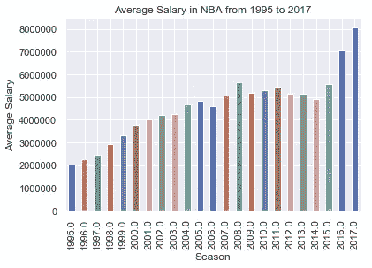
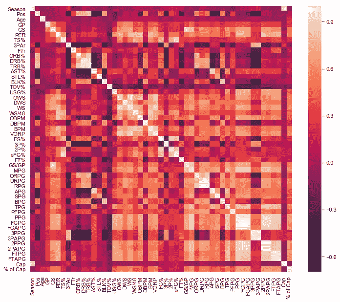
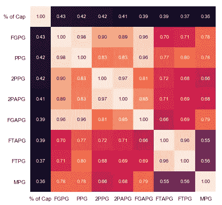
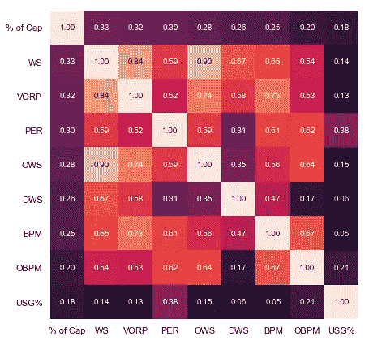
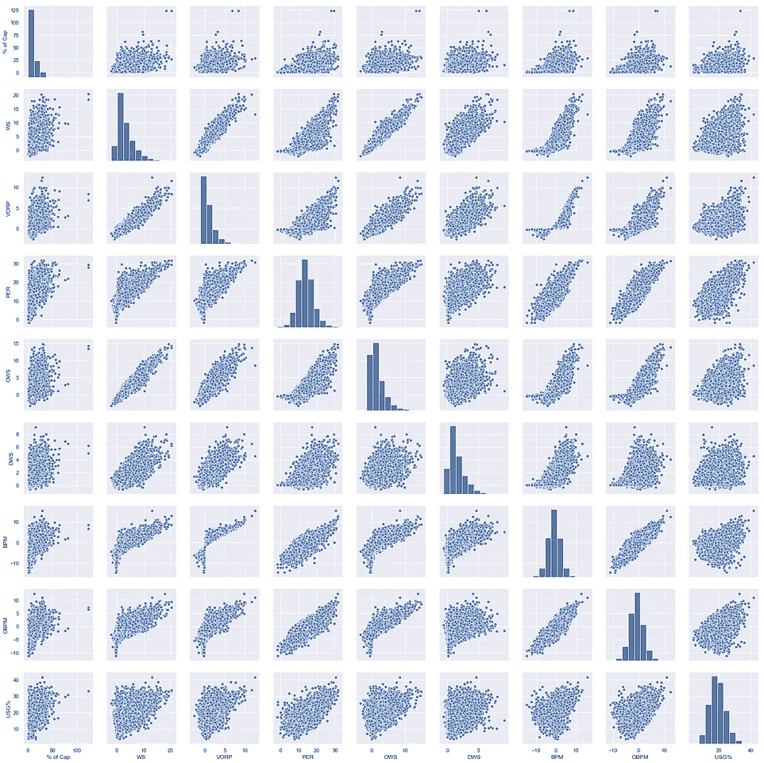
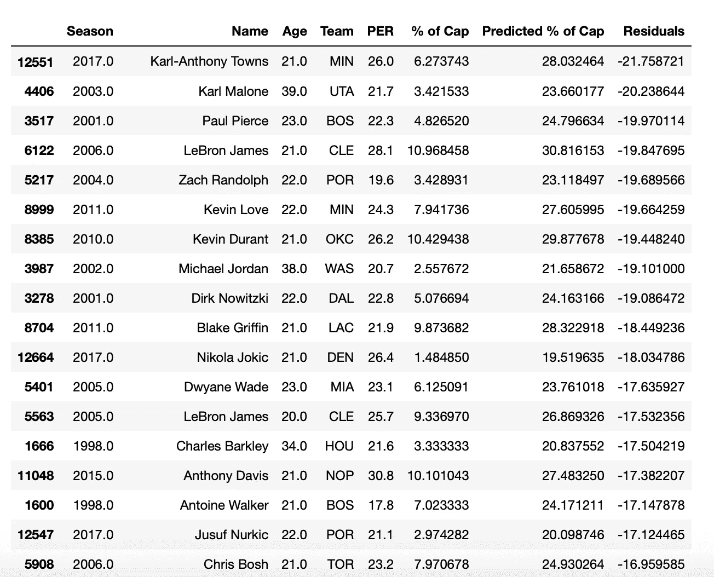
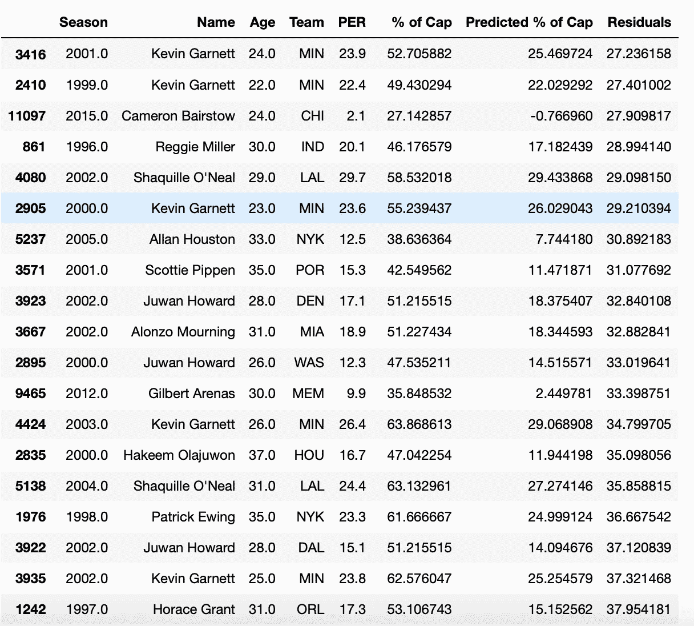
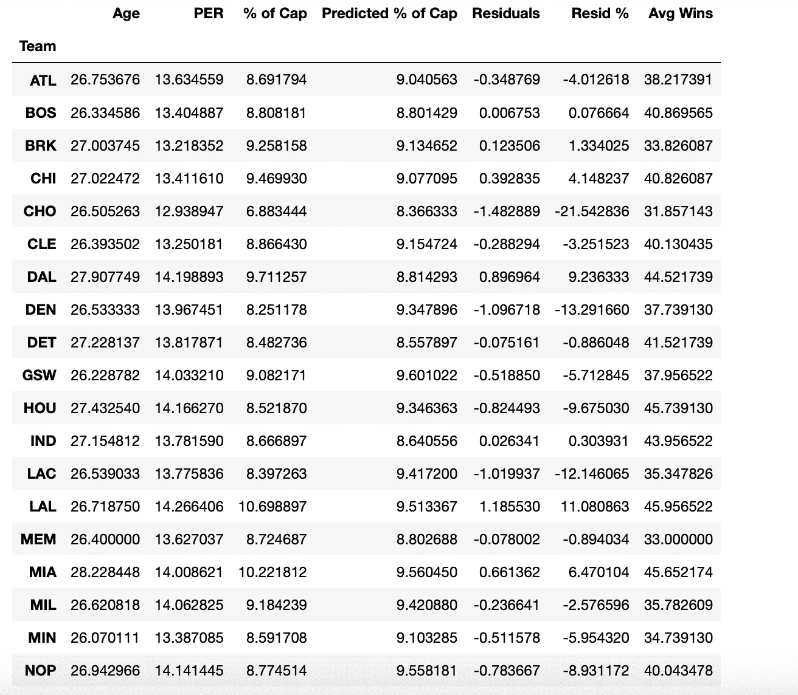
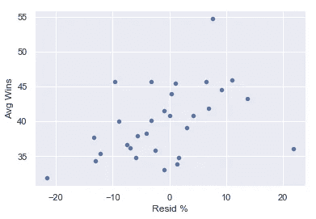

# 使用数据科学和线性回归预测 NBA 薪资

> 原文：<https://towardsdatascience.com/nba-salary-predictions-4cd09931eb55?source=collection_archive---------13----------------------->

用 Python 构建线性回归机器学习模型预测 NBA 球员工资的简要指南

这个项目旨在探索如何利用各种各样的 NBA 统计数据来预测一名 NBA 球员从 1995 年到 2017 年的工资。我对这个项目的目标是:

1.  发现哪些统计数据是 NBA 球员工资的最佳预测指标
2.  使用机器学习模型预测 NBA 薪资
3.  根据给定的和预测的薪水，确定哪些球员被高估和低估了
4.  确定哪些球队在从他们的球员身上获取价值方面是最好的和最差的，以及这是否与一个球队赢得的比赛数量有关

# **数据**

我得到了我的主要数据，一个从 1950 年开始的大约 50 个 NBA 球员的统计数据和工资信息的数据库。数据的链接可以在[这里](https://www.kaggle.com/whitefero/nba-players-advanced-season-stats-19782016#NBA%20Players%20-%20Basic%20Season%20Stats%20(1950-2017).xlsx)找到。我决定只使用 1995 赛季开始的数据，因为 1950 年的 NBA 与 21 世纪的 NBA 有很大不同。我选择 1995 年，因为这是第一年有两支新球队加入，使球队总数达到 29 支(第 30 支球队，夏洛特山猫队，于 2004 年加入)。

我使用的另外两个数据源，[工资帽信息](https://www.basketball-reference.com/contracts/salary-cap-history.html)和[每个赛季的球队胜率](https://www.basketball-reference.com/leagues/NBA_wins.html)，都来自篮球参考，并被复制到一个 Excel 电子表格中，然后我将其导入到一个 Dataframe 中。

数据确实需要清理一点:总的统计数据，如上场时间或总得分，被他们的每场比赛当量所取代，以使统计数据标准化，假设该球员在那个赛季参加了超过一定数量的比赛(如果没有，他就被从数据集中删除)。此外，有许多球员没有列出该赛季的工资信息，因此被从数据集中删除。

The first five data points

# **哪些统计数据？**

看了数据之后，一个早期的问题出现了。在过去的 20 年里，NBA 的平均工资大幅上涨。

解决方案是通过将工资数据作为联盟工资帽的百分比来标准化工资数据，工资帽是一个球队在给定赛季中可以花在球员身上的总工资限额。工资帽随着球员工资的上涨而上涨。

从那时起，是时候探索工资和统计数据之间的关系了。我从数据集中所有统计数据的关联热图开始。

不幸的是，由于统计数据的数量，从这些数据中没有获得多少有用的信息。因此，我切换到了 8 个统计数据的相关热图，这 8 个统计数据的皮尔逊 r 值最高。

然后，我将统计数据分成三个子类别:基本、普通和高级。基本的统计数据只包括球员的位置、年龄和上场时间。普通球迷会理解常规的统计数据:场均得分，场均篮板，投篮命中率等等。创建了高级统计数据来更详细地评估玩家的表现，其中一些包括玩家效率评级(PER)和获胜份额(WS)。

在统计数据被拆分后，我用同样的方法找到了每个角色中与薪水最相关的 8 个统计数据，并为它们创建了热图和散点图。

Heat map (left) and scatter plots (right) for advanced statistics

每个字符中的一些统计数据之间存在一些多重共线性，因此在分析后，一些统计数据被从前 8 位中删除。

# **机器学习模型**

下一步是确定哪一个统计子类是工资的最佳预测者。为了实现这一点，为三个子类别中的每一个创建了线性回归机器学习模型，将数据分成训练和测试数据，并进行交叉验证。结果是，统计的常规子类别是最好的模型，其均方根误差(RMSE)为 6.46(三者中的最低值)，r 为 0.466(三者中的最高值)。下面是剩余价值的图表——每个球员工资的实际工资上限百分比和预测百分比之间的差异。正残差值表示实际值大于预测值。

# **球员估价**

常规线性模型用于预测数据集中每个球员的工资。然后，将这些预测与球员的实际工资进行比较，在数据框中创建一个残差栏，然后根据残差进行排序。下面重点介绍了前 25 名最被低估和最被高估的球员。

The most undervalued players according to the model

Some of the most overvalued players, according to the model

The model states that Michael Jordon in 1997 was the most overvalued player in the last 22 years.

看着这些数据，我开始质疑这个模型。最被高估的球员名单中充满了全盛时期的超级巨星，他们因为自己的能力而获得高薪，包括空前伟大的迈克尔·乔丹。高估和低估球员的统计数据有助于解释发生了什么。

Averages for most undervalued players

Averages for most overvalued players

最被低估的球员大多是年轻的、冉冉升起的新星，他们仍在新秀合同中，因此不会占用太多的工资帽空间。最被高估的球员大多是在他们的最佳巨星时期，他们得到相应的报酬。

认识到这一点后，我决定将残差标准化，将它们除以每个玩家的上限百分比，得到一个残差%。这更好地说明了谁被高估了，谁被低估了。

The new and improved most undervalued players

该模型对最被高估的球员极为不利，预测他们应该接受球队工资帽的负百分比，也就是说，球员应该为打球的特权向球队付费。即便如此，这也有助于确定哪些球员最被高估。

我的最后一项任务是将球员的价值与他们效力的球队联系起来，以及这与球队表现之间的关系。我将球员按球队分组，根据每个球员的平均实际支出百分比与平均预测百分比计算出每个球队的平均百分比百分比，并将过去 22 年的平均获胜次数作为一个附加类别添加进来。

The top section of the data grouped by team

在此基础上，我绘制了剩余百分比与每个团队平均获胜次数的散点图。令我惊讶的是，高估球员的球队通常比低估球员的球队更成功。

# **问题和潜在改进**

我遇到的一个无法解决的问题是来自数据集。有球员通过交易或其他方式在赛季中期更换球队的情况，因此该球员在数据集中有几行(每次一行，一行显示年度总统计数据)，但工资相同。我删除了每个球员的“总数”行，并希望其他行包含类似的统计数据，以免扭曲数据。

包括沙奎尔·奥尼尔在内的一些高知名度球员的薪水值缺失，不得不从数据集中删除。工资范围两端的玩家为机器学习模型提供了有价值的信息。此外，一些薪金数据不正确。数据显示卡梅隆·巴尔斯托在 2015 年赚了 1900 万美元，而实际上他赚了不到 100 万美元。

我的项目中的另一个问题是使用的时间段。NBA 在过去的 22 年里经历了巨大的变化，而我的分析没有反映出这一点。近年来，球队给球员提供的薪水比过去几年更多地基于先进的统计数据。此外，球员合同也发生了变化。1995 年，没有最高合同额，球员可以被自己的球队签下任何金额，即使超过工资帽。1997 年，迈克尔·乔丹挣了 3300 万美元，超过了工资帽允许芝加哥公牛队花在整个 T2 队的费用。联盟在接下来的几年里引入了最高合同来防止这种合同。这种新旧合同的混合让我的模型认为，20 世纪 90 年代末和 21 世纪初的超级巨星都签了不合理的大合同，因为最近一批超级巨星赚不到那么多钱。如果把重点放在更近的时间段，这个项目本可以做得更好。

我做了一个假设，所有的球队都会平等地重视球员，因此没有在线性回归模型中使用 team 作为统计数据。在未来的项目中，观察单个球队对球员工资的影响会很有趣。

# **结论**

从我的分析中得出的两个主要结论如下:

1.  显而易见，得分更多、投篮次数更多的球员将获得更高的薪水，这就是为什么常规子类别比高级模型产生的模型更好，而高级模型是我认为将产生最佳模型的子类别。
2.  那些对球员的估价高于市场价值的球队实际上取得了更多的团队成功。这最有可能导致这些球队中明星球员的出现，而该模型倾向于认为这些球员被高估了。

[**代号**](https://github.com/joshrosson/NBASalaryPredictions)