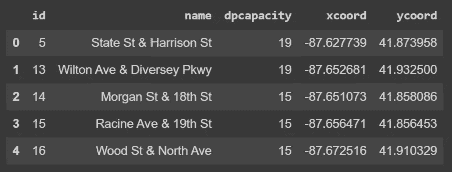
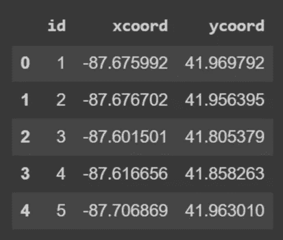
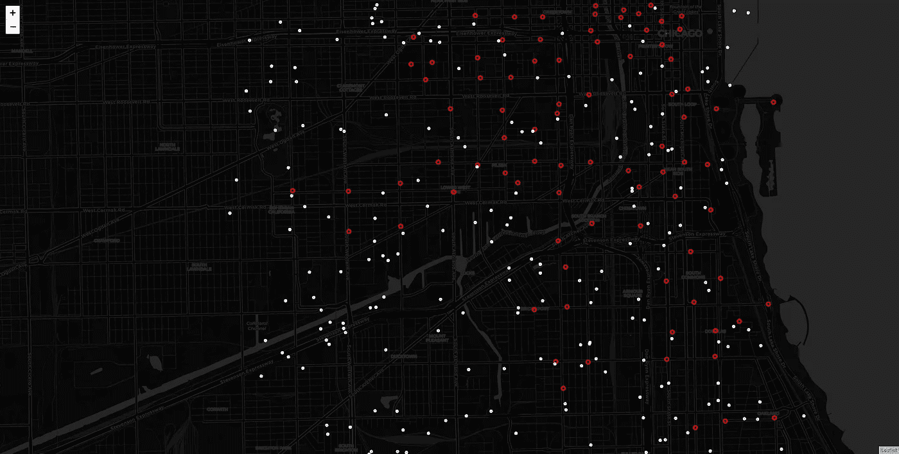
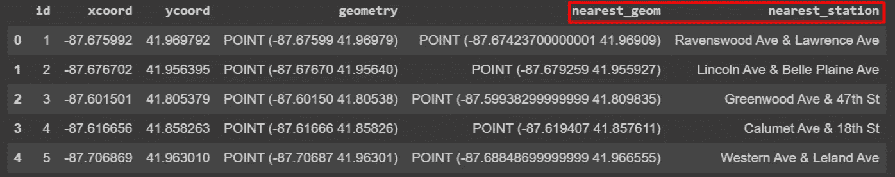
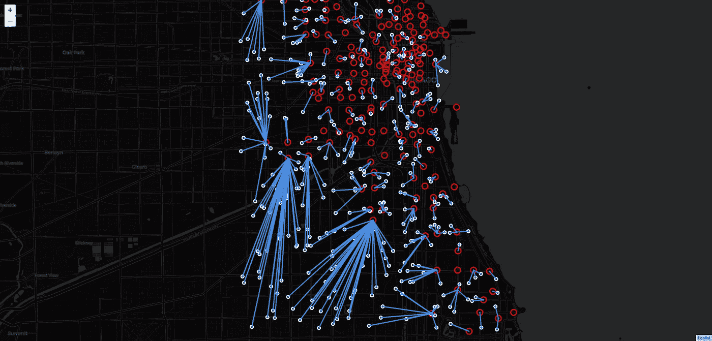

# 使用地理空间数据的最近邻分析

> 原文：<https://towardsdatascience.com/nearest-neighbour-analysis-with-geospatial-data-7bcd95f34c0e?source=collection_archive---------8----------------------->

## 关于如何在 Python 中查找空间数据的最近邻的指南


Photo by [Franck V.](https://unsplash.com/@franckinjapan?utm_source=medium&utm_medium=referral) on [Unsplash](https://unsplash.com?utm_source=medium&utm_medium=referral)

查找一个对象与另一个对象的最近邻是一项常见的空间数据分析任务。例如，确定离家最近的服务点是一个优化问题，需要使用空间数据执行**最近邻分析**。

在本教程中，我们使用芝加哥市的自行车共享数据集执行最近邻分析。数据集由两个独立的文件组成。第一个是自行车站点，第二个是随机生成的点。我们**想要确定哪个站靠近第二个数据集中的任意给定点**——随机生成的点。随机生成的数据集可以表示真实情况，其中骑车人想要确定哪个自行车站离停放自行车最近。

## 探索数据

我们使用 pandas 读取数据，并调用第一个数据帧`stations`,其中包含站点名称、容量和坐标等属性。

```
stations = pd.read_csv(“data/stations.csv”)
stations.head()
```



Bike stations

第二个表保存随机生成的点。我们称之为数据帧`points`。我们在这个表中只有三列，id 和 X 和 y 的坐标。

```
points = pd.read_csv(“data/points.csv”)
points.head()
```



Random points

要执行任何地理处理任务，包括本教程中的最近邻分析，我们需要使用 Geopandas 将数据转换为地理数据框架。这将允许我们计算 Geopandas 中可用的任何地理处理任务以及我们想要使用的任何 pandas 方法。

以下函数将两个数据集转换为 Geopandas 地理数据框架。这将创建一个存储几何图形的附加列。我们还为数据集构建了一个坐标参考系统，在本例中，EPSG:4326。

```
def create_gdf(df, x=”xcoord”, y=”ycoord”):
    return gpd.GeoDataFrame(df, 
    geometry=gpd.points_from_xy(df[y], df[x]), 
             crs={“init”:”EPSG:4326"})stations_gdf = create_gdf(stations)
points_gdf = create_gdf(points)
```

现在，让我们使用 follow Python 库可视化地图中的数据。

```
m = folium.Map([41.805379, -87.601501], tiles=”CartoDb dark_matter”)locs_stations = zip(stations_gdf.ycoord, stations_gdf.xcoord)locs_points = zip(points_gdf.ycoord, points_gdf.xcoord)for location in locs_stations:
    folium.CircleMarker(location=location, 
        color=”red”,   radius=4).add_to(m)for location in locs_points:
    folium.CircleMarker(location=location, 
        color=”white”, radius=2).add_to(m)m
```

下图显示了红色的`station_gdf`和白色的`points_gdf`。目标是为随机生成的点找出最近的站。



Map — Bike stations in Red & random points in white

在下一节中，我们将使用 Geopandas 和 Shapely 功能执行最近邻分析。

## 表演最近邻

我们想找到离其他随机点最近的自行车站。我们可以使用 Shapely function `nearest_points`功能找出最接近每个位置的几何图形，并在此过程中保存其他属性，例如，车站的名称。这里，我们使用`caclulate_nearest` 函数，该函数接受目的地(`station_gdf`)和我们希望从该数据集存储的值(车站名称)。

```
def calculate_nearest(row, destination, val, col=”geometry”): # 1 - create unary union    
    dest_unary = destination[“geometry”].unary_union # 2 - find closest point
    nearest_geom = nearest_points(row[col], dest_unary) # 3 - Find the corresponding geom
    match_geom = destination.loc[destination.geometry 
                == nearest_geom[1]] # 4 - get the corresponding value
    match_value = match_geom[val].to_numpy()[0] return match_value
```

我们将该函数应用于第二个数据集`points_gdf`以导出每个随机点的最近几何图形(从`station_gdf`中)以及最近几何图形的站名。

```
# Get the nearest geometry
points_gdf[“nearest_geom”] = points_gdf.apply(calculate_nearest, destination=stations_gdf, val=”geometry”, axis=1)# Get the nearest Bike station name
points_gdf[“nearest_station”] = points_gdf.apply(calculate_nearest, destination=stations_gdf, val=”name”, axis=1)points_gdf.head()
```

输出是下表，其中有我们在上面创建的两个附加列。



现在，`points_gdf`里既有`nearest_station`又有`nearest_geom`。例如，在`id` 2 中，我们可以看到最近的车站是林肯大道&百丽平面大道站。我们需要验证我们的结果，让我们从`geometry`和`nearest_geom`创建一个线地理数据框架，这有助于我们直观地探索数据。

```
# Create LineString Geometry
points_gdf[‘line’] = points_gdf.apply(lambda row: LineString([row[‘geometry’], row[‘nearest_geom’]]), axis=1)# Create Line Geodataframe
line_gdf = points_gdf[["id", "nearest_station", "line"]].set_geometry('line')# Set the Coordinate reference
line_gdf.crs = crs={"init":"epsg:4326"}
```

我们有目的点`station_gdf`，最近点`points_gdf`，现在还有连接两个数据集的`line_gdf`。让我们在一个情节中想象它们。

```
m = folium.Map([41.805379, -87.601501],zoom_start = 12,  
    tiles=”CartoDb dark_matter”)locs_stations = zip(stations_gdf.ycoord, stations_gdf.xcoord)locs_points = zip(points_gdf.ycoord, points_gdf.xcoord)for location in locs_stations:
    folium.CircleMarker(location=location, 
              color=”red”,  radius=8).add_to(m)for location in locs_points:
    folium.CircleMarker(location=location, 
              color=”white”, radius=4).add_to(m)folium.GeoJson(line_gdf).add_to(m)m.save(“map2.html”)m
```

借助下图所示的地图，您可以轻松浏览数据集并查看每个点的最近站点之间的连接。



Nearest neighbour Visualization

地图用红色圆圈显示自行车站点，用白色显示随机点，用蓝色显示连接线。您可以在附带的笔记本中进一步探索交互式地图。最终结果是准确的，并且可以在您选择的任何其他数据集中复制。

## 结论

在本教程中，我们讲述了如何使用 Geopandas 执行最近邻分析，以及如何使用芝加哥自行车站执行 Shapely 分析。我们还探索了如何使用 leav 轻松构建和可视化分析结果。

本教程的代码可以在 Github 资源库中找到:

[](https://github.com/shakasom/NearestNeighbour-Analysis) [## shaka som/最近邻-分析

### 查找一个对象与另一个对象的最近邻是一项常见的空间数据分析任务。例如，确定…

github.com](https://github.com/shakasom/NearestNeighbour-Analysis) 

Google Colab 笔记本可以从这里直接访问:

[](https://github.com/shakasom/NearestNeighbour-Analysis/blob/master/NNA.ipynb) [## shaka som/最近邻-分析

### 此时您不能执行该操作。您已使用另一个标签页或窗口登录。您已在另一个选项卡中注销，或者…

github.com](https://github.com/shakasom/NearestNeighbour-Analysis/blob/master/NNA.ipynb)