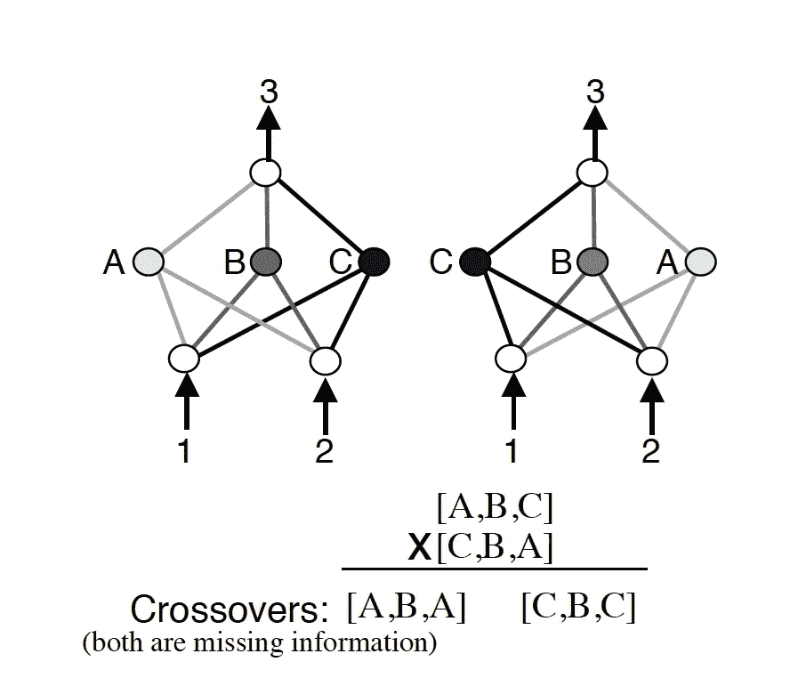
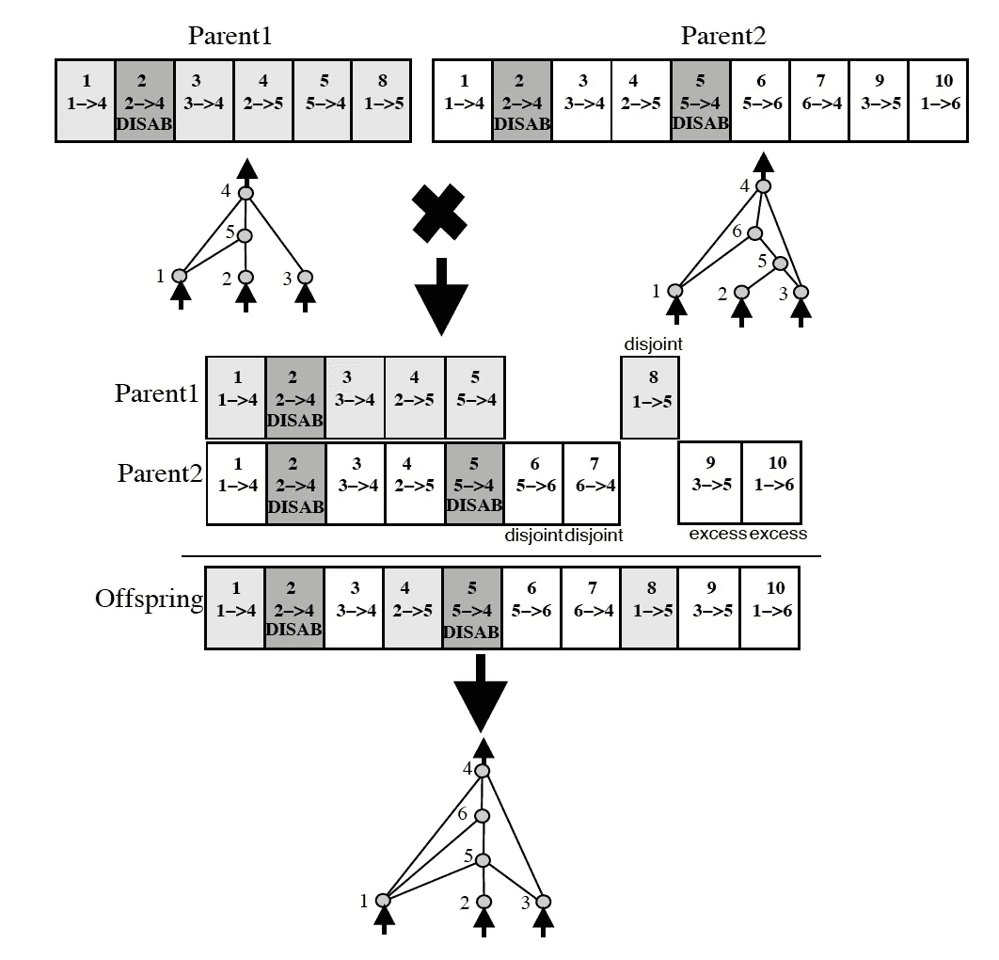

# NEAT:神经进化的一种令人敬畏的方法

> 原文：<https://towardsdatascience.com/neat-an-awesome-approach-to-neuroevolution-3eca5cc7930f?source=collection_archive---------1----------------------->

## 神经进化可以优化和进化神经网络结构，NEAT 算法是第一个显示它是一种可行方法的算法之一！

# 神经进化的世界

最近，我读了很多关于神经进化的书。从高层次来看，这个想法非常简单。与其让神经网络依赖于固定的结构，为什么不允许它通过遗传算法来进化呢？对我来说，这很有意义。通常，在使用神经网络时，人们会选择一种可能基于经验证据工作的结构。但它是可以使用的最佳结构吗？没办法确定。

在我的阅读中，我看到了一篇名为[通过增强拓扑进化神经网络](http://nn.cs.utexas.edu/downloads/papers/stanley.ec02.pdf)的论文，该论文讨论了增强拓扑的神经进化算法，更普遍的说法是 NEAT。虽然这篇论文发表于 2002 年，并且仅仅关注于逐节点和逐连接地进化密集神经网络，但是这篇论文是我深入研究神经进化的一个关键起点，也是我打算在本文中讨论的一篇论文！

现在，您可能想知道，如果该算法只进化密集的神经网络，并且必须专门进化节点之间的连接，那么它如何仍然有用。这也是我早期思考的问题。但事实是，我们通过梯度下降和反向传播在训练神经网络方面取得的进展不必为了神经进化过程而放弃。其实两者是可以互补的。最近的论文甚至强调了使用 NEAT 和 NEAT-like 算法来进化神经网络结构，然后使用反向传播和梯度下降来优化这些网络的方法，我认为这是一个越来越相关和重要的领域。

但是现在，不多说了，扩充拓扑的神经进化:

# 拓扑的神经进化问题

在 NEAT 之前，有一些在进化网络拓扑方面的尝试取得了一定的成功，但是，他们发现了一系列问题，在该技术实际上可以做任何令人难以置信的有用的事情之前，需要克服这些问题。使 NEAT 及其论文如此有趣的是它对这些问题提出的一些解决方案，这些解决方案今天仍然使这篇论文有意义！

# 编码

在生物学中，我们有基因型和表现型。基因型是生物的遗传表现，表型是生物的实际物理表现。进化算法总是在很大程度上反映生物学，神经进化在这方面也不例外。

编码的问题来自于我们希望如何在我们的算法中代表个体的基因。我们对个体进行编码的方式为我们的算法如何处理关键的进化过程铺平了道路:选择、突变和交叉(也称为重组)。任何编码都可以分为两类，直接编码和间接编码。

直接编码将明确指定关于个人的一切。如果它代表一个神经网络，这意味着每个基因将直接链接到网络的某个节点、连接或属性。这可以是 1 和 0 的二进制编码，图形编码(通过加权连接来链接各个节点)，或者更复杂的编码。关键是基因型和表现型之间总会有非常明显和可读的直接联系。

间接编码正好相反。间接编码倾向于指定用于创建个体的过程的规则或参数，而不是直接指定结构可能看起来像什么。因此，间接编码要紧凑得多。另一方面，为间接编码设置规则可能会导致搜索空间中的严重偏差，因此，在没有关于如何使用编码的大量知识的情况下，很难创建间接编码。

因此，NEAT 算法选择了直接编码方法。它们的表示比简单的图形或二进制编码稍微复杂一点，但是仍然很容易理解。它只有两个基因列表，一系列节点和一系列连接。为了直观地看这是什么样子，我这里有一张来自原始论文的图片:

输入和输出节点在节点基因列表中没有进化。可以添加或删除隐藏节点。至于连接节点，它们指定了连接进出的位置、此类连接的权重、连接是否启用以及创新数(我们将在下一节讨论)。

# 变化

简而言之，突变既可以改变现有的连接，也可以给网络增加新的结构。如果在起始节点和结束节点之间添加了新的连接，它会被随机分配一个权重。

如果添加了一个新节点，它将被放置在两个已经连接的节点之间。先前的连接被禁用(尽管仍然存在于基因组中)。先前的开始节点以旧连接的权重链接到新节点，而新节点以权重 1 链接到先前的结束节点。这被发现有助于减轻新结构添加的问题。

# 竞争公约

进化神经网络拓扑的另一个大问题是被 NEAT 论文称为“竞争约定”的东西。这个想法是，仅仅盲目地跨越两个神经网络的基因组可能会导致网络发生可怕的变异和失去功能。如果两个网络都依赖于网络外的中心节点，我们就有问题了。

不仅如此，基因组可以有不同的大小。我们如何比对看起来不明显兼容的基因组？在生物学中，这是通过一个叫做同源的概念来解决的。同源性是基于特定特征的匹配基因的染色体排列。一旦发生这种情况，与染色体盲目混合在一起相比，交叉发生的错误几率会小得多。

NEAT 通过使用历史标记来解决这个问题(如上所示)。通过用一个历史数字标记新的进化，当需要交叉两个个体时，可以用更少的机会创建没有功能的个体。每个基因都可以被排列和(潜在的)交换。每当一个新的节点或新类型的连接出现时，一个历史标记就被分配了，当繁殖我们的两个个体时，允许容易的排列。点击此处查看:

# 物种形成

NEAT 提出的一个非常有趣的观点是，大多数新的进化都不是好的进化。事实上，在任何权重优化发生之前添加新的连接或节点通常会导致表现较差的个体。这使得新的结构处于不利地位。我们如何保护新的结构，并让它们在我们完全从人群中消除之前优化？纯净意味着物种形成。

物种形成只是根据拓扑和连接的相似性将种群分成几个物种。如果竞争约定问题仍然存在，这将很难衡量！然而，由于 NEAT 在其编码中使用了历史标记，这就变得更容易衡量了。论文中给出了一个决定如何进行物种分化的函数，但需要注意的重要部分是，种群中的个体只需与该物种中的其他个体竞争。这允许新的结构被创造和优化，而不用担心它会在被真正探索之前被淘汰。

不仅如此，NEAT 还通过一种叫做显性健身分享的方式向前迈进了一步。这意味着个体分享他们在物种间的表现，促进更高性能的物种，尽管仍然允许其他物种在进化之前探索他们的结构优化。

# 最小结构

NEAT 论文的一个大目标是为进化网络创建一个框架，允许最小的网络进化。作者不想创造一种算法，先找到好的网络，然后在事后减少节点和连接的数量。相反，我们的想法是建立一个算法，从最少的节点和连接开始，随着时间的推移，当且仅当它被认为是有用和必要的时候，才逐渐变得复杂。

NEAT 通过启动所有没有隐藏节点的网络，建立了他们的算法来进化最小网络。初始种群中的每个个体都只是输入节点、输出节点，以及它们之间的一系列连接基因。这本身可能不一定行得通，但当与物种形成的想法结合起来时，这被证明是进化最小但高性能网络的一个强有力的想法。

# 那么效果如何呢？

早在 2002 年，当这个算法被提出时，它是一个新颖的想法。他们需要证明它甚至可以做基本的事情。为了证明其有效性，作者首先测试的事情之一是它是否能进化出 XOR 函数。显然是这样的，否则我们很可能根本不会讨论这个算法。

他们演示的另一项任务是极点平衡控制任务。如果你不熟悉，这是一个任务，其中有一个模拟环境，允许控制算法移动一辆车。与手推车相连的是一根杆子。控制算法的目标是尽可能长时间地平衡这个极点。这项任务有几种变化，也进行了评估，如双极平衡任务(现在有两个极点！)和双极平衡任务，其中没有给控制算法任何关于极点的速度信息。NEAT 非常成功地完成了这项任务的所有变化！

# 包扎

现在你已经熟悉了进化神经网络的简洁算法！希望在读完这篇文章后，你会认为这是一个很酷的神经进化方法，并明白为什么它是神经进化中的一个突破。

但这仅仅是开始。我鼓励你通读这篇论文，如果你想了解更多关于算法的细节(包括它们如何具体地进行物种形成过程)，或者更好的是，查看你最喜欢的编程语言的代码库！

除了 NEAT 之外，还有更多变体，例如 [HyperNEAT](http://axon.cs.byu.edu/~dan/778/papers/NeuroEvolution/stanley3**.pdf) 、 [ES-HyperNEAT](https://eplex.cs.ucf.edu/papers/risi_alife12.pdf) 和 [CoDeepNEAT](https://arxiv.org/pdf/1703.00548.pdf) 等等，我希望在不久的将来能够谈到这些变体！所有这些都是对 NEAT 的很好的补充，我鼓励你也去探索一下。

和往常一样，如果你有问题或者我错过了什么，请告诉我！我仍然非常了解这方面的内容，并且很乐意谈论更多(你可以通过 Twitter 联系到我[)！](https://twitter.com/hunter_heiden)

*原载于*[*【hunterheidenreich.com】*](http://hunterheidenreich.com/blog/neuroevolution-of-augmenting-topologies/)*。*