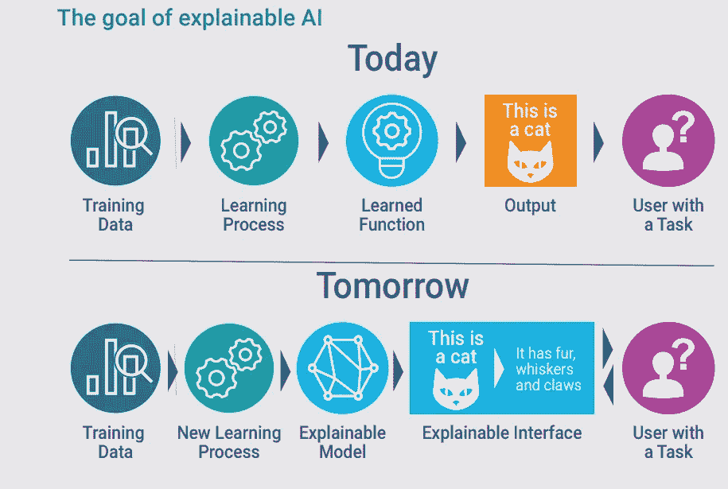
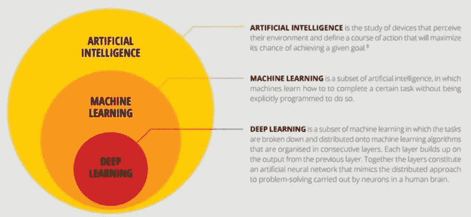

# 人工智能和机器人学对可解释性的需求

> 原文：<https://towardsdatascience.com/need-for-explainability-in-ai-and-robotics-75dc6077c9fa?source=collection_archive---------17----------------------->

(Source = [https://www.datanami.com/2018/05/30/opening-up-black-boxes-with-explainable-ai/](https://www.datanami.com/2018/05/30/opening-up-black-boxes-with-explainable-ai/))

# 介绍

人工智能(AI)在过去几年中取得的突破使计算机有可能执行使用传统软件编程不可能完成的任务。这些进步现在为我们打开了一个人工智能潜在应用的全新世界，如机器人、金融和医学。现代人工智能应用的例子有:手写识别、语音识别、人脸识别、计算机视觉等

人工智能在决策应用(如就业)中的使用最近引起了个人和当局的一些关注。这是因为，当使用深度神经网络时，当前不可能(至少在完全程度上)理解算法在必须执行预定任务时执行的决策过程。由于决策过程缺乏透明度，公众可能会对模型本身的可信度产生困惑。因此，为了防止在人工智能模型中出现任何形式的偏见，对可解释人工智能的需求正在成为下一个预定的进化步骤。

# 人工智能和机器人

传统编程和人工智能之间的一个主要区别是，非人工智能程序是违背一组指令编写的。相反，人工智能模型无需显式编程即可学习。因此，这可以使我们执行用传统编程看起来不可能的任务。机器学习是最常用的人工智能工具之一。目前如何使用 ML 的一些例子可以是:

*   通勤时的预测
*   视频监控
*   垃圾邮件和恶意软件过滤
*   搜索引擎结果提炼
*   产品推荐
*   在线欺诈检测

机器学习还可以潜在地用于增强工业机器人系统的能力。因为最近的发展，特别是在强化学习和深度学习方面，清楚地表明在这个领域有巨大的潜力。

有两种主要类型的机器人。传统机器人是一种能够执行重复性高度专业化任务的机器(例如工业机器人)。相反，智能机器人能够从周围环境中提取信息，以便做出有意义的决定(例如基于行为的机器人)。

机器学习可以应用于机器人学的四个主要领域[1]:

*   视觉=物体的检测和识别
*   抓取=确定抓取物体的最佳方向和位置
*   运动控制=避障和互动
*   数据=找到模式以决定采取最佳行动

机器学习如何提高机器人系统性能的两个例子是多机器人系统和集群。这是因为这两类机器人的主要目的是通过集体行为来执行复杂的任务。使用传统编程对集体行为进行编程可能会成为一项极具挑战性的任务，而使用机器学习(例如强化学习)可以使它变得更容易，并可能导致我们无法想到的更具创新性的解决方案。多机器人系统和集群之间的主要区别在于，前者具有环境的全局知识，并且可以具有集中式架构，而后者不具有环境的全局知识，并且使用分散式架构。

机器学习的一个子领域是深度学习(DL)，它在机器人系统中有非常重要的应用。例如，使用多层人工网络的 DL 算法已经设法在诸如图像识别的任务中表现得令人难以置信地好，这些任务在机器人系统视觉中具有非常重要的应用。DL 算法的一个问题是，目前，我们不能完全跟踪算法在必须做出决策时做出的决策过程(因此需要可解释的人工智能)。

Figure 1 — Relationship between AI-ML-DL (Image Reproduced from [2])

# 伦理学

可解释人工智能(XAI)的主要目标是让机器解释自己，并减少有偏见的算法的影响(图 2)。道德在人工智能中越来越重要的一个例子可以在谷歌承诺在实施人工智能算法时遵循的道德原则清单中看到[3]。谷歌决定发布这些原则，以澄清在哪些领域实现人工智能会变得危险，并确认其对生产人工智能自我解释算法的兴趣。

Figure 2 — Explainable AI Revolution (Image Reproduced from [4])

在过去的几年里，首批 XAI 车型已经开始研发。一些最成功的是:反向时间注意模型(RETAIN)，局部可解释模型不可知的解释(LIME)和分层相关性传播(LRP) [5]。这些列出的用于产生可解释模型的方法现在仍然不能产生详尽的结果，因此该领域的研究仍然需要进一步发展。

# 联系人

如果你想了解我最新的文章和项目[，请通过媒体](https://medium.com/@pierpaoloippolito28?source=post_page---------------------------)关注我，并订阅我的[邮件列表](http://eepurl.com/gwO-Dr?source=post_page---------------------------)。以下是我的一些联系人详细信息:

*   [领英](https://uk.linkedin.com/in/pier-paolo-ippolito-202917146?source=post_page---------------------------)
*   [个人博客](https://pierpaolo28.github.io/blog/?source=post_page---------------------------)
*   [个人网站](https://pierpaolo28.github.io/?source=post_page---------------------------)
*   [中型型材](https://towardsdatascience.com/@pierpaoloippolito28?source=post_page---------------------------)
*   [GitHub](https://github.com/pierpaolo28?source=post_page---------------------------)
*   [卡格尔](https://www.kaggle.com/pierpaolo28?source=post_page---------------------------)

# 文献学

[1]将人工智能和机器学习应用于机器人，机器人行业应用。(访问:[https://www . Robotics . org/blog-article . cfm/Applying-Artificial-Intelligence-and-Machine-Learning-in-Robotics/103](https://www.robotics.org/blog-article.cfm/Applying-Artificial-Intelligence-and-Machine-Learning-in-Robotics/103))2019 年 1 月

[2]深度学习系列 1:深度学习入门— Dhanoop Karunakaran —中级。(访问:[https://medium . com/intro-to-artificial-intelligence/deep-learning-series-1-intro-to-deep-learning-abb 1780 ee20](https://medium.com/intro-to-artificial-intelligence/deep-learning-series-1-intro-to-deep-learning-abb1780ee20))2019 年 1 月

[3]谷歌的人工智能——我们的原则——谷歌人工智能。(访问:[https://ai.google/principles/](https://ai.google/principles/))2019 年 1 月

[4]可解释的人工智能(XAI)——David Gunning 先生——DARPA。(访问:[https://www . DARPA . mil/program/explaible-artificial-intelligence](https://www.darpa.mil/program/explainable-artificial-intelligence))2019 年 1 月

[5]对可解释人工智能的介绍，以及我们为什么需要它——帕特里克·费里斯——中等。(访问:[https://medium . freecodecamp . org/an-introduction-to-explable-ai-and-why-we-need-it-a 326417 DD 000](https://medium.freecodecamp.org/an-introduction-to-explainable-ai-and-why-we-need-it-a326417dd000))2019 年 1 月