# 机器学习需要特征工程

> 原文：<https://towardsdatascience.com/need-for-feature-engineering-in-machine-learning-897df2ed00e6?source=collection_archive---------8----------------------->


Photo by [Franki Chamaki](https://unsplash.com/@franki?utm_source=medium&utm_medium=referral) on [Unsplash](https://unsplash.com?utm_source=medium&utm_medium=referral)

# 特性选择真的很重要吗？

特征选择/提取是机器学习中最重要的概念之一，机器学习是选择与问题的建模和商业目标最相关的相关特征/属性(例如表格数据中的列)的子集并忽略数据集中不相关的特征的过程。

是的，特性选择真的很重要。不相关或部分相关的特征会对模型性能产生负面影响。

当特征的数量非常大时，我们不需要使用我们所能支配的每一个特征，这也变得很重要。

对数据集进行要素工程的好处

## 1.减少过度拟合

## 2.提高准确性

## 3.减少培训时间

让我们开始实践，当特征很大并且我们不知道如何从数据集中选择相关信息时，我们如何将各种特征工程技术应用于我们的数据集。

## 方法 1:计算标准差为零的特征数。这些是不变的特征。由于这些特征没有变化，因此对模型性能没有影响。

```
import pandas as pd
import numpy as np
data = pd.read_csv('./train.csv')
print("Original data shape- ",data.shape)
# Remove Constant Features
constant_features = [feat for feat in data.columns if data[feat].std() == 0]
data.drop(labels=constant_features, axis=1, inplace=True)
print("Reduced feature dataset shape-",data.shape)
```

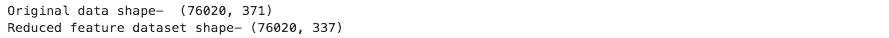

## 方法 2:计算方差较小的特征数。这可以通过使用 sklearn 库中的 VarianceThreshold 的阈值来应用。

```
from sklearn.feature_selection import VarianceThreshold
sel= VarianceThreshold(threshold=0.18)
sel.fit(df)
mask = sel.get_support()
reduced_df = df.loc[:, mask]
print("Original data shape- ",df.shape)
print("Reduced feature dataset shape-",reduced_df.shape)
print("Dimensionality reduced from {} to {}.".format(df.shape[1], reduced_df.shape[1]))
```

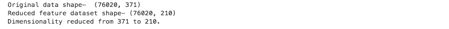

## 方法 3:去除相关性高的特征。相关性可以是正的(增加一个特征值会增加目标变量的值)，也可以是负的(增加一个特征值会减少目标变量的值)

皮尔逊相关系数为:

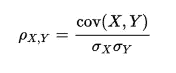

可以使用阈值去除特征，即去除相关系数> 0.8 的那些特征

```
import seaborn as sns
import numpy as np
corr=df_iter.corr()
mask = np.triu(np.ones_like(corr, dtype=bool))
# Add the mask to the heatmap
sns.heatmap(corr, mask=mask,  center=0, linewidths=1, annot=True, fmt=".2f")
plt.show()
```

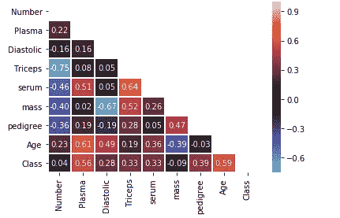

heat map with correlation coefficient

```
corr_matrix = df_iter.corr().abs()
# Create a True/False mask and apply it
mask = np.triu(np.ones_like(corr_matrix, dtype=bool))
tri_df = corr_matrix.mask(mask)# List column names of highly correlated features (r >0.5 )
to_drop = [c for c in tri_df.columns if any(tri_df[c] > 0.5)]# Drop the features in the to_drop list
reduced_df = df_iter.drop(to_drop, axis=1)print("The reduced_df dataframe has {} columns".format(reduced_df.shape[1]
```


## 方法 4:使用逻辑回归找出关于特征的系数。移除那些具有低 lr_coef 的特征。

```
from sklearn.preprocessing import StandardScaler 
from sklearn.metrics import accuracy_score
from sklearn.model_selection import train_test_split
from sklearn.linear_model import LogisticRegression#calculating the coeff with respect to columns 
scaler = StandardScaler()
X_std = scaler.fit_transform(X)# Perform a 25-75% train test split
X_train, X_test, y_train, y_test = train_test_split(X_std, y, test_size=0.25, random_state=0)# Create the logistic regression model and fit it to the data
lr = LogisticRegression()
lr.fit(X_train, y_train)# Calculate the accuracy on the test set
acc = accuracy_score(y_test, lr.predict(X_test))
print("{0:.1%} accuracy on test set.".format(acc)) 
print(dict(zip(X.columns, abs(lr.coef_[0]).round(2))))
```

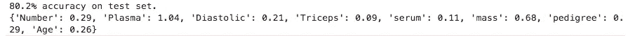

## 方法 5:使用 XGBoost 计算特性重要性。

要素重要性为数据的每个要素提供一个分数，分数越高，要素对输出变量越重要或越相关。

```
import xgboost as xgb
housing_dmatrix = xgb.DMatrix(X,y)# Create the parameter dictionary: params
params = {"objective":"reg:linear","max_depth":"4"}# Train the model: xg_reg
xg_reg = xgb.train(dtrain=housing_dmatrix,params=params,num_boost_round=10)# Plot the feature importances
xgb.plot_importance(xg_reg)
```

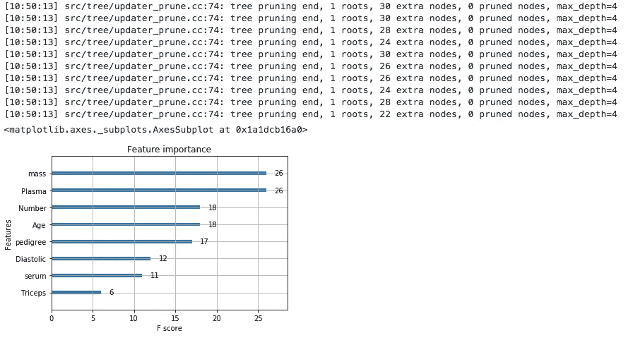

## 方法 6:使用额外树分类器的特征重要性。

基于树的估计器(参见`[**sklearn.tree**](https://scikit-learn.org/stable/modules/classes.html#module-sklearn.tree)`模块和`[**sklearn.ensemble**](https://scikit-learn.org/stable/modules/classes.html#module-sklearn.ensemble)`模块中的森林)可用于计算特征重要性，进而可用于丢弃不相关的特征

```
X = df.iloc[:,0:370]  #independent columns
y = df.iloc[:,-1]    #target column 
from sklearn.ensemble import ExtraTreesClassifier
import matplotlib.pyplot as plt
model = ExtraTreesClassifier()
model.fit(X,y)
print(model.feature_importances_) 
#use inbuilt class feature_importances of tree based classifiers
#plot graph of feature importances for better visualization
feat_importances = pd.Series(model.feature_importances_, index=X.columns)
feat_importances.nlargest(20).plot(kind='barh')
plt.show()
```

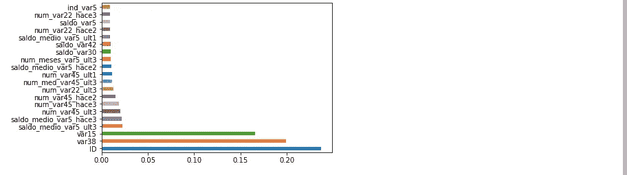

## 方法 7:递归特征消除(RFE)

给定将权重分配给特征(例如，线性模型的系数)的外部估计器，递归特征消除(`[**RFE**](https://scikit-learn.org/stable/modules/generated/sklearn.feature_selection.RFE.html#sklearn.feature_selection.RFE)`)是通过递归地考虑越来越小的特征集来选择特征。首先，在初始特征集上训练估计器，并且通过`coef_`属性或`feature_importances_`属性获得每个特征的重要性。然后，从当前特征集中删除最不重要的特征。该过程在删减集上递归重复，直到最终达到要选择的特征的期望数量。

```
from sklearn.feature_selection import RFErfe = RFE(estimator=RandomForestClassifier(random_state=0),n_features_to_select=3,step=2,verbose=1)
rfe.fit(X_train,y_train)
mask=rfe.support_
X_new=X.loc[:,mask]
print(X_new.columns)
```

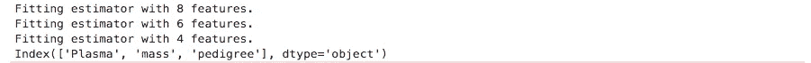

## 方法 8:单变量特征选择(ANOVA)

这是通过基于单变量统计测试(ANOVA)选择最佳特征来实现的。基于 f 检验的方法估计两个随机变量之间的线性相关程度。它们假设特征和目标之间是线性关系。这些方法还假设变量遵循高斯分布。

```
from sklearn.model_selection import train_test_split
from sklearn.feature_selection import f_classif, f_regression
from sklearn.feature_selection import SelectKBest, SelectPercentiledf= pd.read_csv('./train.csv')
X = df.drop(['ID','TARGET'], axis=1)
y = df['TARGET']
df.head()
```

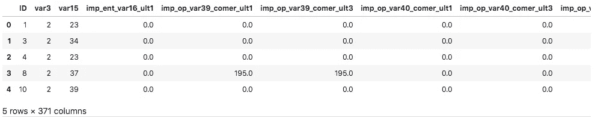

```
# Calculate Univariate Statistical measure between each variable and target
X_train, X_test, y_train, y_test = train_test_split(X, y, test_size=0.3, random_state=101)
print(X_train.shape, y_train.shape, X_test.shape, y_test.shape)
univariate = f_classif(X_train.fillna(0), y_train)# Capture P values in a series
univariate = pd.Series(univariate[1])
univariate.index = X_train.columns
univariate.sort_values(ascending=False, inplace=True)# Plot the P values
univariate.sort_values(ascending=False).plot.bar(figsize=(20,8))
```

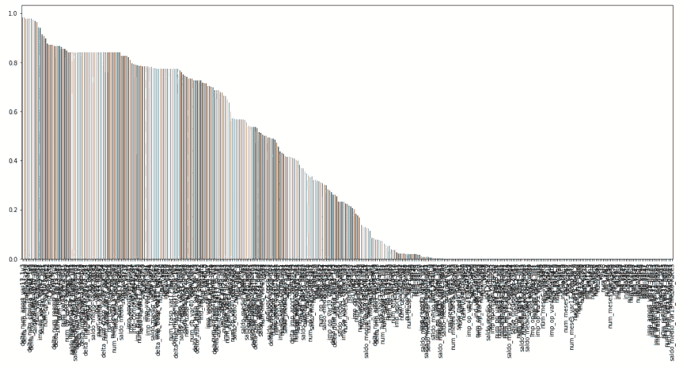

```
# Select K best Features
k_best_features = SelectKBest(f_classif, k=10).fit(X_train.fillna(0), y_train)
X_train.columns[k_best_features.get_support()]
```

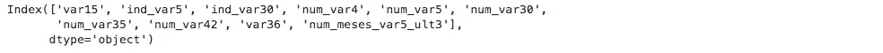

```
# Apply the transformed features to dataset 
X_train = k_best_features.transform(X_train.fillna(0))
X_train.shape
```

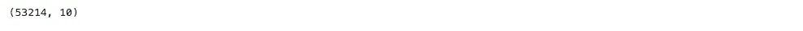

# 降维技术

## 主成分分析

原始数据有 9 列。在这一部分中，代码将 9 维的原始数据投影到 2 维。我应该注意的是，降维后，通常每个主成分都没有特定的含义。新组件只是变化的两个主要方面。

```
from sklearn.decomposition import PCA
dt=pd.read_csv('./dataset.csv')
X=dt.iloc[0:,0:-1]
y=dt.iloc[:,-1]
pca = PCA(n_components=2)
principalComponents = pca.fit_transform(X)
principalDf = pd.DataFrame(data = principalComponents
             , columns = ['principal component 1', 'principal component 2'])
print("Dimension of dataframe before PCA",dt.shape)
print("Dimension of dataframe after PCA",principalDf.shape)
print(principalDf.head())
finalDf = pd.concat([principalDf, y], axis = 1)
print("finalDf")
print(finalDf.head())
```

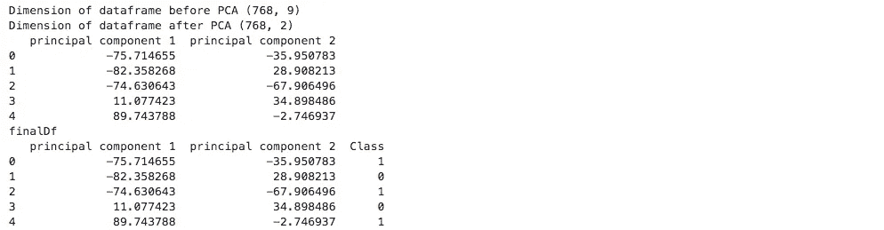

```
#Visualize 2D Projection
fig = plt.figure(figsize = (8,8))
ax = fig.add_subplot(1,1,1) 
ax.set_xlabel('Principal Component 1', fontsize = 15)
ax.set_ylabel('Principal Component 2', fontsize = 15)
ax.set_title('2 component PCA', fontsize = 20)
targets = [0, 1]
colors = ['r', 'g']
for target, color in zip(targets,colors):
    indicesToKeep = finalDf['Class'] == target
    ax.scatter(finalDf.loc[indicesToKeep, 'principal component 1']
               , finalDf.loc[indicesToKeep, 'principal component 2']
               , c = color
               , s = 50)
ax.legend(targets)
ax.grid()
```

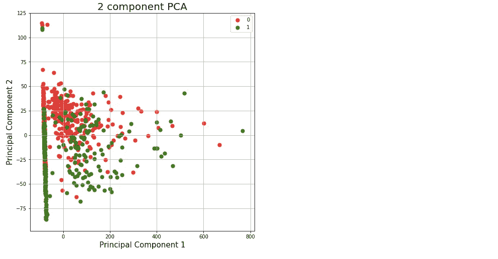

## 解释方差

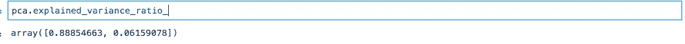

解释方差告诉你有多少信息(方差)可以归因于每个主成分。这一点很重要，因为当你可以将 371 维空间转换成 2 维空间时，你会丢失一些方差(信息)。通过使用属性**explained _ variance _ ratio _**，可以看到第一主成分包含 88.85%的方差，第二主成分包含 0.06%的方差。这两个部分总共包含 88.91%的信息。

谢谢你！

在我的 Youtube 频道上关注我

[https://www.youtube.com/channel/UCSp0BoeXI_EK2W0GzG7TxEw](https://www.youtube.com/channel/UCSp0BoeXI_EK2W0GzG7TxEw)

在此与我联系:

领英:[https://www.linkedin.com/in/ashishban...](https://www.linkedin.com/in/ashishban...)

github:[https://github.com/Ashishb21](https://github.com/Ashishb21)

中:[https://medium.com/@ashishb21](https://medium.com/@ashishb21)

网站: [http://techplanetai.com/](http://techplanetai.com/)

电子邮件 : ashishb21@gmail.com , techplanetai@gmail.com