# 负二项式回归:逐步指南

> 原文：<https://towardsdatascience.com/negative-binomial-regression-f99031bb25b4?source=collection_archive---------0----------------------->


[Brooklyn Bridge with Manhattan in the background](https://en.wikipedia.org/wiki/Brooklyn_Bridge#/media/File:Brooklyn_Bridge_und_Lower_Manhattan.jpg) ( [CC BY-SA 4.0](https://creativecommons.org/licenses/by-sa/4.0))

## 外加一个关于负二项式回归的 Python 教程

在本文中，我们将讨论以下主题:

1.  我们将介绍**负二项式(NB)回归模型。**NB 模型对于预测基于计数的数据非常有用。
2.  我们将一步一步地讲解如何使用 **statsmodels** 的 **GLM 类**在 **Python** 中创建和测试负二项式回归模型。

## 使用负二项式回归模型的动机

在我的[上一篇文章](/an-illustrated-guide-to-the-poisson-regression-model-50cccba15958)中，我们介绍了泊松回归模型，并了解了如何将其应用于基于计数的数据，例如布鲁克林大桥上骑自行车者计数的数据集:


Background image: [The Brooklyn bridge as seen from Manhattan island](https://en.wikipedia.org/wiki/Brooklyn_Bridge#/media/File:Brooklyn_Bridge_Postdlf.jpg)

我们还看到，泊松回归模型被证明是不够的建模我们的自行车数据集。

尽管泊松回归模型做出了视觉上令人满意的预测:

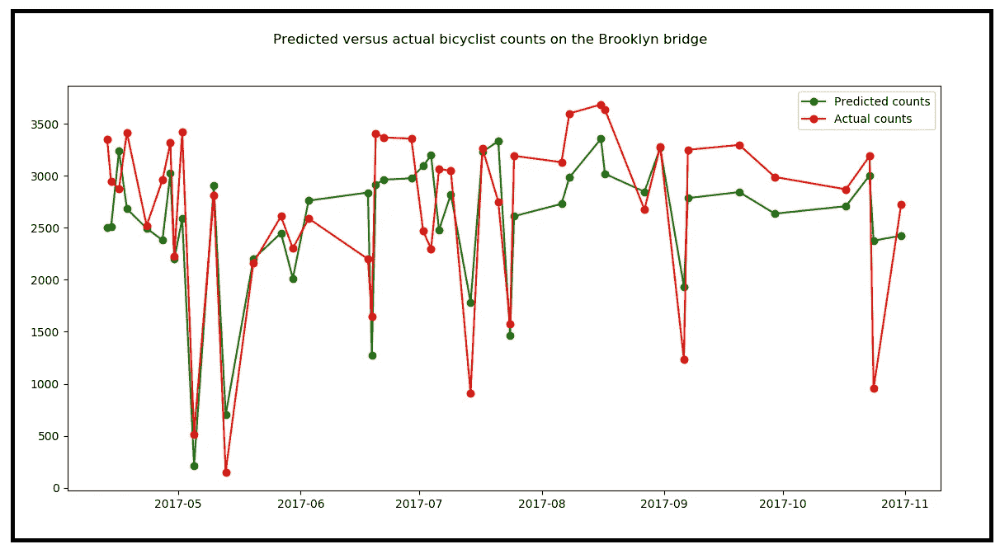

Actual daily counts of bicyclists, versus the values predicted by the Poisson regression model. (Data Source: The [Poisson Regression Model](/an-illustrated-guide-to-the-poisson-regression-model-50cccba15958)) (Image by [Author](https://sachin-date.medium.com/))

…其结果在统计学上不令人满意:

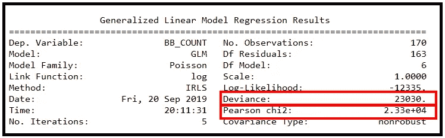

Training summary for the Poisson regression model showing unacceptably high values for deviance and Pearson chi-squared statistics (Image by [Author](https://sachin-date.medium.com/))

模型表现不佳是因为数据不符合泊松回归模型要求的 ***方差=均值*** 准则。

这个相当严格的标准通常不满足真实世界的数据。通常，方差大于均值，这种性质称为**过度分散，**有时方差小于均值，称为**分散不足**。在这种情况下，需要使用一个回归模型，该模型不会使 ***等分散假设*** 即假设方差=均值。

**负二项式(NB)** 回归模型就是这样一种模型，它不做关于数据的 ***方差=均值*** 假设。

在本文的其余部分，我们将了解 NB 模型，并了解如何在骑自行车者计数数据集上使用它。

## 文章的布局

文章布局如下:

1.  我们将介绍一个真实世界的计数数据集，我们将在本文的其余部分使用它。
2.  我们将在这个数据集上定义我们的回归目标。
3.  我们将使用 NB 模型作为我们的回归模型来制定回归策略。
4.  我们将配置 NB 模型，在数据集上训练它，并在测试数据集上进行一些预测。我们将使用***Python stats models***库来完成所有这些工作。
5.  最后，我们将检验 NB 模型的性能是否真的优于泊松模型的性能。

## 真实世界的计数数据集

下表包含了骑自行车穿过纽约市各种桥梁的人数。从 2017 年 4 月 1 日到 2017 年 10 月 31 日每天测量计数。


Source: [Bicycle Counts for East River Bridges](https://data.cityofnewyork.us/Transportation/Bicycle-Counts-for-East-River-Bridges/gua4-p9wg) (Data source: NYC OpenData) (Image by [Author](https://sachin-date.medium.com/))

我们将集中分析每天通过布鲁克林大桥的骑自行车的人数。这是布鲁克林大桥上自行车数量的时间顺序图:


Daily bicyclist counts on the Brooklyn bridge (Background: [The Brooklyn bridge as seen from Manhattan island](https://en.wikipedia.org/wiki/Brooklyn_Bridge#/media/File:Brooklyn_Bridge_Postdlf.jpg))

## 我们的回归目标

我们回归的目标是预测任意一天穿过布鲁克林大桥的骑自行车的人数。

## 我们的回归策略

给定某一天的一组回归变量的值，我们将使用 NB 模型来预测那天布鲁克林大桥上骑自行车的人数。

我们需要详细说明这个策略，所以让我们更深入地挖掘。让我们从定义一些变量开始:

***y*** *=* 在第 *1* 到第 *n* 天看到的**骑车人计数的矢量**。
从而***y =****【y _ 1，y_2，y_3，…，y_n】。
y_i* 是第 *i.* 日骑自行车的人数

***X*** =预测值矩阵**预测值矩阵**又名**回归变量矩阵**又名**解释变量矩阵**又名**回归变量矩阵**。矩阵 ***X*** 的大小是一个*(n×m)*，因为在数据集中有 *n 个*独立的观察值(行)，并且每一行包含 *m 个*解释变量的值。

**λ** =事件率的向量。向量 **λ** 是基于计数的数据集的主要特征。 **λ** 是一个大小为(n×1)的向量。它包含计数向量***【y****中的 *n* 个观测计数对应的 *n* 个速率*【λ_ 0，λ_1，λ_2，…，λ_ n】***，**。*假设观测值*‘I’*的速率 *λ_i* 驱动计数向量 ***y*** 中的实际观测计数 *y_i* 。输入数据中不存在 ***λ*** 列。相反， ***λ*** 向量是由回归模型在训练阶段计算的推导变量。

对于骑自行车者计数数据，每一个*λI*值被定义为在 *i* 日的“单位”时间内骑自行车者过桥的人数。单位时间可以是 1 秒、1 小时、1 天、1 周——我们想要测量速率的任何单位时间间隔。假设该速率 *λ_i* 驱动第 *i* 天观察到的骑自行车者数量 *y_i* 。

下图说明了我们的自行车计数数据集子集上的这些定义:


The regression variables matrix **X** and the vector of observed bicyclist counts **y** (Image by [Author](https://sachin-date.medium.com/))

> 负二项式回归模型的训练算法将使观察计数 y 与回归矩阵 X **拟合。**

一旦模型被训练，我们将在一个模型在训练期间根本没有见过的持续测试数据集上测试它的性能。

回想一下，负二项式回归模型并不像[泊松回归模型](/an-illustrated-guide-to-the-poisson-regression-model-50cccba15958)那样做出 ***方差=均值*** 的假设。

相反，NB 模型要求我们定义一个新的参数 *α* ，它用这个参数来表示均值的方差，如下所示 *:*


The NB model’s variance function (Image by [Author](https://sachin-date.medium.com/))

实际上，这个等式有两种常见的形式:

**当 p = 1 时:**

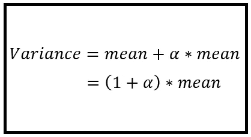

The NB1 model’s variance function (Image by [Author](https://sachin-date.medium.com/))

在回归文献中，p=1 的情况被称为 **NB1 模型**。参见 [*Cameron，A.C .和 P.K. Trivedi (1986)，“基于计数数据的经济计量模型:一些估计量的比较和应用*](https://onlinelibrary.wiley.com/doi/abs/10.1002/jae.3950010104)

**当 p=2 时:**

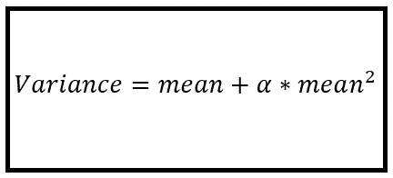

The NB2 model’s variance function (Image by [Author](https://sachin-date.medium.com/))

p=2 的情况称为 **NB2** 模型。

我们将使用 NB2 模型。

***Python stats models***库也支持 NB2 模型，作为它提供的[广义线性模型类](https://www.statsmodels.org/stable/glm.html)的一部分。

事实上，`statsmodels.genmod.families.family` 包中有整整一个类致力于 NB2 模型:

```
***class*** statsmodels.genmod.families.family.**NegativeBinomial**(*link=None*, *alpha=1.0*)
```

注意，这个类假定的默认值 *alpha=1* ，并不总是所有数据集的正确值。那么，我们如何为我们的自行车计数数据集确定正确的值呢？

## 找到 *α* 的正确值

卡梅伦和特里维迪先生又一次拯救了我们。在他们的书《计数数据的回归分析》中， Cameron 和 Trivedi 提出了一种聪明的方法来计算 *α* ，使用了一种他们称之为*辅助的没有常数*的 OLS 回归的技术。他们推荐的回归方程如下:

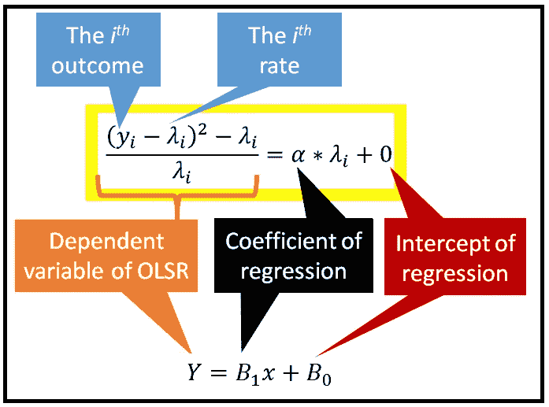

Auxiliary OLS regression to find *α for the NB2 model* (Image by [Author](https://sachin-date.medium.com/))

你马上就能看出奥克斯 OLS 方程与直线回归方程的关系:***Y****=****B _ 1*********X****+****B _ 0***。

如果你很好奇，估计 NB1 模型的 *α* 的公式如下:

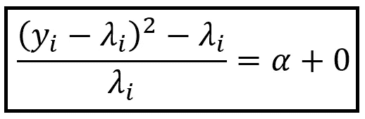

Estimator for *α* for the NB1 model (Image by [Author](https://sachin-date.medium.com/))

在本文的其余部分，我们将使用 NB2 模型。

一旦我们使用普通最小二乘回归技术对我们的计数数据集*拟合了辅助回归方程，我们就可以找到 *α* 的值。我们很快就会看到如何做到这一点。*

但是如何找到包含在辅助 OLS 回归方程*中的 *λ_i* ？*

为了找到 *λ_i* **，**我们将[泊松回归模型](/an-illustrated-guide-to-the-poisson-regression-model-50cccba15958)拟合到我们的数据集！实际上，这样做给了我们完整的速率向量***λ****=【λ_ 1，λ_2，λ_3，…，λ_ n】*对应于数据集中所有 *n* 个观测值。

我们现在已经有了 NB2 回归策略的所有要素。我们来总结一下。

## NB2 回归策略总结

*   **第一步:**对数据集拟合泊松回归模型。这将给我们拟合率的向量 ***λ。***
*   **步骤 2:** 在数据集上拟合辅助 OLS 回归模型。这将给出 *α的值。*
*   **第 3 步:**使用第 2 步中的 *α* 将 NB2 回归模型拟合到数据集。
*   **步骤 4:** 使用拟合的 NB2 模型对测试数据集的预期计数进行预测。
*   **第五步:**测试 NB2 模型的拟合优度。

既然我们的回归策略已经勾勒出来了，让我们使用 Python、Pandas 和 statsmodels 来实现它。

## 如何在 Python 中进行负二项回归

我们将从导入所有需要的包开始。

```
import pandas as pd
from patsy import dmatrices
import numpy as np
import statsmodels.api as sm
import matplotlib.pyplot as plt
```

接下来，为计数数据集创建一个熊猫数据框架。

```
df = pd.read_csv('nyc_bb_bicyclist_counts.csv', header=0, infer_datetime_format=True, parse_dates=[0], index_col=[0])
```

我们将向 **X** 矩阵添加一些派生的回归变量。

```
ds = df.index.to_series()
df['MONTH'] = ds.dt.month
df['DAY_OF_WEEK'] = ds.dt.dayofweek
df['DAY'] = ds.dt.day
```

我们将不使用*日期*变量作为回归变量，因为它包含一个绝对日期值，但是我们不需要做任何特殊的事情来删除*日期*，因为它已经作为熊猫数据帧的索引被使用。因此它在 **X** 矩阵中对我们不可用。

让我们创建训练和测试数据集。

```
mask = np.random.rand(len(df)) < 0.8
df_train = df[mask]
df_test = df[~mask]
print('Training data set length='+str(len(df_train)))
print('Testing data set length='+str(len(df_test)))
```

**步骤 1:我们现在将在训练数据集上配置和拟合泊松回归模型。**

在 [patsy](https://patsy.readthedocs.io/en/latest/quickstart.html) 符号中设置回归表达式。我们告诉 patsy，BB_COUNT 是我们的因变量，它取决于回归变量:DAY、DAY_OF_WEEK、MONTH、HIGH_T、LOW_T 和 PRECIP。

```
expr = """BB_COUNT ~ DAY  + DAY_OF_WEEK + MONTH + HIGH_T + LOW_T + PRECIP"""
```

为训练和测试数据集设置 **X** 和 **y** 矩阵。patsy 让这变得非常简单。

```
y_train, X_train = dmatrices(expr, df_train, return_type='dataframe')
y_test, X_test = dmatrices(expr, df_test, return_type='dataframe')
```

使用***stats models GLM***类，在训练数据集上训练泊松回归模型。

```
poisson_training_results = sm.GLM(y_train, X_train, family=sm.families.Poisson()).fit()
```

这就完成了泊松回归模型的训练。要查看培训的结果，您可以打印出培训总结。

```
print(poisson_training_results.summary())
```

这会打印出以下内容:

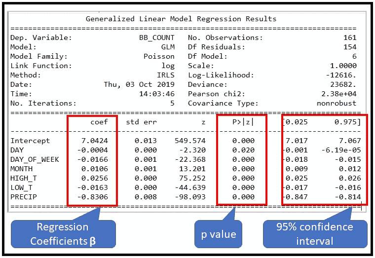

Training summary for the Poisson regression model (Image by [Author](https://sachin-date.medium.com/))

我们真正感兴趣的是由训练产生的拟合率向量*。这个速率向量包含在参数泊松 _ 训练 _ 结果μ中*

```
*print(poisson_training_results.mu)
print(len(poisson_training_results.mu))*
```

*以下输出显示了拟合的λ向量的前几个和后几个值:*

```
*[1920.39434028 2544.81549207 2651.79330653  743.45309242 1072.77132837 1892.9428398  2320.70412868 3269.73598361 3313.21764921 2915.25363322 2614.39482509 2594.44594144 2415.29471195 3181.91998369 2154.15471026 2268.25625592 1793.29625903 2535.31903414 2566.70835529 970.82159668
 2510.70775659 3016.19901465 2260.265944 3365.04650316 2695.6143122...
...2340.12964253 2568.40001641 2232.26752534 2604.97128321  145.92037793 2060.10442187 2518.70470296]*
```

*这就完成了**步骤 1:** 拟合泊松回归模型。*

***步骤 2:我们现在将在数据集上拟合辅助 OLS 回归模型，并使用拟合的模型来获得 *α的值。****

*导入 *api* 包。*

```
*import statsmodels.formula.api as smf*
```

*将 ***λ*** 向量作为名为‘BB _ LAMBDA’的新列添加到训练数据集的数据帧中。回想一下***λ’***s 的维数是(n×1)。在我们的例子中，它将是(161 x 1)。还记得 ***λ*** 向量在`poisson_training_results.mu`中可用:*

```
*df_train['BB_LAMBDA'] = poisson_training_results.mu*
```

*接下来，让我们向熊猫数据框添加一个名为“奥克斯 _OLS_DEP”的派生列。这个新列将存储 OLS 回归的因变量**的值。它是下面 OLS 回归方程的左侧:***

**

*Auxiliary OLS regression to find *α for the NB2 model* (Image by [Author](https://sachin-date.medium.com/))*

```
*df_train['AUX_OLS_DEP'] = df_train.apply(lambda x: ((**x['BB_COUNT'] - x['BB_LAMBDA'])**2 - x['BB_LAMBDA']) / x['BB_LAMBDA']**, axis=1)*
```

*在上面的代码片段中，粗体部分是上面的辅助 OLSR 方程的左侧。*

*让我们使用 patsy 来形成 OLSR 的模型规范。我们想告诉 patsy，AUX_OLS_DEP 是因变量，用 BB_LAMBDA 来解释(它是速率向量 ***λ*** )。表达式末尾的'-1 '是 patsy 语法，表示:不要使用回归的截距；即就像卡梅伦和特里维迪先生建议的那样，拟合一条穿过原点的直线。*

```
*ols_expr = """AUX_OLS_DEP ~ BB_LAMBDA - 1"""*
```

*我们现在准备好安装一个 OLSR 模型。*

*配置并适应 OLSR 模型:*

```
*aux_olsr_results = smf.ols(ols_expr, df_train).fit()*
```

*打印回归参数:*

```
*print(aux_olsr_results.params)*
```

*您将看到下面的单个系数被打印出来，对应于单个回归变量 BB_LAMBDA。这个系数就是我们正在寻找的 *α* :*

```
*BB_LAMBDA    0.037343*
```

## **α* 有统计学意义吗？*

*我们现在需要回答一个非常重要的问题。 *α的这个值(* 0.037343 *)* 有统计学意义吗？或者可以认为在所有实际用途中为零吗？*

*为什么找出这一点如此重要？回想一下，如果 *α* 为零，那么下面的等式:*

**

*The NB2 model’s variance function (Image by [Author](https://sachin-date.medium.com/))*

*…减少到 ***方差=平均值*** *。*这是泊松回归模型的方差函数。*

> *如果α的值在统计上不显著，则负二项式回归模型不能比泊松回归模型更好地拟合训练数据集。*

**OLSResults* 对象包含回归系数 *α的 t 分数。*让我们把它打印出来:*

```
*aux_olsr_results.tvalues*
```

*这将打印出:*

```
*BB_LAMBDA    4.814096*
```

*从一个 [t 值计算器](https://goodcalculators.com/student-t-value-calculator/)可以看出，在 99%置信水平下的临界 t 值(右尾)，自由度=(161 个观测值)——(1 个离散参数α)=160 为 **2.34988** 。这远远小于 t 统计量 *α* 的 4.814096 **。我们的结论是，***

> **α=* 0.037343 有统计学意义。*

*这就完成了**步骤 2:** 确定 *α。**

***步骤 3:我们将步骤 2 中找到的 alpha 的值提供给** `statsmodels.genmod.families.family.**NegativeBinomial**` **类，并在训练数据集上训练 NB2 模型。***

*这是 statsmodels 中的一步操作:*

```
*nb2_training_results = sm.GLM(y_train, X_train,family=sm.families.NegativeBinomial(alpha=aux_olsr_results.params[0])).fit()*
```

*和以前一样，我们将打印培训总结:*

```
*print(nb2_training_results.summary())*
```

*它打印以下摘要:*

*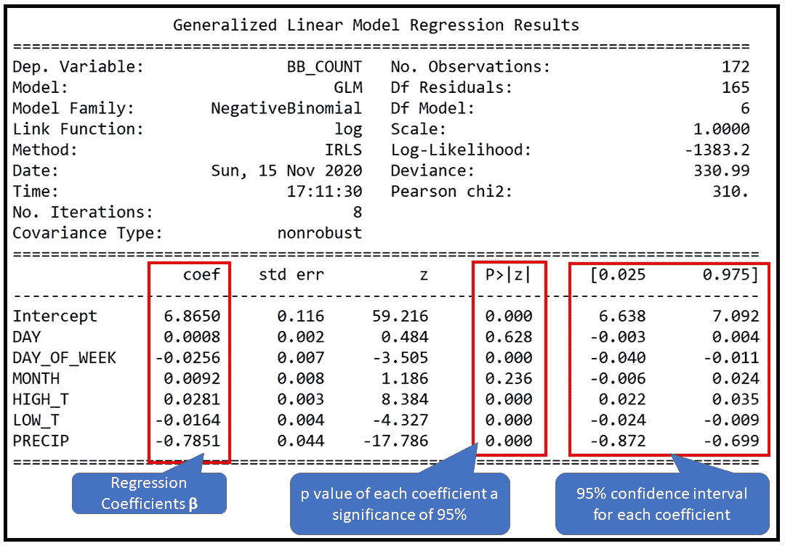*

*NB2 model’s training summary (Image by [Author](https://sachin-date.medium.com/))*

*第四步:让我们用训练好的 NB2 模型做一些预测。*

*在 stats 模型中，预测也是一个单步程序:*

```
*nb2_predictions = nb2_training_results.get_prediction(X_test)*
```

*让我们把预测打印出来:*

```
*predictions_summary_frame = nb2_predictions.summary_frame()
print(predictions_summary_frame)*
```

*以下是输出的前几行:*

*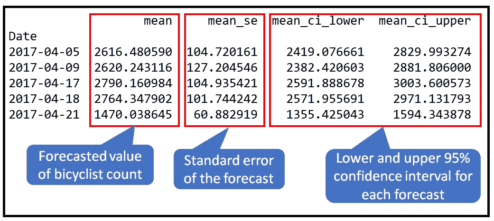*

*First few rows of output from **nb2_predictions.summary_frame()** (Image by [Author](https://sachin-date.medium.com/))*

*让我们也画出测试数据的预测计数和实际计数。*

```
*predicted_counts=predictions_summary_frame['mean']actual_counts = y_test['BB_COUNT']fig = plt.figure()fig.suptitle('Predicted versus actual bicyclist counts on the Brooklyn bridge')predicted, = plt.plot(X_test.index, predicted_counts, 'go-', label='Predicted counts')actual, = plt.plot(X_test.index, actual_counts, 'ro-', label='Actual counts')plt.legend(handles=[predicted, actual])plt.show()*
```

*以下是输出结果:*

*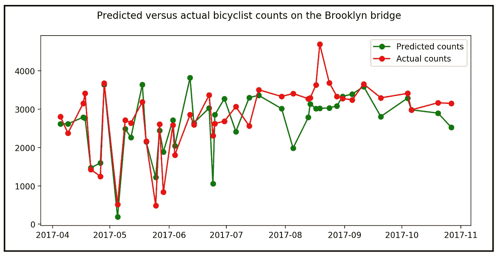*

*Predicted versus actual bicyclist counts on the Brooklyn bridge using the NB2 model*

*不算太差！NB2 模型似乎或多或少地跟踪了自行车数量的趋势。正如[泊松回归模型的表现](/an-illustrated-guide-to-the-poisson-regression-model-50cccba15958)，在某些情况下，它的预测与实际值相差甚远。*

*以下是用于训练负二项式回归模型并测试其预测的完整 Python 源代码:*

*我们面临的最后一个问题是:*

***从统计上看，我们的 NB2 回归模型比泊松回归模型做得更好吗？***

*让我们找出答案。*

## *步骤 5:测量 NB2 模型的拟合优度*

*从拟合优度的角度来看，在 NB2 模型的训练总结中有三件有趣的事情。它们在下图中用红框标出。我们将从对数似然性开始研究每一种方法。*

*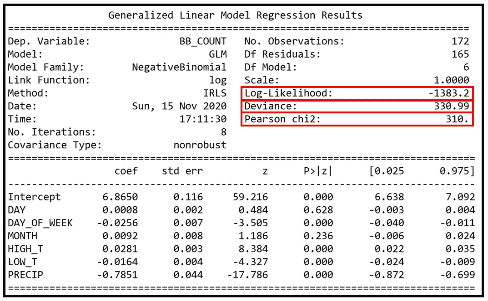*

*NB2 model’s training summary (Image by [Author](https://sachin-date.medium.com/))*

*让我们首先比较 NB2 模型和泊松回归模型在相同数据集上的训练摘要:*

*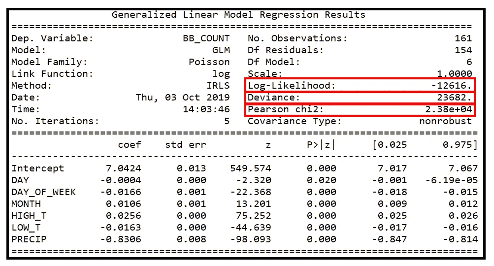*

*(Image by [Author](https://sachin-date.medium.com/))*

*首先要看的统计数据是**对数似然**值。最大对数似然是通过**最大似然估计(MLE** )技术生成的，该技术由 statsmodels 在泊松和 NB2 模型训练期间执行。MLE 技术用于将所有模型系数的值固定为一些最佳值，这些最佳值将最大化在训练数据集中看到计数向量 ***y*** 的可能性。要了解更多关于 MLE 及其如何用于模型训练的信息，请参考我关于[泊松回归模型](/an-illustrated-guide-to-the-poisson-regression-model-50cccba15958)的文章。*

## *似然比检验*

*[似然比](https://en.wikipedia.org/wiki/Likelihood-ratio_test)测试用于比较两个模型对数据的拟合程度。*

*LR 检验统计量是两个模型拟合对数似然性差异的两倍。*

*在我们的例子中，NB2 的对数似然是-1383.2，而泊松回归模型是-12616。所以 LR 检验统计量是 2 *(12616–1383.2)= 22465.6。在 1%的显著性水平上，该值远大于 [χ2(1)](https://www.medcalc.org/manual/chi-square-table.php) 的临界值 5.412。*

> *根据 LR 测试，与泊松回归模型相比，经过训练的 NB2 回归模型在自行车运动员数据集上表现出更好的拟合优度。*

*现在让我们比较一下 NB2 回归模型的绝对拟合优度。*

## *偏差和皮尔逊卡方统计*

*NB2 模型的偏差和皮尔逊卡方的报告值分别为 330.99 和 310。为了在某个置信水平(比如 95% (p=0.05))下定量确定拟合优度，我们在 *χ2* 表中查找 p=0.05 和残差自由度=165 的值。我们将该卡方值与观察到的统计值进行比较，在这种情况下，它是 GLMResults 中报告的偏差或皮尔逊卡方值。我们发现，在 p=0.05 且 DF 残差= 165 时，来自[标准卡方表](https://www.medcalc.org/manual/chi-square-table.php)的卡方值为 195.973，小于报告的统计值 330.99 和 310。因此，根据该测试，尽管 NB2 回归模型显示出比泊松回归模型更好的拟合，但仍然是次优的。我们*也许*能够做得更好。*

# *结论和下一步措施*

*泊松和负二项式回归模型用于对基于计数的数据集进行建模。这两种模型产生的结果是:*

*   *可解释的*
*   *可比较的*
*   *可辩护的*
*   *可用的*

*这两个模型都有强大且被充分理解的统计理论支持。*

*对于基于计数的数据集进行回归，一个好的策略是从[泊松回归模型](/an-illustrated-guide-to-the-poisson-regression-model-50cccba15958)开始，然后看看是否可以通过使用负二项式回归模型获得更好的结果。*

*如果 Poisson 和 NB2 都不适合您的数据集，请考虑使用更高级的技术，例如:*

1.  *泊松回归模型的复杂变体，如[零膨胀模型](https://en.wikipedia.org/wiki/Zero-inflated_model)。*
2.  *[跨栏模型](https://data.library.virginia.edu/getting-started-with-hurdle-models/)*
3.  *一个[基于随机森林的回归模型](https://en.wikipedia.org/wiki/Random_forest)*
4.  *一个基于[长短期记忆(LSTM)](https://en.wikipedia.org/wiki/Long_short-term_memory) 神经网络的回归模型*

## *相关阅读*

*[](/an-illustrated-guide-to-the-poisson-regression-model-50cccba15958) [## 泊松回归模型图解指南

### 和使用 Python 的泊松回归教程

towardsdatascience.com](/an-illustrated-guide-to-the-poisson-regression-model-50cccba15958)* 

**感谢阅读！如果你喜欢这篇文章，请在*[***Sachin Date***](https://timeseriesreasoning.medium.com)*关注我，以获得关于回归、时间序列分析和预测主题的提示、操作方法和编程建议。**