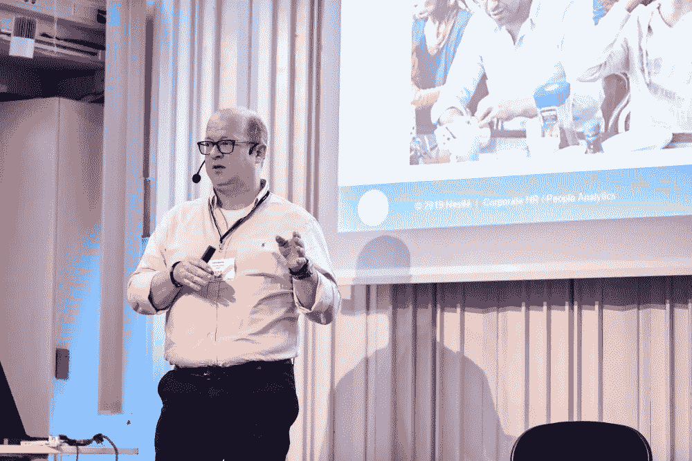
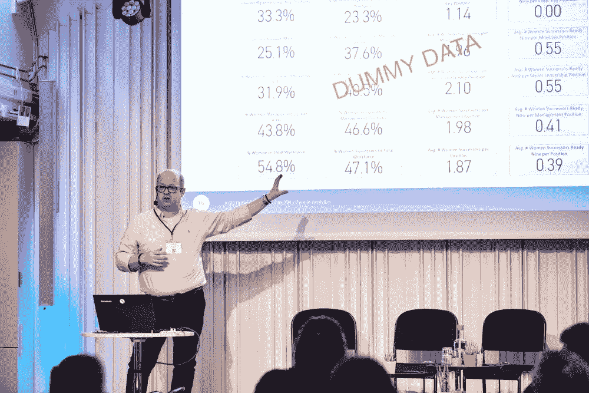

# 雀巢利用人员分析缩小性别薪酬差距

> 原文：<https://towardsdatascience.com/nestl%C3%A9-leverages-people-analytics-to-narrow-the-gender-pay-gap-737a0625d0dd?source=collection_archive---------25----------------------->

## 雀巢如何推动多元化和包容性的发展

Photo by [Brooke Cagle](https://unsplash.com/@brookecagle?utm_source=unsplash&utm_medium=referral&utm_content=creditCopyText) on [Unsplash](https://unsplash.com/s/photos/people-at-office?utm_source=unsplash&utm_medium=referral&utm_content=creditCopyText)

在数字时代，性别薪酬差距仍然广泛存在。不过，公司正在努力缩小这一差距，这是个好消息。更重要的是，最近的立法给公司带来压力，要求他们披露薪酬差距，并开始采取积极措施。 [People analytics](https://hyperight.com/why-and-how-nokia-changed-the-game-with-people-analytics/) 提供对人才统计数据的洞察，帮助公司确定他们在平等工作机会方面的不足。

雀巢是世界上最大的食品和饮料公司，拥有 2000 多个品牌，它是一个很好的例子，说明了一家全球性公司应该如何通过人员分析积极努力在工作场所提供多样性和包容性。

# 雀巢——工作场所性别平等的倡导者

雀巢公司人力分析经理 André Bezemer 在去年的[北欧人力分析峰会](https://npasummit.com/)上，通过人力分析展示了雀巢公司对[性别工作场所平等的倡导和倡议。](https://hyperight.com/people-analytics-in-diversity-inclusion-belonging-andre-bezemer-nestle/)

“如果你问我们的首席执行官(关于性别平等)，那很简单，这是应该做的事情。无论是在性别领域，还是在 LGBT 领域，每个人都应该拥有平等的机会，”André说。为了支持他们的信念，雀巢公司签署了 ILO(国际劳工组织)承诺，表明他们对平等、多样性和同工同酬的承诺。除此之外，自去年以来，他们已经开始在整个集团和地方立法之外监测性别薪酬和平等薪酬，以确保所有差距都得到识别和解决。

Photo by Hyperight AB® on [Nordic People Analytics Summit](https://npasummit.com/) / All rights reserved

但是一旦所有的手续都完成了，你承诺男女同工同酬，你就必须实际兑现。因此，雀巢公司决定向内看，看看他们是否真的支付男女相同的工资，如果不是，如何修改。

# 同酬与性别薪酬差距

在 André继续解释雀巢公司的做法之前，他对术语“同工同酬”和“性别薪酬差距”的含义进行了明确的区分。性别薪酬差距是指公司中所有男性的平均薪酬与所有女性的平均薪酬之比。而同工同酬意味着男女同工同酬。

Photo by r[awpixel](https://pxhere.com/en/photographer/795663) on [Pxhere](https://pxhere.com/en/photo/1442697)

# 雀巢公司的同工同酬人员分析方法

由于在多个市场开展业务，雀巢公司制定了人员分析原则，全球所有部门都将遵循这些原则:

*   标准化分析
*   定义和填充数据集以实现洞察力、行动和评估
*   构建跨人员分析的能力
*   开发适合用户需求的工具

André说，people analytics 的棘手之处在于，分析是在本地进行的，在比较两个不同的市场时会出现问题。因此，他们专注于开发一种本地方法，以便在全球层面上对不同市场进行比较。主要目的是发现在某些市场中是否存在某些异常值，或者是否存在需要解决的薪酬差异较大的整个劳动力群体。

> 如果你想改变性别平衡，你必须确保有足够多的女性担任高级职位。

正如我们之前提到的，性别薪酬差距很容易计算——它是男性平均薪酬和女性平均薪酬之间的差异。但是计算男女同工同酬的问题就有点复杂了。雀巢公司使用一个标准模型，该模型考虑了几个变量，如年龄、级别、职能和才能提升，然后计算所有这些是否与性别相关，并将薪酬作为结果。

他们发现的结果是，女性的平均收入是男性的 1.013 倍。“结果是好的，但重要的是他们实际上用它做了什么，以及他们采取的后续行动，”安德烈强调说。

Photo by [rawpixel](https://unsplash.com/photos/DiBrGfuATJo?utm_source=unsplash&utm_medium=referral&utm_content=creditCopyText) on [Unsplash](https://unsplash.com/@rawpixel?utm_source=unsplash&utm_medium=referral&utm_content=creditCopyText)

# 缩小差距

如果不平等案例涉及到个人，例如工资落后的个人，那么这个问题就相对容易解决。André认为，如果涉及到更大部分的劳动力，就需要一个更加系统化和结构化的方法来弥补差距，例如调整技能差距或影响特定劳动力的政策。同样，关键是要洞察到差距的存在，并在市场中制定行动计划，开始缩小薪酬差距。

# 仪表板

正如在公司中提供多样性和包容性一样，更重要的是将见解的呈现方式标准化，并使其易于获取，因为正如 André所指出的那样。他们发现，当一家公司像雀巢一样在全球范围内运营时，许多人无法获得数据，或者在查看数据时出现了许多误解。例如，各地的自然减员并不相同

因此，他们发现迫切需要标准化一套全面的指标:

*   职员总数
*   消耗
*   雇用
*   才能
*   继承权

安德烈解释说，一个关键的衡量标准是接班人，因为在雀巢公司，你在公司的级别越高，外部招聘的比例就越低，女性的数量就越少，大多数其他公司也是如此。在高管级别，他们的内部流动率是 94%，安德烈承认这不是一个很大的数字，因为从外部招聘是增加性别平衡的一种方式。

对此的一个解决方案是基于对继任指标的洞察制定继任计划，这样不同的部门就可以设计出一个如何培养和准备女性担任这些角色的策略。

Photo by [Lukas](https://www.pexels.com/@goumbik?utm_content=attributionCopyText&utm_medium=referral&utm_source=pexels) from [Pexels](https://www.pexels.com/photo/person-holding-chart-and-bar-graph-669612/?utm_content=attributionCopyText&utm_medium=referral&utm_source=pexels)

继任和其他指标可在雀巢公司的全球 D&I 仪表板中获得，该仪表板可供公司的所有利益相关者在全球范围内访问。它完全符合 GDPR 的规定，所有个人数据都受到保护。

Photo by Hyperight AB® on [Nordic People Analytics Summit](https://npasummit.com/) / All rights reserved

雀巢公司的全球 D&I 仪表板还为他们提供了对性别平衡持有者与继任者的洞察，这意味着公司每个级别的女性比例与拥有知识和技能来接替高级职位的女性比例。“因为如果你想推动性别平衡，你必须确保有足够多的女性来担当这些角色”，安德烈强调说。仪表板数据使他们能够采取具体措施解决性别差距，并制定继任计划。如果空缺职位需要填补，但名单上没有女性，或者她们是潜在的女性候选人，但她们将在 3-5 年或更长时间内为该职位做好准备，她们就开始推动议程，为她们继任更高级的职位做准备。这也意味着让高管们为富有挑战性的对话做好准备，并以开放的态度接受变化。André总结道，在这些富有挑战性的对话中，仪表板见解对人员分析部门很有帮助。

*原载于 2019 年 9 月 19 日*[*【Hyperight.com】*](https://hyperight.com/nestle-leverages-people-analytics-to-narrow-the-gender-pay-gap/)*。*