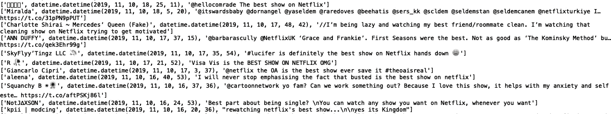

# 网飞使用 Twitter 的 API 和 Python 展示推荐

> 原文：<https://towardsdatascience.com/netflix-show-recommendations-using-twitters-api-and-python-65f347706617?source=collection_archive---------23----------------------->


Photo by [John-Mark Smith](https://www.pexels.com/@jmark) on [Pexels](https://www.pexels.com/photo/photo-of-cup-near-flat-screen-television-2726370/)

在本帖中，我们将分析推特上的网飞秀推荐。首先，你需要申请一个 Twitter 开发者账户:


[Source](https://projects.raspberrypi.org/en/projects/getting-started-with-the-twitter-api/3)

您的开发人员帐户获得批准后，您需要创建一个 Twitter 应用程序:


[Source](https://projects.raspberrypi.org/en/projects/getting-started-with-the-twitter-api/4)

申请 Twitter 开发者账户和创建 Twitter 应用程序的步骤在[这里](https://projects.raspberrypi.org/en/projects/getting-started-with-the-twitter-api/4)列出。

为了访问 Twitter API，我们将使用免费的 python 库 tweepy。tweepy 的文档可以在[这里](https://tweepy.readthedocs.io/en/latest/getting_started.html)找到。

1.  **安装**

首先，确保您已经安装了 tweepy。打开命令行并键入:

```
pip install tweepy
```

2.**导入库**

接下来，打开您最喜欢的编辑器，导入 tweepy 和 pandas 库:

```
import tweepy
import pandas as pd
```

3.**认证**

接下来，我们需要我们的消费者密钥和访问令牌:


[Source](https://projects.raspberrypi.org/en/projects/getting-started-with-the-twitter-api/4)

请注意，该网站建议您保持您的密钥和令牌私有！这里我们定义了一个假的密钥和令牌，但是在创建 Twitter 应用程序时，您应该使用真正的密钥和令牌，如上所示:

```
consumer_key = '5GBi0dCerYpy2jJtkkU3UwqYtgJpRd' 
consumer_secret = 'Q88B4BDDAX0dCerYy2jJtkkU3UpwqY'
access_token = 'X0dCerYpwi0dCerYpwy2jJtkkU3U'
access_token_secret = 'kly2pwi0dCerYpjJtdCerYkkU3Um'
```

下一步是创建 OAuthHandler 实例。我们传递上面定义的消费者密钥和访问令牌:

```
auth = tweepy.OAuthHandler(consumer_key, consumer_secret)
auth.set_access_token(access_token, access_token_secret)
```

接下来，我们将 OAuthHandler 实例传递给 API 方法:

```
api = tweepy.API(auth)
```

4. **TWITTER API 请求**

接下来，我们为我们有兴趣分析的字段初始化列表。现在，我们可以查看推文字符串、用户和推文时间。接下来，我们在一个 tweepy“Cursor”对象上编写一个 for 循环。在“Cursor”对象中，我们传递“api.search”方法，为我们想要搜索的内容设置查询字符串(q= "best show 网飞" )，并设置“count”= 1000，这样我们就不会超过 twitter 的速率限制。我们还使用“item()”方法将“Cursor”对象转换为 iterable。

为了简化查询，我们可以删除转发，只包含英文推文。为了了解该请求返回的内容，我们还可以打印附加到每个列表的值:

```
twitter_users = []
tweet_time = []
tweet_string = []
for tweet in tweepy.Cursor(api.search,q="best show netflix", count=1000).items(1000):
        if (not tweet.retweeted) and ('RT @' not in tweet.text):
            if tweet.lang == "en":
                twitter_users.append(tweet.user.name)
                tweet_time.append(tweet.created_at)
                tweet_string.append(tweet.text)
                print([tweet.user.name,tweet.created_at,tweet.text])
```



在这张推文截图中，人们推荐的节目有*格雷斯和弗兰基*、*路西法*、*被抓*、*Visa vs*和*OA*。让我们来看看另一张推文截图:


在这里，人们推荐*世界末日、黎明、卡明斯基方法、*和*山之屋的闹鬼。我们也可以指定一个流派。如果我们想搜索最佳喜剧(电视剧和电影):*

```
twitter_users = []
tweet_time = []
tweet_string = []
for tweet in tweepy.Cursor(api.search,q="best comedy netflix", count=1000).items(1000):
        if (not tweet.retweeted) and ('RT @' not in tweet.text):
            if tweet.lang == "en":
                twitter_users.append(tweet.user.name)
                tweet_time.append(tweet.created_at)
                tweet_string.append(tweet.text)
                print([tweet.user.name,tweet.created_at,tweet.text])
```


在这里，人们对席特的《小溪》、《贪得无厌》、塞斯·迈耶的喜剧特辑以及哈桑·米纳吉的《爱国者法案》赞不绝口。我们也可以从电视剧中来看:


和惊悚片:


接下来，我们可以将查询结果存储在数据帧中。为此，让我们定义一个函数，该函数将一个关键字作为参数，并返回一个包含与该关键字相关的 1000 条推文的数据帧:

```
def get_related_tweets(key_word):
    twitter_users = []
    tweet_time = []
    tweet_string = [] 
    for tweet in tweepy.Cursor(api.search,q=key_word, count=1000).items(1000):
            if (not tweet.retweeted) and ('RT @' not in tweet.text):
                if tweet.lang == "en":
                    twitter_users.append(tweet.user.name)
                    tweet_time.append(tweet.created_at)
                    tweet_string.append(tweet.text)
                    #print([tweet.user.name,tweet.created_at,tweet.text])
    df = pd.DataFrame({'name':twitter_users, 'time': tweet_time, 'tweet': tweet_string})
    df.to_csv(f"{key_word}.csv")
    return df
```

当我们用“最佳惊悚片网飞”调用函数时，定义一个 dataframe 作为函数的返回值，并打印它的前五行，我们得到:

```
df_thriller = get_related_tweets("best thriller netflix")
print(df_thriller.head(5))
```


如果我们为“网飞最佳喜剧”做同样的事情:

```
df_comedy = get_related_tweets("best comedy netflix")
print(df_comedy.head(5))
```


我就说到这里。这篇文章的代码可以在 Github 上找到。感谢您的阅读！